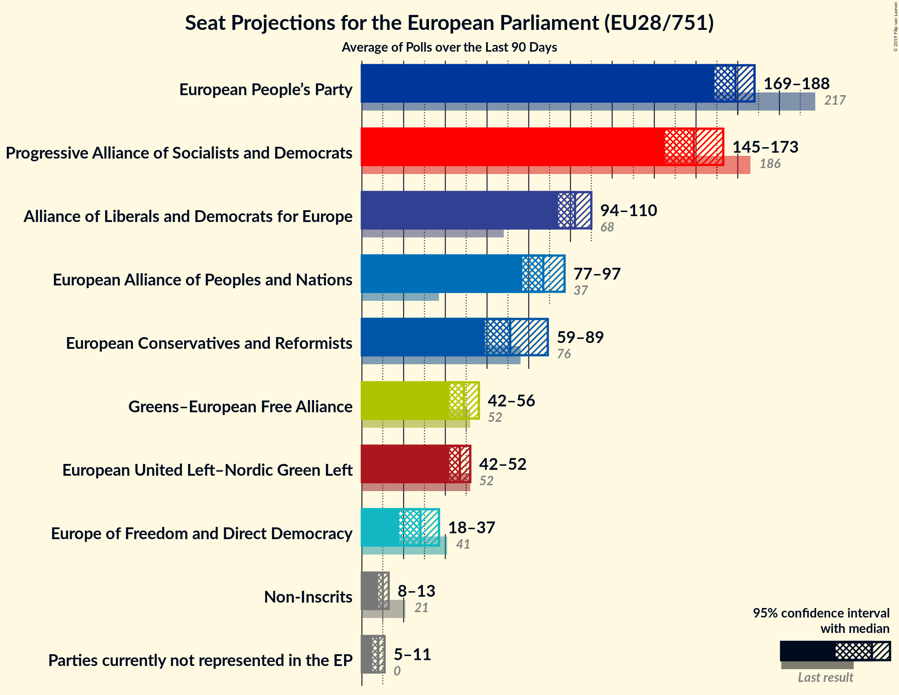
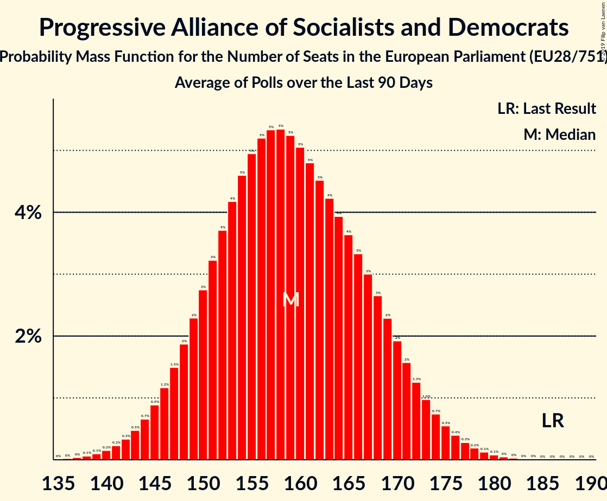
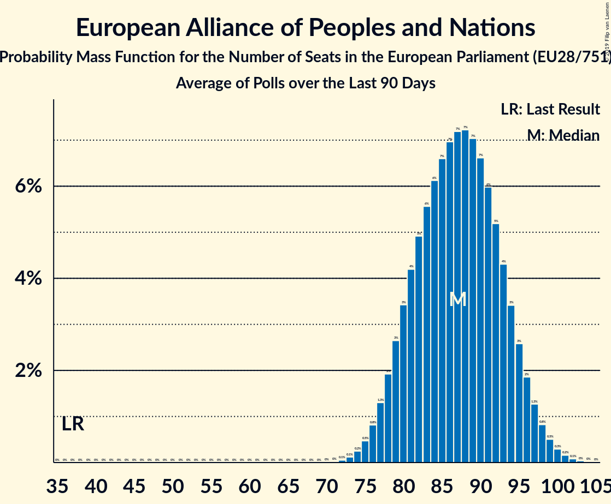
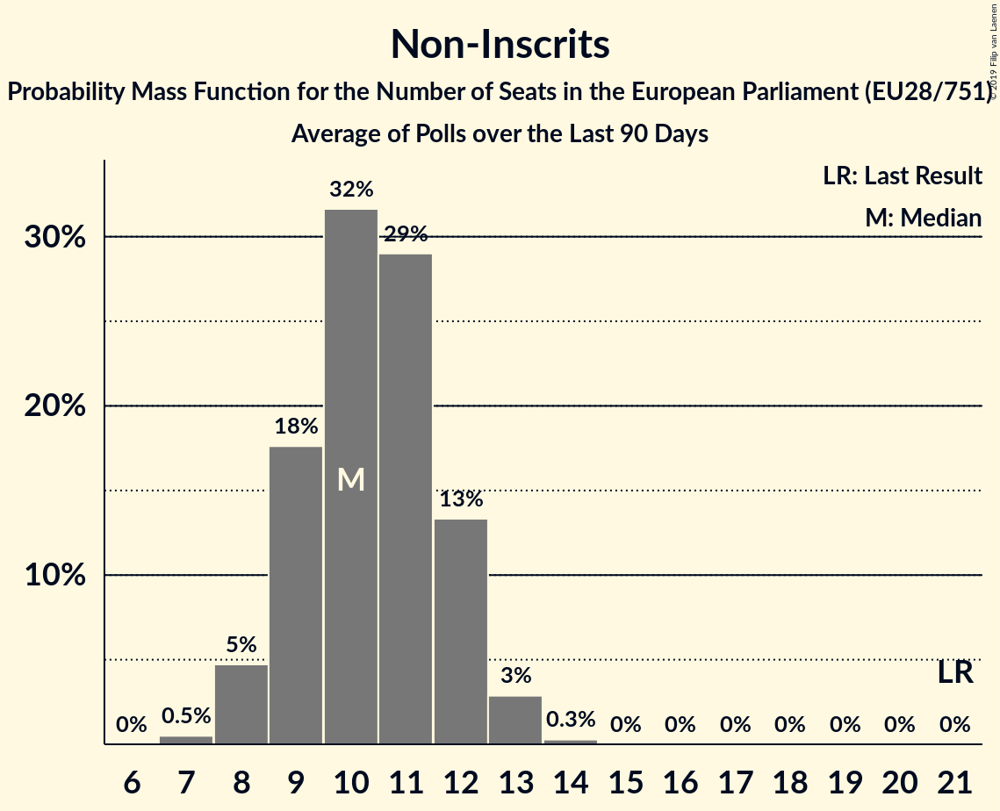
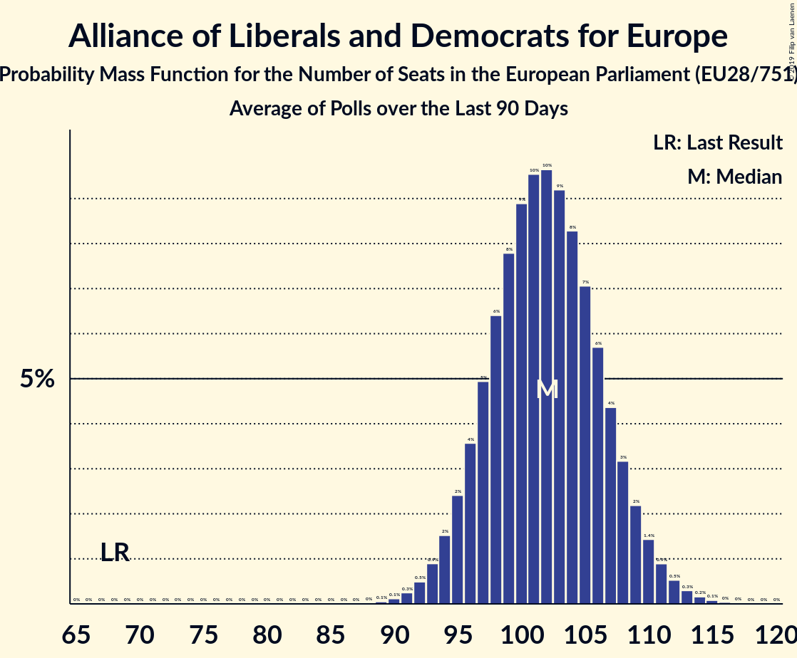
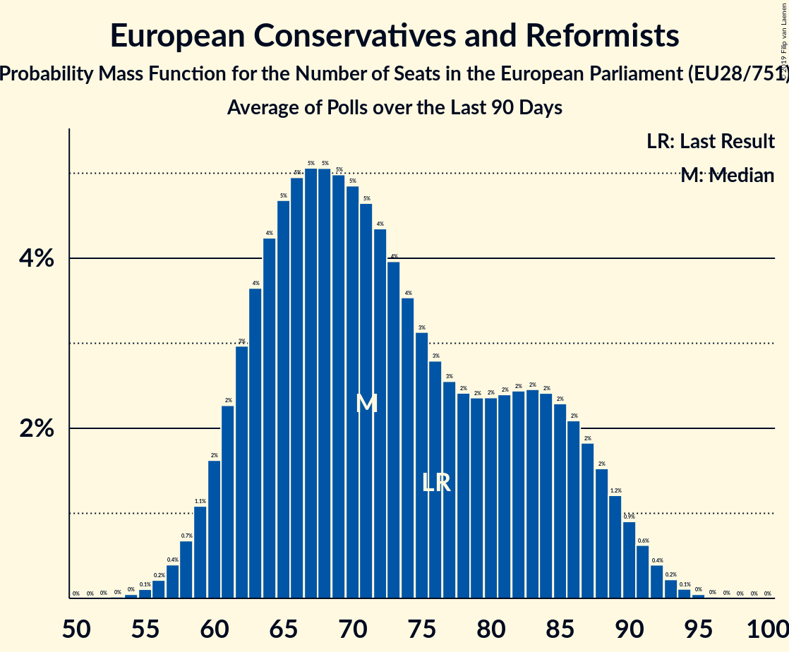
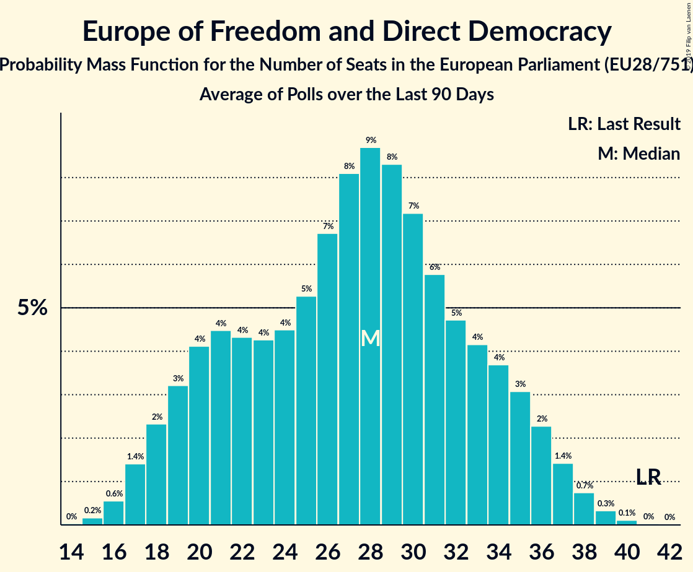
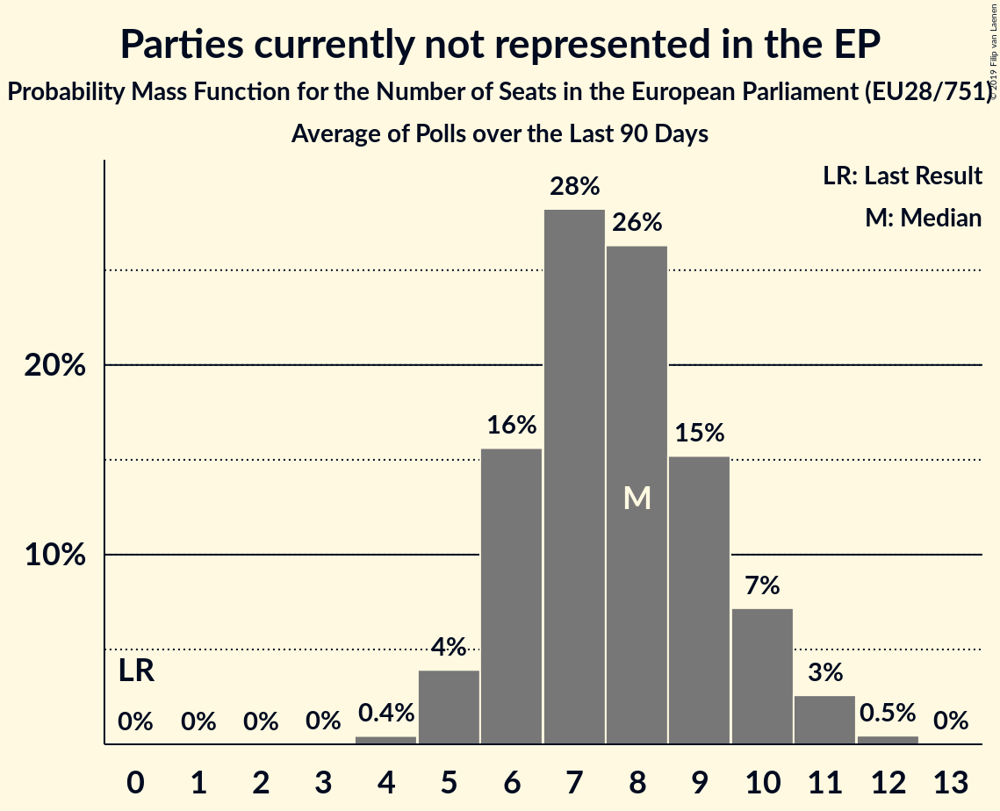

# Seat Projection for the European Parliament (EU28/751)

<a href="#seats">Seats</a> | <a href="#voting-intentions">Voting Intentions</a> | <a href="#technical-information">Technical Information</a>

## Seats

### Confidence Intervals

| Party | Last Result | Median | 80% Confidence Interval | 90% Confidence Interval | 95% Confidence Interval | 99% Confidence Interval |
|:-----:|:-----------:|:------:|:-----------------------:|:-----------------------:|:-----------------------:|:-----------------------:|
| <a href="#european-people’s-party">European People’s Party</a> | 217 | 179 | 173–185 |171–187 | 169–188 | 166–191 |
| <a href="#progressive-alliance-of-socialists-and-democrats">Progressive Alliance of Socialists and Democrats</a> | 186 | 159 | 150–169 |147–171 | 145–173 | 141–178 |
| <a href="#alliance-of-liberals-and-democrats-for-europe">Alliance of Liberals and Democrats for Europe</a> | 68 | 102 | 97–107 |95–109 | 94–110 | 92–113 |
| <a href="#european-alliance-of-peoples-and-nations">European Alliance of Peoples and Nations</a> | 37 | 87 | 80–94 |79–96 | 77–97 | 75–100 |
| <a href="#european-conservatives-and-reformists">European Conservatives and Reformists</a> | 76 | 71 | 63–85 |61–88 | 59–89 | 57–92 |
| <a href="#greens–european-free-alliance">Greens–European Free Alliance</a> | 52 | 49 | 44–54 |43–55 | 42–56 | 41–58 |
| <a href="#european-united-left–nordic-green-left">European United Left–Nordic Green Left</a> | 52 | 47 | 44–50 |43–51 | 42–52 | 41–53 |
| <a href="#europe-of-freedom-and-direct-democracy">Europe of Freedom and Direct Democracy</a> | 41 | 28 | 20–34 |19–35 | 18–37 | 16–38 |
| <a href="#non-inscrits">Non-Inscrits</a> | 21 | 10 | 9–12 |8–12 | 8–13 | 7–13 |
| <a href="#parties-currently-not-represented-in-the-ep">Parties currently not represented in the EP</a> | 0 | 8 | 6–10 |6–10 | 5–11 | 5–11 |

### European People’s Party

*For a full overview of the results for this party, see the [European People’s Party](party-2019-04-15-europeanpeople’sparty.html) page.*

| Number of Seats | Probability | Accumulated | Special Marks |
|:---------------:|:-----------:|:-----------:|:-------------:|
| 163 | 0% | 100% |  |
| 164 | 0.1% | 99.9% |  |
| 165 | 0.2% | 99.8% |  |
| 166 | 0.3% | 99.7% |  |
| 167 | 0.5% | 99.4% |  |
| 168 | 0.8% | 98.9% |  |
| 169 | 1.1% | 98% |  |
| 170 | 2% | 97% |  |
| 171 | 2% | 95% |  |
| 172 | 3% | 93% |  |
| 173 | 4% | 90% |  |
| 174 | 5% | 86% |  |
| 175 | 6% | 81% |  |
| 176 | 7% | 75% |  |
| 177 | 8% | 68% |  |
| 178 | 8% | 61% |  |
| 179 | 8% | 53% | Median |
| 180 | 8% | 44% |  |
| 181 | 8% | 36% |  |
| 182 | 7% | 29% |  |
| 183 | 6% | 22% |  |
| 184 | 5% | 16% |  |
| 185 | 4% | 12% |  |
| 186 | 3% | 8% |  |
| 187 | 2% | 5% |  |
| 188 | 1.3% | 3% |  |
| 189 | 0.8% | 2% |  |
| 190 | 0.5% | 1.2% |  |
| 191 | 0.3% | 0.7% |  |
| 192 | 0.2% | 0.4% |  |
| 193 | 0.1% | 0.2% |  |
| 194 | 0% | 0.1% |  |
| 195 | 0% | 0% |  |
| 196 | 0% | 0% |  |
| 197 | 0% | 0% |  |
| 198 | 0% | 0% |  |
| 199 | 0% | 0% |  |
| 200 | 0% | 0% |  |
| 201 | 0% | 0% |  |
| 202 | 0% | 0% |  |
| 203 | 0% | 0% |  |
| 204 | 0% | 0% |  |
| 205 | 0% | 0% |  |
| 206 | 0% | 0% |  |
| 207 | 0% | 0% |  |
| 208 | 0% | 0% |  |
| 209 | 0% | 0% |  |
| 210 | 0% | 0% |  |
| 211 | 0% | 0% |  |
| 212 | 0% | 0% |  |
| 213 | 0% | 0% |  |
| 214 | 0% | 0% |  |
| 215 | 0% | 0% |  |
| 216 | 0% | 0% |  |
| 217 | 0% | 0% | Last Result |

### Progressive Alliance of Socialists and Democrats

*For a full overview of the results for this party, see the [Progressive Alliance of Socialists and Democrats](party-2019-04-15-progressiveallianceofsocialistsanddemocrats.html) page.*

| Number of Seats | Probability | Accumulated | Special Marks |
|:---------------:|:-----------:|:-----------:|:-------------:|
| 136 | 0% | 100% |  |
| 137 | 0% | 99.9% |  |
| 138 | 0.1% | 99.9% |  |
| 139 | 0.1% | 99.8% |  |
| 140 | 0.2% | 99.8% |  |
| 141 | 0.2% | 99.6% |  |
| 142 | 0.3% | 99.4% |  |
| 143 | 0.5% | 99.0% |  |
| 144 | 0.7% | 98.6% |  |
| 145 | 0.9% | 98% |  |
| 146 | 1.2% | 97% |  |
| 147 | 1.5% | 96% |  |
| 148 | 2% | 94% |  |
| 149 | 2% | 92% |  |
| 150 | 3% | 90% |  |
| 151 | 3% | 87% |  |
| 152 | 4% | 84% |  |
| 153 | 4% | 81% |  |
| 154 | 5% | 76% |  |
| 155 | 5% | 72% |  |
| 156 | 5% | 67% |  |
| 157 | 5% | 62% |  |
| 158 | 5% | 56% |  |
| 159 | 5% | 51% | Median |
| 160 | 5% | 46% |  |
| 161 | 5% | 41% |  |
| 162 | 5% | 36% |  |
| 163 | 4% | 31% |  |
| 164 | 4% | 27% |  |
| 165 | 4% | 23% |  |
| 166 | 3% | 19% |  |
| 167 | 3% | 16% |  |
| 168 | 3% | 13% |  |
| 169 | 2% | 10% |  |
| 170 | 2% | 8% |  |
| 171 | 2% | 6% |  |
| 172 | 1.3% | 5% |  |
| 173 | 1.0% | 3% |  |
| 174 | 0.7% | 2% |  |
| 175 | 0.5% | 2% |  |
| 176 | 0.4% | 1.2% |  |
| 177 | 0.3% | 0.8% |  |
| 178 | 0.2% | 0.5% |  |
| 179 | 0.1% | 0.3% |  |
| 180 | 0.1% | 0.2% |  |
| 181 | 0% | 0.1% |  |
| 182 | 0% | 0.1% |  |
| 183 | 0% | 0% |  |
| 184 | 0% | 0% |  |
| 185 | 0% | 0% |  |
| 186 | 0% | 0% | Last Result |

### European Alliance of Peoples and Nations

*For a full overview of the results for this party, see the [European Alliance of Peoples and Nations](party-2019-04-15-europeanallianceofpeoplesandnations.html) page.*

| Number of Seats | Probability | Accumulated | Special Marks |
|:---------------:|:-----------:|:-----------:|:-------------:|
| 37 | 0% | 100% | Last Result |
| 38 | 0% | 100% |  |
| 39 | 0% | 100% |  |
| 40 | 0% | 100% |  |
| 41 | 0% | 100% |  |
| 42 | 0% | 100% |  |
| 43 | 0% | 100% |  |
| 44 | 0% | 100% |  |
| 45 | 0% | 100% |  |
| 46 | 0% | 100% |  |
| 47 | 0% | 100% |  |
| 48 | 0% | 100% |  |
| 49 | 0% | 100% |  |
| 50 | 0% | 100% |  |
| 51 | 0% | 100% |  |
| 52 | 0% | 100% |  |
| 53 | 0% | 100% |  |
| 54 | 0% | 100% |  |
| 55 | 0% | 100% |  |
| 56 | 0% | 100% |  |
| 57 | 0% | 100% |  |
| 58 | 0% | 100% |  |
| 59 | 0% | 100% |  |
| 60 | 0% | 100% |  |
| 61 | 0% | 100% |  |
| 62 | 0% | 100% |  |
| 63 | 0% | 100% |  |
| 64 | 0% | 100% |  |
| 65 | 0% | 100% |  |
| 66 | 0% | 100% |  |
| 67 | 0% | 100% |  |
| 68 | 0% | 100% |  |
| 69 | 0% | 100% |  |
| 70 | 0% | 100% |  |
| 71 | 0% | 100% |  |
| 72 | 0.1% | 100% |  |
| 73 | 0.1% | 99.9% |  |
| 74 | 0.2% | 99.8% |  |
| 75 | 0.5% | 99.5% |  |
| 76 | 0.8% | 99.1% |  |
| 77 | 1.3% | 98% |  |
| 78 | 2% | 97% |  |
| 79 | 3% | 95% |  |
| 80 | 3% | 92% |  |
| 81 | 4% | 89% |  |
| 82 | 5% | 85% |  |
| 83 | 6% | 80% |  |
| 84 | 6% | 74% |  |
| 85 | 7% | 68% |  |
| 86 | 7% | 62% |  |
| 87 | 7% | 55% | Median |
| 88 | 7% | 47% |  |
| 89 | 7% | 40% |  |
| 90 | 7% | 33% |  |
| 91 | 6% | 27% |  |
| 92 | 5% | 21% |  |
| 93 | 4% | 15% |  |
| 94 | 3% | 11% |  |
| 95 | 3% | 8% |  |
| 96 | 2% | 5% |  |
| 97 | 1.3% | 3% |  |
| 98 | 0.8% | 2% |  |
| 99 | 0.5% | 1.1% |  |
| 100 | 0.3% | 0.6% |  |
| 101 | 0.2% | 0.3% |  |
| 102 | 0.1% | 0.1% |  |
| 103 | 0% | 0.1% |  |
| 104 | 0% | 0% |  |

### Non-Inscrits

*For a full overview of the results for this party, see the [Non-Inscrits](party-2019-04-15-non-inscrits.html) page.*

| Number of Seats | Probability | Accumulated | Special Marks |
|:---------------:|:-----------:|:-----------:|:-------------:|
| 7 | 0.5% | 100% |  |
| 8 | 5% | 99.5% |  |
| 9 | 18% | 95% |  |
| 10 | 32% | 77% | Median |
| 11 | 29% | 46% |  |
| 12 | 13% | 16% |  |
| 13 | 3% | 3% |  |
| 14 | 0.3% | 0.3% |  |
| 15 | 0% | 0% |  |
| 16 | 0% | 0% |  |
| 17 | 0% | 0% |  |
| 18 | 0% | 0% |  |
| 19 | 0% | 0% |  |
| 20 | 0% | 0% |  |
| 21 | 0% | 0% | Last Result |

### Alliance of Liberals and Democrats for Europe

*For a full overview of the results for this party, see the [Alliance of Liberals and Democrats for Europe](party-2019-04-15-allianceofliberalsanddemocratsforeurope.html) page.*

| Number of Seats | Probability | Accumulated | Special Marks |
|:---------------:|:-----------:|:-----------:|:-------------:|
| 68 | 0% | 100% | Last Result |
| 69 | 0% | 100% |  |
| 70 | 0% | 100% |  |
| 71 | 0% | 100% |  |
| 72 | 0% | 100% |  |
| 73 | 0% | 100% |  |
| 74 | 0% | 100% |  |
| 75 | 0% | 100% |  |
| 76 | 0% | 100% |  |
| 77 | 0% | 100% |  |
| 78 | 0% | 100% |  |
| 79 | 0% | 100% |  |
| 80 | 0% | 100% |  |
| 81 | 0% | 100% |  |
| 82 | 0% | 100% |  |
| 83 | 0% | 100% |  |
| 84 | 0% | 100% |  |
| 85 | 0% | 100% |  |
| 86 | 0% | 100% |  |
| 87 | 0% | 100% |  |
| 88 | 0% | 100% |  |
| 89 | 0.1% | 100% |  |
| 90 | 0.1% | 99.9% |  |
| 91 | 0.3% | 99.8% |  |
| 92 | 0.5% | 99.5% |  |
| 93 | 0.9% | 99.1% |  |
| 94 | 2% | 98% |  |
| 95 | 2% | 97% |  |
| 96 | 4% | 94% |  |
| 97 | 5% | 91% |  |
| 98 | 6% | 86% |  |
| 99 | 8% | 79% |  |
| 100 | 9% | 72% |  |
| 101 | 10% | 63% |  |
| 102 | 10% | 53% | Median |
| 103 | 9% | 43% |  |
| 104 | 8% | 34% |  |
| 105 | 7% | 26% |  |
| 106 | 6% | 19% |  |
| 107 | 4% | 13% |  |
| 108 | 3% | 9% |  |
| 109 | 2% | 6% |  |
| 110 | 1.4% | 3% |  |
| 111 | 0.9% | 2% |  |
| 112 | 0.5% | 1.1% |  |
| 113 | 0.3% | 0.6% |  |
| 114 | 0.2% | 0.3% |  |
| 115 | 0.1% | 0.2% |  |
| 116 | 0% | 0.1% |  |
| 117 | 0% | 0% |  |

### Greens–European Free Alliance

*For a full overview of the results for this party, see the [Greens–European Free Alliance](party-2019-04-15-greens–europeanfreealliance.html) page.*

| Number of Seats | Probability | Accumulated | Special Marks |
|:---------------:|:-----------:|:-----------:|:-------------:|
| 39 | 0.1% | 100% |  |
| 40 | 0.3% | 99.9% |  |
| 41 | 0.7% | 99.7% |  |
| 42 | 2% | 98.9% |  |
| 43 | 3% | 97% |  |
| 44 | 5% | 94% |  |
| 45 | 7% | 89% |  |
| 46 | 9% | 81% |  |
| 47 | 10% | 72% |  |
| 48 | 11% | 61% |  |
| 49 | 10% | 51% | Median |
| 50 | 9% | 40% |  |
| 51 | 8% | 31% |  |
| 52 | 7% | 23% | Last Result |
| 53 | 5% | 16% |  |
| 54 | 4% | 10% |  |
| 55 | 3% | 6% |  |
| 56 | 2% | 4% |  |
| 57 | 1.0% | 2% |  |
| 58 | 0.5% | 0.8% |  |
| 59 | 0.2% | 0.3% |  |
| 60 | 0.1% | 0.1% |  |
| 61 | 0% | 0% |  |

### European United Left–Nordic Green Left

*For a full overview of the results for this party, see the [European United Left–Nordic Green Left](party-2019-04-15-europeanunitedleft–nordicgreenleft.html) page.*

| Number of Seats | Probability | Accumulated | Special Marks |
|:---------------:|:-----------:|:-----------:|:-------------:|
| 39 | 0.1% | 100% |  |
| 40 | 0.3% | 99.9% |  |
| 41 | 0.9% | 99.6% |  |
| 42 | 2% | 98.7% |  |
| 43 | 5% | 96% |  |
| 44 | 8% | 91% |  |
| 45 | 12% | 83% |  |
| 46 | 15% | 71% |  |
| 47 | 16% | 55% | Median |
| 48 | 14% | 39% |  |
| 49 | 11% | 25% |  |
| 50 | 7% | 14% |  |
| 51 | 4% | 7% |  |
| 52 | 2% | 3% | Last Result |
| 53 | 0.7% | 1.0% |  |
| 54 | 0.2% | 0.3% |  |
| 55 | 0.1% | 0.1% |  |
| 56 | 0% | 0% |  |

### European Conservatives and Reformists

*For a full overview of the results for this party, see the [European Conservatives and Reformists](party-2019-04-15-europeanconservativesandreformists.html) page.*

| Number of Seats | Probability | Accumulated | Special Marks |
|:---------------:|:-----------:|:-----------:|:-------------:|
| 54 | 0% | 100% |  |
| 55 | 0.1% | 99.9% |  |
| 56 | 0.2% | 99.8% |  |
| 57 | 0.4% | 99.6% |  |
| 58 | 0.7% | 99.2% |  |
| 59 | 1.1% | 98.5% |  |
| 60 | 2% | 97% |  |
| 61 | 2% | 96% |  |
| 62 | 3% | 94% |  |
| 63 | 4% | 91% |  |
| 64 | 4% | 87% |  |
| 65 | 5% | 83% |  |
| 66 | 5% | 78% |  |
| 67 | 5% | 73% |  |
| 68 | 5% | 68% |  |
| 69 | 5% | 63% |  |
| 70 | 5% | 58% |  |
| 71 | 5% | 53% | Median |
| 72 | 4% | 48% |  |
| 73 | 4% | 44% |  |
| 74 | 4% | 40% |  |
| 75 | 3% | 37% |  |
| 76 | 3% | 33% | Last Result |
| 77 | 3% | 31% |  |
| 78 | 2% | 28% |  |
| 79 | 2% | 26% |  |
| 80 | 2% | 23% |  |
| 81 | 2% | 21% |  |
| 82 | 2% | 19% |  |
| 83 | 2% | 16% |  |
| 84 | 2% | 14% |  |
| 85 | 2% | 11% |  |
| 86 | 2% | 9% |  |
| 87 | 2% | 7% |  |
| 88 | 2% | 5% |  |
| 89 | 1.2% | 4% |  |
| 90 | 0.9% | 2% |  |
| 91 | 0.6% | 1.4% |  |
| 92 | 0.4% | 0.8% |  |
| 93 | 0.2% | 0.4% |  |
| 94 | 0.1% | 0.2% |  |
| 95 | 0% | 0.1% |  |
| 96 | 0% | 0% |  |

### Europe of Freedom and Direct Democracy

*For a full overview of the results for this party, see the [Europe of Freedom and Direct Democracy](party-2019-04-15-europeoffreedomanddirectdemocracy.html) page.*

| Number of Seats | Probability | Accumulated | Special Marks |
|:---------------:|:-----------:|:-----------:|:-------------:|
| 15 | 0.2% | 100% |  |
| 16 | 0.6% | 99.8% |  |
| 17 | 1.4% | 99.2% |  |
| 18 | 2% | 98% |  |
| 19 | 3% | 96% |  |
| 20 | 4% | 92% |  |
| 21 | 4% | 88% |  |
| 22 | 4% | 84% |  |
| 23 | 4% | 79% |  |
| 24 | 4% | 75% |  |
| 25 | 5% | 71% |  |
| 26 | 7% | 65% |  |
| 27 | 8% | 59% |  |
| 28 | 9% | 51% | Median |
| 29 | 8% | 42% |  |
| 30 | 7% | 34% |  |
| 31 | 6% | 26% |  |
| 32 | 5% | 21% |  |
| 33 | 4% | 16% |  |
| 34 | 4% | 12% |  |
| 35 | 3% | 8% |  |
| 36 | 2% | 5% |  |
| 37 | 1.4% | 3% |  |
| 38 | 0.7% | 1.2% |  |
| 39 | 0.3% | 0.5% |  |
| 40 | 0.1% | 0.1% |  |
| 41 | 0% | 0% | Last Result |

### Parties currently not represented in the EP

*For a full overview of the results for this party, see the [Parties currently not represented in the EP](party-2019-04-15-partiescurrentlynotrepresentedintheep.html) page.*

| Number of Seats | Probability | Accumulated | Special Marks |
|:---------------:|:-----------:|:-----------:|:-------------:|
| 0 | 0% | 100% | Last Result |
| 1 | 0% | 100% |  |
| 2 | 0% | 100% |  |
| 3 | 0% | 100% |  |
| 4 | 0.4% | 100% |  |
| 5 | 4% | 99.5% |  |
| 6 | 16% | 96% |  |
| 7 | 28% | 80% |  |
| 8 | 26% | 52% | Median |
| 9 | 15% | 25% |  |
| 10 | 7% | 10% |  |
| 11 | 3% | 3% |  |
| 12 | 0.5% | 0.5% |  |
| 13 | 0% | 0% |  |

## Voting Intentions

### Confidence Intervals

| Party | Last Result | Median | 80% Confidence Interval | 90% Confidence Interval | 95% Confidence Interval | 99% Confidence Interval |
|:-----:|:-----------:|:------:|:-----------------------:|:-----------------------:|:-----------------------:|:-----------------------:|
| <a href="#european-people’s-party">European People’s Party</a> | 28.6% | N/A | N/A |N/A | N/A | N/A |
| <a href="#progressive-alliance-of-socialists-and-democrats">Progressive Alliance of Socialists and Democrats</a> | 24.6% | N/A | N/A |N/A | N/A | N/A |
| <a href="#european-alliance-of-peoples-and-nations">European Alliance of Peoples and Nations</a> | 15.3% | N/A | N/A |N/A | N/A | N/A |
| <a href="#non-inscrits">Non-Inscrits</a> | 15.3% | N/A | N/A |N/A | N/A | N/A |
| <a href="#alliance-of-liberals-and-democrats-for-europe">Alliance of Liberals and Democrats for Europe</a> | 7.9% | N/A | N/A |N/A | N/A | N/A |
| <a href="#greens–european-free-alliance">Greens–European Free Alliance</a> | 6.5% | N/A | N/A |N/A | N/A | N/A |
| <a href="#european-conservatives-and-reformists">European Conservatives and Reformists</a> | 6.0% | N/A | N/A |N/A | N/A | N/A |
| <a href="#european-united-left–nordic-green-left">European United Left–Nordic Green Left</a> | 6.0% | N/A | N/A |N/A | N/A | N/A |
| <a href="#europe-of-freedom-and-direct-democracy">Europe of Freedom and Direct Democracy</a> | 5.1% | N/A | N/A |N/A | N/A | N/A |
| <a href="#parties-currently-not-represented-in-the-ep">Parties currently not represented in the EP</a> | 0.0% | N/A | N/A |N/A | N/A | N/A |

## Technical Information

The seat and voting intentions projection for the European Parliament presented on this page was based on the averages of the most recent polls for the following countries:

| Country                                                                                                                      | No of Seats                   | No of Constituencies | Method                    | Threshold |
|:-----------------------------------------------------------------------------------------------------------------------------|:-----------------------------:|:--------------------:|:-------------------------:|:---------:|
| Austria [⁰](https://filipvanlaenen.github.io/austrian_ep_polls/average-2019-04-15.html)                                                 | 18 <strike>19</strike>¹       | 1                    | D'Hondt                  | 4%        |
| Belgium: [Flanders](https://filipvanlaenen.github.io/flemish_ep_polls/average-2019-04-15.html)                                          | 12                            | 1                    | D'Hondt                  | No        |
| Belgium: French Community [⁰](https://github.com/filipvanlaenen/french_community_of_belgium_ep_polls/blob/master/average-2019-04-15.md) | 8                             | 1                    | D'Hondt                  | No        |
| Belgium: German-speaking constituency²                                                                                       | 1                             | 1                    | D'Hondt                  | No        |
| Bulgaria [⁰](https://filipvanlaenen.github.io/bulgarian_ep_polls/average-2019-04-15.html)                                               | 17                            | 1                    | Hare-Niemeyer             | 5%        |
| Croatia [⁰](https://filipvanlaenen.github.io/croatian_ep_polls/average-2019-04-15.html)                                                 | 11 <strike>12</strike>¹       | 1                    | D'Hondt                  | 5%        |
| Cyprus [⁰](https://github.com/filipvanlaenen/cypriot_ep_polls/blob/master/average-2019-04-15.md)                                        | 6                             | 1                    | Hare-Niemeyer             | No        |
| Czech Republic [⁰](https://filipvanlaenen.github.io/czech_ep_polls/average-2019-04-15.html)                                             | 21                            | 1                    | D'Hondt                  | 5%        |
| [Denmark](https://filipvanlaenen.github.io/danish_ep_polls/average-2019-04-15.html)                                                     | 13 <strike>14</strike>¹       | 1                    | D'Hondt                  | No        |
| [Estonia](https://filipvanlaenen.github.io/estonian_ep_polls/average-2019-04-15.html)                                                   | 6 <strike>7</strike>¹         | 1                    | D'Hondt                  | No        |
| [Finland](https://filipvanlaenen.github.io/finnish_ep_polls/average-2019-04-15.html)³                                                   | 13 <strike>14</strike>¹       | 1                    | D'Hondt                  | No        |
| France [⁰](https://filipvanlaenen.github.io/french_ep_polls/average-2019-04-15.html)                                                    | 74 <strike>79</strike>¹       | 1                    | D'Hondt                  | 5%        |
| [Germany](https://filipvanlaenen.github.io/german_ep_polls/average-2019-04-15.html)                                                     | 96                            | 1                    | Sainte-Laguë              | No        |
| [Greece](https://filipvanlaenen.github.io/greek_ep_polls/average-2019-04-15.html)                                                       | 21                            | 1                    | Droop                     | 3%        |
| [Hungary](https://filipvanlaenen.github.io/hungarian_ep_polls/average-2019-04-15.html)                                                  | 21                            | 1                    | D'Hondt                  | No        |
| Ireland [⁰](https://filipvanlaenen.github.io/irish_ep_polls/average-2019-04-15.html)                                                    | 11 <strike>13</strike>¹       | 3                    | Single transferable vote⁴ | N/A       |
| Italy [⁰](https://filipvanlaenen.github.io/italian_ep_polls/average-2019-04-15.html)                                                    | 73 <strike>76</strike>¹       | 1                    | Hare-Niemeyer             | 4%        |
| [Latvia](https://filipvanlaenen.github.io/latvian_ep_polls/average-2019-04-15.html)                                                     | 8                             | 1                    | Sainte-Laguë              | 5%        |
| Lithuania [⁰](https://github.com/filipvanlaenen/lithuanian_ep_polls/blob/master/average-2019-04-15.md)                                  | 11                            | 1                    | Hare–Niemeyer             | 5%        |
| [Luxembourg](https://filipvanlaenen.github.io/luxembourg_ep_polls/average-2019-04-15.html)³                                             | 6                             | 1                    | D'Hondt                  | No        |
| Malta [⁰](https://github.com/filipvanlaenen/maltese_ep_polls/blob/master/average-2019-04-15.md)                                         | 6                             | 1                    | Single transferable vote⁴ | N/A       |
| Netherlands [⁰](https://filipvanlaenen.github.io/dutch_ep_polls/average-2019-04-15.html)                                                | 26 <strike>29</strike>¹       | 1                    | D'Hondt                  | 1/26      |
| Poland [⁰](https://filipvanlaenen.github.io/polish_ep_polls/average-2019-04-15.html)                                                    | 51 <strike>52</strike>¹       | 1                    | D'Hondt                  | 5%        |
| [Portugal](https://filipvanlaenen.github.io/portuguese_ep_polls/average-2019-04-15.html)                                                | 21                            | 1                    | D'Hondt                  | No        |
| Romania [⁰](https://filipvanlaenen.github.io/romanian_ep_polls/average-2019-04-15.html)                                                 | 32 <strike>33</strike>¹       | 1                    | D'Hondt                  | 5%        |
| Slovakia [⁰](https://github.com/filipvanlaenen/slovakian_ep_polls/blob/master/average-2019-04-15.md)                                    | 13 <strike>14</strike>¹       | 1                    | Hagenbach-Bischoff        | 5%        |
| [Slovenia](https://filipvanlaenen.github.io/slovenian_ep_polls/average-2019-04-15.html)                                                 | 8                             | 1                    | D'Hondt                  | 5%        |
| [Spain](https://filipvanlaenen.github.io/spanish_ep_polls/average-2019-04-15.html)                                                      | 54 <strike>59</strike>¹       | 1                    | D'Hondt                  | No        |
| [Sweden](https://filipvanlaenen.github.io/swedish_ep_polls/average-2019-04-15.html)                                                     | 20 <strike>21</strike>¹       | 1                    | Modified Sainte-Laguë     | 4%        |
| United Kingdom: [Great Britain](https://filipvanlaenen.github.io/british_ep_polls/average-2019-04-15.html)                              | 70 <strike>0</strike>⁵        | 11                   | D'Hondt                  | No        |
| United Kingdom: [Northern Ireland](https://filipvanlaenen.github.io/northern_irish_ep_polls/average-2019-04-15.html)                    | 3 <strike>0</strike>⁵         | 1                    | Single transferable vote⁴ | N/A       |
| **Total**                                                                                                                    | **751 <strike>705</strike>¹** | **43**               |                           |           |

¹ Number of seats according to the [redistribution of seats](http://www.europarl.europa.eu/news/en/headlines/eu-affairs/20180126STO94114/eu-elections-how-many-meps-will-each-country-get-in-2019) that was planned for the 2019 European election if the United Kingdom had left the European Union by May 2019.

² No opinion polls reported since the 2014 European election; represented as 1 seat for the EPP.

³ No new opinion polls reported since the last national election; the results from the last national election are therefore used in the current projection for the European election.

⁴ Implemented as D'Hondt.

⁵ The United Kingdom was set to leave the European Union before the next European election.
