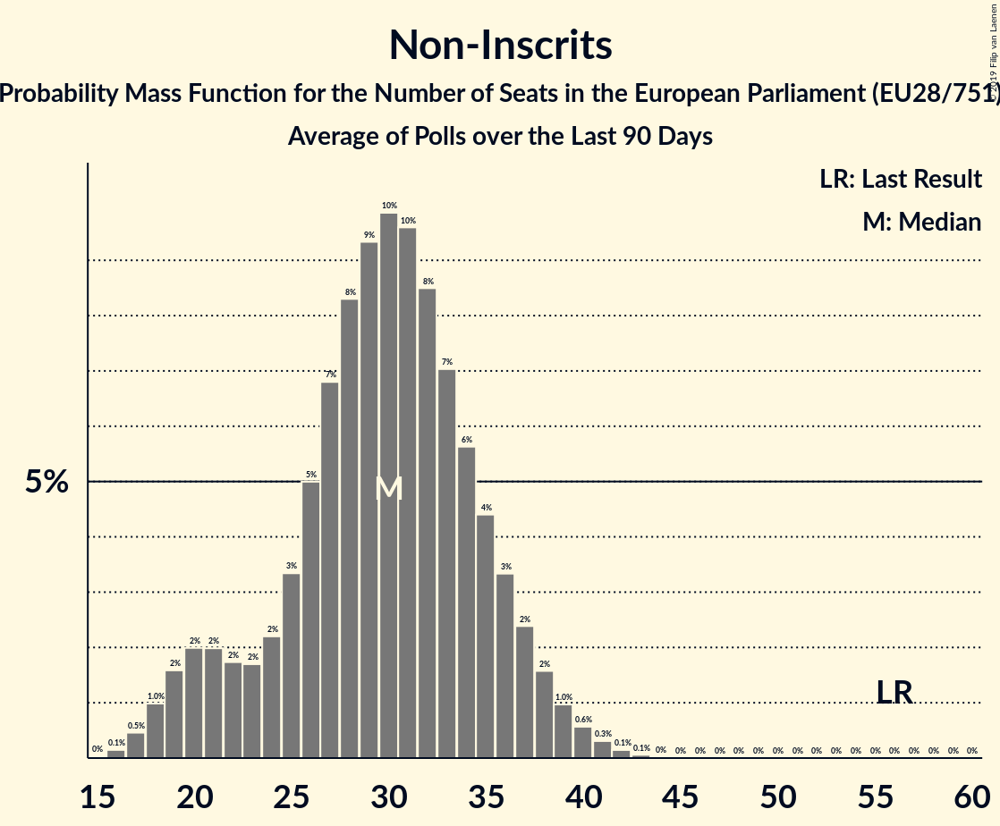

# Non-Inscrits

Members registered from **14 countries**:

> BE, BG, CY, ES, FI, FR, GB, GR, HR, HU, IT, PL, SI, SK

## Seats

Last result: **56** seats (General Election of 25 May 2014)

Current median: **30** seats (-26 seats)

At least one member in **7 countries** have a median of 1 seat or more:

> ES, GB, GR, HR, HU, IT, SK

### Confidence Intervals

| Party | Area | Last Result | Median | 80% Confidence Interval | 90% Confidence Interval | 95% Confidence Interval | 99% Confidence Interval |
|:-----:|:----:|:-----------:|:------:|:-----------------------:|:-----------------------:|:-----------------------:|:-----------------------:|
| Non-Inscrits | EU | 56 | 30 | 23–35 | 20–37 | 19–38 | 17–41 |
| Movimento 5 Stelle | IT | | 14 | 12–19 | 11–20 | 11–20 | 10–21 |
| Brexit Party | GB-GBN | | 8 | 0–11 | 0–11 | 0–12 | 0–13 |
| Jobbik | HU | | 2 | 1–2 | 1–2 | 1–2 | 1–3 |
| Kotleba–Ľudová strana Naše Slovensko | SK | | 2 | 1–2 | 1–2 | 1–2 | 1–2 |
| Democratic Unionist Party | GB-NIR | | 1 | 1 | 1 | 1 | 1 |
| Nezavisna lista Mislava Kolakušića | HR | | 1 | 0–1 | 0–1 | 0–1 | 0–1 |
| Partit Demòcrata Europeu Català | ES | | 1 | 0–1 | 0–1 | 0–1 | 0–1 |
| Κομμουνιστικό Κόμμα Ελλάδας | GR | | 1 | 1 | 1 | 1 | 1 |
| KORWiN | PL | | 0 | 0 | 0 | 0 | 0–3 |
| Kukiz’15 | PL | | 0 | 0–3 | 0–3 | 0–4 | 0–4 |
| Les Patriotes | FR | | 0 | 0 | 0 | 0 | 0 |
| Liike Nyt | FI | | 0 | 0 | 0 | 0 | 0 |
| Magyar Kétfarkú Kutya Párt | HU | | 0 | 0–1 | 0–1 | 0–1 | 0–1 |
| Mi Hazánk Mozgalom | HU | | 0 | 0 | 0 | 0 | 0–1 |
| Parti Populaire | BE-FRC | | 0 | 0 | 0 | 0 | 0 |
| Slovenska nacionalna stranka | SI | | 0 | 0 | 0 | 0 | 0 |
| Živi zid | HR | | 0 | 0 | 0 | 0 | 0 |
| Εθνικό Λαϊκό Μέτωπο | CY | | 0 | 0 | 0 | 0 | 0 |
| Χρυσή Αυγή | GR | | 0 | 0 | 0 | 0 | 0 |
| Атака | BG | | 0 | 0 | 0 | 0 | 0 |
| Национален фронт за спасение на България | BG | | 0 | 0 | 0 | 0 | 0 |

### Probability Mass Function

The following table shows the probability mass function per seat for the [poll average](average-2019-08-31.html) for Non-Inscrits.

| Number of Seats | Probability | Accumulated | Special Marks |
|:---------------:|:-----------:|:-----------:|:-------------:|
| 16 | 0.1% | 100% |  |
| 17 | 0.5% | 99.8% |  |
| 18 | 1.0% | 99.4% |  |
| 19 | 2% | 98% |  |
| 20 | 2% | 97% |  |
| 21 | 2% | 95% |  |
| 22 | 2% | 93% |  |
| 23 | 2% | 91% |  |
| 24 | 2% | 89% |  |
| 25 | 3% | 87% |  |
| 26 | 5% | 84% |  |
| 27 | 7% | 79% |  |
| 28 | 8% | 72% |  |
| 29 | 9% | 64% |  |
| 30 | 10% | 54% | Median |
| 31 | 10% | 45% |  |
| 32 | 8% | 35% |  |
| 33 | 7% | 26% |  |
| 34 | 6% | 19% |  |
| 35 | 4% | 14% |  |
| 36 | 3% | 9% |  |
| 37 | 2% | 6% |  |
| 38 | 2% | 4% |  |
| 39 | 1.0% | 2% |  |
| 40 | 0.6% | 1.1% |  |
| 41 | 0.3% | 0.5% |  |
| 42 | 0.1% | 0.2% |  |
| 43 | 0.1% | 0.1% |  |
| 44 | 0% | 0% |  |
| 45 | 0% | 0% |  |
| 46 | 0% | 0% |  |
| 47 | 0% | 0% |  |
| 48 | 0% | 0% |  |
| 49 | 0% | 0% |  |
| 50 | 0% | 0% |  |
| 51 | 0% | 0% |  |
| 52 | 0% | 0% |  |
| 53 | 0% | 0% |  |
| 54 | 0% | 0% |  |
| 55 | 0% | 0% |  |
| 56 | 0% | 0% | Last Result |

