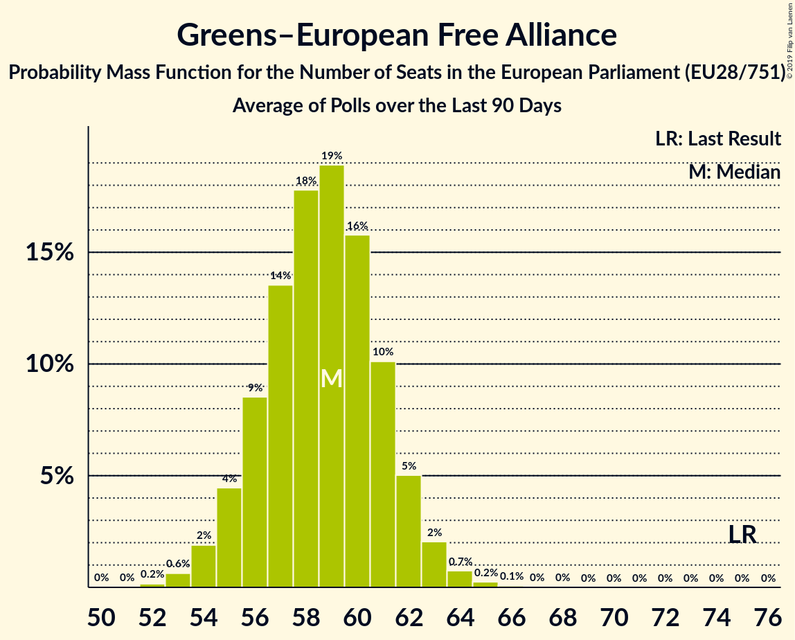

# Greens–European Free Alliance

Members registered from **20 countries**:

> AT, BE, CY, CZ, DE, DK, EE, ES, FI, FR, GB, HU, IE, IT, LT, LU, LV, NL, PT, SE

## Seats

Last result: **75** seats (General Election of 25 May 2014)

Current median: **59** seats (-16 seats)

At least one member in **13 countries** have a median of 1 seat or more:

> AT, BE, CZ, DE, DK, ES, FI, FR, GB, LT, LU, NL, SE

### Confidence Intervals

| Party | Area | Last Result | Median | 80% Confidence Interval | 90% Confidence Interval | 95% Confidence Interval | 99% Confidence Interval |
|:-----:|:----:|:-----------:|:------:|:-----------------------:|:-----------------------:|:-----------------------:|:-----------------------:|
| Greens–European Free Alliance | EU | 75 | 59 | 56–61 | 55–62 | 54–63 | 53–64 |
| Bündnis 90/Die Grünen | DE | | 21 | 19–22 | 19–23 | 18–23 | 18–24 |
| Europe Écologie Les Verts | FR | | 12 | 12 | 12 | 12 | 12 |
| Die Grünen–Die Grüne Alternative | AT | | 3 | 2–3 | 2–3 | 2–3 | 2–4 |
| GroenLinks | NL | | 3 | 2–4 | 2–4 | 2–4 | 2–4 |
| Česká pirátská strana | CZ | | 3 | 2–3 | 2–4 | 2–4 | 2–4 |
| Ecolo | BE-FRC | | 2 | 1–2 | 1–2 | 1–2 | 1–2 |
| Esquerra Republicana de Catalunya–Catalunya Sí | ES | | 2 | 1–2 | 1–2 | 1–2 | 1–3 |
| Lietuvos valstiečių ir žaliųjų sąjunga | LT | | 2 | 1–2 | 1–2 | 1–2 | 1–3 |
| Scottish National Party | GB-GBN | | 2 | 2–3 | 1–3 | 1–3 | 1–3 |
| Vihreä liitto | FI | | 2 | 2 | 2 | 2 | 1–2 |
| Coalició Compromís | ES | | 1 | 0–1 | 0–1 | 0–1 | 0–1 |
| Die PARTEI | DE | | 1 | 1–2 | 1–2 | 1–2 | 0–2 |
| Groen | BE-VLG | | 1 | 1 | 1–2 | 1–2 | 1–2 |
| Miljöpartiet de gröna | SE | | 1 | 1 | 1 | 0–1 | 0–1 |
| Socialistisk Folkeparti | DK | | 1 | 1 | 1 | 1 | 1 |
| déi gréng | LU | | 1 | 1 | 1 | 1 | 1 |
| Alternativet | DK | | 0 | 0 | 0 | 0 | 0 |
| Bloque Nacionalista Galego–Nós Candidatura Galega | ES | | 0 | 0 | 0 | 0 | 0 |
| Erakond Eestimaa Rohelised | EE | | 0 | 0 | 0 | 0 | 0 |
| Europa Verde | IT | | 0 | 0 | 0 | 0 | 0 |
| Green Party | GB-GBN | | 0 | 0 | 0 | 0 | 0 |
| Green Party | IE | | 0 | 0–1 | 0–1 | 0–1 | 0–1 |
| LIVRE | PT | | 0 | 0 | 0 | 0–1 | 0–1 |
| Latvijas Krievu savienība | LV | | 0 | 0 | 0 | 0 | 0 |
| Lehet Más a Politika | HU | | 0 | 0 | 0 | 0 | 0 |
| Lietuvos Žaliųjų Partija | LT | | 0 | 0 | 0 | 0 | 0 |
| Pessoas–Animais–Natureza | PT | | 0 | 0–1 | 0–1 | 0–1 | 0–1 |
| Piratenpartei Deutschland | DE | | 0 | 0–1 | 0–1 | 0–1 | 0–1 |
| Piratepartei Lëtzebuerg | LU | | 0 | 0 | 0 | 0 | 0 |
| Plaid Cymru | GB-GBN | | 0 | 0–1 | 0–1 | 0–1 | 0–2 |
| Strana zelených | CZ | | 0 | 0 | 0 | 0 | 0 |
| Volt Europa | DE | | 0 | 0–1 | 0–1 | 0–1 | 0–1 |
| Ökologisch-Demokratische Partei | DE | | 0 | 0–1 | 0–1 | 0–1 | 0–1 |
| Κίνημα Οικολόγων—Συνεργασία Πολιτών | CY | | 0 | 0 | 0 | 0 | 0 |

### Probability Mass Function

The following table shows the probability mass function per seat for the [poll average](average-2019-11-30.html) for Greens–European Free Alliance.

| Number of Seats | Probability | Accumulated | Special Marks |
|:---------------:|:-----------:|:-----------:|:-------------:|
| 52 | 0.2% | 100% |  |
| 53 | 0.6% | 99.8% |  |
| 54 | 2% | 99.2% |  |
| 55 | 4% | 97% |  |
| 56 | 9% | 93% |  |
| 57 | 14% | 84% |  |
| 58 | 18% | 71% |  |
| 59 | 19% | 53% | Median |
| 60 | 16% | 34% |  |
| 61 | 10% | 18% |  |
| 62 | 5% | 8% |  |
| 63 | 2% | 3% |  |
| 64 | 0.7% | 1.1% |  |
| 65 | 0.2% | 0.3% |  |
| 66 | 0.1% | 0.1% |  |
| 67 | 0% | 0% |  |
| 68 | 0% | 0% |  |
| 69 | 0% | 0% |  |
| 70 | 0% | 0% |  |
| 71 | 0% | 0% |  |
| 72 | 0% | 0% |  |
| 73 | 0% | 0% |  |
| 74 | 0% | 0% |  |
| 75 | 0% | 0% | Last Result |

