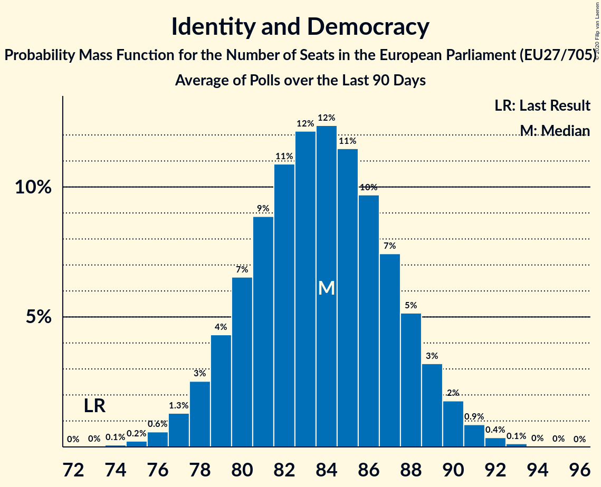

# Identity and Democracy

Members registered from **14 countries**:

> AT, BE, BG, CZ, DE, DK, EE, FI, FR, HR, IT, NL, PT, SK

## Seats

Last result: **73** seats (General Election of 26 May 2019)

Current median: **84** seats (+11 seats)

At least one member in **11 countries** have a median of 1 seat or more:

> AT, BE, CZ, DE, DK, EE, FI, FR, IT, NL, SK

### Confidence Intervals

| Party | Area | Last Result | Median | 80% Confidence Interval | 90% Confidence Interval | 95% Confidence Interval | 99% Confidence Interval |
|:-----:|:----:|:-----------:|:------:|:-----------------------:|:-----------------------:|:-----------------------:|:-----------------------:|
| Identity and Democracy | EU | 73 | 84 | 80–88 | 79–89 | 78–90 | 76–92 |
| Lega Nord | IT | | 27 | 24–29 | 24–30 | 23–30 | 22–31 |
| Rassemblement national | FR | | 25 | 24–26 | 23–27 | 22–27 | 21–28 |
| Alternative für Deutschland | DE | | 13 | 11–15 | 11–15 | 11–15 | 10–15 |
| Perussuomalaiset | FI | | 4 | 4 | 4 | 3–4 | 3–5 |
| Vlaams Belang | BE-VLG | | 4 | 4 | 3–4 | 3–4 | 3–4 |
| Freiheitliche Partei Österreichs | AT | | 3 | 2–3 | 2–3 | 2–3 | 2–4 |
| Partij voor de Vrijheid | NL | | 3 | 3–4 | 3–4 | 3–4 | 3–4 |
| Dansk Folkeparti | DK | | 1 | 1–2 | 1–2 | 1–2 | 1–2 |
| Eesti Konservatiivne Rahvaerakond | EE | | 1 | 1–2 | 1–2 | 1–2 | 1–2 |
| SME RODINA | SK | | 1 | 1 | 1–2 | 1–2 | 1–2 |
| Svoboda a přímá demokracie | CZ | | 1 | 0–2 | 0–2 | 0–2 | 0–3 |
| Chega | PT | | 0 | 0–1 | 0–1 | 0–1 | 0–2 |
| Neovisni za Hrvatsku | HR | | 0 | 0 | 0 | 0 | 0 |
| Воля | BG | | 0 | 0 | 0 | 0 | 0 |

### Probability Mass Function

The following table shows the probability mass function per seat for the [poll average](average-2020-01-31.html) for Identity and Democracy.

| Number of Seats | Probability | Accumulated | Special Marks |
|:---------------:|:-----------:|:-----------:|:-------------:|
| 73 | 0% | 100% | Last Result |
| 74 | 0.1% | 100% |  |
| 75 | 0.2% | 99.9% |  |
| 76 | 0.6% | 99.7% |  |
| 77 | 1.3% | 99.1% |  |
| 78 | 3% | 98% |  |
| 79 | 4% | 95% |  |
| 80 | 7% | 91% |  |
| 81 | 9% | 84% |  |
| 82 | 11% | 76% |  |
| 83 | 12% | 65% |  |
| 84 | 12% | 53% | Median |
| 85 | 11% | 40% |  |
| 86 | 10% | 29% |  |
| 87 | 7% | 19% |  |
| 88 | 5% | 12% |  |
| 89 | 3% | 6% |  |
| 90 | 2% | 3% |  |
| 91 | 0.9% | 1.4% |  |
| 92 | 0.4% | 0.5% |  |
| 93 | 0.1% | 0.2% |  |
| 94 | 0% | 0.1% |  |
| 95 | 0% | 0% |  |

