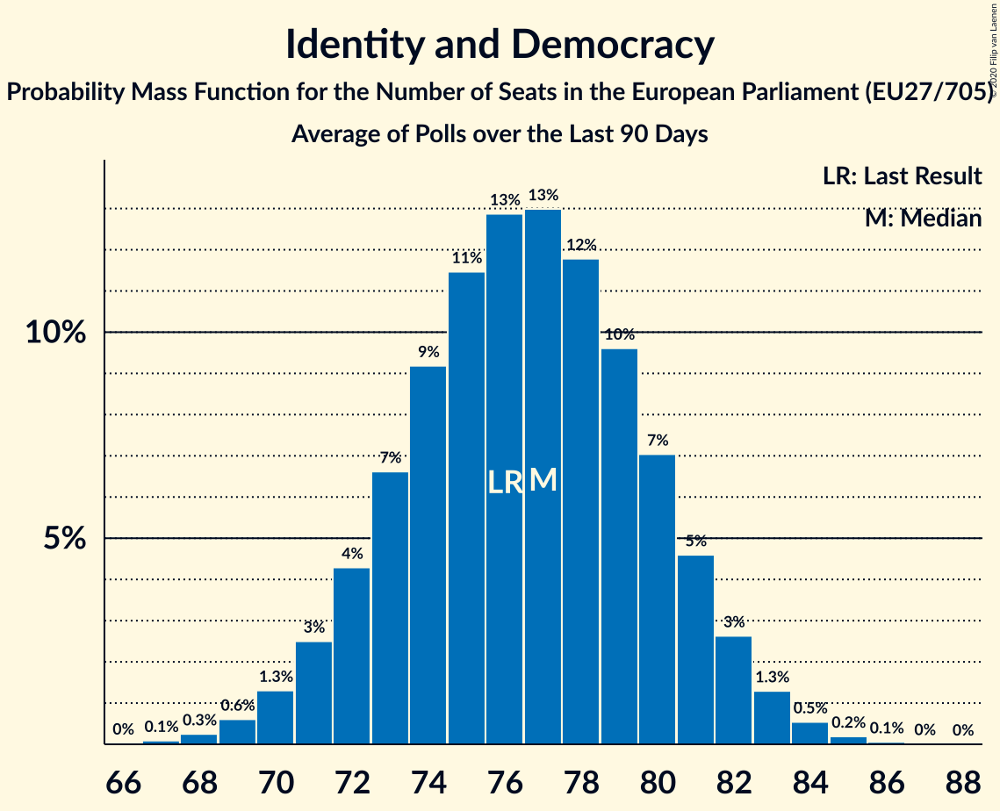

# Identity and Democracy

Members registered from **14 countries**:

> AT, BE, BG, CZ, DE, DK, EE, FI, FR, HR, IT, NL, PT, SK

## Seats

Last result: **76** seats (General Election of 26 May 2019)

Current median: **77** seats (+1 seats)

At least one member in **12 countries** have a median of 1 seat or more:

> AT, BE, CZ, DE, DK, EE, FI, FR, IT, NL, PT, SK

### Confidence Intervals

| Party | Area | Last Result | Median | 80% Confidence Interval | 90% Confidence Interval | 95% Confidence Interval | 99% Confidence Interval |
|:-----:|:----:|:-----------:|:------:|:-----------------------:|:-----------------------:|:-----------------------:|:-----------------------:|
| Identity and Democracy | EU | 76 | 77 | 73–80 | 72–81 | 71–82 | 69–84 |
| Rassemblement national | FR | | 26 | 23–27 | 23–27 | 22–27 | 21–29 |
| Lega Nord | IT | | 23 | 20–25 | 20–26 | 19–26 | 18–27 |
| Alternative für Deutschland | DE | | 10 | 8–11 | 8–12 | 8–12 | 7–12 |
| Vlaams Belang | BE-VLG | | 4 | 3–4 | 3–4 | 3–4 | 3–4 |
| Partij voor de Vrijheid | NL | | 3 | 3–4 | 3–4 | 3–4 | 2–4 |
| Perussuomalaiset | FI | | 3 | 3 | 3 | 2–3 | 2–4 |
| Freiheitliche Partei Österreichs | AT | | 2 | 2–3 | 2–3 | 2–3 | 2–3 |
| SME RODINA | SK | | 2 | 1–2 | 1–2 | 1–3 | 1–3 |
| Svoboda a přímá demokracie | CZ | | 2 | 1–2 | 1–2 | 1–2 | 0–2 |
| Chega | PT | | 1 | 0–1 | 0–2 | 0–2 | 0–2 |
| Dansk Folkeparti | DK | | 1 | 0–1 | 0–1 | 0–1 | 0–1 |
| Eesti Konservatiivne Rahvaerakond | EE | | 1 | 1–2 | 1–2 | 1–2 | 1–2 |
| Neovisni za Hrvatsku | HR | | 0 | 0 | 0 | 0 | 0 |
| Trikolóra hnutí občanů | CZ | | 0 | 0–1 | 0–1 | 0–1 | 0–1 |
| Воля | BG | | 0 | 0 | 0 | 0 | 0 |

### Probability Mass Function

The following table shows the probability mass function per seat for the [poll average](average-2020-06-30.html) for Identity and Democracy.

| Number of Seats | Probability | Accumulated | Special Marks |
|:---------------:|:-----------:|:-----------:|:-------------:|
| 67 | 0.1% | 100% |  |
| 68 | 0.3% | 99.9% |  |
| 69 | 0.6% | 99.6% |  |
| 70 | 1.3% | 99.0% |  |
| 71 | 3% | 98% |  |
| 72 | 4% | 95% |  |
| 73 | 7% | 91% |  |
| 74 | 9% | 84% |  |
| 75 | 11% | 75% |  |
| 76 | 13% | 64% | Last Result |
| 77 | 13% | 51% | Median |
| 78 | 12% | 38% |  |
| 79 | 10% | 26% |  |
| 80 | 7% | 16% |  |
| 81 | 5% | 9% |  |
| 82 | 3% | 5% |  |
| 83 | 1.3% | 2% |  |
| 84 | 0.5% | 0.8% |  |
| 85 | 0.2% | 0.3% |  |
| 86 | 0.1% | 0.1% |  |
| 87 | 0% | 0% |  |

