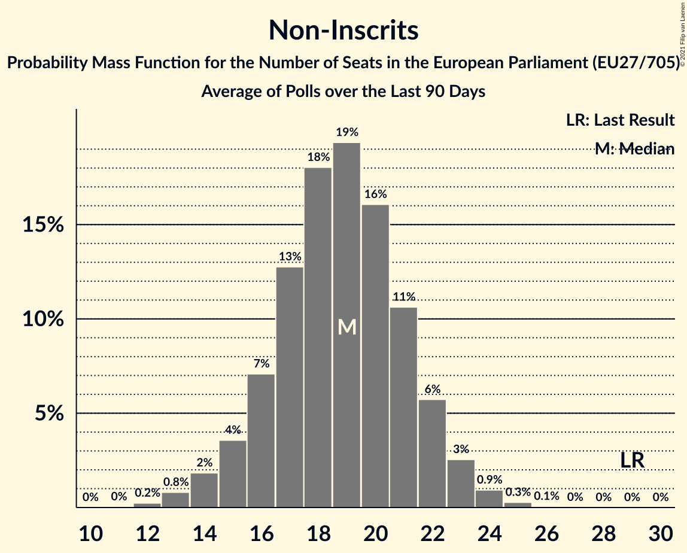

# Non-Inscrits

Members registered from **12 countries**:

> BG, CY, CZ, ES, FI, GR, HR, HU, IT, PL, SI, SK

## Seats

Last result: **29** seats (General Election of 26 May 2019)

Current median: **19** seats (-10 seats)

At least one member in **5 countries** have a median of 1 seat or more:

> ES, GR, IT, PL, SK

### Confidence Intervals

| Party | Area | Last Result | Median | 80% Confidence Interval | 90% Confidence Interval | 95% Confidence Interval | 99% Confidence Interval |
|:-----:|:----:|:-----------:|:------:|:-----------------------:|:-----------------------:|:-----------------------:|:-----------------------:|
| Non-Inscrits | EU | 29 | 19 | 16–21 | 15–22 | 14–23 | 13–24 |
| Movimento 5 Stelle | IT | | 12 | 11–14 | 10–14 | 10–15 | 9–16 |
| Konfederacja | PL | | 4 | 2–5 | 0–6 | 0–6 | 0–7 |
| Kotleba–Ľudová strana Naše Slovensko | SK | | 1 | 0–2 | 0–2 | 0–2 | 0–2 |
| Partit Demòcrata Europeu Català | ES | | 1 | 0–1 | 0–2 | 0–2 | 0–2 |
| Κομμουνιστικό Κόμμα Ελλάδας | GR | | 1 | 1 | 1–2 | 1–2 | 1–2 |
| Kukiz’15 | PL | | 0 | 0 | 0 | 0 | 0–3 |
| Liike Nyt | FI | | 0 | 0 | 0 | 0 | 0 |
| Magyar Kétfarkú Kutya Párt | HU | | 0 | 0 | 0 | 0 | 0 |
| Mi Hazánk Mozgalom | HU | | 0 | 0 | 0 | 0 | 0 |
| Slovenska nacionalna stranka | SI | | 0 | 0 | 0 | 0 | 0 |
| Strana svobodných občanů | CZ | | 0 | 0 | 0 | 0 | 0 |
| Živi zid | HR | | 0 | 0 | 0 | 0 | 0 |
| Εθνικό Λαϊκό Μέτωπο | CY | | 0 | 0–1 | 0–1 | 0–1 | 0–1 |
| Атака | BG | | 0 | 0 | 0 | 0 | 0 |

### Probability Mass Function

The following table shows the probability mass function per seat for the [poll average](average-2021-02-28.html) for Non-Inscrits.

| Number of Seats | Probability | Accumulated | Special Marks |
|:---------------:|:-----------:|:-----------:|:-------------:|
| 12 | 0.2% | 100% |  |
| 13 | 0.8% | 99.7% |  |
| 14 | 2% | 98.9% |  |
| 15 | 4% | 97% |  |
| 16 | 7% | 94% |  |
| 17 | 13% | 86% |  |
| 18 | 18% | 74% |  |
| 19 | 19% | 56% | Median |
| 20 | 16% | 36% |  |
| 21 | 11% | 20% |  |
| 22 | 6% | 10% |  |
| 23 | 3% | 4% |  |
| 24 | 0.9% | 1.3% |  |
| 25 | 0.3% | 0.4% |  |
| 26 | 0.1% | 0.1% |  |
| 27 | 0% | 0% |  |
| 28 | 0% | 0% |  |
| 29 | 0% | 0% | Last Result |

