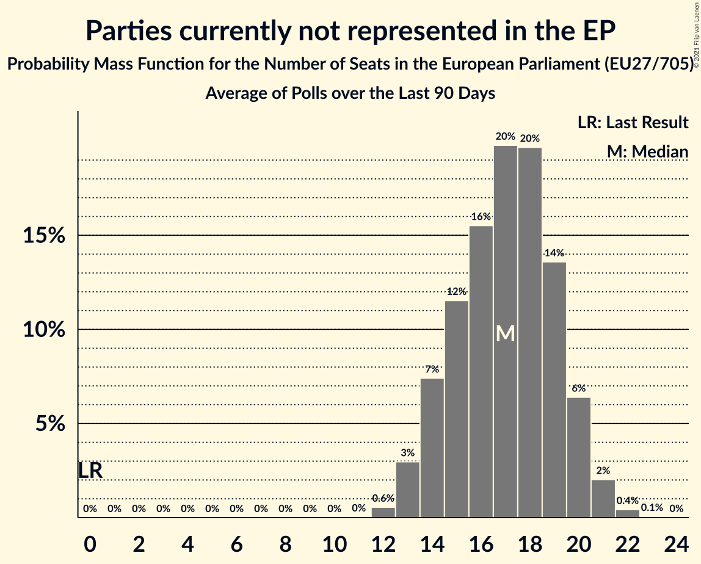

# Parties currently not represented in the EP

Members registered from **14 countries**:

> BE, BG, CY, CZ, DK, FR, HR, IE, LU, LV, NL, PL, SI, SK

## Seats

Last result: **0** seats (General Election of 26 May 2019)

Current median: **17** seats (+17 seats)

At least one member in **2 countries** have a median of 1 seat or more:

> BG, PL

### Confidence Intervals

| Party | Area | Last Result | Median | 80% Confidence Interval | 90% Confidence Interval | 95% Confidence Interval | 99% Confidence Interval |
|:-----:|:----:|:-----------:|:------:|:-----------------------:|:-----------------------:|:-----------------------:|:-----------------------:|
| Parties currently not represented in the EP | EU | 0 | 17 | 14–19 | 14–20 | 13–21 | 12–21 |
| Polska 2050 [PL] (*) | PL | | 12 | 10–14 | 9–15 | 9–15 | 9–16 |
| Има такъв народ [BG] (*) | BG | | 4 | 3–4 | 3–5 | 3–5 | 3–5 |
| Andrej Čuš in Zeleni Slovenije [SI] (*) | SI | | 0 | 0 | 0 | 0 | 0 |
| Aontú [IE] (*) | IE | | 0 | 0 | 0 | 0 | 0 |
| Bandić Milan 365–Stranka rada i solidarnosti [HR] (*) | HR | | 0 | 0 | 0 | 0 | 0 |
| Bij1 [NL] (*) | NL | | 0 | 0 | 0 | 0 | 0 |
| BoerBurgerBeweging [NL] (*) | NL | | 0 | 0–1 | 0–1 | 0–1 | 0–1 |
| DENK [NL] (*) | NL | | 0 | 0 | 0 | 0 | 0–1 |
| Dobra država [SI] (*) | SI | | 0 | 0 | 0 | 0 | 0 |
| Dobrá voľba [SK] (*) | SK | | 0 | 0 | 0 | 0 | 0 |
| DéFI [BE-FRC] (*) | BE-FRC | | 0 | 0 | 0 | 0 | 0 |
| Independents [IE] (*) | IE | | 0 | 0 | 0–1 | 0–1 | 0–1 |
| Kommunistesch Partei Lëtzebuerg [LU] (*) | LU | | 0 | 0 | 0 | 0 | 0 |
| Likums un kārtība [LV] (*) | LV | | 0 | 0–1 | 0–1 | 0–1 | 0–1 |
| Lutte Ouvrière [FR] (*) | FR | | 0 | 0 | 0 | 0 | 0 |
| Přísaha [CZ] (*) | CZ | | 0 | 0–1 | 0–1 | 0–1 | 0–2 |
| Résistons! [FR] (*) | FR | | 0 | 0 | 0 | 0 | 0 |
| Union populaire républicaine [FR] (*) | FR | | 0 | 0 | 0 | 0 | 0 |
| Veganerpartiet [DK] (*) | DK | | 0 | 0 | 0 | 0 | 0 |
| Ανεξάρτητοι [CY] (*) | CY | | 0 | 0 | 0 | 0 | 0 |
| Възраждане [BG] (*) | BG | | 0 | 0 | 0 | 0 | 0 |

### Probability Mass Function

The following table shows the probability mass function per seat for the [poll average](average-2021-06-30.html) for Parties currently not represented in the EP.

| Number of Seats | Probability | Accumulated | Special Marks |
|:---------------:|:-----------:|:-----------:|:-------------:|
| 0 | 0% | 100% | Last Result |
| 1 | 0% | 100% |  |
| 2 | 0% | 100% |  |
| 3 | 0% | 100% |  |
| 4 | 0% | 100% |  |
| 5 | 0% | 100% |  |
| 6 | 0% | 100% |  |
| 7 | 0% | 100% |  |
| 8 | 0% | 100% |  |
| 9 | 0% | 100% |  |
| 10 | 0% | 100% |  |
| 11 | 0% | 100% |  |
| 12 | 0.6% | 100% |  |
| 13 | 3% | 99.4% |  |
| 14 | 7% | 96% |  |
| 15 | 12% | 89% |  |
| 16 | 16% | 77% |  |
| 17 | 20% | 62% | Median |
| 18 | 20% | 42% |  |
| 19 | 14% | 23% |  |
| 20 | 6% | 9% |  |
| 21 | 2% | 3% |  |
| 22 | 0.4% | 0.5% |  |
| 23 | 0.1% | 0.1% |  |
| 24 | 0% | 0% |  |

