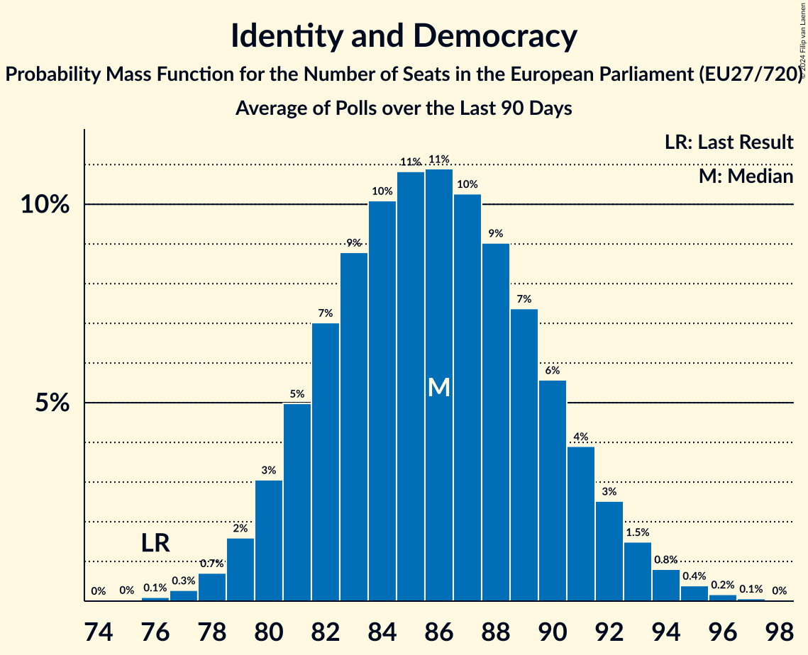

# Identity and Democracy

Members registered from **15 countries**:

> AT, BE, BG, CZ, DE, DK, EE, FR, HR, IT, NL, PL, PT, RO, SK

## Seats

Last result: **76** seats (General Election of 26 May 2019)

Current median: **86** seats (+10 seats)

At least one member in **13 countries** have a median of 1 seat or more:

> AT, BE, BG, CZ, DE, DK, EE, FR, HR, IT, NL, PL, PT

### Confidence Intervals

| Party | Area | Last Result | Median | 80% Confidence Interval | 90% Confidence Interval | 95% Confidence Interval | 99% Confidence Interval |
|:-----:|:----:|:-----------:|:------:|:-----------------------:|:-----------------------:|:-----------------------:|:-----------------------:|
| Identity and Democracy | EU | 76 | 86 | 81–90 | 80–92 | 79–93 | 78–95 |
| Rassemblement national | FR | | 28 | 27–31 | 26–31 | 26–33 | 24–33 |
| Alternative für Deutschland | DE | | 16 | 14–19 | 13–20 | 13–20 | 13–20 |
| Partij voor de Vrijheid | NL | | 9 | 9 | 8–10 | 8–10 | 8–10 |
| Lega Nord | IT | | 8 | 6–9 | 6–9 | 6–9 | 5–10 |
| Freiheitliche Partei Österreichs | AT | | 6 | 5–6 | 5–7 | 5–7 | 5–7 |
| Chega | PT | | 4 | 4 | 4 | 4 | 4 |
| Vlaams Belang | BE-VLG | | 3 | 3–4 | 3–4 | 3–4 | 3–4 |
| Възраждане | BG | | 3 | 2–3 | 2–3 | 2–3 | 2–4 |
| Ruch Narodowy | PL | | 2 | 1–3 | 1–3 | 1–3 | 1–3 |
| Svoboda a přímá demokracie–Trikolóra hnutí občanů | CZ | | 2 | 1–2 | 1–2 | 1–3 | 1–3 |
| Dansk Folkeparti | DK | | 1 | 0–1 | 0–1 | 0–1 | 0–1 |
| Domovinski pokret Miroslava Škore | HR | | 1 | 1 | 1 | 1 | 1 |
| Eesti Konservatiivne Rahvaerakond | EE | | 1 | 1 | 1 | 1 | 1–2 |
| Konfederacja Korony Polskiej | PL | | 1 | 1–2 | 1–2 | 1–2 | 0–2 |
| Partidul S.O.S. România | RO | | 0 | 0–2 | 0–2 | 0–3 | 0–3 |
| Slovenská národná strana | SK | | 0 | 0–1 | 0–1 | 0–1 | 0–1 |

### Probability Mass Function

The following table shows the probability mass function per seat for the [poll average](average-2024-04-15.html) for Identity and Democracy.

| Number of Seats | Probability | Accumulated | Special Marks |
|:---------------:|:-----------:|:-----------:|:-------------:|
| 76 | 0.1% | 100% | Last Result |
| 77 | 0.3% | 99.9% |  |
| 78 | 0.7% | 99.6% |  |
| 79 | 2% | 98.9% |  |
| 80 | 3% | 97% |  |
| 81 | 5% | 94% |  |
| 82 | 7% | 89% |  |
| 83 | 9% | 82% |  |
| 84 | 10% | 73% |  |
| 85 | 11% | 63% |  |
| 86 | 11% | 53% | Median |
| 87 | 10% | 42% |  |
| 88 | 9% | 31% |  |
| 89 | 7% | 22% |  |
| 90 | 6% | 15% |  |
| 91 | 4% | 9% |  |
| 92 | 3% | 5% |  |
| 93 | 1.5% | 3% |  |
| 94 | 0.8% | 1.5% |  |
| 95 | 0.4% | 0.7% |  |
| 96 | 0.2% | 0.3% |  |
| 97 | 0.1% | 0.1% |  |
| 98 | 0% | 0% |  |

