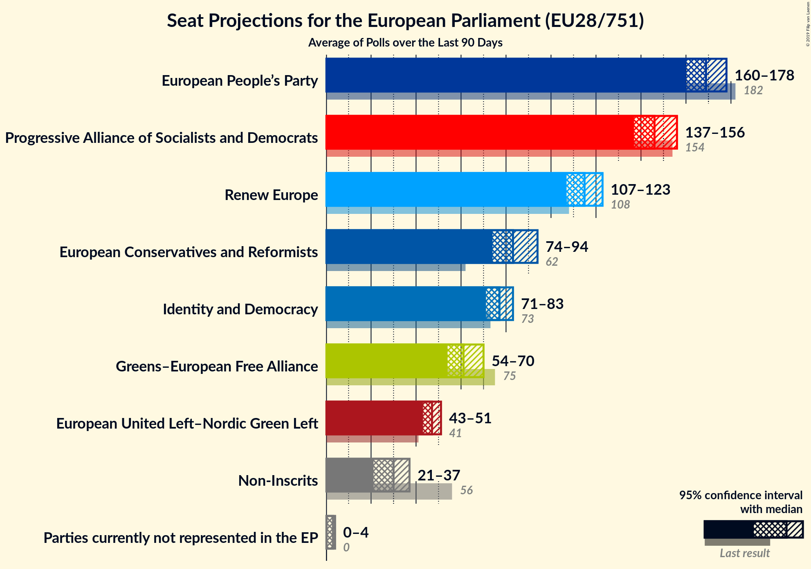
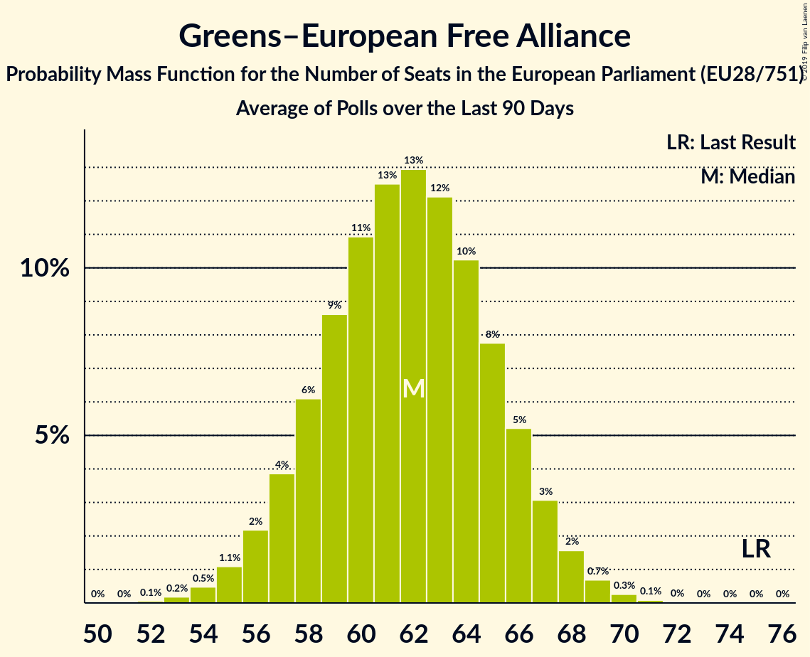
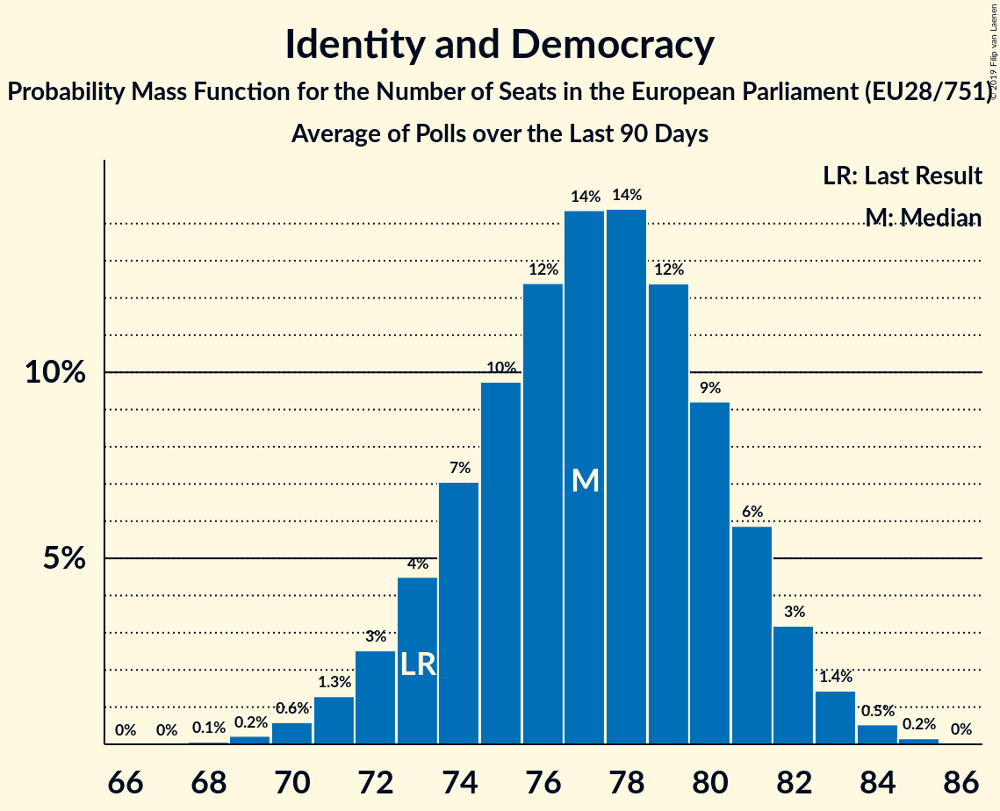
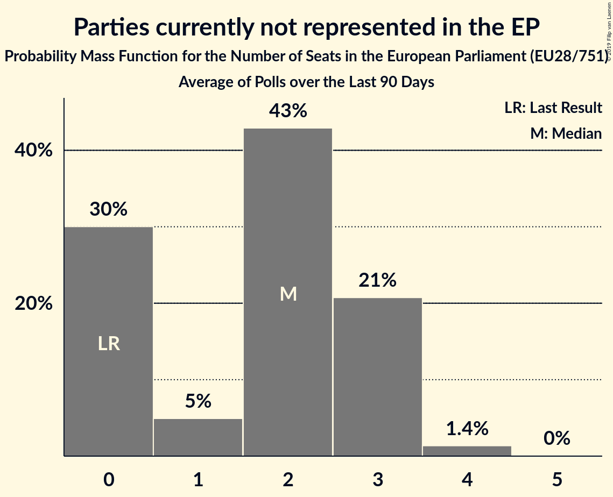
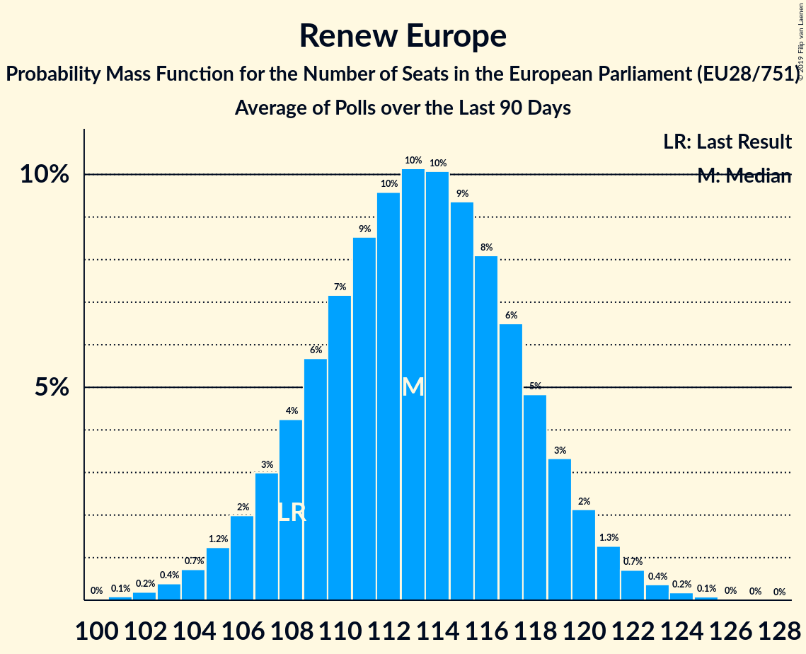
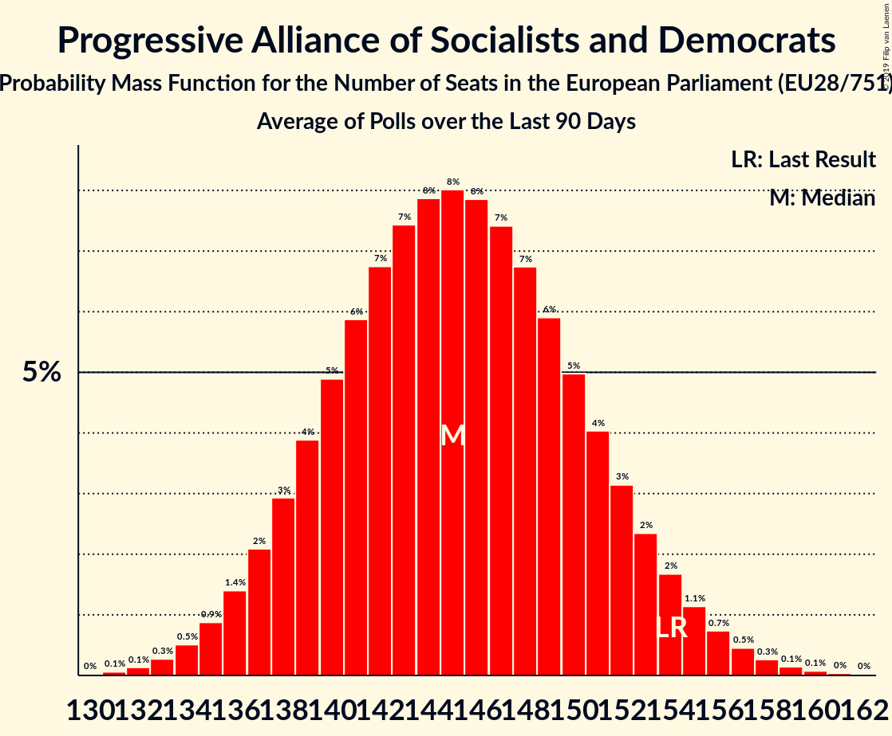
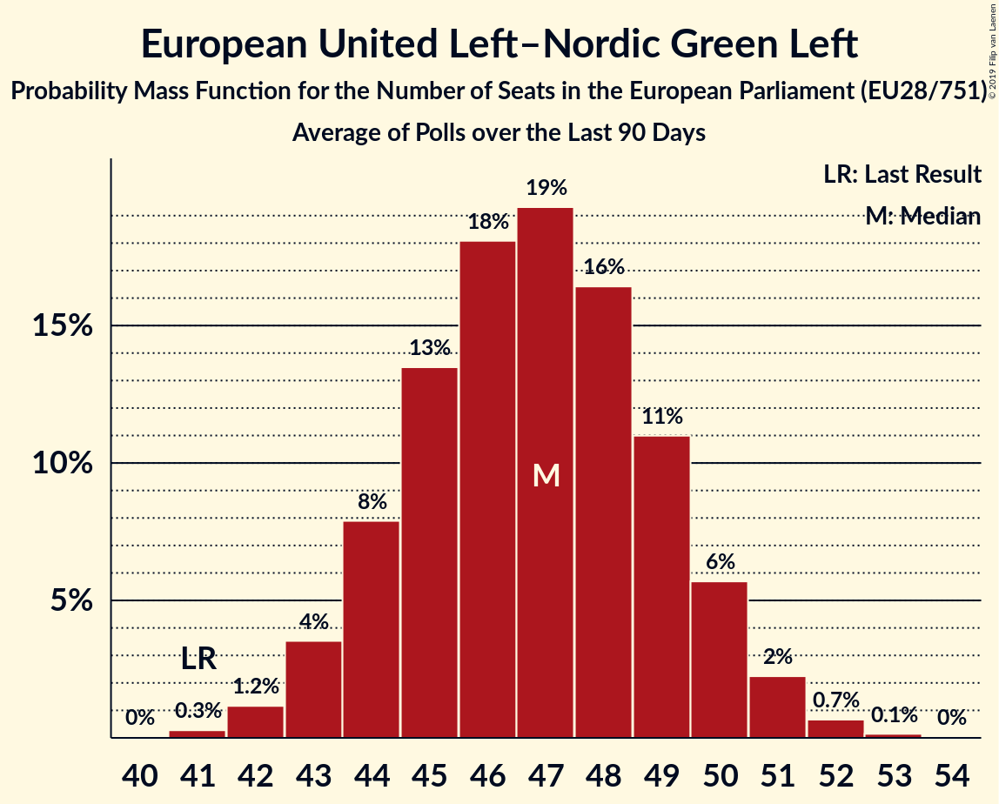
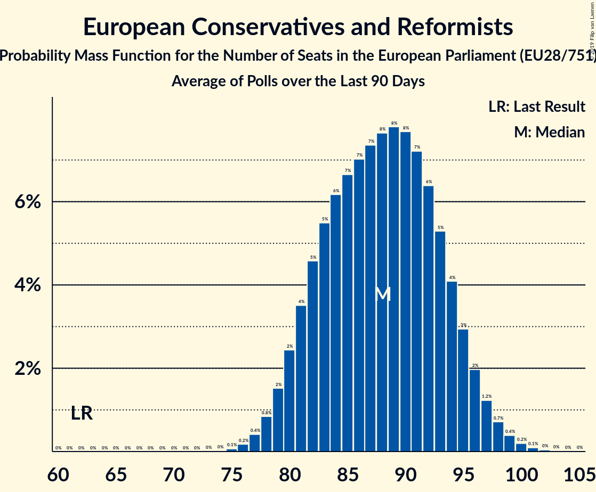

# Seat Projection for the European Parliament (EU28/751)

<a href="#seats">Seats</a> | <a href="#voting-intentions">Voting Intentions</a> | <a href="#technical-information">Technical Information</a>

## Seats

### Confidence Intervals

| Group | Last Result | Median | 80% Confidence Interval | 90% Confidence Interval | 95% Confidence Interval | 99% Confidence Interval |
|:-----:|:-----------:|:------:|:-----------------------:|:-----------------------:|:-----------------------:|:-----------------------:|
| <a href="#european-people’s-party">European People’s Party</a> | 182 | 172 | 166–178 |165–179 | 163–181 | 160–184 |
| <a href="#progressive-alliance-of-socialists-and-democrats">Progressive Alliance of Socialists and Democrats</a> | 154 | 147 | 141–153 |139–155 | 138–157 | 135–159 |
| <a href="#renew-europe">Renew Europe</a> | 108 | 113 | 108–118 |107–119 | 105–121 | 103–123 |
| <a href="#european-conservatives-and-reformists">European Conservatives and Reformists</a> | 62 | 88 | 82–94 |80–95 | 79–97 | 77–99 |
| <a href="#identity-and-democracy">Identity and Democracy</a> | 73 | 77 | 74–81 |73–82 | 72–82 | 71–84 |
| <a href="#greens–european-free-alliance">Greens–European Free Alliance</a> | 75 | 62 | 58–66 |57–67 | 56–68 | 54–69 |
| <a href="#european-united-left–nordic-green-left">European United Left–Nordic Green Left</a> | 41 | 46 | 43–48 |42–49 | 41–49 | 40–51 |
| <a href="#non-inscrits">Non-Inscrits</a> | 56 | 29 | 24–33 |23–34 | 22–35 | 20–37 |
| <a href="#parties-currently-not-represented-in-the-ep">Parties currently not represented in the EP</a> | 0 | 2 | 0–3 |0–3 | 0–3 | 0–4 |

### Greens–European Free Alliance

*For a full overview of the results for this party, see the [Greens–European Free Alliance](party-2019-10-31-greens–europeanfreealliance.html) page.*

| Number of Seats | Probability | Accumulated | Special Marks |
|:---------------:|:-----------:|:-----------:|:-------------:|
| 52 | 0.1% | 100% |  |
| 53 | 0.2% | 99.9% |  |
| 54 | 0.5% | 99.7% |  |
| 55 | 1.1% | 99.3% |  |
| 56 | 2% | 98% |  |
| 57 | 4% | 96% |  |
| 58 | 6% | 92% |  |
| 59 | 9% | 86% |  |
| 60 | 11% | 77% |  |
| 61 | 13% | 66% |  |
| 62 | 13% | 54% | Median |
| 63 | 12% | 41% |  |
| 64 | 10% | 29% |  |
| 65 | 8% | 19% |  |
| 66 | 5% | 11% |  |
| 67 | 3% | 6% |  |
| 68 | 2% | 3% |  |
| 69 | 0.7% | 1.1% |  |
| 70 | 0.3% | 0.4% |  |
| 71 | 0.1% | 0.1% |  |
| 72 | 0% | 0% |  |
| 73 | 0% | 0% |  |
| 74 | 0% | 0% |  |
| 75 | 0% | 0% | Last Result |

### Identity and Democracy

*For a full overview of the results for this party, see the [Identity and Democracy](party-2019-10-31-identityanddemocracy.html) page.*

| Number of Seats | Probability | Accumulated | Special Marks |
|:---------------:|:-----------:|:-----------:|:-------------:|
| 69 | 0.1% | 100% |  |
| 70 | 0.2% | 99.9% |  |
| 71 | 0.7% | 99.7% |  |
| 72 | 2% | 98.9% |  |
| 73 | 4% | 97% | Last Result |
| 74 | 7% | 93% |  |
| 75 | 10% | 86% |  |
| 76 | 13% | 76% |  |
| 77 | 15% | 63% | Median |
| 78 | 15% | 48% |  |
| 79 | 13% | 34% |  |
| 80 | 9% | 21% |  |
| 81 | 6% | 12% |  |
| 82 | 3% | 5% |  |
| 83 | 1.5% | 2% |  |
| 84 | 0.5% | 0.7% |  |
| 85 | 0.2% | 0.2% |  |
| 86 | 0% | 0% |  |

### Parties currently not represented in the EP

*For a full overview of the results for this party, see the [Parties currently not represented in the EP](party-2019-10-31-partiescurrentlynotrepresentedintheep.html) page.*

| Number of Seats | Probability | Accumulated | Special Marks |
|:---------------:|:-----------:|:-----------:|:-------------:|
| 0 | 30% | 100% | Last Result |
| 1 | 5% | 70% |  |
| 2 | 43% | 65% | Median |
| 3 | 21% | 22% |  |
| 4 | 1.4% | 1.4% |  |
| 5 | 0% | 0% |  |

### Renew Europe

*For a full overview of the results for this party, see the [Renew Europe](party-2019-10-31-reneweurope.html) page.*

| Number of Seats | Probability | Accumulated | Special Marks |
|:---------------:|:-----------:|:-----------:|:-------------:|
| 100 | 0% | 100% |  |
| 101 | 0.1% | 99.9% |  |
| 102 | 0.2% | 99.9% |  |
| 103 | 0.4% | 99.7% |  |
| 104 | 0.7% | 99.3% |  |
| 105 | 1.3% | 98.5% |  |
| 106 | 2% | 97% |  |
| 107 | 3% | 95% |  |
| 108 | 4% | 92% | Last Result |
| 109 | 6% | 88% |  |
| 110 | 7% | 82% |  |
| 111 | 9% | 75% |  |
| 112 | 10% | 66% |  |
| 113 | 10% | 57% | Median |
| 114 | 10% | 47% |  |
| 115 | 9% | 37% |  |
| 116 | 8% | 27% |  |
| 117 | 6% | 19% |  |
| 118 | 5% | 13% |  |
| 119 | 3% | 8% |  |
| 120 | 2% | 5% |  |
| 121 | 1.2% | 3% |  |
| 122 | 0.7% | 1.4% |  |
| 123 | 0.4% | 0.7% |  |
| 124 | 0.2% | 0.3% |  |
| 125 | 0.1% | 0.1% |  |
| 126 | 0% | 0.1% |  |
| 127 | 0% | 0% |  |

### European People’s Party

*For a full overview of the results for this party, see the [European People’s Party](party-2019-10-31-europeanpeople’sparty.html) page.*

| Number of Seats | Probability | Accumulated | Special Marks |
|:---------------:|:-----------:|:-----------:|:-------------:|
| 157 | 0% | 100% |  |
| 158 | 0.1% | 99.9% |  |
| 159 | 0.1% | 99.9% |  |
| 160 | 0.3% | 99.7% |  |
| 161 | 0.5% | 99.5% |  |
| 162 | 0.8% | 99.0% |  |
| 163 | 1.2% | 98% |  |
| 164 | 2% | 97% |  |
| 165 | 3% | 95% |  |
| 166 | 4% | 93% |  |
| 167 | 5% | 89% |  |
| 168 | 6% | 84% |  |
| 169 | 7% | 79% |  |
| 170 | 8% | 72% |  |
| 171 | 9% | 64% |  |
| 172 | 9% | 55% | Median |
| 173 | 9% | 46% |  |
| 174 | 8% | 38% |  |
| 175 | 7% | 29% |  |
| 176 | 6% | 22% |  |
| 177 | 5% | 16% |  |
| 178 | 4% | 11% |  |
| 179 | 3% | 7% |  |
| 180 | 2% | 5% |  |
| 181 | 1.2% | 3% |  |
| 182 | 0.8% | 2% | Last Result |
| 183 | 0.4% | 1.0% |  |
| 184 | 0.3% | 0.5% |  |
| 185 | 0.1% | 0.3% |  |
| 186 | 0.1% | 0.1% |  |
| 187 | 0% | 0.1% |  |
| 188 | 0% | 0% |  |

### Progressive Alliance of Socialists and Democrats

*For a full overview of the results for this party, see the [Progressive Alliance of Socialists and Democrats](party-2019-10-31-progressiveallianceofsocialistsanddemocrats.html) page.*

| Number of Seats | Probability | Accumulated | Special Marks |
|:---------------:|:-----------:|:-----------:|:-------------:|
| 132 | 0% | 100% |  |
| 133 | 0.1% | 99.9% |  |
| 134 | 0.2% | 99.9% |  |
| 135 | 0.3% | 99.7% |  |
| 136 | 0.6% | 99.4% |  |
| 137 | 0.9% | 98.8% |  |
| 138 | 1.5% | 98% |  |
| 139 | 2% | 96% |  |
| 140 | 3% | 94% |  |
| 141 | 4% | 91% |  |
| 142 | 5% | 87% |  |
| 143 | 6% | 82% |  |
| 144 | 7% | 76% |  |
| 145 | 8% | 69% |  |
| 146 | 8% | 62% |  |
| 147 | 8% | 54% | Median |
| 148 | 8% | 45% |  |
| 149 | 7% | 38% |  |
| 150 | 7% | 30% |  |
| 151 | 6% | 24% |  |
| 152 | 5% | 18% |  |
| 153 | 4% | 13% |  |
| 154 | 3% | 9% | Last Result |
| 155 | 2% | 6% |  |
| 156 | 2% | 4% |  |
| 157 | 1.0% | 3% |  |
| 158 | 0.7% | 2% |  |
| 159 | 0.4% | 0.9% |  |
| 160 | 0.2% | 0.5% |  |
| 161 | 0.1% | 0.2% |  |
| 162 | 0.1% | 0.1% |  |
| 163 | 0% | 0.1% |  |
| 164 | 0% | 0% |  |

### European United Left–Nordic Green Left

*For a full overview of the results for this party, see the [European United Left–Nordic Green Left](party-2019-10-31-europeanunitedleft–nordicgreenleft.html) page.*

| Number of Seats | Probability | Accumulated | Special Marks |
|:---------------:|:-----------:|:-----------:|:-------------:|
| 39 | 0.2% | 100% |  |
| 40 | 0.7% | 99.8% |  |
| 41 | 2% | 99.1% | Last Result |
| 42 | 5% | 97% |  |
| 43 | 9% | 92% |  |
| 44 | 14% | 83% |  |
| 45 | 18% | 69% |  |
| 46 | 19% | 50% | Median |
| 47 | 15% | 32% |  |
| 48 | 10% | 17% |  |
| 49 | 5% | 7% |  |
| 50 | 2% | 2% |  |
| 51 | 0.5% | 0.6% |  |
| 52 | 0.1% | 0.1% |  |
| 53 | 0% | 0% |  |

### European Conservatives and Reformists

*For a full overview of the results for this party, see the [European Conservatives and Reformists](party-2019-10-31-europeanconservativesandreformists.html) page.*

| Number of Seats | Probability | Accumulated | Special Marks |
|:---------------:|:-----------:|:-----------:|:-------------:|
| 62 | 0% | 100% | Last Result |
| 63 | 0% | 100% |  |
| 64 | 0% | 100% |  |
| 65 | 0% | 100% |  |
| 66 | 0% | 100% |  |
| 67 | 0% | 100% |  |
| 68 | 0% | 100% |  |
| 69 | 0% | 100% |  |
| 70 | 0% | 100% |  |
| 71 | 0% | 100% |  |
| 72 | 0% | 100% |  |
| 73 | 0% | 100% |  |
| 74 | 0% | 100% |  |
| 75 | 0.1% | 100% |  |
| 76 | 0.2% | 99.9% |  |
| 77 | 0.4% | 99.7% |  |
| 78 | 0.8% | 99.3% |  |
| 79 | 2% | 98.5% |  |
| 80 | 2% | 97% |  |
| 81 | 3% | 95% |  |
| 82 | 5% | 91% |  |
| 83 | 5% | 87% |  |
| 84 | 6% | 81% |  |
| 85 | 7% | 75% |  |
| 86 | 7% | 68% |  |
| 87 | 7% | 61% |  |
| 88 | 8% | 54% | Median |
| 89 | 8% | 46% |  |
| 90 | 8% | 38% |  |
| 91 | 7% | 31% |  |
| 92 | 6% | 24% |  |
| 93 | 5% | 17% |  |
| 94 | 4% | 12% |  |
| 95 | 3% | 8% |  |
| 96 | 2% | 5% |  |
| 97 | 1.2% | 3% |  |
| 98 | 0.7% | 1.5% |  |
| 99 | 0.4% | 0.8% |  |
| 100 | 0.2% | 0.4% |  |
| 101 | 0.1% | 0.2% |  |
| 102 | 0% | 0.1% |  |
| 103 | 0% | 0% |  |

### Non-Inscrits

*For a full overview of the results for this party, see the [Non-Inscrits](party-2019-10-31-non-inscrits.html) page.*

| Number of Seats | Probability | Accumulated | Special Marks |
|:---------------:|:-----------:|:-----------:|:-------------:|
| 17 | 0% | 100% |  |
| 18 | 0.1% | 99.9% |  |
| 19 | 0.3% | 99.8% |  |
| 20 | 0.6% | 99.5% |  |
| 21 | 1.1% | 98.9% |  |
| 22 | 2% | 98% |  |
| 23 | 3% | 96% |  |
| 24 | 4% | 93% |  |
| 25 | 5% | 90% |  |
| 26 | 8% | 85% |  |
| 27 | 11% | 76% |  |
| 28 | 13% | 66% |  |
| 29 | 13% | 53% | Median |
| 30 | 11% | 40% |  |
| 31 | 9% | 29% |  |
| 32 | 7% | 19% |  |
| 33 | 5% | 12% |  |
| 34 | 3% | 7% |  |
| 35 | 2% | 4% |  |
| 36 | 1.1% | 2% |  |
| 37 | 0.5% | 1.0% |  |
| 38 | 0.3% | 0.4% |  |
| 39 | 0.1% | 0.2% |  |
| 40 | 0% | 0.1% |  |
| 41 | 0% | 0% |  |
| 42 | 0% | 0% |  |
| 43 | 0% | 0% |  |
| 44 | 0% | 0% |  |
| 45 | 0% | 0% |  |
| 46 | 0% | 0% |  |
| 47 | 0% | 0% |  |
| 48 | 0% | 0% |  |
| 49 | 0% | 0% |  |
| 50 | 0% | 0% |  |
| 51 | 0% | 0% |  |
| 52 | 0% | 0% |  |
| 53 | 0% | 0% |  |
| 54 | 0% | 0% |  |
| 55 | 0% | 0% |  |
| 56 | 0% | 0% | Last Result |

## Voting Intentions

### Confidence Intervals

| Party | Last Result | Median | 80% Confidence Interval | 90% Confidence Interval | 95% Confidence Interval | 99% Confidence Interval |
|:-----:|:-----------:|:------:|:-----------------------:|:-----------------------:|:-----------------------:|:-----------------------:|
| <a href="#european-people’s-party">European People’s Party</a> | 0.0% | N/A | N/A |N/A | N/A | N/A |
| <a href="#progressive-alliance-of-socialists-and-democrats">Progressive Alliance of Socialists and Democrats</a> | 0.0% | N/A | N/A |N/A | N/A | N/A |
| <a href="#renew-europe">Renew Europe</a> | 0.0% | N/A | N/A |N/A | N/A | N/A |
| <a href="#greens–european-free-alliance">Greens–European Free Alliance</a> | 0.0% | N/A | N/A |N/A | N/A | N/A |
| <a href="#identity-and-democracy">Identity and Democracy</a> | 0.0% | N/A | N/A |N/A | N/A | N/A |
| <a href="#european-conservatives-and-reformists">European Conservatives and Reformists</a> | 0.0% | N/A | N/A |N/A | N/A | N/A |
| <a href="#european-united-left–nordic-green-left">European United Left–Nordic Green Left</a> | 0.0% | N/A | N/A |N/A | N/A | N/A |
| <a href="#non-inscrits">Non-Inscrits</a> | 0.0% | N/A | N/A |N/A | N/A | N/A |
| <a href="#parties-currently-not-represented-in-the-ep">Parties currently not represented in the EP</a> | 0.0% | N/A | N/A |N/A | N/A | N/A |

## Technical Information

The seat and voting intentions projection for the European Parliament presented on this page was based on the averages of the most recent polls for the following countries:

| Country                                                                                                                      | No of Seats                   | No of Constituencies | Method                    | Threshold |
|:-----------------------------------------------------------------------------------------------------------------------------|:-----------------------------:|:--------------------:|:-------------------------:|:---------:|
| Austria [⁰](https://filipvanlaenen.github.io/austrian_ep_polls/average-2019-10-31.html)                                                 | 18 <strike>19</strike>¹       | 1                    | D'Hondt                  | 4%        |
| Belgium: [Flanders](https://filipvanlaenen.github.io/flemish_ep_polls/average-2019-10-31.html)                                          | 12                            | 1                    | D'Hondt                  | No        |
| Belgium: French Community [⁰](https://github.com/filipvanlaenen/french_community_of_belgium_ep_polls/blob/master/average-2019-10-31.md) | 8                             | 1                    | D'Hondt                  | No        |
| Belgium: German-speaking constituency²                                                                                       | 1                             | 1                    | D'Hondt                  | No        |
| Bulgaria [⁰](https://filipvanlaenen.github.io/bulgarian_ep_polls/average-2019-10-31.html)                                               | 17                            | 1                    | Hare-Niemeyer             | 5%        |
| Croatia [⁰](https://filipvanlaenen.github.io/croatian_ep_polls/average-2019-10-31.html)                                                 | 11 <strike>12</strike>¹       | 1                    | D'Hondt                  | 5%        |
| Cyprus²                                         | 6                             | 1                    | Hare-Niemeyer             | No        |
| Czech Republic [⁰](https://filipvanlaenen.github.io/czech_ep_polls/average-2019-10-31.html)                                             | 21                            | 1                    | D'Hondt                  | 5%        |
| [Denmark](https://filipvanlaenen.github.io/danish_ep_polls/average-2019-10-31.html)                                                     | 13 <strike>14</strike>¹       | 1                    | D'Hondt                  | No        |
| [Estonia](https://filipvanlaenen.github.io/estonian_ep_polls/average-2019-10-31.html)                                                   | 6 <strike>7</strike>¹         | 1                    | D'Hondt                  | No        |
| [Finland](https://filipvanlaenen.github.io/finnish_ep_polls/average-2019-10-31.html)                                                    | 13 <strike>14</strike>¹       | 1                    | D'Hondt                  | No        |
| France²                                                     | 74 <strike>79</strike>¹       | 1                    | D'Hondt                  | 5%        |
| [Germany](https://filipvanlaenen.github.io/german_ep_polls/average-2019-10-31.html)                                                     | 96                            | 1                    | Sainte-Laguë              | No        |
| [Greece](https://filipvanlaenen.github.io/greek_ep_polls/average-2019-10-31.html)                                                       | 21                            | 1                    | Droop                     | 3%        |
| [Hungary](https://filipvanlaenen.github.io/hungarian_ep_polls/average-2019-10-31.html)                                                  | 21                            | 1                    | D'Hondt                  | No        |
| Ireland [⁰](https://filipvanlaenen.github.io/irish_ep_polls/average-2019-10-31.html)                                                    | 11 <strike>13</strike>¹       | 3                    | Single transferable vote³ | N/A       |
| Italy [⁰](https://filipvanlaenen.github.io/italian_ep_polls/average-2019-10-31.html)                                                    | 73 <strike>76</strike>¹       | 1                    | Hare-Niemeyer             | 4%        |
| [Latvia](https://filipvanlaenen.github.io/latvian_ep_polls/average-2019-10-31.html)                                                     | 8                             | 1                    | Sainte-Laguë              | 5%        |
| Lithuania [⁰](https://github.com/filipvanlaenen/lithuanian_ep_polls/blob/master/average-2019-10-31.md)                                  | 11                            | 1                    | Hare–Niemeyer             | 5%        |
| Luxembourg²                                              | 6                             | 1                    | D'Hondt                  | No        |
| Malta [⁰](https://github.com/filipvanlaenen/maltese_ep_polls/blob/master/average-2019-10-31.md)                                         | 6                             | 1                    | Single transferable vote³ | N/A       |
| Netherlands [⁰](https://filipvanlaenen.github.io/dutch_ep_polls/average-2019-10-31.html)                                                | 26 <strike>29</strike>¹       | 1                    | D'Hondt                  | 1/26      |
| Poland [⁰](https://filipvanlaenen.github.io/polish_ep_polls/average-2019-10-31.html)                                                    | 51 <strike>52</strike>¹       | 1                    | D'Hondt                  | 5%        |
| [Portugal](https://filipvanlaenen.github.io/portuguese_ep_polls/average-2019-10-31.html)                                                | 21                            | 1                    | D'Hondt                  | No        |
| Romania [⁰](https://filipvanlaenen.github.io/romanian_ep_polls/average-2019-10-31.html)                                                 | 32 <strike>33</strike>¹       | 1                    | D'Hondt                  | 5%        |
| [Slovakia](https://filipvanlaenen.github.io/slovakian_ep_polls/average-2019-10-31.html)                                                 | 13 <strike>14</strike>¹       | 1                    | Hagenbach-Bischoff        | 5%        |
| [Slovenia](https://filipvanlaenen.github.io/slovenian_ep_polls/average-2019-10-31.html)                                                 | 8                             | 1                    | D'Hondt                  | 5%        |
| [Spain](https://filipvanlaenen.github.io/spanish_ep_polls/average-2019-10-31.html)                                                      | 54 <strike>59</strike>¹       | 1                    | D'Hondt                  | No        |
| [Sweden](https://filipvanlaenen.github.io/swedish_ep_polls/average-2019-10-31.html)                                                     | 20 <strike>21</strike>¹       | 1                    | Modified Sainte-Laguë     | 4%        |
| United Kingdom: [Great Britain](https://filipvanlaenen.github.io/british_ep_polls/average-2019-10-31.html)                              | 70 <strike>0</strike>⁴        | 11                   | D'Hondt                  | No        |
| United Kingdom: [Northern Ireland](https://filipvanlaenen.github.io/northern_irish_ep_polls/average-2019-10-31.html)                    | 3 <strike>0</strike>⁴         | 1                    | Single transferable vote³ | N/A       |
| **Total**                                                                                                                    | **751 <strike>705</strike>¹** | **43**               |                           |           |

¹ Number of seats according to the [redistribution of seats](http://www.europarl.europa.eu/news/en/headlines/eu-affairs/20180126STO94114/eu-elections-how-many-meps-will-each-country-get-in-2019) that was planned for the 2019 European election if the United Kingdom had left the European Union by May 2019.

² No new opinion polls reported since the last European election; the results from the last European election are therefore used in the current projection for the European election.

³ Implemented as D'Hondt.

⁴ The United Kingdom was set to leave the European Union before the next European election.
