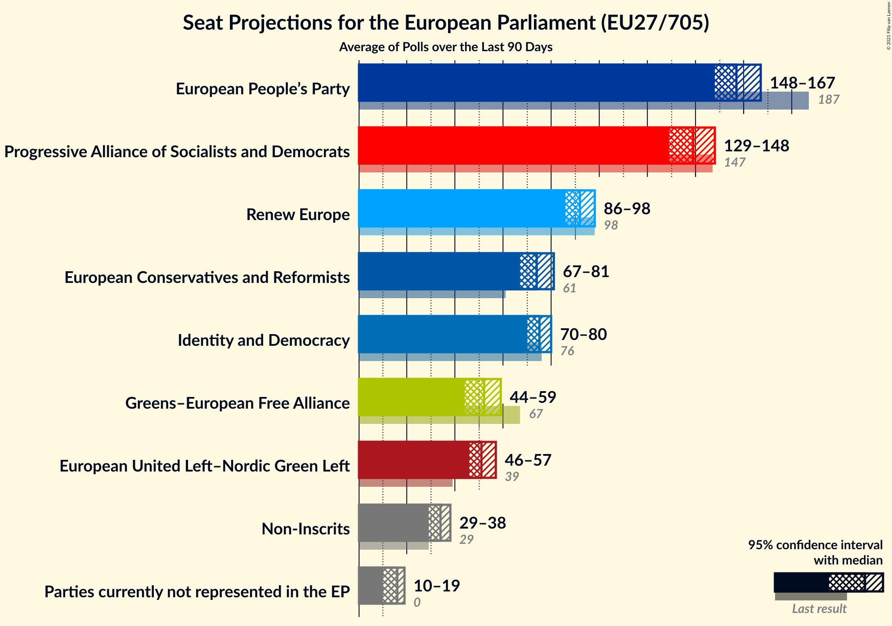

# Seat Projection for the European Parliament (EU27/705)

<a href="#seats">Seats</a> | <a href="#voting-intentions">Voting Intentions</a> | <a href="#technical-information">Technical Information</a>

## Seats

### Confidence Intervals

| Group | Last Result | Median | 80% Confidence Interval | 90% Confidence Interval | 95% Confidence Interval | 99% Confidence Interval |
|:-----:|:-----------:|:------:|:-----------------------:|:-----------------------:|:-----------------------:|:-----------------------:|
| <a href="#european-people’s-party">European People’s Party</a> | 187 | 155 | 150–160 |149–161 | 147–162 | 145–165 |
| <a href="#progressive-alliance-of-socialists-and-democrats">Progressive Alliance of Socialists and Democrats</a> | 147 | 140 | 133–146 |131–148 | 129–149 | 126–152 |
| <a href="#renew-europe">Renew Europe</a> | 98 | 93 | 89–97 |88–98 | 87–99 | 85–102 |
| <a href="#identity-and-democracy">Identity and Democracy</a> | 76 | 76 | 73–80 |72–81 | 71–82 | 69–83 |
| <a href="#european-conservatives-and-reformists">European Conservatives and Reformists</a> | 61 | 73 | 68–78 |67–79 | 66–80 | 64–82 |
| <a href="#greens–european-free-alliance">Greens–European Free Alliance</a> | 67 | 52 | 47–56 |45–57 | 44–58 | 42–60 |
| <a href="#european-united-left–nordic-green-left">European United Left–Nordic Green Left</a> | 39 | 52 | 48–55 |47–56 | 47–57 | 45–58 |
| <a href="#non-inscrits">Non-Inscrits</a> | 29 | 33 | 31–36 |30–37 | 29–38 | 28–39 |
| <a href="#parties-currently-not-represented-in-the-ep">Parties currently not represented in the EP</a> | 0 | 18 | 16–20 |15–21 | 15–21 | 14–22 |

### European People’s Party

*For a full overview of the results for this party, see the [European People’s Party](party-2021-07-31-europeanpeople’sparty.html) page.*

| Number of Seats | Probability | Accumulated | Special Marks |
|:---------------:|:-----------:|:-----------:|:-------------:|
| 142 | 0% | 100% |  |
| 143 | 0.1% | 99.9% |  |
| 144 | 0.2% | 99.8% |  |
| 145 | 0.4% | 99.6% |  |
| 146 | 0.8% | 99.2% |  |
| 147 | 1.3% | 98% |  |
| 148 | 2% | 97% |  |
| 149 | 3% | 95% |  |
| 150 | 4% | 92% |  |
| 151 | 6% | 88% |  |
| 152 | 7% | 82% |  |
| 153 | 9% | 74% |  |
| 154 | 10% | 65% |  |
| 155 | 10% | 55% | Median |
| 156 | 10% | 45% |  |
| 157 | 9% | 35% |  |
| 158 | 8% | 26% |  |
| 159 | 6% | 18% |  |
| 160 | 5% | 12% |  |
| 161 | 3% | 8% |  |
| 162 | 2% | 4% |  |
| 163 | 1.2% | 2% |  |
| 164 | 0.7% | 1.3% |  |
| 165 | 0.3% | 0.6% |  |
| 166 | 0.2% | 0.3% |  |
| 167 | 0.1% | 0.1% |  |
| 168 | 0% | 0% |  |
| 169 | 0% | 0% |  |
| 170 | 0% | 0% |  |
| 171 | 0% | 0% |  |
| 172 | 0% | 0% |  |
| 173 | 0% | 0% |  |
| 174 | 0% | 0% |  |
| 175 | 0% | 0% |  |
| 176 | 0% | 0% |  |
| 177 | 0% | 0% |  |
| 178 | 0% | 0% |  |
| 179 | 0% | 0% |  |
| 180 | 0% | 0% |  |
| 181 | 0% | 0% |  |
| 182 | 0% | 0% |  |
| 183 | 0% | 0% |  |
| 184 | 0% | 0% |  |
| 185 | 0% | 0% |  |
| 186 | 0% | 0% |  |
| 187 | 0% | 0% | Last Result |

### Progressive Alliance of Socialists and Democrats

*For a full overview of the results for this party, see the [Progressive Alliance of Socialists and Democrats](party-2021-07-31-progressiveallianceofsocialistsanddemocrats.html) page.*

| Number of Seats | Probability | Accumulated | Special Marks |
|:---------------:|:-----------:|:-----------:|:-------------:|
| 123 | 0.1% | 100% |  |
| 124 | 0.1% | 99.9% |  |
| 125 | 0.2% | 99.8% |  |
| 126 | 0.3% | 99.6% |  |
| 127 | 0.4% | 99.4% |  |
| 128 | 0.6% | 98.9% |  |
| 129 | 0.9% | 98% |  |
| 130 | 1.3% | 97% |  |
| 131 | 2% | 96% |  |
| 132 | 2% | 94% |  |
| 133 | 3% | 92% |  |
| 134 | 4% | 89% |  |
| 135 | 5% | 85% |  |
| 136 | 5% | 81% |  |
| 137 | 6% | 75% |  |
| 138 | 7% | 69% |  |
| 139 | 7% | 63% |  |
| 140 | 8% | 56% | Median |
| 141 | 8% | 48% |  |
| 142 | 8% | 40% |  |
| 143 | 7% | 33% |  |
| 144 | 6% | 25% |  |
| 145 | 5% | 19% |  |
| 146 | 4% | 14% |  |
| 147 | 3% | 9% | Last Result |
| 148 | 2% | 6% |  |
| 149 | 2% | 4% |  |
| 150 | 1.0% | 2% |  |
| 151 | 0.6% | 1.2% |  |
| 152 | 0.3% | 0.6% |  |
| 153 | 0.2% | 0.3% |  |
| 154 | 0.1% | 0.1% |  |
| 155 | 0% | 0.1% |  |
| 156 | 0% | 0% |  |

### Renew Europe

*For a full overview of the results for this party, see the [Renew Europe](party-2021-07-31-reneweurope.html) page.*

| Number of Seats | Probability | Accumulated | Special Marks |
|:---------------:|:-----------:|:-----------:|:-------------:|
| 83 | 0.1% | 100% |  |
| 84 | 0.2% | 99.9% |  |
| 85 | 0.6% | 99.6% |  |
| 86 | 1.2% | 99.1% |  |
| 87 | 2% | 98% |  |
| 88 | 4% | 96% |  |
| 89 | 6% | 92% |  |
| 90 | 8% | 86% |  |
| 91 | 10% | 78% |  |
| 92 | 12% | 67% |  |
| 93 | 12% | 56% | Median |
| 94 | 12% | 43% |  |
| 95 | 10% | 32% |  |
| 96 | 8% | 22% |  |
| 97 | 6% | 14% |  |
| 98 | 4% | 8% | Last Result |
| 99 | 2% | 5% |  |
| 100 | 1.2% | 2% |  |
| 101 | 0.6% | 1.2% |  |
| 102 | 0.3% | 0.5% |  |
| 103 | 0.1% | 0.2% |  |
| 104 | 0.1% | 0.1% |  |
| 105 | 0% | 0% |  |

### Greens–European Free Alliance

*For a full overview of the results for this party, see the [Greens–European Free Alliance](party-2021-07-31-greens–europeanfreealliance.html) page.*

| Number of Seats | Probability | Accumulated | Special Marks |
|:---------------:|:-----------:|:-----------:|:-------------:|
| 39 | 0% | 100% |  |
| 40 | 0.1% | 99.9% |  |
| 41 | 0.2% | 99.8% |  |
| 42 | 0.5% | 99.6% |  |
| 43 | 0.8% | 99.1% |  |
| 44 | 1.3% | 98% |  |
| 45 | 2% | 97% |  |
| 46 | 3% | 95% |  |
| 47 | 4% | 92% |  |
| 48 | 6% | 87% |  |
| 49 | 8% | 81% |  |
| 50 | 10% | 73% |  |
| 51 | 11% | 64% |  |
| 52 | 12% | 53% | Median |
| 53 | 11% | 41% |  |
| 54 | 10% | 30% |  |
| 55 | 8% | 21% |  |
| 56 | 6% | 13% |  |
| 57 | 4% | 7% |  |
| 58 | 2% | 4% |  |
| 59 | 1.0% | 2% |  |
| 60 | 0.4% | 0.6% |  |
| 61 | 0.1% | 0.2% |  |
| 62 | 0% | 0% |  |
| 63 | 0% | 0% |  |
| 64 | 0% | 0% |  |
| 65 | 0% | 0% |  |
| 66 | 0% | 0% |  |
| 67 | 0% | 0% | Last Result |

### Identity and Democracy

*For a full overview of the results for this party, see the [Identity and Democracy](party-2021-07-31-identityanddemocracy.html) page.*

| Number of Seats | Probability | Accumulated | Special Marks |
|:---------------:|:-----------:|:-----------:|:-------------:|
| 67 | 0% | 100% |  |
| 68 | 0.2% | 99.9% |  |
| 69 | 0.5% | 99.8% |  |
| 70 | 1.2% | 99.3% |  |
| 71 | 3% | 98% |  |
| 72 | 5% | 96% |  |
| 73 | 8% | 91% |  |
| 74 | 11% | 83% |  |
| 75 | 13% | 72% |  |
| 76 | 14% | 59% | Last Result, Median |
| 77 | 14% | 44% |  |
| 78 | 11% | 31% |  |
| 79 | 8% | 19% |  |
| 80 | 5% | 11% |  |
| 81 | 3% | 6% |  |
| 82 | 2% | 3% |  |
| 83 | 0.7% | 1.1% |  |
| 84 | 0.3% | 0.4% |  |
| 85 | 0.1% | 0.1% |  |
| 86 | 0% | 0% |  |

### European Conservatives and Reformists

*For a full overview of the results for this party, see the [European Conservatives and Reformists](party-2021-07-31-europeanconservativesandreformists.html) page.*

| Number of Seats | Probability | Accumulated | Special Marks |
|:---------------:|:-----------:|:-----------:|:-------------:|
| 61 | 0% | 100% | Last Result |
| 62 | 0.1% | 100% |  |
| 63 | 0.2% | 99.9% |  |
| 64 | 0.6% | 99.6% |  |
| 65 | 1.2% | 99.1% |  |
| 66 | 2% | 98% |  |
| 67 | 4% | 96% |  |
| 68 | 5% | 92% |  |
| 69 | 7% | 87% |  |
| 70 | 9% | 80% |  |
| 71 | 9% | 71% |  |
| 72 | 10% | 62% |  |
| 73 | 10% | 52% | Median |
| 74 | 9% | 42% |  |
| 75 | 8% | 33% |  |
| 76 | 7% | 25% |  |
| 77 | 6% | 18% |  |
| 78 | 4% | 12% |  |
| 79 | 3% | 7% |  |
| 80 | 2% | 4% |  |
| 81 | 1.1% | 2% |  |
| 82 | 0.6% | 1.1% |  |
| 83 | 0.3% | 0.5% |  |
| 84 | 0.1% | 0.2% |  |
| 85 | 0% | 0.1% |  |
| 86 | 0% | 0% |  |

### European United Left–Nordic Green Left

*For a full overview of the results for this party, see the [European United Left–Nordic Green Left](party-2021-07-31-europeanunitedleft–nordicgreenleft.html) page.*

| Number of Seats | Probability | Accumulated | Special Marks |
|:---------------:|:-----------:|:-----------:|:-------------:|
| 39 | 0% | 100% | Last Result |
| 40 | 0% | 100% |  |
| 41 | 0% | 100% |  |
| 42 | 0% | 100% |  |
| 43 | 0% | 100% |  |
| 44 | 0.2% | 99.9% |  |
| 45 | 0.6% | 99.8% |  |
| 46 | 2% | 99.2% |  |
| 47 | 4% | 98% |  |
| 48 | 6% | 94% |  |
| 49 | 10% | 88% |  |
| 50 | 13% | 78% |  |
| 51 | 15% | 65% |  |
| 52 | 15% | 51% | Median |
| 53 | 14% | 36% |  |
| 54 | 10% | 22% |  |
| 55 | 6% | 12% |  |
| 56 | 3% | 6% |  |
| 57 | 2% | 3% |  |
| 58 | 0.7% | 1.2% |  |
| 59 | 0.3% | 0.5% |  |
| 60 | 0.1% | 0.2% |  |
| 61 | 0% | 0.1% |  |
| 62 | 0% | 0% |  |

### Non-Inscrits

*For a full overview of the results for this party, see the [Non-Inscrits](party-2021-07-31-non-inscrits.html) page.*

| Number of Seats | Probability | Accumulated | Special Marks |
|:---------------:|:-----------:|:-----------:|:-------------:|
| 27 | 0.1% | 100% |  |
| 28 | 0.6% | 99.8% |  |
| 29 | 2% | 99.2% | Last Result |
| 30 | 5% | 97% |  |
| 31 | 10% | 92% |  |
| 32 | 15% | 82% |  |
| 33 | 18% | 67% | Median |
| 34 | 18% | 49% |  |
| 35 | 14% | 32% |  |
| 36 | 9% | 18% |  |
| 37 | 5% | 9% |  |
| 38 | 2% | 4% |  |
| 39 | 0.9% | 1.2% |  |
| 40 | 0.3% | 0.3% |  |
| 41 | 0.1% | 0.1% |  |
| 42 | 0% | 0% |  |

### Parties currently not represented in the EP

*For a full overview of the results for this party, see the [Parties currently not represented in the EP](party-2021-07-31-partiescurrentlynotrepresentedintheep.html) page.*

| Number of Seats | Probability | Accumulated | Special Marks |
|:---------------:|:-----------:|:-----------:|:-------------:|
| 0 | 0% | 100% | Last Result |
| 1 | 0% | 100% |  |
| 2 | 0% | 100% |  |
| 3 | 0% | 100% |  |
| 4 | 0% | 100% |  |
| 5 | 0% | 100% |  |
| 6 | 0% | 100% |  |
| 7 | 0% | 100% |  |
| 8 | 0% | 100% |  |
| 9 | 0% | 100% |  |
| 10 | 0% | 100% |  |
| 11 | 0% | 100% |  |
| 12 | 0% | 100% |  |
| 13 | 0.1% | 100% |  |
| 14 | 1.1% | 99.9% |  |
| 15 | 5% | 98.8% |  |
| 16 | 13% | 93% |  |
| 17 | 19% | 80% |  |
| 18 | 21% | 61% | Median |
| 19 | 20% | 40% |  |
| 20 | 13% | 20% |  |
| 21 | 5% | 7% |  |
| 22 | 1.3% | 2% |  |
| 23 | 0.2% | 0.2% |  |
| 24 | 0% | 0% |  |

## Voting Intentions

### Confidence Intervals

| Party | Last Result | Median | 80% Confidence Interval | 90% Confidence Interval | 95% Confidence Interval | 99% Confidence Interval |
|:-----:|:-----------:|:------:|:-----------------------:|:-----------------------:|:-----------------------:|:-----------------------:|
| <a href="#european-people’s-party">European People’s Party</a> | 0.0% | N/A | N/A |N/A | N/A | N/A |
| <a href="#progressive-alliance-of-socialists-and-democrats">Progressive Alliance of Socialists and Democrats</a> | 0.0% | N/A | N/A |N/A | N/A | N/A |
| <a href="#renew-europe">Renew Europe</a> | 0.0% | N/A | N/A |N/A | N/A | N/A |
| <a href="#greens–european-free-alliance">Greens–European Free Alliance</a> | 0.0% | N/A | N/A |N/A | N/A | N/A |
| <a href="#identity-and-democracy">Identity and Democracy</a> | 0.0% | N/A | N/A |N/A | N/A | N/A |
| <a href="#european-conservatives-and-reformists">European Conservatives and Reformists</a> | 0.0% | N/A | N/A |N/A | N/A | N/A |
| <a href="#european-united-left–nordic-green-left">European United Left–Nordic Green Left</a> | 0.0% | N/A | N/A |N/A | N/A | N/A |
| <a href="#non-inscrits">Non-Inscrits</a> | 0.0% | N/A | N/A |N/A | N/A | N/A |
| <a href="#parties-currently-not-represented-in-the-ep">Parties currently not represented in the EP</a> | 0.0% | N/A | N/A |N/A | N/A | N/A |

## Technical Information

The seat and voting intentions projection for the European Parliament presented on this page was based on the averages of the most recent polls for the following countries:

| Country                                                                                                           | No of Seats | No of Constituencies | Method                    | Threshold |
|:------------------------------------------------------------------------------------------------------------------|:-----------:|:--------------------:|:-------------------------:|:---------:|
| Austria [⁰](https://filipvanlaenen.github.io/austrian_ep_polls/average-2021-07-31.html)                                      | 19          | 1                    | D'Hondt                  | 4%        |
| Belgium: [Flanders](https://filipvanlaenen.github.io/flemish_ep_polls/average-2021-07-31.html)                               | 12          | 1                    | D'Hondt                  | No        |
| Belgium: French Community [⁰](https://filipvanlaenen.github.io/french_community_of_belgium_ep_polls/average-2021-07-31.html) | 8           | 1                    | D'Hondt                  | No        |
| Belgium: German-speaking constituency¹                                                                            | 1           | 1                    | D'Hondt                  | No        |
| [Bulgaria](https://filipvanlaenen.github.io/bulgarian_ep_polls/average-2021-07-31.html)                                      | 17          | 1                    | Hare-Niemeyer             | 5%        |
| Croatia [⁰](https://filipvanlaenen.github.io/croatian_ep_polls/average-2021-07-31.html)                                      | 12          | 1                    | D'Hondt                  | 5%        |
| Cyprus [⁰](https://filipvanlaenen.github.io/cypriot_ep_polls/average-2021-07-31.html)                                        | 6           | 1                    | Hare-Niemeyer             | No        |
| Czech Republic [⁰](https://filipvanlaenen.github.io/czech_ep_polls/average-2021-07-31.html)                                  | 21          | 1                    | D'Hondt                  | 5%        |
| [Denmark](https://filipvanlaenen.github.io/danish_ep_polls/average-2021-07-31.html)                                          | 14          | 1                    | D'Hondt                  | No        |
| [Estonia](https://filipvanlaenen.github.io/estonian_ep_polls/average-2021-07-31.html)                                        | 7           | 1                    | D'Hondt                  | No        |
| [Finland](https://filipvanlaenen.github.io/finnish_ep_polls/average-2021-07-31.html)                                         | 14          | 1                    | D'Hondt                  | No        |
| France [⁰](https://filipvanlaenen.github.io/french_ep_polls/average-2021-07-31.html)                                         | 79          | 1                    | D'Hondt                  | 5%        |
| [Germany](https://filipvanlaenen.github.io/german_ep_polls/average-2021-07-31.html)                                          | 96          | 1                    | Sainte-Laguë              | No        |
| [Greece](https://filipvanlaenen.github.io/greek_ep_polls/average-2021-07-31.html)                                            | 21          | 1                    | Droop                     | 3%        |
| [Hungary](https://filipvanlaenen.github.io/hungarian_ep_polls/average-2021-07-31.html)                                       | 21          | 1                    | D'Hondt                  | No        |
| [Ireland](https://filipvanlaenen.github.io/irish_ep_polls/average-2021-07-31.html)                                           | 13          | 3                    | Single transferable vote² | N/A       |
| Italy [⁰](https://filipvanlaenen.github.io/italian_ep_polls/average-2021-07-31.html)                                         | 76          | 1                    | Hare-Niemeyer             | 4%        |
| [Latvia](https://filipvanlaenen.github.io/latvian_ep_polls/average-2021-07-31.html)                                          | 8           | 1                    | Sainte-Laguë              | 5%        |
| Lithuania [⁰](https://filipvanlaenen.github.io/lithuanian_ep_polls/average-2021-07-31.html)                                  | 11          | 1                    | Hare–Niemeyer             | 5%        |
| [Luxembourg](https://filipvanlaenen.github.io/luxembourg_ep_polls/average-2021-07-31.html)                                   | 6           | 1                    | D'Hondt                  | No        |
| Malta [⁰](https://filipvanlaenen.github.io/maltese_ep_polls/average-2021-07-31.html)                                         | 6           | 1                    | Single transferable vote² | N/A       |
| Netherlands [⁰](https://filipvanlaenen.github.io/dutch_ep_polls/average-2021-07-31.html)                                     | 29          | 1                    | D'Hondt                  | 1/26      |
| Poland [⁰](https://filipvanlaenen.github.io/polish_ep_polls/average-2021-07-31.html)                                         | 52          | 1                    | D'Hondt                  | 5%        |
| [Portugal](https://filipvanlaenen.github.io/portuguese_ep_polls/average-2021-07-31.html)                                     | 21          | 1                    | D'Hondt                  | No        |
| [Romania](https://filipvanlaenen.github.io/romanian_ep_polls/average-2021-07-31.html)                                        | 33          | 1                    | D'Hondt                  | 5%        |
| [Slovakia](https://filipvanlaenen.github.io/slovakian_ep_polls/average-2021-07-31.html)                                      | 14          | 1                    | Hagenbach-Bischoff        | 5%        |
| [Slovenia](https://filipvanlaenen.github.io/slovenian_ep_polls/average-2021-07-31.html)                                      | 8           | 1                    | D'Hondt                  | 5%        |
| [Spain](https://filipvanlaenen.github.io/spanish_ep_polls/average-2021-07-31.html)                                           | 59          | 1                    | D'Hondt                  | No        |
| [Sweden](https://filipvanlaenen.github.io/swedish_ep_polls/average-2021-07-31.html)                                          | 21          | 1                    | Modified Sainte-Laguë     | 4%        |
| **Total**                                                                                                         | **705**     | **31**               |                           |           |

¹ No new opinion polls reported since the last European election; the results from the last European election are therefore used in the current projection for the European election.

² Implemented as D'Hondt.
