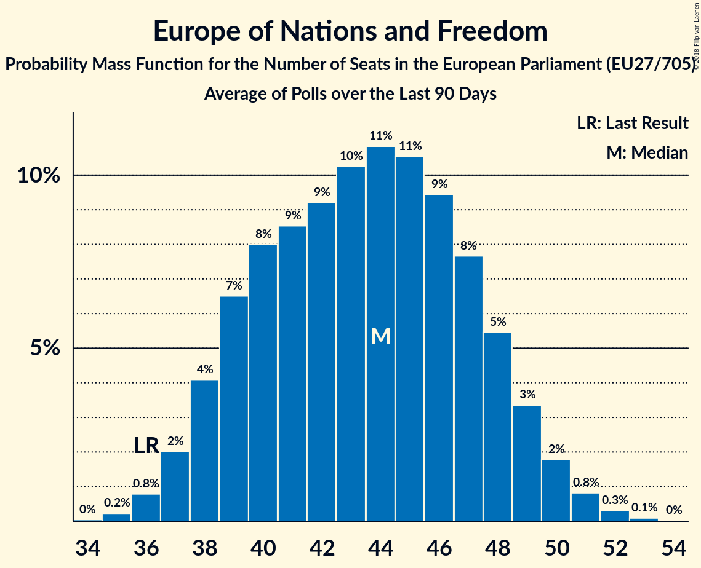

# Seat Projection for the European Parliament (EU27/705)

<a href="#seats">Seats</a> | <a href="#voting-intentions">Voting Intentions</a> | <a href="#technical-information">Technical Information</a>

## Seats

### Confidence Intervals

| Party | Last Result | Median | 80% Confidence Interval | 90% Confidence Interval | 95% Confidence Interval | 99% Confidence Interval |
|:-----:|:-----------:|:------:|:-----------------------:|:-----------------------:|:-----------------------:|:-----------------------:|
| <a href="#european-people’s-party">European People’s Party</a> | 217 | 172 | 164–179 |162–181 | 161–183 | 157–186 |
| <a href="#progressive-alliance-of-socialists-and-democrats">Progressive Alliance of Socialists and Democrats</a> | 169 | 122 | 115–130 |113–132 | 111–134 | 108–137 |
| <a href="#alliance-of-liberals-and-democrats-for-europe">Alliance of Liberals and Democrats for Europe</a> | 67 | 96 | 91–102 |90–103 | 89–105 | 86–107 |
| <a href="#european-conservatives-and-reformists">European Conservatives and Reformists</a> | 53 | 62 | 57–68 |56–69 | 54–70 | 52–72 |
| <a href="#europe-of-nations-and-freedom">Europe of Nations and Freedom</a> | 36 | 60 | 56–65 |55–66 | 54–67 | 52–69 |
| <a href="#european-united-left–nordic-green-left">European United Left–Nordic Green Left</a> | 51 | 53 | 50–56 |49–58 | 48–58 | 46–60 |
| <a href="#europe-of-freedom-and-direct-democracy">Europe of Freedom and Direct Democracy</a> | 25 | 48 | 43–52 |42–53 | 40–54 | 38–55 |
| <a href="#greens–european-free-alliance">Greens–European Free Alliance</a> | 45 | 44 | 41–50 |40–51 | 39–53 | 36–55 |
| <a href="#non-inscrits">Non-Inscrits</a> | 15 | 9 | 7–10 |7–10 | 7–10 | 6–11 |
| <a href="#parties-currently-not-represented-in-the-ep">Parties currently not represented in the EP</a> | 0 | 7 | 6–9 |5–10 | 5–10 | 5–11 |

### European People’s Party

*For a full overview of the results for this party, see the [European People’s Party](party-europeanpeople’sparty.html) page.*

| Number of Seats | Probability | Accumulated | Special Marks |
|:---------------:|:-----------:|:-----------:|:-------------:|
| 154 | 0% | 100% |  |
| 155 | 0.1% | 99.9% |  |
| 156 | 0.1% | 99.8% |  |
| 157 | 0.2% | 99.7% |  |
| 158 | 0.4% | 99.5% |  |
| 159 | 0.6% | 99.1% |  |
| 160 | 0.9% | 98.5% |  |
| 161 | 1.2% | 98% |  |
| 162 | 2% | 96% |  |
| 163 | 2% | 95% |  |
| 164 | 3% | 92% |  |
| 165 | 4% | 89% |  |
| 166 | 4% | 86% |  |
| 167 | 5% | 82% |  |
| 168 | 6% | 77% |  |
| 169 | 6% | 71% |  |
| 170 | 7% | 65% |  |
| 171 | 7% | 58% |  |
| 172 | 7% | 51% | Median |
| 173 | 7% | 45% |  |
| 174 | 6% | 38% |  |
| 175 | 6% | 31% |  |
| 176 | 5% | 26% |  |
| 177 | 5% | 20% |  |
| 178 | 4% | 16% |  |
| 179 | 3% | 12% |  |
| 180 | 3% | 9% |  |
| 181 | 2% | 6% |  |
| 182 | 1.4% | 4% |  |
| 183 | 1.0% | 3% |  |
| 184 | 0.7% | 2% |  |
| 185 | 0.4% | 1.1% |  |
| 186 | 0.3% | 0.6% |  |
| 187 | 0.2% | 0.4% |  |
| 188 | 0.1% | 0.2% |  |
| 189 | 0.1% | 0.1% |  |
| 190 | 0% | 0.1% |  |
| 191 | 0% | 0% |  |
| 192 | 0% | 0% |  |
| 193 | 0% | 0% |  |
| 194 | 0% | 0% |  |
| 195 | 0% | 0% |  |
| 196 | 0% | 0% |  |
| 197 | 0% | 0% |  |
| 198 | 0% | 0% |  |
| 199 | 0% | 0% |  |
| 200 | 0% | 0% |  |
| 201 | 0% | 0% |  |
| 202 | 0% | 0% |  |
| 203 | 0% | 0% |  |
| 204 | 0% | 0% |  |
| 205 | 0% | 0% |  |
| 206 | 0% | 0% |  |
| 207 | 0% | 0% |  |
| 208 | 0% | 0% |  |
| 209 | 0% | 0% |  |
| 210 | 0% | 0% |  |
| 211 | 0% | 0% |  |
| 212 | 0% | 0% |  |
| 213 | 0% | 0% |  |
| 214 | 0% | 0% |  |
| 215 | 0% | 0% |  |
| 216 | 0% | 0% |  |
| 217 | 0% | 0% | Last Result |

### Progressive Alliance of Socialists and Democrats

*For a full overview of the results for this party, see the [Progressive Alliance of Socialists and Democrats](party-progressiveallianceofsocialistsanddemocrats.html) page.*

| Number of Seats | Probability | Accumulated | Special Marks |
|:---------------:|:-----------:|:-----------:|:-------------:|
| 106 | 0.1% | 100% |  |
| 107 | 0.1% | 99.9% |  |
| 108 | 0.3% | 99.8% |  |
| 109 | 0.5% | 99.5% |  |
| 110 | 0.7% | 99.0% |  |
| 111 | 1.1% | 98% |  |
| 112 | 2% | 97% |  |
| 113 | 2% | 96% |  |
| 114 | 3% | 94% |  |
| 115 | 3% | 91% |  |
| 116 | 4% | 88% |  |
| 117 | 5% | 84% |  |
| 118 | 5% | 79% |  |
| 119 | 6% | 74% |  |
| 120 | 6% | 68% |  |
| 121 | 6% | 62% |  |
| 122 | 6% | 56% | Median |
| 123 | 6% | 50% |  |
| 124 | 6% | 43% |  |
| 125 | 6% | 37% |  |
| 126 | 5% | 31% |  |
| 127 | 5% | 25% |  |
| 128 | 4% | 21% |  |
| 129 | 4% | 16% |  |
| 130 | 3% | 12% |  |
| 131 | 3% | 9% |  |
| 132 | 2% | 7% |  |
| 133 | 2% | 5% |  |
| 134 | 1.1% | 3% |  |
| 135 | 0.8% | 2% |  |
| 136 | 0.5% | 1.2% |  |
| 137 | 0.3% | 0.7% |  |
| 138 | 0.2% | 0.4% |  |
| 139 | 0.1% | 0.2% |  |
| 140 | 0.1% | 0.1% |  |
| 141 | 0% | 0% |  |
| 142 | 0% | 0% |  |
| 143 | 0% | 0% |  |
| 144 | 0% | 0% |  |
| 145 | 0% | 0% |  |
| 146 | 0% | 0% |  |
| 147 | 0% | 0% |  |
| 148 | 0% | 0% |  |
| 149 | 0% | 0% |  |
| 150 | 0% | 0% |  |
| 151 | 0% | 0% |  |
| 152 | 0% | 0% |  |
| 153 | 0% | 0% |  |
| 154 | 0% | 0% |  |
| 155 | 0% | 0% |  |
| 156 | 0% | 0% |  |
| 157 | 0% | 0% |  |
| 158 | 0% | 0% |  |
| 159 | 0% | 0% |  |
| 160 | 0% | 0% |  |
| 161 | 0% | 0% |  |
| 162 | 0% | 0% |  |
| 163 | 0% | 0% |  |
| 164 | 0% | 0% |  |
| 165 | 0% | 0% |  |
| 166 | 0% | 0% |  |
| 167 | 0% | 0% |  |
| 168 | 0% | 0% |  |
| 169 | 0% | 0% | Last Result |

### Europe of Nations and Freedom

*For a full overview of the results for this party, see the [Europe of Nations and Freedom](party-europeofnationsandfreedom.html) page.*

| Number of Seats | Probability | Accumulated | Special Marks |
|:---------------:|:-----------:|:-----------:|:-------------:|
| 36 | 0% | 100% | Last Result |
| 37 | 0% | 100% |  |
| 38 | 0% | 100% |  |
| 39 | 0% | 100% |  |
| 40 | 0% | 100% |  |
| 41 | 0% | 100% |  |
| 42 | 0% | 100% |  |
| 43 | 0% | 100% |  |
| 44 | 0% | 100% |  |
| 45 | 0% | 100% |  |
| 46 | 0% | 100% |  |
| 47 | 0% | 100% |  |
| 48 | 0% | 100% |  |
| 49 | 0% | 100% |  |
| 50 | 0.1% | 100% |  |
| 51 | 0.2% | 99.9% |  |
| 52 | 0.5% | 99.7% |  |
| 53 | 1.3% | 99.2% |  |
| 54 | 3% | 98% |  |
| 55 | 4% | 95% |  |
| 56 | 6% | 91% |  |
| 57 | 8% | 85% |  |
| 58 | 10% | 77% |  |
| 59 | 11% | 68% |  |
| 60 | 11% | 57% | Median |
| 61 | 11% | 46% |  |
| 62 | 10% | 35% |  |
| 63 | 8% | 25% |  |
| 64 | 6% | 17% |  |
| 65 | 4% | 10% |  |
| 66 | 3% | 6% |  |
| 67 | 2% | 3% |  |
| 68 | 0.9% | 2% |  |
| 69 | 0.4% | 0.8% |  |
| 70 | 0.2% | 0.4% |  |
| 71 | 0.1% | 0.2% |  |
| 72 | 0% | 0.1% |  |
| 73 | 0% | 0% |  |

### Non-Inscrits

*For a full overview of the results for this party, see the [Non-Inscrits](party-non-inscrits.html) page.*

| Number of Seats | Probability | Accumulated | Special Marks |
|:---------------:|:-----------:|:-----------:|:-------------:|
| 5 | 0.1% | 100% |  |
| 6 | 2% | 99.9% |  |
| 7 | 12% | 98% |  |
| 8 | 31% | 86% |  |
| 9 | 37% | 56% | Median |
| 10 | 16% | 18% |  |
| 11 | 2% | 2% |  |
| 12 | 0.1% | 0.1% |  |
| 13 | 0% | 0% |  |
| 14 | 0% | 0% |  |
| 15 | 0% | 0% | Last Result |

### Alliance of Liberals and Democrats for Europe

*For a full overview of the results for this party, see the [Alliance of Liberals and Democrats for Europe](party-allianceofliberalsanddemocratsforeurope.html) page.*

| Number of Seats | Probability | Accumulated | Special Marks |
|:---------------:|:-----------:|:-----------:|:-------------:|
| 67 | 0% | 100% | Last Result |
| 68 | 0% | 100% |  |
| 69 | 0% | 100% |  |
| 70 | 0% | 100% |  |
| 71 | 0% | 100% |  |
| 72 | 0% | 100% |  |
| 73 | 0% | 100% |  |
| 74 | 0% | 100% |  |
| 75 | 0% | 100% |  |
| 76 | 0% | 100% |  |
| 77 | 0% | 100% |  |
| 78 | 0% | 100% |  |
| 79 | 0% | 100% |  |
| 80 | 0% | 100% |  |
| 81 | 0% | 100% |  |
| 82 | 0% | 100% |  |
| 83 | 0% | 100% |  |
| 84 | 0.1% | 100% |  |
| 85 | 0.2% | 99.9% |  |
| 86 | 0.3% | 99.7% |  |
| 87 | 0.7% | 99.4% |  |
| 88 | 1.2% | 98.8% |  |
| 89 | 2% | 98% |  |
| 90 | 3% | 96% |  |
| 91 | 4% | 93% |  |
| 92 | 6% | 89% |  |
| 93 | 7% | 83% |  |
| 94 | 8% | 76% |  |
| 95 | 9% | 68% |  |
| 96 | 9% | 59% | Median |
| 97 | 9% | 50% |  |
| 98 | 9% | 40% |  |
| 99 | 8% | 31% |  |
| 100 | 7% | 23% |  |
| 101 | 5% | 17% |  |
| 102 | 4% | 11% |  |
| 103 | 3% | 7% |  |
| 104 | 2% | 4% |  |
| 105 | 1.2% | 3% |  |
| 106 | 0.7% | 1.4% |  |
| 107 | 0.4% | 0.7% |  |
| 108 | 0.2% | 0.3% |  |
| 109 | 0.1% | 0.2% |  |
| 110 | 0% | 0.1% |  |
| 111 | 0% | 0% |  |

### Greens–European Free Alliance

*For a full overview of the results for this party, see the [Greens–European Free Alliance](party-greens–europeanfreealliance.html) page.*

| Number of Seats | Probability | Accumulated | Special Marks |
|:---------------:|:-----------:|:-----------:|:-------------:|
| 33 | 0% | 100% |  |
| 34 | 0.1% | 99.9% |  |
| 35 | 0.1% | 99.8% |  |
| 36 | 0.2% | 99.7% |  |
| 37 | 0.4% | 99.5% |  |
| 38 | 1.0% | 99.1% |  |
| 39 | 2% | 98% |  |
| 40 | 4% | 96% |  |
| 41 | 7% | 92% |  |
| 42 | 11% | 84% |  |
| 43 | 13% | 74% |  |
| 44 | 13% | 61% | Median |
| 45 | 12% | 48% | Last Result |
| 46 | 9% | 36% |  |
| 47 | 7% | 27% |  |
| 48 | 5% | 20% |  |
| 49 | 4% | 15% |  |
| 50 | 3% | 11% |  |
| 51 | 3% | 8% |  |
| 52 | 2% | 5% |  |
| 53 | 1.3% | 3% |  |
| 54 | 0.8% | 2% |  |
| 55 | 0.4% | 0.8% |  |
| 56 | 0.2% | 0.3% |  |
| 57 | 0.1% | 0.1% |  |
| 58 | 0% | 0% |  |

### European United Left–Nordic Green Left

*For a full overview of the results for this party, see the [European United Left–Nordic Green Left](party-europeanunitedleft–nordicgreenleft.html) page.*

| Number of Seats | Probability | Accumulated | Special Marks |
|:---------------:|:-----------:|:-----------:|:-------------:|
| 44 | 0.1% | 100% |  |
| 45 | 0.2% | 99.9% |  |
| 46 | 0.5% | 99.7% |  |
| 47 | 1.3% | 99.2% |  |
| 48 | 3% | 98% |  |
| 49 | 5% | 95% |  |
| 50 | 8% | 90% |  |
| 51 | 11% | 82% | Last Result |
| 52 | 14% | 71% |  |
| 53 | 15% | 57% | Median |
| 54 | 14% | 42% |  |
| 55 | 11% | 29% |  |
| 56 | 8% | 18% |  |
| 57 | 5% | 10% |  |
| 58 | 3% | 5% |  |
| 59 | 1.4% | 2% |  |
| 60 | 0.7% | 1.1% |  |
| 61 | 0.3% | 0.4% |  |
| 62 | 0.1% | 0.1% |  |
| 63 | 0% | 0% |  |

### European Conservatives and Reformists

*For a full overview of the results for this party, see the [European Conservatives and Reformists](party-europeanconservativesandreformists.html) page.*

| Number of Seats | Probability | Accumulated | Special Marks |
|:---------------:|:-----------:|:-----------:|:-------------:|
| 50 | 0.1% | 100% |  |
| 51 | 0.2% | 99.9% |  |
| 52 | 0.4% | 99.7% |  |
| 53 | 0.7% | 99.3% | Last Result |
| 54 | 1.3% | 98.6% |  |
| 55 | 2% | 97% |  |
| 56 | 3% | 95% |  |
| 57 | 4% | 92% |  |
| 58 | 6% | 88% |  |
| 59 | 7% | 82% |  |
| 60 | 8% | 75% |  |
| 61 | 9% | 67% |  |
| 62 | 9% | 58% | Median |
| 63 | 9% | 49% |  |
| 64 | 9% | 39% |  |
| 65 | 8% | 31% |  |
| 66 | 7% | 23% |  |
| 67 | 5% | 16% |  |
| 68 | 4% | 11% |  |
| 69 | 3% | 7% |  |
| 70 | 2% | 4% |  |
| 71 | 1.1% | 2% |  |
| 72 | 0.6% | 0.9% |  |
| 73 | 0.2% | 0.4% |  |
| 74 | 0.1% | 0.1% |  |
| 75 | 0% | 0% |  |

### Europe of Freedom and Direct Democracy

*For a full overview of the results for this party, see the [Europe of Freedom and Direct Democracy](party-europeoffreedomanddirectdemocracy.html) page.*

| Number of Seats | Probability | Accumulated | Special Marks |
|:---------------:|:-----------:|:-----------:|:-------------:|
| 25 | 0% | 100% | Last Result |
| 26 | 0% | 100% |  |
| 27 | 0% | 100% |  |
| 28 | 0% | 100% |  |
| 29 | 0% | 100% |  |
| 30 | 0% | 100% |  |
| 31 | 0% | 100% |  |
| 32 | 0% | 100% |  |
| 33 | 0% | 100% |  |
| 34 | 0% | 100% |  |
| 35 | 0.1% | 100% |  |
| 36 | 0.1% | 99.9% |  |
| 37 | 0.2% | 99.8% |  |
| 38 | 0.4% | 99.6% |  |
| 39 | 0.8% | 99.1% |  |
| 40 | 1.2% | 98% |  |
| 41 | 2% | 97% |  |
| 42 | 2% | 96% |  |
| 43 | 3% | 93% |  |
| 44 | 5% | 90% |  |
| 45 | 8% | 84% |  |
| 46 | 10% | 77% |  |
| 47 | 12% | 67% |  |
| 48 | 13% | 54% | Median |
| 49 | 12% | 41% |  |
| 50 | 10% | 29% |  |
| 51 | 8% | 19% |  |
| 52 | 5% | 11% |  |
| 53 | 3% | 6% |  |
| 54 | 2% | 3% |  |
| 55 | 0.8% | 1.3% |  |
| 56 | 0.3% | 0.5% |  |
| 57 | 0.1% | 0.2% |  |
| 58 | 0% | 0.1% |  |
| 59 | 0% | 0% |  |

### Parties currently not represented in the EP

*For a full overview of the results for this party, see the [Parties currently not represented in the EP](party-partiescurrentlynotrepresentedintheep.html) page.*

| Number of Seats | Probability | Accumulated | Special Marks |
|:---------------:|:-----------:|:-----------:|:-------------:|
| 0 | 0% | 100% | Last Result |
| 1 | 0% | 100% |  |
| 2 | 0% | 100% |  |
| 3 | 0% | 100% |  |
| 4 | 0.4% | 100% |  |
| 5 | 5% | 99.6% |  |
| 6 | 18% | 95% |  |
| 7 | 29% | 77% | Median |
| 8 | 26% | 48% |  |
| 9 | 15% | 21% |  |
| 10 | 5% | 7% |  |
| 11 | 1.2% | 2% |  |
| 12 | 0.2% | 0.4% |  |
| 13 | 0.1% | 0.1% |  |
| 14 | 0% | 0.1% |  |
| 15 | 0% | 0% |  |

## Voting Intentions

### Confidence Intervals

| Party | Last Result | Median | 80% Confidence Interval | 90% Confidence Interval | 95% Confidence Interval | 99% Confidence Interval |
|:-----:|:-----------:|:------:|:-----------------------:|:-----------------------:|:-----------------------:|:-----------------------:|
| <a href="#european-people’s-party">European People’s Party</a> | 28.6% | N/A | N/A |N/A | N/A | N/A |
| <a href="#progressive-alliance-of-socialists-and-democrats">Progressive Alliance of Socialists and Democrats</a> | 24.6% | N/A | N/A |N/A | N/A | N/A |
| <a href="#europe-of-nations-and-freedom">Europe of Nations and Freedom</a> | 15.3% | N/A | N/A |N/A | N/A | N/A |
| <a href="#non-inscrits">Non-Inscrits</a> | 15.3% | N/A | N/A |N/A | N/A | N/A |
| <a href="#alliance-of-liberals-and-democrats-for-europe">Alliance of Liberals and Democrats for Europe</a> | 7.9% | N/A | N/A |N/A | N/A | N/A |
| <a href="#greens–european-free-alliance">Greens–European Free Alliance</a> | 6.5% | N/A | N/A |N/A | N/A | N/A |
| <a href="#european-conservatives-and-reformists">European Conservatives and Reformists</a> | 6.0% | N/A | N/A |N/A | N/A | N/A |
| <a href="#european-united-left–nordic-green-left">European United Left–Nordic Green Left</a> | 6.0% | N/A | N/A |N/A | N/A | N/A |
| <a href="#europe-of-freedom-and-direct-democracy">Europe of Freedom and Direct Democracy</a> | 5.1% | N/A | N/A |N/A | N/A | N/A |
| <a href="#parties-currently-not-represented-in-the-ep">Parties currently not represented in the EP</a> | 0.0% | N/A | N/A |N/A | N/A | N/A |

## Technical Information

The seat and voting intentions projection for the European Parliament presented on this page was based on the averages of the most recent polls for the following countries:

| Country                                                                                                                      | No of Seats             | No of Constituencies   | Method                      | Threshold |
|:-----------------------------------------------------------------------------------------------------------------------------|:-----------------------:|:----------------------:|:---------------------------:|:---------:|
| Austria [⁰](https://github.com/filipvanlaenen/austrian_ep_polls/blob/master/average.md)                                      | <strike>18</strike> 19¹ | 1                      | D'Hondt                    | 4%        |
| Belgium: [Flanders](https://filipvanlaenen.github.io/flemish_ep_polls/average.html)                                          | 12                      | 1                      | D'Hondt                    | No        |
| Belgium: French Community [⁰](https://github.com/filipvanlaenen/french_community_of_belgium_ep_polls/blob/master/average.md) | 8                       | 1                      | D'Hondt                    | No        |
| Bulgaria [⁰](https://filipvanlaenen.github.io/bulgarian_ep_polls/average.html)                                               | 17                      | 1                      | Hare-Niemeyer               | 5%        |
| Croatia [⁰](https://filipvanlaenen.github.io/croatian_ep_polls/average.html)                                                 | <strike>11</strike> 12¹ | 1                      | D'Hondt                    | 5%        |
| Cyprus [⁰](https://github.com/filipvanlaenen/cypriot_ep_polls/blob/master/average.md)                                        | 6                       | 1                      | Hare-Niemeyer               | No        |
| Czech Republic [⁰](https://filipvanlaenen.github.io/czech_ep_polls/average.html)                                             | 21                      | 1                      | D'Hondt                    | 5%        |
| [Denmark](https://filipvanlaenen.github.io/danish_ep_polls/average.html)                                                     | <strike>13</strike> 14¹ | 1                      | D'Hondt                    | No        |
| [Estonia](https://filipvanlaenen.github.io/estonian_ep_polls/average.html)                                                   | <strike>6</strike> 7¹   | 1                      | D'Hondt                    | No        |
| [Finland](https://filipvanlaenen.github.io/finnish_ep_polls/average.html)                                                    | <strike>13</strike> 14¹ | 1                      | D'Hondt                    | No        |
| France² [⁰](https://github.com/filipvanlaenen/french_ep_polls/blob/master/average.md)                                        | <strike>74</strike> 79¹ | <strike>10</strike> 1² | D'Hondt²                   | 5%²       |
| [Germany](https://filipvanlaenen.github.io/german_ep_polls/average.html)                                                     | 96                      | 1                      | Sainte-Laguë                | No        |
| [Greece](https://filipvanlaenen.github.io/greek_ep_polls/average.html)                                                       | 21                      | 1                      | Droop                       | 3%        |
| [Hungary](https://filipvanlaenen.github.io/hungarian_ep_polls/average.html)                                                  | 21                      | 1                      | D'Hondt                    | No        |
| Ireland [⁰](https://filipvanlaenen.github.io/irish_ep_polls/average.html)                                                    | <strike>11</strike> 13¹ | 3                      | Single transferable vote³   | N/A       |
| Italy [⁰](https://filipvanlaenen.github.io/italian_ep_polls/average.html)                                                    | <strike>73</strike> 76¹ | 1                      | Hare-Niemeyer               | 4%        |
| [Latvia](https://filipvanlaenen.github.io/latvian_ep_polls/average.html)                                                     | 8                       | 1                      | Sainte-Laguë                | 5%        |
| Lithuania [⁰](https://github.com/filipvanlaenen/lithuanian_ep_polls/blob/master/average.md)                                  | 11                      | 1                      | Hare–Niemeyer               | 5%        |
| [Luxembourg](https://filipvanlaenen.github.io/luxembourg_ep_polls/average.html)                                              | 6                       | 1                      | D'Hondt                    | No        |
| Malta [⁰](https://github.com/filipvanlaenen/maltese_ep_polls/blob/master/average.md)                                         | 6                       | 1                      | Single transferable vote³   | N/A       |
| Netherlands [⁰](https://github.com/filipvanlaenen/dutch_ep_polls/blob/master/average.md)                                     | <strike>26</strike> 29¹ | 1                      | D'Hondt                    | 1/26      |
| Poland [⁰](https://filipvanlaenen.github.io/polish_ep_polls/average.html)                                                    | <strike>51</strike> 52¹ | 1⁴                     | D'Hondt                    | 5%        |
| [Portugal](https://filipvanlaenen.github.io/portuguese_ep_polls/average.html)                                                | 21                      | 1                      | D'Hondt                    | No        |
| Romania [⁰](https://github.com/filipvanlaenen/romanian_ep_polls/blob/master/average.md)                                      | <strike>32</strike> 33¹ | 1                      | D'Hondt                    | 5%        |
| Slovakia [⁰](https://github.com/filipvanlaenen/slovakian_ep_polls/blob/master/average.md)                                    | <strike>13</strike> 14¹ | 1                      | Hagenbach-Bischoff          | 5%        |
| [Slovenia](https://filipvanlaenen.github.io/slovenian_ep_polls/average.html)                                                 | 8                       | 1                      | D'Hondt                    | 5%        |
| Spain [⁰](https://filipvanlaenen.github.io/spanish_ep_polls/average.html)                                                    | <strike>54</strike> 59¹ | 1                      | D'Hondt                    | No        |
| [Sweden](https://filipvanlaenen.github.io/swedish_ep_polls/average.html)                                                     | <strike>20</strike> 21¹ | 1                      | Modified Sainte-Laguë       | 4%        |
| **Total**                                                                                                                    | **<strike>677 / 678</strike> 704¹ / 705¹ (99.9%)** | |                         |           |

¹ Changed according to the [redistribution of seats](http://www.europarl.europa.eu/news/en/headlines/eu-affairs/20180126STO94114/eu-elections-how-many-meps-will-each-country-get-in-2019) planned for the 2019 European election.

² France has changed its electoral system since the last election; current assumption is that it will use the D'Hondt method with a 5% threshold.

³ Implemented as D'Hondt.

⁴ Will be changed to 13; legislation adopted in August 2018.

The following countries haven't been included in the calculations yet,
 and are therefore, except for the United Kingdom, represented with the fixed number
 1 seat for EPP,
 and none for ALDE, GUE/NGL, S&D, Greens/EFA, ECR, EFDD, ENF and NI in the results above:

| Country                                            | No of Seats             | No of Constituencies | Method                      | Threshold |
|:---------------------------------------------------|:-----------------------:|:--------------------:|:---------------------------:|:---------:|
| Belgium: German-speaking constituency              | 1                       | 1                    | D'Hondt                    | No        |
| <strike>United Kingdom: Great Britain</strike>³    | <strike>70</strike>³    | 11                   | D'Hondt                    | No        |
| <strike>United Kingdom: Northern Ireland</strike>³ | <strike>3</strike>³     | 1                    | Single transferable vote    | N/A       |
| **Total**                                          | **<strike>74 / 751</strike> 1¹ / 705¹** |   |                             |           |

¹ Changed according to the [redistribution of seats](http://www.europarl.europa.eu/news/en/headlines/eu-affairs/20180126STO94114/eu-elections-how-many-meps-will-each-country-get-in-2019) planned for the 2019 European election.

³ The United Kingdom is set to leave the European Union before the next European election.
