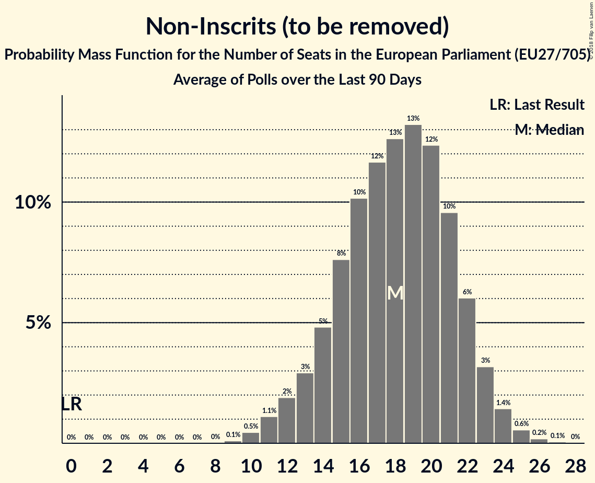

# Seat Projection for the European Parliament (EU27/705)

<a href="#seats">Seats</a> | <a href="#voting-intentions">Voting Intentions</a> | <a href="#technical-information">Technical Information</a>

## Seats

### Confidence Intervals

| Party | Last Result | Median | 80% Confidence Interval | 90% Confidence Interval | 95% Confidence Interval | 99% Confidence Interval |
|:-----:|:-----------:|:------:|:-----------------------:|:-----------------------:|:-----------------------:|:-----------------------:|
| <a href="#european-people’s-party">European People’s Party</a> | 217 | 186 | 179–193 |177–195 | 175–196 | 172–200 |
| <a href="#progressive-alliance-of-socialists-and-democrats">Progressive Alliance of Socialists and Democrats</a> | 169 | 141 | 133–149 |130–151 | 129–152 | 126–155 |
| <a href="#europe-of-nations-and-freedom">Europe of Nations and Freedom</a> | 36 | 43 | 39–47 |38–49 | 37–50 | 35–52 |
| <a href="#non-inscrits">Non-Inscrits</a> | 15 | N/A | N/A |N/A | N/A | N/A |
| <a href="#alliance-of-liberals-and-democrats-for-europe">Alliance of Liberals and Democrats for Europe</a> | 67 | 103 | 98–109 |96–110 | 95–111 | 92–114 |
| <a href="#greens–european-free-alliance">Greens–European Free Alliance</a> | 45 | 35 | 32–37 |31–39 | 31–40 | 30–42 |
| <a href="#european-conservatives-and-reformists">European Conservatives and Reformists</a> | 53 | 40 | 39–41 |38–41 | 38–42 | 37–42 |
| <a href="#european-united-left–nordic-green-left">European United Left–Nordic Green Left</a> | 51 | 56 | 53–59 |52–59 | 51–60 | 50–62 |
| <a href="#europe-of-freedom-and-direct-democracy">Europe of Freedom and Direct Democracy</a> | 25 | 51 | 47–56 |46–57 | 45–59 | 42–61 |
| <a href="#non-inscrits-(to-be-removed)">Non-Inscrits (to be removed)</a> | 0 | 18 | 14–22 |13–23 | 12–23 | 10–25 |
| <a href="#parties-currently-not-represented-in-the-ep">Parties currently not represented in the EP</a> | 0 | 3 | 2–4 |2–4 | 2–4 | 1–4 |

### European People’s Party

*For a full overview of the results for this party, see the [European People’s Party](party-europeanpeople’sparty.html) page.*

| Number of Seats | Probability | Accumulated | Special Marks |
|:---------------:|:-----------:|:-----------:|:-------------:|
| 168 | 0% | 100% |  |
| 169 | 0.1% | 99.9% |  |
| 170 | 0.1% | 99.9% |  |
| 171 | 0.2% | 99.8% |  |
| 172 | 0.3% | 99.6% |  |
| 173 | 0.5% | 99.3% |  |
| 174 | 0.8% | 98.8% |  |
| 175 | 1.1% | 98% |  |
| 176 | 2% | 97% |  |
| 177 | 2% | 95% |  |
| 178 | 3% | 93% |  |
| 179 | 3% | 90% |  |
| 180 | 4% | 87% |  |
| 181 | 5% | 83% |  |
| 182 | 6% | 78% |  |
| 183 | 6% | 72% |  |
| 184 | 7% | 66% |  |
| 185 | 7% | 59% |  |
| 186 | 7% | 51% | Median |
| 187 | 7% | 44% |  |
| 188 | 7% | 37% |  |
| 189 | 6% | 31% |  |
| 190 | 5% | 25% |  |
| 191 | 5% | 19% |  |
| 192 | 4% | 15% |  |
| 193 | 3% | 11% |  |
| 194 | 2% | 8% |  |
| 195 | 2% | 5% |  |
| 196 | 1.3% | 4% |  |
| 197 | 0.9% | 2% |  |
| 198 | 0.6% | 2% |  |
| 199 | 0.4% | 0.9% |  |
| 200 | 0.2% | 0.5% |  |
| 201 | 0.1% | 0.3% |  |
| 202 | 0.1% | 0.2% |  |
| 203 | 0% | 0.1% |  |
| 204 | 0% | 0% |  |
| 205 | 0% | 0% |  |
| 206 | 0% | 0% |  |
| 207 | 0% | 0% |  |
| 208 | 0% | 0% |  |
| 209 | 0% | 0% |  |
| 210 | 0% | 0% |  |
| 211 | 0% | 0% |  |
| 212 | 0% | 0% |  |
| 213 | 0% | 0% |  |
| 214 | 0% | 0% |  |
| 215 | 0% | 0% |  |
| 216 | 0% | 0% |  |
| 217 | 0% | 0% | Last Result |

### Progressive Alliance of Socialists and Democrats

*For a full overview of the results for this party, see the [Progressive Alliance of Socialists and Democrats](party-progressiveallianceofsocialistsanddemocrats.html) page.*

| Number of Seats | Probability | Accumulated | Special Marks |
|:---------------:|:-----------:|:-----------:|:-------------:|
| 123 | 0.1% | 100% |  |
| 124 | 0.1% | 99.9% |  |
| 125 | 0.2% | 99.8% |  |
| 126 | 0.4% | 99.5% |  |
| 127 | 0.6% | 99.2% |  |
| 128 | 0.9% | 98.6% |  |
| 129 | 1.2% | 98% |  |
| 130 | 2% | 97% |  |
| 131 | 2% | 95% |  |
| 132 | 2% | 93% |  |
| 133 | 3% | 90% |  |
| 134 | 3% | 88% |  |
| 135 | 4% | 84% |  |
| 136 | 4% | 80% |  |
| 137 | 5% | 76% |  |
| 138 | 5% | 71% |  |
| 139 | 6% | 65% |  |
| 140 | 6% | 60% |  |
| 141 | 6% | 54% | Median |
| 142 | 6% | 47% |  |
| 143 | 6% | 41% |  |
| 144 | 6% | 35% |  |
| 145 | 5% | 29% |  |
| 146 | 5% | 24% |  |
| 147 | 4% | 19% |  |
| 148 | 4% | 14% |  |
| 149 | 3% | 10% |  |
| 150 | 2% | 7% |  |
| 151 | 2% | 5% |  |
| 152 | 1.3% | 3% |  |
| 153 | 0.8% | 2% |  |
| 154 | 0.5% | 1.2% |  |
| 155 | 0.3% | 0.7% |  |
| 156 | 0.2% | 0.4% |  |
| 157 | 0.1% | 0.2% |  |
| 158 | 0% | 0.1% |  |
| 159 | 0% | 0% |  |
| 160 | 0% | 0% |  |
| 161 | 0% | 0% |  |
| 162 | 0% | 0% |  |
| 163 | 0% | 0% |  |
| 164 | 0% | 0% |  |
| 165 | 0% | 0% |  |
| 166 | 0% | 0% |  |
| 167 | 0% | 0% |  |
| 168 | 0% | 0% |  |
| 169 | 0% | 0% | Last Result |

### Europe of Nations and Freedom

*For a full overview of the results for this party, see the [Europe of Nations and Freedom](party-europeofnationsandfreedom.html) page.*

| Number of Seats | Probability | Accumulated | Special Marks |
|:---------------:|:-----------:|:-----------:|:-------------:|
| 33 | 0.1% | 100% |  |
| 34 | 0.2% | 99.9% |  |
| 35 | 0.4% | 99.8% |  |
| 36 | 1.0% | 99.3% | Last Result |
| 37 | 2% | 98% |  |
| 38 | 4% | 96% |  |
| 39 | 6% | 93% |  |
| 40 | 9% | 87% |  |
| 41 | 12% | 78% |  |
| 42 | 13% | 66% |  |
| 43 | 12% | 53% | Median |
| 44 | 11% | 41% |  |
| 45 | 9% | 30% |  |
| 46 | 7% | 21% |  |
| 47 | 5% | 14% |  |
| 48 | 4% | 9% |  |
| 49 | 2% | 5% |  |
| 50 | 1.5% | 3% |  |
| 51 | 0.8% | 1.4% |  |
| 52 | 0.4% | 0.6% |  |
| 53 | 0.2% | 0.2% |  |
| 54 | 0.1% | 0.1% |  |
| 55 | 0% | 0% |  |

### Alliance of Liberals and Democrats for Europe

*For a full overview of the results for this party, see the [Alliance of Liberals and Democrats for Europe](party-allianceofliberalsanddemocratsforeurope.html) page.*

| Number of Seats | Probability | Accumulated | Special Marks |
|:---------------:|:-----------:|:-----------:|:-------------:|
| 67 | 0% | 100% | Last Result |
| 68 | 0% | 100% |  |
| 69 | 0% | 100% |  |
| 70 | 0% | 100% |  |
| 71 | 0% | 100% |  |
| 72 | 0% | 100% |  |
| 73 | 0% | 100% |  |
| 74 | 0% | 100% |  |
| 75 | 0% | 100% |  |
| 76 | 0% | 100% |  |
| 77 | 0% | 100% |  |
| 78 | 0% | 100% |  |
| 79 | 0% | 100% |  |
| 80 | 0% | 100% |  |
| 81 | 0% | 100% |  |
| 82 | 0% | 100% |  |
| 83 | 0% | 100% |  |
| 84 | 0% | 100% |  |
| 85 | 0% | 100% |  |
| 86 | 0% | 100% |  |
| 87 | 0% | 100% |  |
| 88 | 0% | 100% |  |
| 89 | 0% | 100% |  |
| 90 | 0.1% | 99.9% |  |
| 91 | 0.1% | 99.9% |  |
| 92 | 0.3% | 99.7% |  |
| 93 | 0.5% | 99.5% |  |
| 94 | 0.9% | 98.9% |  |
| 95 | 1.4% | 98% |  |
| 96 | 2% | 97% |  |
| 97 | 3% | 95% |  |
| 98 | 4% | 92% |  |
| 99 | 5% | 87% |  |
| 100 | 7% | 82% |  |
| 101 | 8% | 75% |  |
| 102 | 9% | 68% |  |
| 103 | 9% | 59% | Median |
| 104 | 9% | 50% |  |
| 105 | 9% | 40% |  |
| 106 | 8% | 32% |  |
| 107 | 7% | 24% |  |
| 108 | 5% | 17% |  |
| 109 | 4% | 11% |  |
| 110 | 3% | 7% |  |
| 111 | 2% | 4% |  |
| 112 | 1.1% | 2% |  |
| 113 | 0.6% | 1.2% |  |
| 114 | 0.3% | 0.5% |  |
| 115 | 0.1% | 0.2% |  |
| 116 | 0.1% | 0.1% |  |
| 117 | 0% | 0% |  |

### Greens–European Free Alliance

*For a full overview of the results for this party, see the [Greens–European Free Alliance](party-greens–europeanfreealliance.html) page.*

| Number of Seats | Probability | Accumulated | Special Marks |
|:---------------:|:-----------:|:-----------:|:-------------:|
| 28 | 0.1% | 100% |  |
| 29 | 0.4% | 99.9% |  |
| 30 | 2% | 99.6% |  |
| 31 | 5% | 98% |  |
| 32 | 10% | 93% |  |
| 33 | 15% | 84% |  |
| 34 | 18% | 68% |  |
| 35 | 18% | 50% | Median |
| 36 | 14% | 32% |  |
| 37 | 9% | 19% |  |
| 38 | 5% | 10% |  |
| 39 | 2% | 5% |  |
| 40 | 1.3% | 3% |  |
| 41 | 0.7% | 1.3% |  |
| 42 | 0.4% | 0.6% |  |
| 43 | 0.2% | 0.2% |  |
| 44 | 0.1% | 0.1% |  |
| 45 | 0% | 0% | Last Result |

### European Conservatives and Reformists

*For a full overview of the results for this party, see the [European Conservatives and Reformists](party-europeanconservativesandreformists.html) page.*

| Number of Seats | Probability | Accumulated | Special Marks |
|:---------------:|:-----------:|:-----------:|:-------------:|
| 36 | 0.4% | 100% |  |
| 37 | 2% | 99.6% |  |
| 38 | 6% | 98% |  |
| 39 | 15% | 92% |  |
| 40 | 30% | 77% | Median |
| 41 | 44% | 47% |  |
| 42 | 46% | 3% |  |
| 43 | 39% | 0% |  |
| 44 | 28% | 0% |  |
| 45 | 20% | 0% |  |
| 46 | 16% | 0% |  |
| 47 | 16% | 0% |  |
| 48 | 15% | 0% |  |
| 49 | 12% | 0% |  |
| 50 | 7% | 0% |  |
| 51 | 3% | 0% |  |
| 52 | 1.3% | 0% |  |
| 53 | 0.5% | 0% | Last Result |
| 54 | 0.2% | 0% |  |

### European United Left–Nordic Green Left

*For a full overview of the results for this party, see the [European United Left–Nordic Green Left](party-europeanunitedleft–nordicgreenleft.html) page.*

| Number of Seats | Probability | Accumulated | Special Marks |
|:---------------:|:-----------:|:-----------:|:-------------:|
| 48 | 0% | 100% |  |
| 49 | 0.2% | 99.9% |  |
| 50 | 0.7% | 99.7% |  |
| 51 | 2% | 99.0% | Last Result |
| 52 | 5% | 97% |  |
| 53 | 9% | 92% |  |
| 54 | 14% | 83% |  |
| 55 | 17% | 69% |  |
| 56 | 17% | 52% | Median |
| 57 | 14% | 34% |  |
| 58 | 10% | 20% |  |
| 59 | 6% | 10% |  |
| 60 | 3% | 4% |  |
| 61 | 1.1% | 2% |  |
| 62 | 0.4% | 0.6% |  |
| 63 | 0.1% | 0.2% |  |
| 64 | 0% | 0% |  |

### Europe of Freedom and Direct Democracy

*For a full overview of the results for this party, see the [Europe of Freedom and Direct Democracy](party-europeoffreedomanddirectdemocracy.html) page.*

| Number of Seats | Probability | Accumulated | Special Marks |
|:---------------:|:-----------:|:-----------:|:-------------:|
| 25 | 0% | 100% | Last Result |
| 26 | 0% | 100% |  |
| 27 | 0% | 100% |  |
| 28 | 0% | 100% |  |
| 29 | 0% | 100% |  |
| 30 | 0% | 100% |  |
| 31 | 0% | 100% |  |
| 32 | 0% | 100% |  |
| 33 | 0% | 100% |  |
| 34 | 0% | 100% |  |
| 35 | 0% | 100% |  |
| 36 | 0% | 100% |  |
| 37 | 0% | 100% |  |
| 38 | 0% | 100% |  |
| 39 | 0% | 100% |  |
| 40 | 0.1% | 100% |  |
| 41 | 0.2% | 99.9% |  |
| 42 | 0.3% | 99.7% |  |
| 43 | 0.5% | 99.4% |  |
| 44 | 0.9% | 98.8% |  |
| 45 | 2% | 98% |  |
| 46 | 3% | 96% |  |
| 47 | 5% | 93% |  |
| 48 | 8% | 88% |  |
| 49 | 10% | 80% |  |
| 50 | 12% | 70% |  |
| 51 | 12% | 58% | Median |
| 52 | 11% | 46% |  |
| 53 | 9% | 35% |  |
| 54 | 8% | 26% |  |
| 55 | 6% | 19% |  |
| 56 | 5% | 13% |  |
| 57 | 3% | 8% |  |
| 58 | 2% | 5% |  |
| 59 | 1.3% | 3% |  |
| 60 | 0.7% | 1.3% |  |
| 61 | 0.3% | 0.6% |  |
| 62 | 0.1% | 0.2% |  |
| 63 | 0% | 0.1% |  |
| 64 | 0% | 0% |  |

### Parties currently not represented in the EP

*For a full overview of the results for this party, see the [Parties currently not represented in the EP](party-partiescurrentlynotrepresentedintheep.html) page.*

| Number of Seats | Probability | Accumulated | Special Marks |
|:---------------:|:-----------:|:-----------:|:-------------:|
| 0 | 0% | 100% | Last Result |
| 1 | 1.5% | 100% |  |
| 2 | 30% | 98.5% |  |
| 3 | 57% | 68% | Median |
| 4 | 12% | 12% |  |
| 5 | 0% | 0% |  |

### Non-Inscrits (to be removed)

*For a full overview of the results for this party, see the [Non-Inscrits (to be removed)](party-non-inscritstoberemoved.html) page.*

| Number of Seats | Probability | Accumulated | Special Marks |
|:---------------:|:-----------:|:-----------:|:-------------:|
| 0 | 0% | 100% | Last Result |
| 1 | 0% | 100% |  |
| 2 | 0% | 100% |  |
| 3 | 0% | 100% |  |
| 4 | 0% | 100% |  |
| 5 | 0% | 100% |  |
| 6 | 0% | 100% |  |
| 7 | 0% | 100% |  |
| 8 | 0% | 100% |  |
| 9 | 0.1% | 100% |  |
| 10 | 0.5% | 99.9% |  |
| 11 | 1.1% | 99.4% |  |
| 12 | 2% | 98% |  |
| 13 | 3% | 96% |  |
| 14 | 5% | 93% |  |
| 15 | 8% | 89% |  |
| 16 | 10% | 81% |  |
| 17 | 12% | 71% |  |
| 18 | 13% | 59% | Median |
| 19 | 13% | 47% |  |
| 20 | 12% | 33% |  |
| 21 | 10% | 21% |  |
| 22 | 6% | 11% |  |
| 23 | 3% | 5% |  |
| 24 | 1.4% | 2% |  |
| 25 | 0.6% | 0.8% |  |
| 26 | 0.2% | 0.3% |  |
| 27 | 0.1% | 0.1% |  |
| 28 | 0% | 0% |  |

## Voting Intentions

### Confidence Intervals

| Party | Last Result | Median | 80% Confidence Interval | 90% Confidence Interval | 95% Confidence Interval | 99% Confidence Interval |
|:-----:|:-----------:|:------:|:-----------------------:|:-----------------------:|:-----------------------:|:-----------------------:|
| <a href="#european-people’s-party">European People’s Party</a> | 28.6% | N/A | N/A |N/A | N/A | N/A |
| <a href="#progressive-alliance-of-socialists-and-democrats">Progressive Alliance of Socialists and Democrats</a> | 24.6% | N/A | N/A |N/A | N/A | N/A |
| <a href="#europe-of-nations-and-freedom">Europe of Nations and Freedom</a> | 15.3% | N/A | N/A |N/A | N/A | N/A |
| <a href="#non-inscrits">Non-Inscrits</a> | 15.3% | N/A | N/A |N/A | N/A | N/A |
| <a href="#alliance-of-liberals-and-democrats-for-europe">Alliance of Liberals and Democrats for Europe</a> | 7.9% | N/A | N/A |N/A | N/A | N/A |
| <a href="#greens–european-free-alliance">Greens–European Free Alliance</a> | 6.5% | N/A | N/A |N/A | N/A | N/A |
| <a href="#european-conservatives-and-reformists">European Conservatives and Reformists</a> | 6.0% | N/A | N/A |N/A | N/A | N/A |
| <a href="#european-united-left–nordic-green-left">European United Left–Nordic Green Left</a> | 6.0% | N/A | N/A |N/A | N/A | N/A |
| <a href="#europe-of-freedom-and-direct-democracy">Europe of Freedom and Direct Democracy</a> | 5.1% | N/A | N/A |N/A | N/A | N/A |
| <a href="#non-inscrits-(to-be-removed)">Non-Inscrits (to be removed)</a> | 0.0% | N/A | N/A |N/A | N/A | N/A |
| <a href="#parties-currently-not-represented-in-the-ep">Parties currently not represented in the EP</a> | 0.0% | N/A | N/A |N/A | N/A | N/A |

## Technical Information

The seat and voting intentions projection for the European Parliament presented on this page was based on the averages of the most recent polls for the following countries:

| Country                                                                                     | No of Seats             | No of Constituencies   | Method                      | Threshold |
|:--------------------------------------------------------------------------------------------|:-----------------------:|:----------------------:|:---------------------------:|:---------:|
| Austria [⁰](https://github.com/filipvanlaenen/austrian_ep_polls/blob/master/average.md)     | <strike>18</strike> 19¹ | 1                      | D'Hondt                    | 4%        |
| Belgium: [Flanders](https://filipvanlaenen.github.io/flemish_ep_polls/)                     | 12                      | 1                      | D'Hondt                    | No        |
| Bulgaria [⁰](https://github.com/filipvanlaenen/bulgarian_ep_polls/blob/master/average.md)   | 17                      | 1                      | Hare-Niemeyer               | 5%        |
| Croatia [⁰](https://github.com/filipvanlaenen/croatian_ep_polls/blob/master/average.md)     | <strike>11</strike> 12¹ | 1                      | D'Hondt                    | 5%        |
| Czech Republic [⁰](https://github.com/filipvanlaenen/czech_ep_polls/blob/master/average.md) | 21                      | 1                      | D'Hondt                    | 5%        |
| Denmark [⁰](https://github.com/filipvanlaenen/danish_ep_polls/blob/master/average.md)       | <strike>13</strike> 14¹ | 1                      | D'Hondt                    | No        |
| Finland [⁰](https://github.com/filipvanlaenen/finnish_ep_polls/blob/master/average.md)      | <strike>13</strike> 14¹ | 1                      | D'Hondt                    | No        |
| France² [⁰](https://github.com/filipvanlaenen/french_ep_polls/blob/master/average.md)       | <strike>74</strike> 79¹ | <strike>10</strike> 1² | D'Hondt²                   | 5%²       |
| Germany [⁰](https://github.com/filipvanlaenen/german_ep_polls/blob/master/average.md)       | 96                      | 1                      | Sainte-Laguë                | No        |
| Greece [⁰](https://github.com/filipvanlaenen/greek_ep_polls/blob/master/average.md)         | 21                      | 1                      | Droop                       | 3%        |
| [Hungary](https://filipvanlaenen.github.io/hungarian_ep_polls/)                             | 21                      | 1                      | D'Hondt                    | No        |
| Italy [⁰](https://github.com/filipvanlaenen/italian_ep_polls/blob/master/average.md)        | <strike>73</strike> 76¹ | 1                      | Hare-Niemeyer               | 4%        |
| Lithuania [⁰](https://github.com/filipvanlaenen/lithuanian_ep_polls/blob/master/average.md) | 11                      | 1                      | Hare–Niemeyer               | 5%        |
| Netherlands [⁰](https://github.com/filipvanlaenen/dutch_ep_polls/blob/master/average.md)    | <strike>26</strike> 29¹ | 1                      | D'Hondt                    | 1/26      |
| Poland [⁰](https://github.com/filipvanlaenen/polish_ep_polls/blob/master/average.md)        | <strike>51</strike> 52¹ | 1                      | D'Hondt                    | 5%        |
| Portugal [⁰](https://github.com/filipvanlaenen/portuguese_ep_polls/blob/master/average.md)  | 21                      | 1                      | D'Hondt                    | No        |
| Romania [⁰](https://github.com/filipvanlaenen/romanian_ep_polls/blob/master/average.md)     | <strike>32</strike> 33¹ | 1                      | D'Hondt                    | 5%        |
| Slovakia [⁰](https://github.com/filipvanlaenen/slovakian_ep_polls/blob/master/average.md)   | <strike>13</strike> 14¹ | 1                      | Hagenbach-Bischoff          | 5%        |
| Spain [⁰](https://github.com/filipvanlaenen/spanish_ep_polls/blob/master/average.md)        | <strike>54</strike> 59¹ | 1                      | D'Hondt                    | No        |
| [Sweden](https://filipvanlaenen.github.io/swedish_ep_polls/)                                | <strike>20</strike> 21¹ | 1                      | Modified Sainte-Laguë       | 4%        |
| **Total**                                                                                   | **<strike>618 / 678</strike> 642¹ / 705¹ (91%)** | |                           |           |

¹ Changed according to the [redistribution of seats](http://www.europarl.europa.eu/news/en/headlines/eu-affairs/20180126STO94114/eu-elections-how-many-meps-will-each-country-get-in-2019) planned for the 2019 European election.

² France has changed its electoral system since the last election; current assumption is that it will use the D'Hondt method with a 5% threshold.

The following countries haven't been included in the calculations yet,
 and are therefore, except for the United Kingdom, represented with the fixed numbers
 26 seats for EPP,
 15 seats for S&D,
 4 seats for ECR,
 13 seats for ALDE,
 6 seats for GUE/NGL,
 6 seats for Greens/EFA,
 1 seat for EFDD,
 and none for ENF and NI in the results above:

| Country                                            | No of Seats             | No of Constituencies | Method                      | Threshold |
|:---------------------------------------------------|:-----------------------:|:--------------------:|:---------------------------:|:---------:|
| Belgium: French-speaking constituency              | 8                       | 1                    | D'Hondt                    | No        |
| Belgium: German-speaking constituency              | 1                       | 1                    | D'Hondt                    | No        |
| Cyprus                                             | 6                       | 1                    | Hare-Niemeyer               | No        |
| Estonia                                            | <strike>6</strike> 7¹   | 1                    | D'Hondt                    | No        |
| Ireland                                            | <strike>11</strike> 13¹ | 3                    | Single transferable vote    | N/A       |
| Latvia                                             | 8                       | 1                    | Sainte-Laguë                | 5%        |
| Luxembourg                                         | 6                       | 1                    | Hagenbach-Bischoff/D'Hondt | No        |
| Malta                                              | 6                       | 1                    | Single transferable vote    | N/A       |
| Slovenia                                           | 8                       | 1                    | D'Hondt                    | 5%        |
| <strike>United Kingdom: Great Britain</strike>³    | <strike>70</strike>³    | 11                   | D'Hondt                    | No        |
| <strike>United Kingdom: Northern Ireland</strike>³ | <strike>3</strike>³     | 1                    | Single transferable vote    | N/A       |
| **Total**                                          | **<strike>133 / 751</strike> 63¹ / 705¹** |   |                             |           |

¹ Changed according to the [redistribution of seats](http://www.europarl.europa.eu/news/en/headlines/eu-affairs/20180126STO94114/eu-elections-how-many-meps-will-each-country-get-in-2019) planned for the 2019 European election.

³ The United Kingdom is set to leave the European Union before the next European election.
