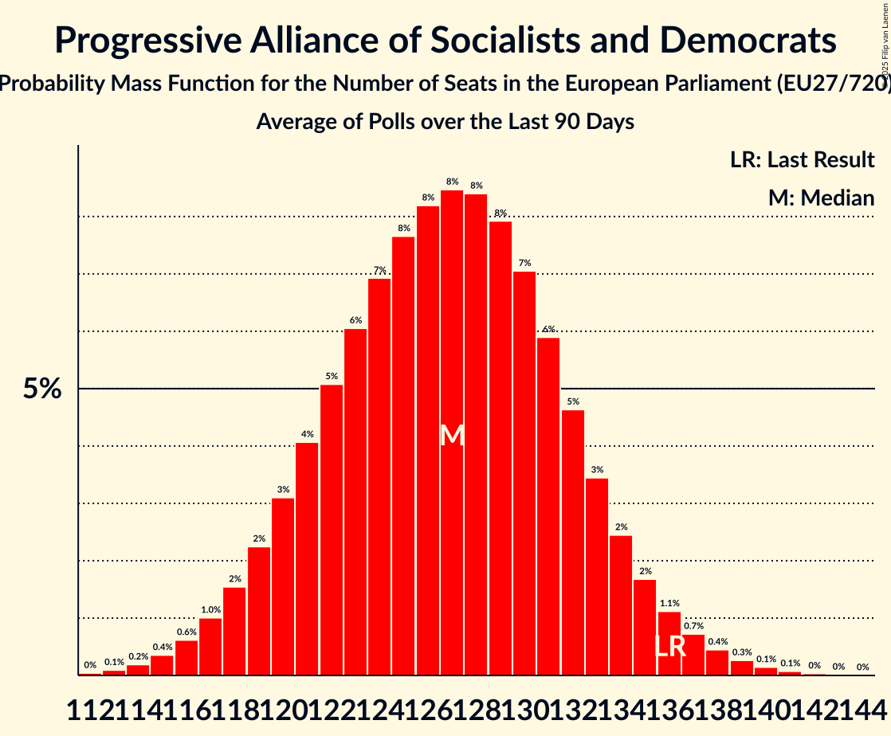

# Seat Projection for the European Parliament

<a href="#seats">Seats</a> | <a href="#voting-intentions">Voting Intentions</a> | <a href="#technical-information">Technical Information</a>

## Seats

### Confidence Intervals

| Party | Last Result | Median | 80% Confidence Interval | 90% Confidence Interval | 95% Confidence Interval | 99% Confidence Interval |
|:-----:|:-----------:|:------:|:-----------------------:|:-----------------------:|:-----------------------:|:-----------------------:|
| <a href="#european-people’s-party">European People’s Party</a> | 217 | 94 | 89–99 |87–100 | 86–101 | 84–104 |
| <a href="#progressive-alliance-of-socialists-and-democrats">Progressive Alliance of Socialists and Democrats</a> | 189 | 61 | 57–65 |56–66 | 56–67 | 54–70 |
| <a href="#europe-of-nations-and-freedom">Europe of Nations and Freedom</a> | 37 | 29 | 26–31 |25–32 | 25–32 | 24–33 |
| <a href="#non-inscrits">Non-Inscrits</a> | 18 | 8 | 4–11 |4–12 | 3–12 | 3–13 |
| <a href="#alliance-of-liberals-and-democrats-for-europe">Alliance of Liberals and Democrats for Europe</a> | 68 | 48 | 45–51 |44–52 | 43–53 | 41–54 |
| <a href="#greens–european-free-alliance">Greens–European Free Alliance</a> | 51 | 19 | 16–21 |16–21 | 15–22 | 14–23 |
| <a href="#european-conservatives-and-reformists">European Conservatives and Reformists</a> | 74 | 32 | 32–33 |31–33 | 31–33 | 28–33 |
| <a href="#european-united-left–nordic-green-left">European United Left–Nordic Green Left</a> | 52 | 30 | 27–33 |27–33 | 26–34 | 25–35 |
| <a href="#europe-of-freedom-and-direct-democracy">Europe of Freedom and Direct Democracy</a> | 45 | 41 | 38–44 |37–45 | 36–45 | 34–46 |

### European People’s Party

*For a full overview of the results for this party, see the [European People’s Party](party-europeanpeople’sparty.html) page.*

| Number of Seats | Probability | Accumulated | Special Marks |
|:---------------:|:-----------:|:-----------:|:-------------:|
| 83 | 0.1% | 100% |  |
| 84 | 0.4% | 99.9% |  |
| 85 | 1.0% | 99.5% |  |
| 86 | 2% | 98% |  |
| 87 | 3% | 97% |  |
| 88 | 4% | 94% |  |
| 89 | 5% | 90% |  |
| 90 | 6% | 85% |  |
| 91 | 8% | 79% |  |
| 92 | 9% | 71% |  |
| 93 | 9% | 62% |  |
| 94 | 10% | 53% | Median |
| 95 | 9% | 43% |  |
| 96 | 8% | 34% |  |
| 97 | 7% | 26% |  |
| 98 | 6% | 18% |  |
| 99 | 5% | 12% |  |
| 100 | 3% | 8% |  |
| 101 | 2% | 4% |  |
| 102 | 1.2% | 2% |  |
| 103 | 0.6% | 1.2% |  |
| 104 | 0.3% | 0.5% |  |
| 105 | 0.1% | 0.2% |  |
| 106 | 0% | 0.1% |  |
| 107 | 0% | 0% |  |
| 108 | 0% | 0% |  |
| 109 | 0% | 0% |  |
| 110 | 0% | 0% |  |
| 111 | 0% | 0% |  |
| 112 | 0% | 0% |  |
| 113 | 0% | 0% |  |
| 114 | 0% | 0% |  |
| 115 | 0% | 0% |  |
| 116 | 0% | 0% |  |
| 117 | 0% | 0% |  |
| 118 | 0% | 0% |  |
| 119 | 0% | 0% |  |
| 120 | 0% | 0% |  |
| 121 | 0% | 0% |  |
| 122 | 0% | 0% |  |
| 123 | 0% | 0% |  |
| 124 | 0% | 0% |  |
| 125 | 0% | 0% |  |
| 126 | 0% | 0% |  |
| 127 | 0% | 0% |  |
| 128 | 0% | 0% |  |
| 129 | 0% | 0% |  |
| 130 | 0% | 0% |  |
| 131 | 0% | 0% |  |
| 132 | 0% | 0% |  |
| 133 | 0% | 0% |  |
| 134 | 0% | 0% |  |
| 135 | 0% | 0% |  |
| 136 | 0% | 0% |  |
| 137 | 0% | 0% |  |
| 138 | 0% | 0% |  |
| 139 | 0% | 0% |  |
| 140 | 0% | 0% |  |
| 141 | 0% | 0% |  |
| 142 | 0% | 0% |  |
| 143 | 0% | 0% |  |
| 144 | 0% | 0% |  |
| 145 | 0% | 0% |  |
| 146 | 0% | 0% |  |
| 147 | 0% | 0% |  |
| 148 | 0% | 0% |  |
| 149 | 0% | 0% |  |
| 150 | 0% | 0% |  |
| 151 | 0% | 0% |  |
| 152 | 0% | 0% |  |
| 153 | 0% | 0% |  |
| 154 | 0% | 0% |  |
| 155 | 0% | 0% |  |
| 156 | 0% | 0% |  |
| 157 | 0% | 0% |  |
| 158 | 0% | 0% |  |
| 159 | 0% | 0% |  |
| 160 | 0% | 0% |  |
| 161 | 0% | 0% |  |
| 162 | 0% | 0% |  |
| 163 | 0% | 0% |  |
| 164 | 0% | 0% |  |
| 165 | 0% | 0% |  |
| 166 | 0% | 0% |  |
| 167 | 0% | 0% |  |
| 168 | 0% | 0% |  |
| 169 | 0% | 0% |  |
| 170 | 0% | 0% |  |
| 171 | 0% | 0% |  |
| 172 | 0% | 0% |  |
| 173 | 0% | 0% |  |
| 174 | 0% | 0% |  |
| 175 | 0% | 0% |  |
| 176 | 0% | 0% |  |
| 177 | 0% | 0% |  |
| 178 | 0% | 0% |  |
| 179 | 0% | 0% |  |
| 180 | 0% | 0% |  |
| 181 | 0% | 0% |  |
| 182 | 0% | 0% |  |
| 183 | 0% | 0% |  |
| 184 | 0% | 0% |  |
| 185 | 0% | 0% |  |
| 186 | 0% | 0% |  |
| 187 | 0% | 0% |  |
| 188 | 0% | 0% |  |
| 189 | 0% | 0% |  |
| 190 | 0% | 0% |  |
| 191 | 0% | 0% |  |
| 192 | 0% | 0% |  |
| 193 | 0% | 0% |  |
| 194 | 0% | 0% |  |
| 195 | 0% | 0% |  |
| 196 | 0% | 0% |  |
| 197 | 0% | 0% |  |
| 198 | 0% | 0% |  |
| 199 | 0% | 0% |  |
| 200 | 0% | 0% |  |
| 201 | 0% | 0% |  |
| 202 | 0% | 0% |  |
| 203 | 0% | 0% |  |
| 204 | 0% | 0% |  |
| 205 | 0% | 0% |  |
| 206 | 0% | 0% |  |
| 207 | 0% | 0% |  |
| 208 | 0% | 0% |  |
| 209 | 0% | 0% |  |
| 210 | 0% | 0% |  |
| 211 | 0% | 0% |  |
| 212 | 0% | 0% |  |
| 213 | 0% | 0% |  |
| 214 | 0% | 0% |  |
| 215 | 0% | 0% |  |
| 216 | 0% | 0% |  |
| 217 | 0% | 0% | Last Result |

### Progressive Alliance of Socialists and Democrats

*For a full overview of the results for this party, see the [Progressive Alliance of Socialists and Democrats](party-progressiveallianceofsocialistsanddemocrats.html) page.*

| Number of Seats | Probability | Accumulated | Special Marks |
|:---------------:|:-----------:|:-----------:|:-------------:|
| 52 | 0.1% | 100% |  |
| 53 | 0.2% | 99.9% |  |
| 54 | 0.6% | 99.6% |  |
| 55 | 1.5% | 99.0% |  |
| 56 | 3% | 98% |  |
| 57 | 5% | 95% |  |
| 58 | 8% | 89% |  |
| 59 | 11% | 81% |  |
| 60 | 12% | 70% |  |
| 61 | 13% | 58% | Median |
| 62 | 13% | 45% |  |
| 63 | 11% | 32% |  |
| 64 | 8% | 21% |  |
| 65 | 6% | 13% |  |
| 66 | 4% | 8% |  |
| 67 | 2% | 4% |  |
| 68 | 1.2% | 2% |  |
| 69 | 0.6% | 1.1% |  |
| 70 | 0.3% | 0.5% |  |
| 71 | 0.1% | 0.2% |  |
| 72 | 0.1% | 0.1% |  |
| 73 | 0% | 0% |  |
| 74 | 0% | 0% |  |
| 75 | 0% | 0% |  |
| 76 | 0% | 0% |  |
| 77 | 0% | 0% |  |
| 78 | 0% | 0% |  |
| 79 | 0% | 0% |  |
| 80 | 0% | 0% |  |
| 81 | 0% | 0% |  |
| 82 | 0% | 0% |  |
| 83 | 0% | 0% |  |
| 84 | 0% | 0% |  |
| 85 | 0% | 0% |  |
| 86 | 0% | 0% |  |
| 87 | 0% | 0% |  |
| 88 | 0% | 0% |  |
| 89 | 0% | 0% |  |
| 90 | 0% | 0% |  |
| 91 | 0% | 0% |  |
| 92 | 0% | 0% |  |
| 93 | 0% | 0% |  |
| 94 | 0% | 0% |  |
| 95 | 0% | 0% |  |
| 96 | 0% | 0% |  |
| 97 | 0% | 0% |  |
| 98 | 0% | 0% |  |
| 99 | 0% | 0% |  |
| 100 | 0% | 0% |  |
| 101 | 0% | 0% |  |
| 102 | 0% | 0% |  |
| 103 | 0% | 0% |  |
| 104 | 0% | 0% |  |
| 105 | 0% | 0% |  |
| 106 | 0% | 0% |  |
| 107 | 0% | 0% |  |
| 108 | 0% | 0% |  |
| 109 | 0% | 0% |  |
| 110 | 0% | 0% |  |
| 111 | 0% | 0% |  |
| 112 | 0% | 0% |  |
| 113 | 0% | 0% |  |
| 114 | 0% | 0% |  |
| 115 | 0% | 0% |  |
| 116 | 0% | 0% |  |
| 117 | 0% | 0% |  |
| 118 | 0% | 0% |  |
| 119 | 0% | 0% |  |
| 120 | 0% | 0% |  |
| 121 | 0% | 0% |  |
| 122 | 0% | 0% |  |
| 123 | 0% | 0% |  |
| 124 | 0% | 0% |  |
| 125 | 0% | 0% |  |
| 126 | 0% | 0% |  |
| 127 | 0% | 0% |  |
| 128 | 0% | 0% |  |
| 129 | 0% | 0% |  |
| 130 | 0% | 0% |  |
| 131 | 0% | 0% |  |
| 132 | 0% | 0% |  |
| 133 | 0% | 0% |  |
| 134 | 0% | 0% |  |
| 135 | 0% | 0% |  |
| 136 | 0% | 0% |  |
| 137 | 0% | 0% |  |
| 138 | 0% | 0% |  |
| 139 | 0% | 0% |  |
| 140 | 0% | 0% |  |
| 141 | 0% | 0% |  |
| 142 | 0% | 0% |  |
| 143 | 0% | 0% |  |
| 144 | 0% | 0% |  |
| 145 | 0% | 0% |  |
| 146 | 0% | 0% |  |
| 147 | 0% | 0% |  |
| 148 | 0% | 0% |  |
| 149 | 0% | 0% |  |
| 150 | 0% | 0% |  |
| 151 | 0% | 0% |  |
| 152 | 0% | 0% |  |
| 153 | 0% | 0% |  |
| 154 | 0% | 0% |  |
| 155 | 0% | 0% |  |
| 156 | 0% | 0% |  |
| 157 | 0% | 0% |  |
| 158 | 0% | 0% |  |
| 159 | 0% | 0% |  |
| 160 | 0% | 0% |  |
| 161 | 0% | 0% |  |
| 162 | 0% | 0% |  |
| 163 | 0% | 0% |  |
| 164 | 0% | 0% |  |
| 165 | 0% | 0% |  |
| 166 | 0% | 0% |  |
| 167 | 0% | 0% |  |
| 168 | 0% | 0% |  |
| 169 | 0% | 0% |  |
| 170 | 0% | 0% |  |
| 171 | 0% | 0% |  |
| 172 | 0% | 0% |  |
| 173 | 0% | 0% |  |
| 174 | 0% | 0% |  |
| 175 | 0% | 0% |  |
| 176 | 0% | 0% |  |
| 177 | 0% | 0% |  |
| 178 | 0% | 0% |  |
| 179 | 0% | 0% |  |
| 180 | 0% | 0% |  |
| 181 | 0% | 0% |  |
| 182 | 0% | 0% |  |
| 183 | 0% | 0% |  |
| 184 | 0% | 0% |  |
| 185 | 0% | 0% |  |
| 186 | 0% | 0% |  |
| 187 | 0% | 0% |  |
| 188 | 0% | 0% |  |
| 189 | 0% | 0% | Last Result |

### Europe of Nations and Freedom

*For a full overview of the results for this party, see the [Europe of Nations and Freedom](party-europeofnationsandfreedom.html) page.*

| Number of Seats | Probability | Accumulated | Special Marks |
|:---------------:|:-----------:|:-----------:|:-------------:|
| 23 | 0.3% | 100% |  |
| 24 | 2% | 99.7% |  |
| 25 | 4% | 98% |  |
| 26 | 10% | 94% |  |
| 27 | 11% | 84% |  |
| 28 | 15% | 73% |  |
| 29 | 22% | 58% | Median |
| 30 | 19% | 36% |  |
| 31 | 11% | 17% |  |
| 32 | 5% | 6% |  |
| 33 | 1.1% | 1.3% |  |
| 34 | 0.1% | 0.1% |  |
| 35 | 0% | 0% |  |
| 36 | 0% | 0% |  |
| 37 | 0% | 0% | Last Result |

### Non-Inscrits

*For a full overview of the results for this party, see the [Non-Inscrits](party-non-inscrits.html) page.*

| Number of Seats | Probability | Accumulated | Special Marks |
|:---------------:|:-----------:|:-----------:|:-------------:|
| 2 | 0.4% | 100% |  |
| 3 | 4% | 99.6% |  |
| 4 | 10% | 96% |  |
| 5 | 7% | 86% |  |
| 6 | 7% | 79% |  |
| 7 | 13% | 72% |  |
| 8 | 20% | 59% | Median |
| 9 | 15% | 39% |  |
| 10 | 12% | 24% |  |
| 11 | 6% | 11% |  |
| 12 | 3% | 5% |  |
| 13 | 2% | 2% |  |
| 14 | 0.2% | 0.3% |  |
| 15 | 0.1% | 0.1% |  |
| 16 | 0% | 0% |  |
| 17 | 0% | 0% |  |
| 18 | 0% | 0% | Last Result |

### Alliance of Liberals and Democrats for Europe

*For a full overview of the results for this party, see the [Alliance of Liberals and Democrats for Europe](party-allianceofliberalsanddemocratsforeurope.html) page.*

| Number of Seats | Probability | Accumulated | Special Marks |
|:---------------:|:-----------:|:-----------:|:-------------:|
| 38 | 0% | 100% |  |
| 39 | 0.1% | 99.9% |  |
| 40 | 0.2% | 99.8% |  |
| 41 | 0.6% | 99.6% |  |
| 42 | 1.2% | 99.0% |  |
| 43 | 3% | 98% |  |
| 44 | 5% | 95% |  |
| 45 | 9% | 90% |  |
| 46 | 11% | 82% |  |
| 47 | 14% | 71% |  |
| 48 | 15% | 57% | Median |
| 49 | 14% | 42% |  |
| 50 | 11% | 28% |  |
| 51 | 8% | 17% |  |
| 52 | 5% | 9% |  |
| 53 | 3% | 4% |  |
| 54 | 1.0% | 1.5% |  |
| 55 | 0.3% | 0.5% |  |
| 56 | 0.1% | 0.2% |  |
| 57 | 0% | 0% |  |
| 58 | 0% | 0% |  |
| 59 | 0% | 0% |  |
| 60 | 0% | 0% |  |
| 61 | 0% | 0% |  |
| 62 | 0% | 0% |  |
| 63 | 0% | 0% |  |
| 64 | 0% | 0% |  |
| 65 | 0% | 0% |  |
| 66 | 0% | 0% |  |
| 67 | 0% | 0% |  |
| 68 | 0% | 0% | Last Result |

### Greens–European Free Alliance

*For a full overview of the results for this party, see the [Greens–European Free Alliance](party-greens–europeanfreealliance.html) page.*

| Number of Seats | Probability | Accumulated | Special Marks |
|:---------------:|:-----------:|:-----------:|:-------------:|
| 13 | 0.1% | 100% |  |
| 14 | 0.6% | 99.9% |  |
| 15 | 3% | 99.3% |  |
| 16 | 8% | 97% |  |
| 17 | 14% | 89% |  |
| 18 | 20% | 74% |  |
| 19 | 22% | 54% | Median |
| 20 | 18% | 33% |  |
| 21 | 10% | 15% |  |
| 22 | 4% | 5% |  |
| 23 | 0.8% | 1.0% |  |
| 24 | 0.1% | 0.1% |  |
| 25 | 0% | 0% |  |
| 26 | 0% | 0% |  |
| 27 | 0% | 0% |  |
| 28 | 0% | 0% |  |
| 29 | 0% | 0% |  |
| 30 | 0% | 0% |  |
| 31 | 0% | 0% |  |
| 32 | 0% | 0% |  |
| 33 | 0% | 0% |  |
| 34 | 0% | 0% |  |
| 35 | 0% | 0% |  |
| 36 | 0% | 0% |  |
| 37 | 0% | 0% |  |
| 38 | 0% | 0% |  |
| 39 | 0% | 0% |  |
| 40 | 0% | 0% |  |
| 41 | 0% | 0% |  |
| 42 | 0% | 0% |  |
| 43 | 0% | 0% |  |
| 44 | 0% | 0% |  |
| 45 | 0% | 0% |  |
| 46 | 0% | 0% |  |
| 47 | 0% | 0% |  |
| 48 | 0% | 0% |  |
| 49 | 0% | 0% |  |
| 50 | 0% | 0% |  |
| 51 | 0% | 0% | Last Result |

### European Conservatives and Reformists

*For a full overview of the results for this party, see the [European Conservatives and Reformists](party-europeanconservativesandreformists.html) page.*

| Number of Seats | Probability | Accumulated | Special Marks |
|:---------------:|:-----------:|:-----------:|:-------------:|
| 27 | 0.1% | 100% |  |
| 28 | 1.2% | 99.9% |  |
| 29 | 0.3% | 98.7% |  |
| 30 | 0.7% | 98% |  |
| 31 | 4% | 98% |  |
| 32 | 77% | 93% | Median |
| 33 | 17% | 17% |  |
| 34 | 0% | 0% |  |
| 35 | 0% | 0% |  |
| 36 | 0% | 0% |  |
| 37 | 0% | 0% |  |
| 38 | 0% | 0% |  |
| 39 | 0% | 0% |  |
| 40 | 0% | 0% |  |
| 41 | 0% | 0% |  |
| 42 | 0% | 0% |  |
| 43 | 0% | 0% |  |
| 44 | 0% | 0% |  |
| 45 | 0% | 0% |  |
| 46 | 0% | 0% |  |
| 47 | 0% | 0% |  |
| 48 | 0% | 0% |  |
| 49 | 0% | 0% |  |
| 50 | 0% | 0% |  |
| 51 | 0% | 0% |  |
| 52 | 0% | 0% |  |
| 53 | 0% | 0% |  |
| 54 | 0% | 0% |  |
| 55 | 0% | 0% |  |
| 56 | 0% | 0% |  |
| 57 | 0% | 0% |  |
| 58 | 0% | 0% |  |
| 59 | 0% | 0% |  |
| 60 | 0% | 0% |  |
| 61 | 0% | 0% |  |
| 62 | 0% | 0% |  |
| 63 | 0% | 0% |  |
| 64 | 0% | 0% |  |
| 65 | 0% | 0% |  |
| 66 | 0% | 0% |  |
| 67 | 0% | 0% |  |
| 68 | 0% | 0% |  |
| 69 | 0% | 0% |  |
| 70 | 0% | 0% |  |
| 71 | 0% | 0% |  |
| 72 | 0% | 0% |  |
| 73 | 0% | 0% |  |
| 74 | 0% | 0% | Last Result |

### European United Left–Nordic Green Left

*For a full overview of the results for this party, see the [European United Left–Nordic Green Left](party-europeanunitedleft–nordicgreenleft.html) page.*

| Number of Seats | Probability | Accumulated | Special Marks |
|:---------------:|:-----------:|:-----------:|:-------------:|
| 24 | 0.2% | 100% |  |
| 25 | 1.0% | 99.8% |  |
| 26 | 3% | 98.8% |  |
| 27 | 6% | 96% |  |
| 28 | 10% | 90% |  |
| 29 | 15% | 79% |  |
| 30 | 18% | 64% | Median |
| 31 | 18% | 46% |  |
| 32 | 15% | 28% |  |
| 33 | 9% | 13% |  |
| 34 | 3% | 4% |  |
| 35 | 0.8% | 1.0% |  |
| 36 | 0.2% | 0.2% |  |
| 37 | 0% | 0% |  |
| 38 | 0% | 0% |  |
| 39 | 0% | 0% |  |
| 40 | 0% | 0% |  |
| 41 | 0% | 0% |  |
| 42 | 0% | 0% |  |
| 43 | 0% | 0% |  |
| 44 | 0% | 0% |  |
| 45 | 0% | 0% |  |
| 46 | 0% | 0% |  |
| 47 | 0% | 0% |  |
| 48 | 0% | 0% |  |
| 49 | 0% | 0% |  |
| 50 | 0% | 0% |  |
| 51 | 0% | 0% |  |
| 52 | 0% | 0% | Last Result |

### Europe of Freedom and Direct Democracy

*For a full overview of the results for this party, see the [Europe of Freedom and Direct Democracy](party-europeoffreedomanddirectdemocracy.html) page.*

| Number of Seats | Probability | Accumulated | Special Marks |
|:---------------:|:-----------:|:-----------:|:-------------:|
| 33 | 0.2% | 100% |  |
| 34 | 0.3% | 99.8% |  |
| 35 | 1.2% | 99.4% |  |
| 36 | 2% | 98% |  |
| 37 | 5% | 96% |  |
| 38 | 7% | 91% |  |
| 39 | 12% | 85% |  |
| 40 | 14% | 73% |  |
| 41 | 19% | 59% | Median |
| 42 | 15% | 40% |  |
| 43 | 13% | 25% |  |
| 44 | 7% | 12% |  |
| 45 | 4% | 5% | Last Result |
| 46 | 1.3% | 2% |  |
| 47 | 0.2% | 0.2% |  |
| 48 | 0.1% | 0.1% |  |
| 49 | 0% | 0% |  |

## Voting Intentions

### Confidence Intervals

| Party | Last Result | Median | 80% Confidence Interval | 90% Confidence Interval | 95% Confidence Interval | 99% Confidence Interval |
|:-----:|:-----------:|:------:|:-----------------------:|:-----------------------:|:-----------------------:|:-----------------------:|
| <a href="#european-people’s-party">European People’s Party</a> | 28.6% | N/A | N/A |N/A | N/A | N/A |
| <a href="#progressive-alliance-of-socialists-and-democrats">Progressive Alliance of Socialists and Democrats</a> | 24.6% | N/A | N/A |N/A | N/A | N/A |
| <a href="#europe-of-nations-and-freedom">Europe of Nations and Freedom</a> | 15.3% | N/A | N/A |N/A | N/A | N/A |
| <a href="#non-inscrits">Non-Inscrits</a> | 15.3% | N/A | N/A |N/A | N/A | N/A |
| <a href="#alliance-of-liberals-and-democrats-for-europe">Alliance of Liberals and Democrats for Europe</a> | 7.9% | N/A | N/A |N/A | N/A | N/A |
| <a href="#greens–european-free-alliance">Greens–European Free Alliance</a> | 6.5% | N/A | N/A |N/A | N/A | N/A |
| <a href="#european-conservatives-and-reformists">European Conservatives and Reformists</a> | 6.0% | N/A | N/A |N/A | N/A | N/A |
| <a href="#european-united-left–nordic-green-left">European United Left–Nordic Green Left</a> | 6.0% | N/A | N/A |N/A | N/A | N/A |
| <a href="#europe-of-freedom-and-direct-democracy">Europe of Freedom and Direct Democracy</a> | 5.1% | N/A | N/A |N/A | N/A | N/A |

## Technical Information

The seat and voting intentions projection for the European Parliament presented on this page was based on the averages of the most recent polls for the following countries:

| Country                                                                 | No of Seats¹         | No of Constituencies   | Method                      | Threshold |
|:------------------------------------------------------------------------|:--------------------:|:----------------------:|:---------------------------:|:---------:|
| Belgium: [Flanders](https://filipvanlaenen.github.io/flemish_ep_polls/) | 12                   | 1                      | D'Hondt                    | No        |
| Germany                                                                 | 96                   | 1                      | Sainte-Laguë                | No        |
| France²                                                                 | 74                   | <strike>10</strike> 1² | D'Hondt²                   | <strike>5%</strike> No² |
| [Hungary](https://filipvanlaenen.github.io/hungarian_ep_polls/)         | 21                   | 1                      | D'Hondt                    | No        |
| Italy                                                                   | 73                   | 1                      | Hare-Niemeyer               | 4%        |
| Poland                                                                  | 51                   | 1                      | D'Hondt                    | 5%        |
| Romania                                                                 | 32                   | 1                      | D'Hondt                    | 5%        |
| Spain                                                                   | 54                   | 1                      | D'Hondt                    | No        |
| **Total**                                                               | **413 / 751 (55%)**  |                        |                             |           |

¹ This table doesn't take into account the redistribution of seats planned for the 2019 European election.

² France has changed its electoral system since the last election; current assumption is that it will use the D'Hondt method without a threshold.

The following countries haven't been included yet:

| Country                                                                 | No of Seats¹         | No of Constituencies   | Method                      | Threshold |
|:------------------------------------------------------------------------|:--------------------:|:----------------------:|:---------------------------:|:---------:|
| Austria                                                                 | 18                   | 1                      | D'Hondt                    | 4%        |
| Belgium: French-speaking constituency                                   | 8                    | 1                      | D'Hondt                    | No        |
| Belgium: German-speaking constituency                                   | 1                    | 1                      | D'Hondt                    | No        |
| Bulgaria                                                                | 17                   | 1                      | Hare-Niemeyer               | 5%        |
| Croatia                                                                 | 11                   |                        |                             |           |
| Cyprus                                                                  | 6                    |                        |                             |           |
| Czech Republic                                                          | 21                   | 1                      | D'Hondt                    | 5%        |
| Denmark                                                                 | 13                   |                        |                             |           |
| Estonia                                                                 | 6                    |                        |                             |           |
| Finland                                                                 | 13                   | 1                      | D'Hondt                    | No        |
| Greece                                                                  | 21                   | 1                      | Droop                       | 3%        |
| Ireland                                                                 | 11                   | 3                      | Single transferable vote    | N/A       |
| Latvia                                                                  | 8                    |                        |                             |           |
| Lithuania                                                               | 11                   |                        |                             |           |
| Luxembourg                                                              | 6                    | 1                      | Hagenbach-Bischoff/D'Hondt | No        |
| Malta                                                                   | 6                    |                        |                             |           |
| The Netherlands                                                         | 26                   | 1                      | D'Hondt                    | No        |
| Portugal                                                                | 21                   | 1                      | D'Hondt                    | No        |
| Slovakia                                                                | 13                   | 1                      | Hagenbach-Bischoff/D'Hondt | 5%        |
| Slovenia                                                                | 8                    |                        |                             |           |
| Sweden                                                                  | 20                   | 1                      | Modified Sainte-Laguë       | 4%        |
| <strike>United Kingdom</strike>²                                        | <strike>73</strike>³ |                        |                             |           |
| **Total**                                                               | **<strike>338 / 751</strike> 261 / 678** |    |                             |           |

¹ This table doesn't take into account the redistribution of seats planned for the 2019 European election³.

³ The United Kingdom is set to leave the European Union before the next European election.
