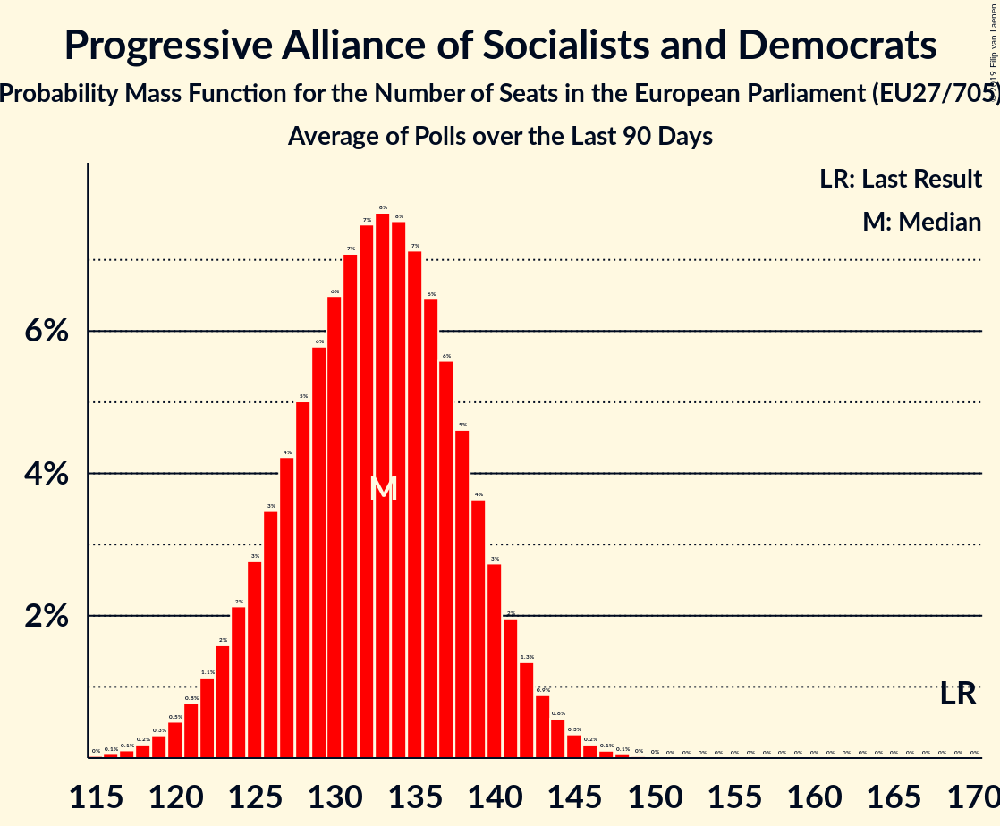

# Progressive Alliance of Socialists and Democrats

## Seats

Last result: **169** seats (General Election of 25 May 2014)

### Confidence Intervals

| Party | Last Result | Median | 80% Confidence Interval | 90% Confidence Interval | 95% Confidence Interval | 99% Confidence Interval |
|:-----:|:-----------:|:------:|:-----------------------:|:-----------------------:|:-----------------------:|:-----------------------:|
| Progressive Alliance of Socialists and Democrats | 169 | 133 | 126–140 | 124–141 | 123–143 | 119–146 |
| Partido Socialista Obrero Español (S&D) | | 17 | 15–19 | 14–19 | 14–20 | 13–20 |
| SPD (S&D) | | 17 | 15–19 | 15–19 | 14–20 | 13–20 |
| Partito Democratico (S&D) | | 16 | 14–18 | 13–18 | 13–19 | 12–19 |
| Partidul Social Democrat (S&D) | | 10 | 8–11 | 8–12 | 8–12 | 7–13 |
| Partido Socialista (S&D) | | 9 | 8–9 | 7–10 | 7–10 | 7–10 |
| Българска социалистическа партия (S&D) | | 7 | 6–8 | 5–8 | 5–8 | 5–8 |
| Parti socialiste (S&D) | | 6 | 0–7 | 0–7 | 0–7 | 0–8 |
| Sveriges socialdemokratiska arbetareparti (S&D) | | 6 | 5–6 | 5–6 | 5–6 | 5–7 |
| Socialdemokraterne (S&D) | | 5 | 4–5 | 4–6 | 4–6 | 4–6 |
| Sozialdemokratische Partei Österreichs (S&D) | | 5 | 5–6 | 5–6 | 4–6 | 4–6 |
| Partit Laburista (S&D) | | 4 | 4 | 3–4 | 3–4 | 3–4 |
| Suomen Sosialidemokraattinen Puolue (S&D) | | 4 | 3–4 | 3–4 | 3–4 | 3–4 |
| Wiosna–Partia Razem (S&D) | | 4 | 2–6 | 0–7 | 0–7 | 0–7 |
| MSZP–Párbeszéd (S&D) | | 3 | 2–3 | 2–3 | 2–4 | 2–4 |
| SMER–sociálna demokracia (S&D) | | 3 | 3–4 | 3–4 | 3–4 | 3–4 |
| Socijaldemokratska partija Hrvatske (S&D) | | 3 | 3 | 2–3 | 2–3 | 2–4 |
| PS (S&D) | | 2 | 2 | 2 | 2–3 | 2–3 |
| Partij van de Arbeid (S&D) | | 2 | 2–3 | 2–3 | 2–3 | 1–3 |
| Sociāldemokrātiskā Partija “Saskaņa” (S&D) | | 2 | 1–2 | 1–2 | 1–3 | 1–3 |
| Κίνημα Αλλαγής (S&D) | | 2 | 1–2 | 1–2 | 1–2 | 1–3 |
| DK (S&D) | | 1 | 1–2 | 1–2 | 1–2 | 1–2 |
| Lietuvos socialdemokratų partija (S&D) | | 1 | 1 | 1–2 | 1–2 | 1–2 |
| Lëtzebuerger Sozialistesch Aarbechterpartei (S&D) | | 1 | 1 | 1 | 1 | 1 |
| Socialni demokrati (S&D) | | 1 | 0–1 | 0–1 | 0–1 | 0–1 |
| Sotsiaaldemokraatlik Erakond (S&D) | | 1 | 0–1 | 0–1 | 0–1 | 0–1 |
| sp.a (S&D) | | 1 | 1 | 1–2 | 1–2 | 1–2 |
| Česká strana sociálně demokratická (S&D) | | 1 | 1–3 | 1–3 | 0–3 | 0–3 |
| Δημοκρατικό Κόμμα (S&D) | | 1 | 1 | 1 | 1 | 1 |
| Génération·s, le mouvement (S&D) | | 0 | 0 | 0–5 | 0–5 | 0–6 |
| Labour Party (S&D) | | 0 | 0 | 0 | 0 | 0 |
| Liberi e Uguali (S&D) | | 0 | 0 | 0 | 0–3 | 0–4 |
| Lietuvos socialdemokratų darbo partija (S&D) | | 0 | 0–1 | 0–1 | 0–1 | 0–1 |
| Progresīvie (S&D) | | 0 | 0–1 | 0–1 | 0–1 | 0–1 |
| Κίνημα Σοσιαλδημοκρατών (S&D) | | 0 | 0–1 | 0–1 | 0–1 | 0–1 |
| Το Ποτάμι (S&D) | | 0 | 0 | 0 | 0 | 0–1 |

### Probability Mass Function

The following table shows the probability mass function per seat for the [poll average](average-2019-03-31.html) for Progressive Alliance of Socialists and Democrats.

| Number of Seats | Probability | Accumulated | Special Marks |
|:---------------:|:-----------:|:-----------:|:-------------:|
| 116 | 0% | 100% |  |
| 117 | 0.1% | 99.9% |  |
| 118 | 0.1% | 99.9% |  |
| 119 | 0.2% | 99.7% |  |
| 120 | 0.4% | 99.5% |  |
| 121 | 0.6% | 99.1% |  |
| 122 | 0.9% | 98% |  |
| 123 | 1.3% | 98% |  |
| 124 | 2% | 96% |  |
| 125 | 2% | 95% |  |
| 126 | 3% | 92% |  |
| 127 | 4% | 89% |  |
| 128 | 5% | 85% |  |
| 129 | 5% | 81% |  |
| 130 | 6% | 76% |  |
| 131 | 7% | 70% |  |
| 132 | 7% | 63% |  |
| 133 | 8% | 56% | Median |
| 134 | 8% | 48% |  |
| 135 | 7% | 40% |  |
| 136 | 7% | 33% |  |
| 137 | 6% | 26% |  |
| 138 | 5% | 20% |  |
| 139 | 4% | 15% |  |
| 140 | 3% | 10% |  |
| 141 | 2% | 7% |  |
| 142 | 2% | 5% |  |
| 143 | 1.2% | 3% |  |
| 144 | 0.8% | 2% |  |
| 145 | 0.5% | 1.1% |  |
| 146 | 0.3% | 0.6% |  |
| 147 | 0.2% | 0.3% |  |
| 148 | 0.1% | 0.2% |  |
| 149 | 0% | 0.1% |  |
| 150 | 0% | 0% |  |
| 151 | 0% | 0% |  |
| 152 | 0% | 0% |  |
| 153 | 0% | 0% |  |
| 154 | 0% | 0% |  |
| 155 | 0% | 0% |  |
| 156 | 0% | 0% |  |
| 157 | 0% | 0% |  |
| 158 | 0% | 0% |  |
| 159 | 0% | 0% |  |
| 160 | 0% | 0% |  |
| 161 | 0% | 0% |  |
| 162 | 0% | 0% |  |
| 163 | 0% | 0% |  |
| 164 | 0% | 0% |  |
| 165 | 0% | 0% |  |
| 166 | 0% | 0% |  |
| 167 | 0% | 0% |  |
| 168 | 0% | 0% |  |
| 169 | 0% | 0% | Last Result |

