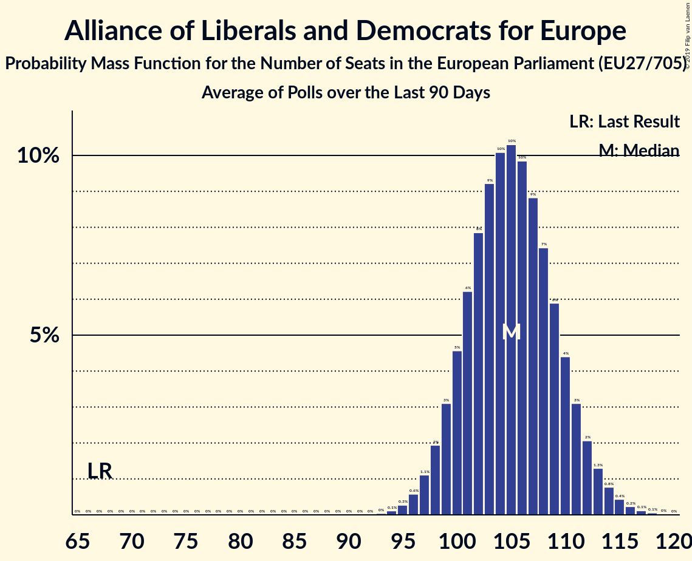

# Alliance of Liberals and Democrats for Europe

## Seats

Last result: **67** seats (General Election of 25 May 2014)

### Confidence Intervals

| Party | Last Result | Median | 80% Confidence Interval | 90% Confidence Interval | 95% Confidence Interval | 99% Confidence Interval |
|:-----:|:-----------:|:------:|:-----------------------:|:-----------------------:|:-----------------------:|:-----------------------:|
| Alliance of Liberals and Democrats for Europe | 67 | 105 | 100–110 | 99–112 | 98–113 | 95–116 |
| La République en marche–Mouvement démocrate (ALDE) | | 23 | 20–24 | 20–25 | 19–26 | 19–29 |
| Ciudadanos–Partido de la Ciudadanía (ALDE) | | 10 | 8–11 | 8–12 | 7–12 | 7–12 |
| ANO 2011 (ALDE) | | 8 | 7–8 | 7–8 | 7–9 | 6–9 |
| FDP (ALDE) | | 8 | 7–10 | 6–10 | 6–11 | 5–11 |
| Uniunea Salvați România–Partidul Libertății, Unității și Solidarității (ALDE) | | 5 | 4–6 | 3–7 | 3–7 | 3–7 |
| Volkspartij voor Vrijheid en Democratie (ALDE) | | 5 | 5–6 | 5–6 | 5–6 | 4–7 |
| Fianna Fáil (ALDE) | | 4 | 4 | 4 | 4 | 3–5 |
| Partidul Alianța Liberalilor și Democraților (ALDE) | | 4 | 3–5 | 2–5 | 2–5 | 2–5 |
| Lista Marjana Šarca (ALDE) | | 3 | 2–4 | 2–4 | 2–4 | 2–5 |
| PRO România (ALDE) | | 3 | 3–4 | 3–4 | 3–4 | 2–5 |
| Venstre (ALDE) | | 3 | 3 | 3–4 | 3–4 | 2–4 |
| Centerpartiet (ALDE) | | 2 | 1–2 | 1–2 | 1–2 | 1–2 |
| Democraten 66 (ALDE) | | 2 | 2–3 | 2–3 | 2–3 | 2–3 |
| Eesti Keskerakond (ALDE) | | 2 | 2–3 | 1–3 | 1–3 | 1–3 |
| Eesti Reformierakond (ALDE) | | 2 | 2–3 | 2–3 | 2–3 | 2–3 |
| MR (ALDE) | | 2 | 2 | 2 | 2 | 1–2 |
| Open Vld (ALDE) | | 2 | 1–2 | 1–2 | 1–2 | 1–3 |
| Suomen Keskusta (ALDE) | | 2 | 2–3 | 2–3 | 2–3 | 2–3 |
| Движение за права и свободи (ALDE) | | 2 | 2–3 | 2–3 | 2–3 | 2–3 |
| Amsterdamska koalicija (ALDE) | | 1 | 0–2 | 0–2 | 0–2 | 0–2 |
| Attīstībai/Par! (ALDE) | | 1 | 1 | 1 | 1 | 1 |
| Coalición por Europa (ALDE) | | 1 | 1–2 | 1–2 | 1–2 | 0–3 |
| Darbo Partija (ALDE) | | 1 | 1 | 1 | 1 | 1–2 |
| Demokratesch Partei (ALDE) | | 1 | 1 | 1 | 1 | 1 |
| FREIE WÄHLER (ALDE) | | 1 | 1–2 | 1–2 | 1–2 | 0–2 |
| MM (ALDE) | | 1 | 0–1 | 0–1 | 0–1 | 0–1 |
| NEOS–Das Neue Österreich und Liberales Forum (ALDE) | | 1 | 1–2 | 1–2 | 1–2 | 1–2 |
| Progresívne Slovensko–SPOLU–Občianska Demokracia (ALDE) | | 1 | 1–2 | 1–2 | 1–2 | 1–3 |
| Radikale Venstre (ALDE) | | 1 | 1 | 1 | 1 | 0–1 |
| Agir, la droite constructive–Union des démocrates et indépendants (ALDE) | | 0 | 0 | 0 | 0 | 0 |
| Demokratična stranka upokojencev Slovenije (ALDE) | | 0 | 0 | 0 | 0 | 0 |
| DéFI (ALDE) | | 0 | 0 | 0 | 0 | 0 |
| Eesti 200 (ALDE) | | 0 | 0 | 0–1 | 0–1 | 0–1 |
| Hrvatska narodna stranka–liberalni demokrati (ALDE) | | 0 | 0 | 0 | 0 | 0 |
| Liberal Alliance (ALDE) | | 0 | 0–1 | 0–1 | 0–1 | 0–1 |
| Liberalerna (ALDE) | | 0 | 0–1 | 0–1 | 0–1 | 0–1 |
| Liberalų Sąjūdis (ALDE) | | 0 | 0–1 | 0–1 | 0–1 | 0–1 |
| Partit Demokratiku (ALDE) | | 0 | 0 | 0 | 0 | 0 |
| Più Europa (ALDE) | | 0 | 0 | 0–3 | 0–4 | 0–4 |
| Stranka Alenke Bratušek (ALDE) | | 0 | 0 | 0 | 0 | 0 |
| Stranka modernega centra (ALDE) | | 0 | 0 | 0 | 0 | 0 |
| Svenska folkpartiet i Finland (ALDE) | | 0 | 0 | 0–1 | 0–1 | 0–1 |
| Ένωση Κεντρώων (ALDE) | | 0 | 0–1 | 0–1 | 0–1 | 0–1 |

### Probability Mass Function

The following table shows the probability mass function per seat for the [poll average](average-2019-04-09.html) for Alliance of Liberals and Democrats for Europe.

| Number of Seats | Probability | Accumulated | Special Marks |
|:---------------:|:-----------:|:-----------:|:-------------:|
| 67 | 0% | 100% | Last Result |
| 68 | 0% | 100% |  |
| 69 | 0% | 100% |  |
| 70 | 0% | 100% |  |
| 71 | 0% | 100% |  |
| 72 | 0% | 100% |  |
| 73 | 0% | 100% |  |
| 74 | 0% | 100% |  |
| 75 | 0% | 100% |  |
| 76 | 0% | 100% |  |
| 77 | 0% | 100% |  |
| 78 | 0% | 100% |  |
| 79 | 0% | 100% |  |
| 80 | 0% | 100% |  |
| 81 | 0% | 100% |  |
| 82 | 0% | 100% |  |
| 83 | 0% | 100% |  |
| 84 | 0% | 100% |  |
| 85 | 0% | 100% |  |
| 86 | 0% | 100% |  |
| 87 | 0% | 100% |  |
| 88 | 0% | 100% |  |
| 89 | 0% | 100% |  |
| 90 | 0% | 100% |  |
| 91 | 0% | 100% |  |
| 92 | 0% | 100% |  |
| 93 | 0.1% | 100% |  |
| 94 | 0.1% | 99.9% |  |
| 95 | 0.3% | 99.8% |  |
| 96 | 0.6% | 99.5% |  |
| 97 | 1.2% | 98.8% |  |
| 98 | 2% | 98% |  |
| 99 | 3% | 96% |  |
| 100 | 5% | 92% |  |
| 101 | 6% | 88% |  |
| 102 | 8% | 81% |  |
| 103 | 9% | 73% |  |
| 104 | 10% | 64% |  |
| 105 | 10% | 54% | Median |
| 106 | 10% | 44% |  |
| 107 | 9% | 35% |  |
| 108 | 7% | 26% |  |
| 109 | 6% | 19% |  |
| 110 | 4% | 13% |  |
| 111 | 3% | 8% |  |
| 112 | 2% | 5% |  |
| 113 | 1.3% | 3% |  |
| 114 | 0.8% | 2% |  |
| 115 | 0.5% | 1.0% |  |
| 116 | 0.3% | 0.5% |  |
| 117 | 0.1% | 0.3% |  |
| 118 | 0.1% | 0.1% |  |
| 119 | 0% | 0.1% |  |
| 120 | 0% | 0% |  |

