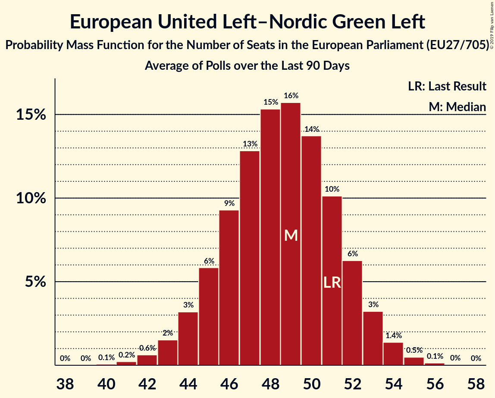

# European United Left–Nordic Green Left

## Seats

Last result: **51** seats (General Election of 25 May 2014)

### Confidence Intervals

| Party | Last Result | Median | 80% Confidence Interval | 90% Confidence Interval | 95% Confidence Interval | 99% Confidence Interval |
|:-----:|:-----------:|:------:|:-----------------------:|:-----------------------:|:-----------------------:|:-----------------------:|
| European United Left–Nordic Green Left | 51 | 48 | 45–52 | 44–53 | 43–53 | 42–55 |
| DIE LINKE (GUE/NGL) | | 8 | 6–9 | 6–9 | 5–9 | 5–10 |
| La France insoumise (GUE/NGL) | | 8 | 6–10 | 6–10 | 6–10 | 5–10 |
| Unidos Podemos (GUE/NGL) | | 8 | 6–9 | 6–9 | 6–9 | 5–10 |
| Συνασπισμός Ριζοσπαστικής Αριστεράς (GUE/NGL) | | 5 | 5–6 | 5–6 | 5–6 | 5–7 |
| Sinn Féin (GUE/NGL) | | 4 | 1–4 | 1–4 | 1–4 | 1–4 |
| Bloco de Esquerda (GUE/NGL) | | 2 | 1–2 | 1–2 | 1–2 | 1–2 |
| Socialistische Partij (GUE/NGL) | | 2 | 2–3 | 2–3 | 2–3 | 1–4 |
| Vänsterpartiet (GUE/NGL) | | 2 | 2 | 2 | 2–3 | 1–3 |
| Ανορθωτικό Κόμμα Εργαζόμενου Λαού (GUE/NGL) | | 2 | 1–2 | 1–2 | 1–2 | 1–2 |
| Coligação Democrática Unitária (GUE/NGL) | | 1 | 1–2 | 1–2 | 1–2 | 1–3 |
| Enhedslisten–De Rød-Grønne (GUE/NGL) | | 1 | 1–2 | 1–2 | 1–2 | 1–2 |
| Komunistická strana Čech a Moravy (GUE/NGL) | | 1 | 1–2 | 1–2 | 1–2 | 0–2 |
| Levica (GUE/NGL) | | 1 | 0–1 | 0–1 | 0–1 | 0–1 |
| PTB (GUE/NGL) | | 1 | 1 | 1 | 1 | 1 |
| Partei Mensch Umwelt Tierschutz (GUE/NGL) | | 1 | 0–1 | 0–2 | 0–2 | 0–2 |
| Partij voor de Dieren (GUE/NGL) | | 1 | 1–2 | 1–2 | 0–2 | 0–2 |
| Vasemmistoliitto (GUE/NGL) | | 1 | 1–2 | 1–2 | 1–2 | 1–2 |
| Nouveau Parti anticapitaliste (GUE/NGL) | | 0 | 0 | 0 | 0 | 0 |
| PVDA (GUE/NGL) | | 0 | 0 | 0 | 0 | 0–1 |
| Parti communiste français (GUE/NGL) | | 0 | 0 | 0 | 0 | 0 |
| Partido Animalista Contra el Maltrato Animal (GUE/NGL) | | 0 | 0–2 | 0–2 | 0–2 | 0–2 |
| Potere al Popolo (GUE/NGL) | | 0 | 0 | 0 | 0 | 0 |
| Solidarity–People Before Profit (GUE/NGL) | | 0 | 0–1 | 0–1 | 0–1 | 0–1 |
| Λαϊκή Ενότητα (GUE/NGL) | | 0 | 0 | 0–1 | 0–1 | 0–1 |
| Πλεύση Ελευθερίας (GUE/NGL) | | 0 | 0 | 0 | 0 | 0 |

### Probability Mass Function

The following table shows the probability mass function per seat for the [poll average](average-2019-04-09.html) for European United Left–Nordic Green Left.

| Number of Seats | Probability | Accumulated | Special Marks |
|:---------------:|:-----------:|:-----------:|:-------------:|
| 40 | 0.1% | 100% |  |
| 41 | 0.3% | 99.9% |  |
| 42 | 0.8% | 99.6% |  |
| 43 | 2% | 98.8% |  |
| 44 | 4% | 97% |  |
| 45 | 7% | 93% |  |
| 46 | 10% | 87% |  |
| 47 | 13% | 77% |  |
| 48 | 15% | 64% | Median |
| 49 | 15% | 49% |  |
| 50 | 13% | 34% |  |
| 51 | 9% | 21% | Last Result |
| 52 | 6% | 12% |  |
| 53 | 3% | 6% |  |
| 54 | 2% | 2% |  |
| 55 | 0.6% | 0.8% |  |
| 56 | 0.2% | 0.2% |  |
| 57 | 0% | 0.1% |  |
| 58 | 0% | 0% |  |

