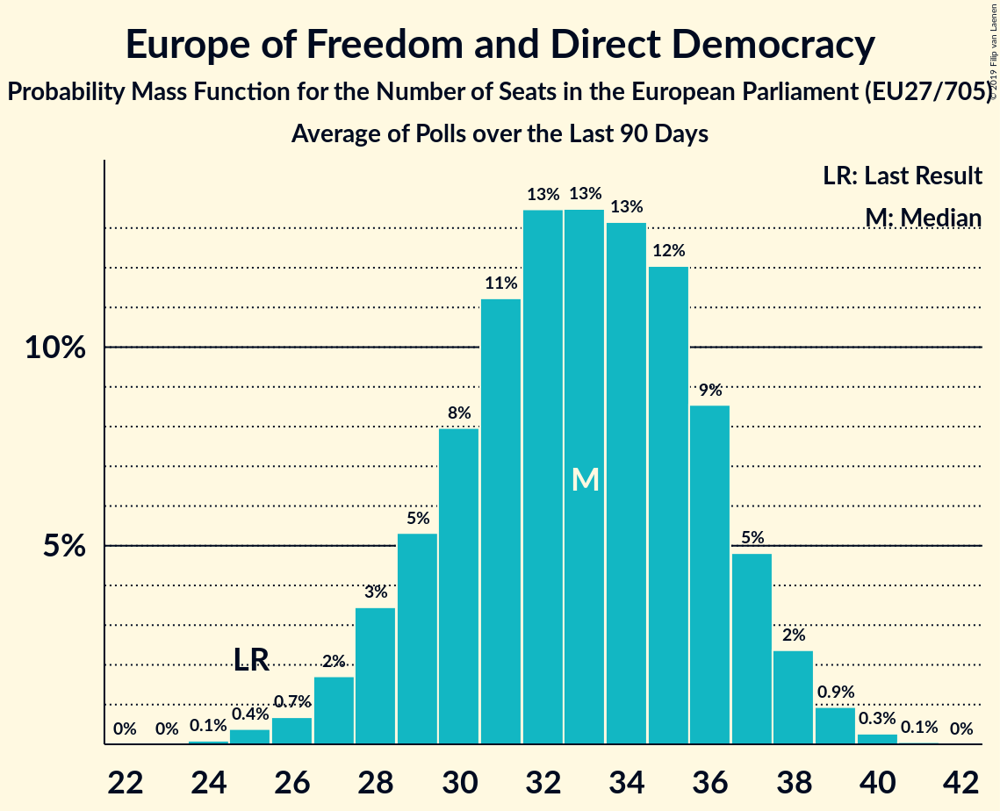

# Europe of Freedom and Direct Democracy

## Seats

Last result: **25** seats (General Election of 25 May 2014)

### Confidence Intervals

| Party | Last Result | Median | 80% Confidence Interval | 90% Confidence Interval | 95% Confidence Interval | 99% Confidence Interval |
|:-----:|:-----------:|:------:|:-----------------------:|:-----------------------:|:-----------------------:|:-----------------------:|
| Europe of Freedom and Direct Democracy | 25 | 33 | 29–36 | 28–37 | 28–38 | 26–39 |
| Movimento 5 Stelle (EFDD) | | 18 | 15–20 | 14–21 | 14–21 | 13–21 |
| Alternative für Deutschland (EFDD) | | 11 | 10–13 | 9–13 | 9–13 | 8–14 |
| Kukiz’15 (EFDD) | | 3 | 0–4 | 0–4 | 0–4 | 0–5 |
| Partija tvarka ir teisingumas (EFDD) | | 1 | 0–1 | 0–1 | 0–1 | 0–2 |
| Živi zid (EFDD) | | 1 | 1–2 | 1–2 | 1–2 | 1–2 |
| KORWiN (EFDD) | | 0 | 0 | 0 | 0 | 0 |
| Les Patriotes (EFDD) | | 0 | 0 | 0 | 0 | 0 |
| Parti Populaire (EFDD) | | 0 | 0 | 0 | 0 | 0 |
| Strana svobodných občanů (EFDD) | | 0 | 0 | 0 | 0 | 0 |

### Probability Mass Function

The following table shows the probability mass function per seat for the [poll average](average-2019-04-09.html) for Europe of Freedom and Direct Democracy.

| Number of Seats | Probability | Accumulated | Special Marks |
|:---------------:|:-----------:|:-----------:|:-------------:|
| 24 | 0.1% | 100% |  |
| 25 | 0.2% | 99.9% | Last Result |
| 26 | 0.7% | 99.7% |  |
| 27 | 1.5% | 99.1% |  |
| 28 | 3% | 98% |  |
| 29 | 5% | 95% |  |
| 30 | 8% | 90% |  |
| 31 | 11% | 82% |  |
| 32 | 13% | 71% |  |
| 33 | 14% | 57% | Median |
| 34 | 14% | 43% |  |
| 35 | 12% | 30% |  |
| 36 | 9% | 17% |  |
| 37 | 5% | 9% |  |
| 38 | 2% | 4% |  |
| 39 | 0.9% | 1.3% |  |
| 40 | 0.3% | 0.3% |  |
| 41 | 0.1% | 0.1% |  |
| 42 | 0% | 0% |  |

