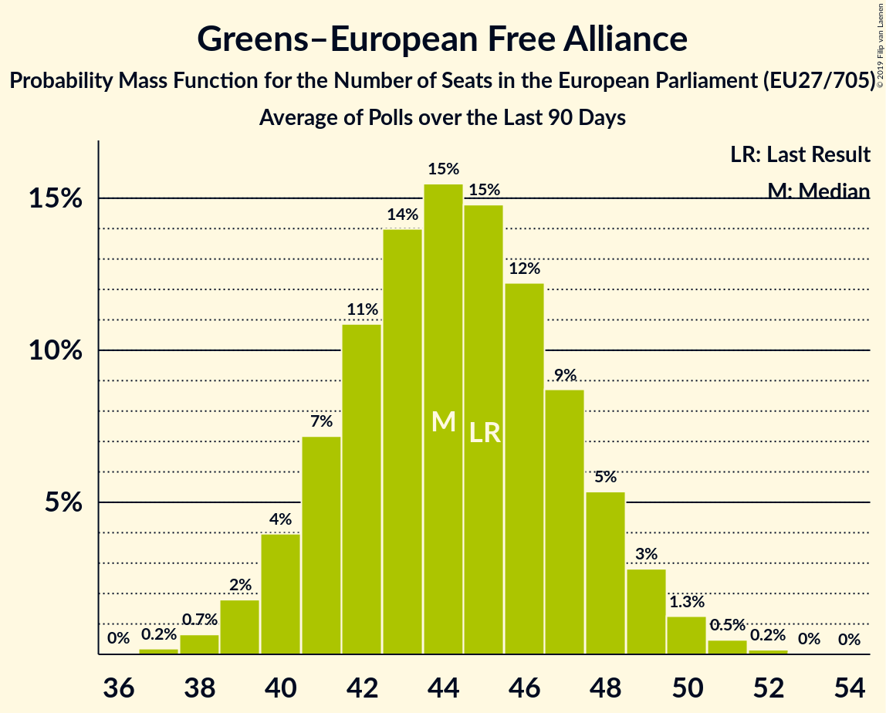

# Greens–European Free Alliance

## Seats

Last result: **45** seats (General Election of 25 May 2014)

### Confidence Intervals

| Party | Last Result | Median | 80% Confidence Interval | 90% Confidence Interval | 95% Confidence Interval | 99% Confidence Interval |
|:-----:|:-----------:|:------:|:-----------------------:|:-----------------------:|:-----------------------:|:-----------------------:|
| Greens–European Free Alliance | 45 | 45 | 41–48 | 40–49 | 40–50 | 38–51 |
| BÜNDNIS 90/DIE GRÜNEN (Greens/EFA) | | 17 | 16–19 | 16–20 | 16–20 | 15–21 |
| Europe Écologie Les Verts (Greens/EFA) | | 7 | 5–8 | 5–9 | 5–10 | 5–10 |
| GroenLinks (Greens/EFA) | | 4 | 3–4 | 3–4 | 3–4 | 3–4 |
| Lietuvos valstiečių ir žaliųjų sąjunga (Greens/EFA) | | 3 | 2–3 | 2–3 | 2–3 | 2–3 |
| Ahora Repúblicas (Greens/EFA) | | 2 | 1–3 | 1–3 | 1–3 | 1–4 |
| Ecolo (Greens/EFA) | | 2 | 2 | 2 | 2 | 1–2 |
| Groen (Greens/EFA) | | 2 | 2 | 2 | 2 | 1–3 |
| Vihreä liitto (Greens/EFA) | | 2 | 2 | 2 | 2–3 | 2–3 |
| Die Grünen–Die Grüne Alternative (Greens/EFA) | | 1 | 1–2 | 1–2 | 0–2 | 0–2 |
| Miljöpartiet de gröna (Greens/EFA) | | 1 | 0–2 | 0–2 | 0–2 | 0–2 |
| Socialistisk Folkeparti (Greens/EFA) | | 1 | 1 | 1 | 0–1 | 0–1 |
| Zaļo un Zemnieku savienība (Greens/EFA) | | 1 | 1 | 1 | 1 | 1–2 |
| déi gréng (Greens/EFA) | | 1 | 1 | 1 | 1 | 1 |
| Alternativet (Greens/EFA) | | 0 | 0 | 0 | 0–1 | 0–1 |
| Alternattiva Demokratika (Greens/EFA) | | 0 | 0 | 0 | 0 | 0 |
| Erakond Eestimaa Rohelised (Greens/EFA) | | 0 | 0 | 0 | 0 | 0 |
| Green Party (Greens/EFA) | | 0 | 0 | 0 | 0 | 0–1 |
| JETZT–Liste Pilz (Greens/EFA) | | 0 | 0 | 0 | 0 | 0 |
| LMP (Greens/EFA) | | 0 | 0–1 | 0–1 | 0–1 | 0–1 |
| Latvijas Krievu savienība (Greens/EFA) | | 0 | 0–1 | 0–1 | 0–1 | 0–1 |
| Pessoas–Animais–Natureza (Greens/EFA) | | 0 | 0 | 0 | 0–1 | 0–1 |
| Primavera Europea (Greens/EFA) | | 0 | 0–1 | 0–1 | 0–1 | 0–1 |
| Κίνημα Οικολόγων—Συνεργασία Πολιτών (Greens/EFA) | | 0 | 0 | 0 | 0 | 0 |

### Probability Mass Function

The following table shows the probability mass function per seat for the [poll average](average-2019-04-09.html) for Greens–European Free Alliance.

| Number of Seats | Probability | Accumulated | Special Marks |
|:---------------:|:-----------:|:-----------:|:-------------:|
| 36 | 0% | 100% |  |
| 37 | 0.2% | 99.9% |  |
| 38 | 0.5% | 99.8% |  |
| 39 | 1.5% | 99.3% |  |
| 40 | 3% | 98% |  |
| 41 | 6% | 94% |  |
| 42 | 10% | 88% |  |
| 43 | 13% | 78% |  |
| 44 | 15% | 66% |  |
| 45 | 15% | 51% | Last Result, Median |
| 46 | 13% | 36% |  |
| 47 | 10% | 23% |  |
| 48 | 6% | 13% |  |
| 49 | 4% | 7% |  |
| 50 | 2% | 3% |  |
| 51 | 0.7% | 1.1% |  |
| 52 | 0.3% | 0.4% |  |
| 53 | 0.1% | 0.1% |  |
| 54 | 0% | 0% |  |

