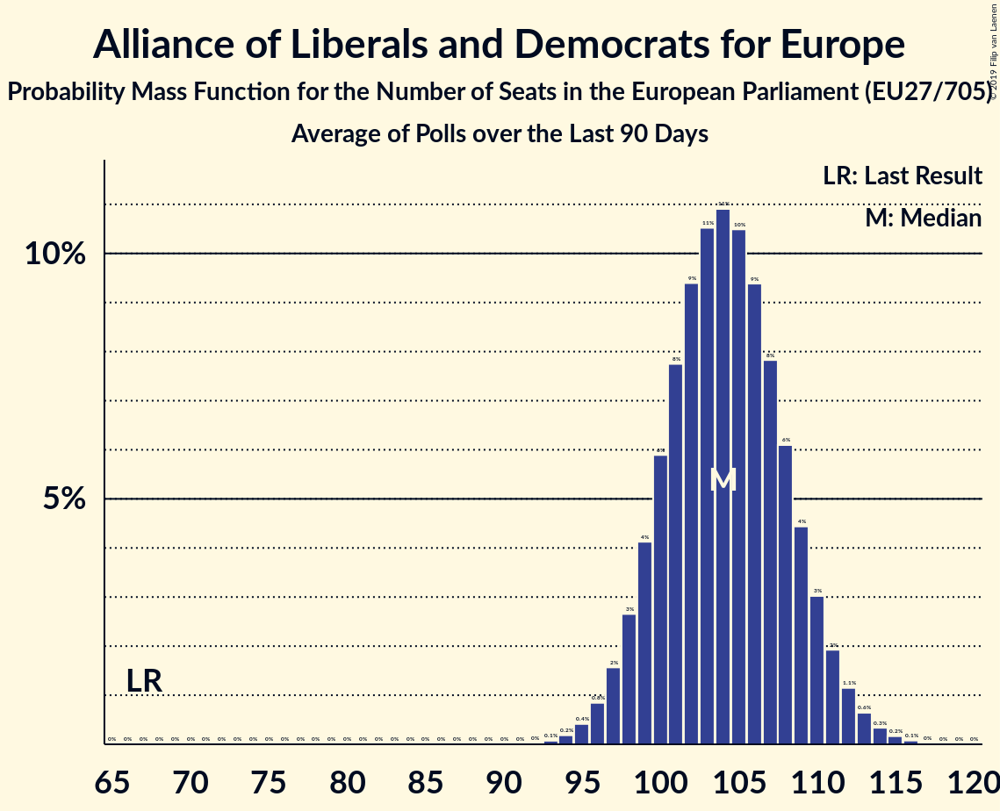

# Alliance of Liberals and Democrats for Europe

## Seats

Last result: **67** seats (General Election of 25 May 2014)

### Confidence Intervals

| Party | Last Result | Median | 80% Confidence Interval | 90% Confidence Interval | 95% Confidence Interval | 99% Confidence Interval |
|:-----:|:-----------:|:------:|:-----------------------:|:-----------------------:|:-----------------------:|:-----------------------:|
| Alliance of Liberals and Democrats for Europe | 67 | 102 | 97–108 | 95–109 | 94–111 | 92–113 |
| La République en marche–Mouvement démocrate [FR] (ALDE) | | 20 | 20–23 | 19–23 | 18–23 | 18–23 |
| Ciudadanos–Partido de la Ciudadanía [ES] (ALDE) | | 9 | 7–10 | 7–10 | 7–10 | 6–11 |
| FDP [DE] (ALDE) | | 9 | 7–10 | 6–10 | 6–11 | 5–11 |
| ANO 2011 [CZ] (ALDE) | | 8 | 5–8 | 5–8 | 4–8 | 4–9 |
| Uniunea Salvați România–Partidul Libertății, Unității și Solidarității [RO] (ALDE) | | 5 | 4–7 | 4–7 | 3–7 | 3–7 |
| Fianna Fáil [IE] (ALDE) | | 4 | 3–4 | 3–4 | 3–4 | 3–4 |
| Volkspartij voor Vrijheid en Democratie [NL] (ALDE) | | 4 | 4–5 | 4–5 | 4–5 | 4–5 |
| Liberal Democrats [GB-GBN] (ALDE) | | 3 | 2–5 | 2–6 | 2–6 | 2–7 |
| Lista Marjana Šarca [SI] (ALDE) | | 3 | 2–4 | 2–4 | 2–4 | 2–5 |
| PRO România [RO] (ALDE) | | 3 | 3–4 | 3–4 | 3–4 | 2–5 |
| Partidul Alianța Liberalilor și Democraților [RO] (ALDE) | | 3 | 2–5 | 2–5 | 2–5 | 2–5 |
| Venstre [DK] (ALDE) | | 3 | 2–3 | 2–3 | 2–3 | 2–3 |
| Centerpartiet [SE] (ALDE) | | 2 | 1–2 | 1–2 | 1–2 | 1–2 |
| Democraten 66 [NL] (ALDE) | | 2 | 2–3 | 2–3 | 2–3 | 2–3 |
| Eesti Keskerakond [EE] (ALDE) | | 2 | 1–2 | 1–2 | 1–2 | 1–2 |
| Eesti Reformierakond [EE] (ALDE) | | 2 | 2–3 | 2–3 | 2–3 | 2–3 |
| MR [BE-FRC] (ALDE) | | 2 | 2 | 2 | 2 | 1–2 |
| Open Vld [BE-VLG] (ALDE) | | 2 | 1–2 | 1–2 | 1–2 | 1–3 |
| Suomen Keskusta [FI] (ALDE) | | 2 | 2 | 2 | 2 | 2–3 |
| Движение за права и свободи [BG] (ALDE) | | 2 | 2–3 | 2–3 | 2–3 | 2–3 |
| Amsterdamska koalicija [HR] (ALDE) | | 1 | 0–2 | 0–2 | 0–2 | 0–2 |
| Attīstībai/Par! [LV] (ALDE) | | 1 | 1 | 1 | 1 | 1 |
| Coalición por Europa [ES] (ALDE) | | 1 | 1–2 | 1–2 | 0–2 | 0–2 |
| Darbo Partija [LT] (ALDE) | | 1 | 1 | 1 | 1 | 1–2 |
| Demokratesch Partei [LU] (ALDE) | | 1 | 1 | 1 | 1 | 1 |
| FREIE WÄHLER [DE] (ALDE) | | 1 | 1–2 | 1–2 | 1–2 | 0–2 |
| MM [HU] (ALDE) | | 1 | 0–1 | 0–1 | 0–1 | 0–1 |
| NEOS–Das Neue Österreich und Liberales Forum [AT] (ALDE) | | 1 | 1–2 | 1–2 | 1–2 | 1–2 |
| Progresívne Slovensko–SPOLU–Občianska Demokracia [SK] (ALDE) | | 1 | 1–2 | 1–2 | 1–2 | 1–3 |
| Radikale Venstre [DK] (ALDE) | | 1 | 1 | 0–1 | 0–1 | 0–1 |
| Agir, la droite constructive–Union des démocrates et indépendants [FR] (ALDE) | | 0 | 0 | 0 | 0 | 0 |
| Alliance Party of Northern Ireland [GB-NIR] (ALDE) | | 0 | 0 | 0 | 0 | 0–1 |
| Demokratična stranka upokojencev Slovenije [SI] (ALDE) | | 0 | 0 | 0 | 0 | 0 |
| DéFI [BE-FRC] (ALDE) | | 0 | 0 | 0 | 0 | 0 |
| Eesti 200 [EE] (ALDE) | | 0 | 0 | 0–1 | 0–1 | 0–1 |
| Hrvatska narodna stranka–liberalni demokrati [HR] (ALDE) | | 0 | 0 | 0 | 0 | 0 |
| Liberal Alliance [DK] (ALDE) | | 0 | 0–1 | 0–1 | 0–1 | 0–1 |
| Liberalerna [SE] (ALDE) | | 0 | 0–1 | 0–1 | 0–1 | 0–1 |
| Liberalų Sąjūdis [LT] (ALDE) | | 0 | 0–1 | 0–1 | 0–1 | 0–1 |
| Partit Demokratiku [MT] (ALDE) | | 0 | 0 | 0 | 0 | 0 |
| Più Europa [IT] (ALDE) | | 0 | 0–3 | 0–4 | 0–4 | 0–5 |
| Stranka Alenke Bratušek [SI] (ALDE) | | 0 | 0 | 0 | 0 | 0 |
| Stranka modernega centra [SI] (ALDE) | | 0 | 0 | 0 | 0 | 0 |
| Svenska folkpartiet i Finland [FI] (ALDE) | | 0 | 0 | 0–1 | 0–1 | 0–1 |
| Ένωση Κεντρώων [GR] (ALDE) | | 0 | 0 | 0–1 | 0–1 | 0–1 |

### Probability Mass Function

The following table shows the probability mass function per seat for the [poll average](average-2019-04-23.html) for Alliance of Liberals and Democrats for Europe.

| Number of Seats | Probability | Accumulated | Special Marks |
|:---------------:|:-----------:|:-----------:|:-------------:|
| 67 | 0% | 100% | Last Result |
| 68 | 0% | 100% |  |
| 69 | 0% | 100% |  |
| 70 | 0% | 100% |  |
| 71 | 0% | 100% |  |
| 72 | 0% | 100% |  |
| 73 | 0% | 100% |  |
| 74 | 0% | 100% |  |
| 75 | 0% | 100% |  |
| 76 | 0% | 100% |  |
| 77 | 0% | 100% |  |
| 78 | 0% | 100% |  |
| 79 | 0% | 100% |  |
| 80 | 0% | 100% |  |
| 81 | 0% | 100% |  |
| 82 | 0% | 100% |  |
| 83 | 0% | 100% |  |
| 84 | 0% | 100% |  |
| 85 | 0% | 100% |  |
| 86 | 0% | 100% |  |
| 87 | 0% | 100% |  |
| 88 | 0% | 100% |  |
| 89 | 0% | 100% |  |
| 90 | 0.1% | 99.9% |  |
| 91 | 0.2% | 99.9% |  |
| 92 | 0.4% | 99.7% |  |
| 93 | 0.8% | 99.2% |  |
| 94 | 1.4% | 98% |  |
| 95 | 2% | 97% |  |
| 96 | 3% | 95% |  |
| 97 | 5% | 92% |  |
| 98 | 6% | 87% |  |
| 99 | 7% | 81% |  |
| 100 | 8% | 74% |  |
| 101 | 9% | 65% |  |
| 102 | 9% | 56% | Median |
| 103 | 9% | 47% |  |
| 104 | 8% | 38% |  |
| 105 | 7% | 29% |  |
| 106 | 6% | 22% |  |
| 107 | 5% | 16% |  |
| 108 | 4% | 11% |  |
| 109 | 3% | 7% |  |
| 110 | 2% | 5% |  |
| 111 | 1.2% | 3% |  |
| 112 | 0.7% | 2% |  |
| 113 | 0.4% | 0.9% |  |
| 114 | 0.2% | 0.5% |  |
| 115 | 0.1% | 0.2% |  |
| 116 | 0.1% | 0.1% |  |
| 117 | 0% | 0.1% |  |
| 118 | 0% | 0% |  |

