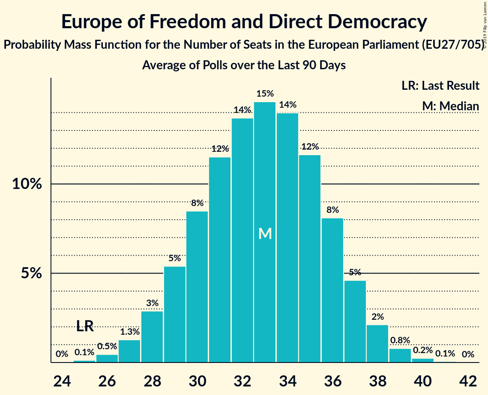

# Europe of Freedom and Direct Democracy

## Seats

Last result: **41** seats (General Election of 25 May 2014)

### Confidence Intervals

| Party | Last Result | Median | 80% Confidence Interval | 90% Confidence Interval | 95% Confidence Interval | 99% Confidence Interval |
|:-----:|:-----------:|:------:|:-----------------------:|:-----------------------:|:-----------------------:|:-----------------------:|
| Europe of Freedom and Direct Democracy | 41 | 32 | 26–42 | 25–43 | 24–45 | 23–46 |
| Movimento 5 Stelle [IT] (EFDD) | | 17 | 15–19 | 15–20 | 14–20 | 14–21 |
| Brexit Party [GB-GBN] (EFDD) | | 11 | 6–20 | 6–21 | 6–21 | 6–22 |
| Kukiz’15 [PL] (EFDD) | | 3 | 0–3 | 0–3 | 0–4 | 0–4 |
| Partija tvarka ir teisingumas [LT] (EFDD) | | 1 | 1 | 1 | 1 | 0–1 |
| Živi zid [HR] (EFDD) | | 1 | 1 | 1 | 1 | 1–2 |
| KORWiN [PL] (EFDD) | | 0 | 0 | 0–3 | 0–3 | 0–4 |
| Les Patriotes [FR] (EFDD) | | 0 | 0 | 0 | 0 | 0 |
| Parti Populaire [BE-FRC] (EFDD) | | 0 | 0 | 0 | 0 | 0 |
| Strana svobodných občanů [CZ] (EFDD) | | 0 | 0 | 0 | 0 | 0 |

### Probability Mass Function

The following table shows the probability mass function per seat for the [poll average](average-2019-04-23.html) for Europe of Freedom and Direct Democracy.

| Number of Seats | Probability | Accumulated | Special Marks |
|:---------------:|:-----------:|:-----------:|:-------------:|
| 22 | 0.1% | 100% |  |
| 23 | 0.8% | 99.8% |  |
| 24 | 2% | 99.0% |  |
| 25 | 3% | 97% |  |
| 26 | 5% | 94% |  |
| 27 | 7% | 89% |  |
| 28 | 8% | 82% |  |
| 29 | 8% | 74% |  |
| 30 | 7% | 66% |  |
| 31 | 6% | 59% |  |
| 32 | 4% | 53% | Median |
| 33 | 4% | 49% |  |
| 34 | 4% | 45% |  |
| 35 | 4% | 42% |  |
| 36 | 4% | 38% |  |
| 37 | 4% | 34% |  |
| 38 | 4% | 30% |  |
| 39 | 4% | 26% |  |
| 40 | 5% | 22% |  |
| 41 | 5% | 17% | Last Result |
| 42 | 4% | 12% |  |
| 43 | 3% | 8% |  |
| 44 | 2% | 5% |  |
| 45 | 1.4% | 3% |  |
| 46 | 0.7% | 1.2% |  |
| 47 | 0.3% | 0.5% |  |
| 48 | 0.1% | 0.2% |  |
| 49 | 0% | 0.1% |  |
| 50 | 0% | 0% |  |

