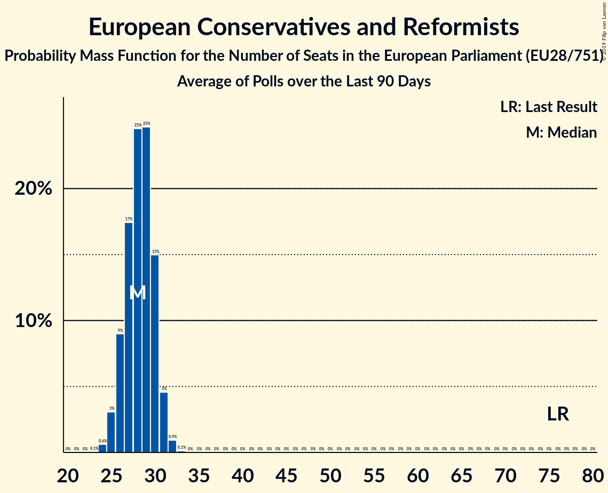

# European Conservatives and Reformists

## Seats

Last result: **76** seats (General Election of 25 May 2014)

### Confidence Intervals

| Party | Last Result | Median | 80% Confidence Interval | 90% Confidence Interval | 95% Confidence Interval | 99% Confidence Interval |
|:-----:|:-----------:|:------:|:-----------------------:|:-----------------------:|:-----------------------:|:-----------------------:|
| European Conservatives and Reformists | 76 | 28 | 26–30 | 26–31 | 25–31 | 24–32 |
| Prawo i Sprawiedliwość [PL] (ECR) | | 22 | 20–23 | 20–24 | 19–24 | 19–25 |
| Sverigedemokraterna [SE] (ECR) | | 4 | 3–4 | 3–4 | 3–5 | 2–5 |
| OBYČAJNÍ ĽUDIA a nezávislé osobnosti [SK] (ECR) | | 1 | 1–2 | 1–2 | 1–2 | 1–2 |
| Sloboda a Solidarita [SK] (ECR) | | 1 | 1–2 | 1–2 | 1–2 | 1–2 |

### Probability Mass Function

The following table shows the probability mass function per seat for the [poll average](average-2019-04-30.html) for European Conservatives and Reformists.

| Number of Seats | Probability | Accumulated | Special Marks |
|:---------------:|:-----------:|:-----------:|:-------------:|
| 23 | 0.1% | 100% |  |
| 24 | 0.6% | 99.9% |  |
| 25 | 3% | 99.3% |  |
| 26 | 9% | 96% |  |
| 27 | 17% | 87% |  |
| 28 | 25% | 70% | Median |
| 29 | 25% | 45% |  |
| 30 | 15% | 21% |  |
| 31 | 5% | 6% |  |
| 32 | 0.9% | 1.1% |  |
| 33 | 0.1% | 0.1% |  |
| 34 | 0% | 0% |  |
| 35 | 0% | 0% |  |
| 36 | 0% | 0% |  |
| 37 | 0% | 0% |  |
| 38 | 0% | 0% |  |
| 39 | 0% | 0% |  |
| 40 | 0% | 0% |  |
| 41 | 0% | 0% |  |
| 42 | 0% | 0% |  |
| 43 | 0% | 0% |  |
| 44 | 0% | 0% |  |
| 45 | 0% | 0% |  |
| 46 | 0% | 0% |  |
| 47 | 0% | 0% |  |
| 48 | 0% | 0% |  |
| 49 | 0% | 0% |  |
| 50 | 0% | 0% |  |
| 51 | 0% | 0% |  |
| 52 | 0% | 0% |  |
| 53 | 0% | 0% |  |
| 54 | 0% | 0% |  |
| 55 | 0% | 0% |  |
| 56 | 0% | 0% |  |
| 57 | 0% | 0% |  |
| 58 | 0% | 0% |  |
| 59 | 0% | 0% |  |
| 60 | 0% | 0% |  |
| 61 | 0% | 0% |  |
| 62 | 0% | 0% |  |
| 63 | 0% | 0% |  |
| 64 | 0% | 0% |  |
| 65 | 0% | 0% |  |
| 66 | 0% | 0% |  |
| 67 | 0% | 0% |  |
| 68 | 0% | 0% |  |
| 69 | 0% | 0% |  |
| 70 | 0% | 0% |  |
| 71 | 0% | 0% |  |
| 72 | 0% | 0% |  |
| 73 | 0% | 0% |  |
| 74 | 0% | 0% |  |
| 75 | 0% | 0% |  |
| 76 | 0% | 0% | Last Result |

