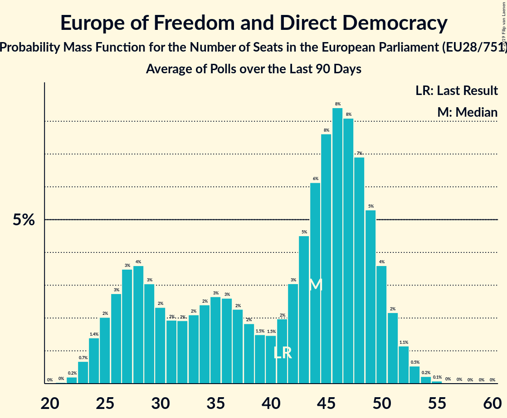

# Europe of Freedom and Direct Democracy

## Seats

Last result: **41** seats (General Election of 25 May 2014)

### Confidence Intervals

| Party | Last Result | Median | 80% Confidence Interval | 90% Confidence Interval | 95% Confidence Interval | 99% Confidence Interval |
|:-----:|:-----------:|:------:|:-----------------------:|:-----------------------:|:-----------------------:|:-----------------------:|
| Europe of Freedom and Direct Democracy | 41 | 41 | 27–47 | 26–48 | 25–49 | 23–51 |
| Brexit Party [GB-GBN] (EFDD) | | 20 | 6–25 | 6–26 | 6–27 | 6–28 |
| Movimento 5 Stelle [IT] (EFDD) | | 17 | 15–19 | 15–19 | 14–20 | 14–21 |
| Kukiz’15 [PL] (EFDD) | | 3 | 0–3 | 0–3 | 0–4 | 0–4 |
| Partija tvarka ir teisingumas [LT] (EFDD) | | 1 | 0–1 | 0–1 | 0–1 | 0–1 |
| Živi zid [HR] (EFDD) | | 1 | 1 | 1 | 1 | 1–2 |
| KORWiN [PL] (EFDD) | | 0 | 0 | 0–2 | 0–3 | 0–3 |
| Les Patriotes [FR] (EFDD) | | 0 | 0 | 0 | 0 | 0 |
| Parti Populaire [BE-FRC] (EFDD) | | 0 | 0 | 0 | 0 | 0 |
| Strana svobodných občanů [CZ] (EFDD) | | 0 | 0 | 0 | 0 | 0 |

### Probability Mass Function

The following table shows the probability mass function per seat for the [poll average](average-2019-04-30.html) for Europe of Freedom and Direct Democracy.

| Number of Seats | Probability | Accumulated | Special Marks |
|:---------------:|:-----------:|:-----------:|:-------------:|
| 21 | 0% | 100% |  |
| 22 | 0.2% | 99.9% |  |
| 23 | 0.7% | 99.7% |  |
| 24 | 1.5% | 99.0% |  |
| 25 | 2% | 98% |  |
| 26 | 3% | 95% |  |
| 27 | 4% | 93% |  |
| 28 | 4% | 89% |  |
| 29 | 3% | 86% |  |
| 30 | 2% | 83% |  |
| 31 | 2% | 80% |  |
| 32 | 2% | 78% |  |
| 33 | 2% | 76% |  |
| 34 | 2% | 74% |  |
| 35 | 3% | 72% |  |
| 36 | 3% | 69% |  |
| 37 | 3% | 66% |  |
| 38 | 4% | 62% |  |
| 39 | 4% | 59% |  |
| 40 | 4% | 55% |  |
| 41 | 5% | 51% | Last Result, Median |
| 42 | 6% | 45% |  |
| 43 | 6% | 40% |  |
| 44 | 7% | 34% |  |
| 45 | 7% | 27% |  |
| 46 | 6% | 20% |  |
| 47 | 5% | 14% |  |
| 48 | 4% | 8% |  |
| 49 | 2% | 5% |  |
| 50 | 1.3% | 2% |  |
| 51 | 0.6% | 1.1% |  |
| 52 | 0.3% | 0.4% |  |
| 53 | 0.1% | 0.2% |  |
| 54 | 0% | 0.1% |  |
| 55 | 0% | 0% |  |

