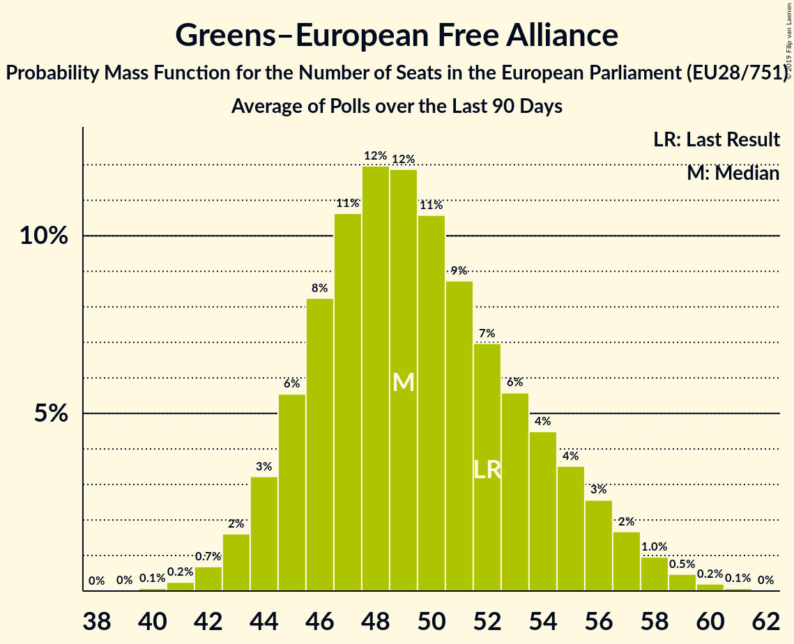

# Greens–European Free Alliance

## Seats

Last result: **52** seats (General Election of 25 May 2014)

### Confidence Intervals

| Party | Last Result | Median | 80% Confidence Interval | 90% Confidence Interval | 95% Confidence Interval | 99% Confidence Interval |
|:-----:|:-----------:|:------:|:-----------------------:|:-----------------------:|:-----------------------:|:-----------------------:|
| Greens–European Free Alliance | 52 | 50 | 46–56 | 45–58 | 44–59 | 42–61 |
| BÜNDNIS 90/DIE GRÜNEN [DE] (Greens/EFA) | | 17 | 16–19 | 15–19 | 15–20 | 14–21 |
| Europe Écologie Les Verts [FR] (Greens/EFA) | | 8 | 6–9 | 6–9 | 6–9 | 5–10 |
| Scottish National Party [GB-GBN] (Greens/EFA) | | 4 | 3–4 | 3–5 | 3–5 | 2–5 |
| GroenLinks [NL] (Greens/EFA) | | 3 | 3–4 | 3–4 | 3–4 | 2–4 |
| Lietuvos valstiečių ir žaliųjų sąjunga [LT] (Greens/EFA) | | 3 | 2–3 | 2–3 | 2–4 | 2–4 |
| Ahora Repúblicas [ES] (Greens/EFA) | | 2 | 1–2 | 1–3 | 1–3 | 1–3 |
| Ecolo [BE-FRC] (Greens/EFA) | | 2 | 2 | 2 | 1–2 | 1–2 |
| Groen [BE-VLG] (Greens/EFA) | | 2 | 2 | 2 | 2 | 2–3 |
| Vihreä liitto [FI] (Greens/EFA) | | 2 | 2 | 2 | 2 | 2 |
| Die Grünen–Die Grüne Alternative [AT] (Greens/EFA) | | 1 | 1–2 | 0–2 | 0–2 | 0–2 |
| LMP [HU] (Greens/EFA) | | 1 | 0–1 | 0–1 | 0–1 | 0–1 |
| Miljöpartiet de gröna [SE] (Greens/EFA) | | 1 | 0–2 | 0–2 | 0–2 | 0–2 |
| Plaid Cymru [GB-GBN] (Greens/EFA) | | 1 | 0–2 | 0–2 | 0–2 | 0–2 |
| Socialistisk Folkeparti [DK] (Greens/EFA) | | 1 | 0–1 | 0–1 | 0–1 | 0–1 |
| Zaļo un Zemnieku savienība [LV] (Greens/EFA) | | 1 | 0–1 | 0–1 | 0–1 | 0–2 |
| déi gréng [LU] (Greens/EFA) | | 1 | 1 | 1 | 1 | 1 |
| Alternativet [DK] (Greens/EFA) | | 0 | 0 | 0 | 0 | 0 |
| Alternattiva Demokratika [MT] (Greens/EFA) | | 0 | 0 | 0 | 0 | 0 |
| Erakond Eestimaa Rohelised [EE] (Greens/EFA) | | 0 | 0 | 0 | 0 | 0 |
| Green Party [GB-GBN] (Greens/EFA) | | 0 | 0–6 | 0–6 | 0–6 | 0–7 |
| Green Party [IE] (Greens/EFA) | | 0 | 0 | 0 | 0 | 0 |
| JETZT–Liste Pilz [AT] (Greens/EFA) | | 0 | 0 | 0 | 0 | 0 |
| Latvijas Krievu savienība [LV] (Greens/EFA) | | 0 | 0–1 | 0–1 | 0–1 | 0–1 |
| Pessoas–Animais–Natureza [PT] (Greens/EFA) | | 0 | 0 | 0 | 0–1 | 0–1 |
| Primavera Europea [ES] (Greens/EFA) | | 0 | 0–1 | 0–1 | 0–1 | 0–1 |
| Κίνημα Οικολόγων—Συνεργασία Πολιτών [CY] (Greens/EFA) | | 0 | 0 | 0 | 0 | 0–1 |

### Probability Mass Function

The following table shows the probability mass function per seat for the [poll average](average-2019-04-30.html) for Greens–European Free Alliance.

| Number of Seats | Probability | Accumulated | Special Marks |
|:---------------:|:-----------:|:-----------:|:-------------:|
| 41 | 0.1% | 100% |  |
| 42 | 0.4% | 99.9% |  |
| 43 | 1.0% | 99.5% |  |
| 44 | 2% | 98.5% |  |
| 45 | 4% | 96% |  |
| 46 | 6% | 92% |  |
| 47 | 9% | 86% |  |
| 48 | 10% | 78% |  |
| 49 | 11% | 67% |  |
| 50 | 10% | 57% | Median |
| 51 | 9% | 47% |  |
| 52 | 7% | 38% | Last Result |
| 53 | 6% | 30% |  |
| 54 | 5% | 24% |  |
| 55 | 5% | 19% |  |
| 56 | 4% | 14% |  |
| 57 | 4% | 9% |  |
| 58 | 3% | 6% |  |
| 59 | 2% | 3% |  |
| 60 | 0.9% | 2% |  |
| 61 | 0.4% | 0.6% |  |
| 62 | 0.2% | 0.2% |  |
| 63 | 0% | 0.1% |  |
| 64 | 0% | 0% |  |

