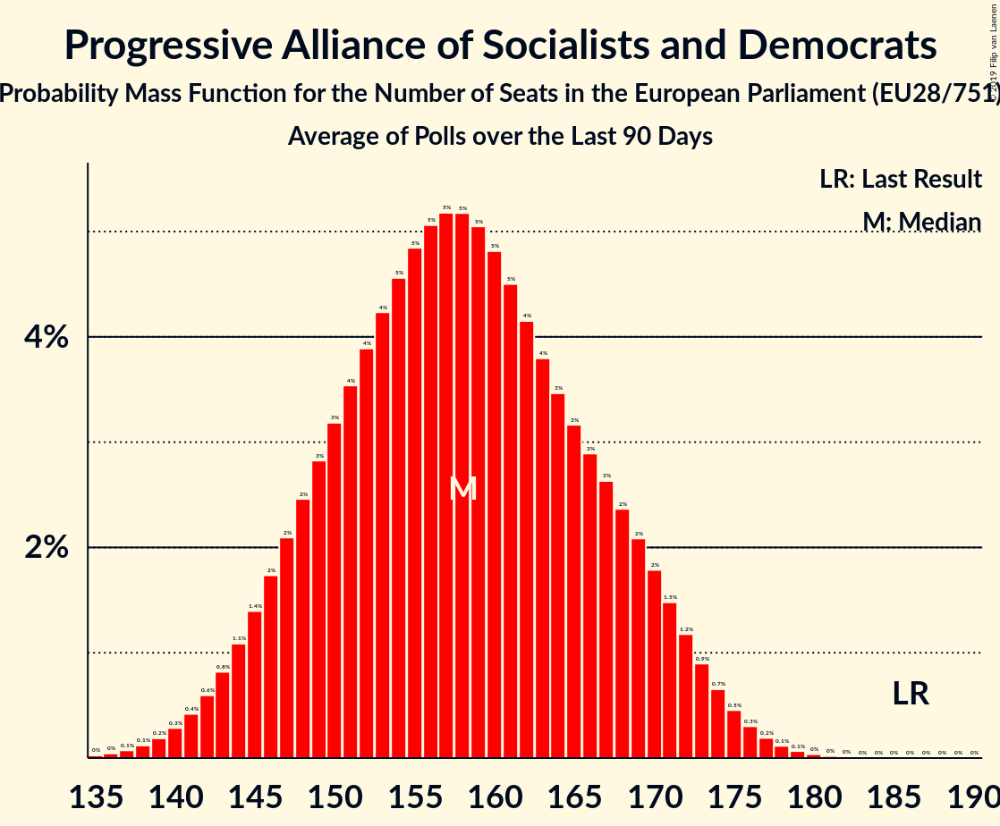

# Progressive Alliance of Socialists and Democrats

## Seats

Last result: **186** seats (General Election of 25 May 2014)

### Confidence Intervals

| Party | Last Result | Median | 80% Confidence Interval | 90% Confidence Interval | 95% Confidence Interval | 99% Confidence Interval |
|:-----:|:-----------:|:------:|:-----------------------:|:-----------------------:|:-----------------------:|:-----------------------:|
| Progressive Alliance of Socialists and Democrats | 186 | 159 | 152–169 | 150–171 | 148–173 | 145–176 |
| Labour Party [GB-GBN] (S&D) | | 28 | 25–38 | 24–38 | 23–38 | 22–39 |
| SPD [DE] (S&D) | | 17 | 14–18 | 13–19 | 13–19 | 12–20 |
| Partido Socialista Obrero Español [ES] (S&D) | | 16 | 15–18 | 13–18 | 13–18 | 13–19 |
| Partito Democratico [IT] (S&D) | | 15 | 13–17 | 13–17 | 12–18 | 12–19 |
| Partidul Social Democrat [RO] (S&D) | | 10 | 7–11 | 7–11 | 7–11 | 6–12 |
| Partido Socialista [PT] (S&D) | | 8 | 6–9 | 6–9 | 6–10 | 5–10 |
| Българска социалистическа партия [BG] (S&D) | | 6 | 6–7 | 5–7 | 5–7 | 5–7 |
| Parti socialiste [FR] (S&D) | | 5 | 5–6 | 4–6 | 4–6 | 0–6 |
| Socialdemokraterne [DK] (S&D) | | 5 | 4–6 | 4–6 | 4–6 | 4–6 |
| Sozialdemokratische Partei Österreichs [AT] (S&D) | | 5 | 5–6 | 5–6 | 4–6 | 4–6 |
| Sveriges socialdemokratiska arbetareparti [SE] (S&D) | | 5 | 5–6 | 5–6 | 5–6 | 4–6 |
| Partit Laburista [MT] (S&D) | | 4 | 4 | 4 | 3–4 | 3–4 |
| Wiosna–Partia Razem [PL] (S&D) | | 4 | 3–6 | 0–7 | 0–7 | 0–8 |
| SMER–sociálna demokracia [SK] (S&D) | | 3 | 2–3 | 2–3 | 2–3 | 2–3 |
| Socijaldemokratska partija Hrvatske [HR] (S&D) | | 3 | 2–3 | 2–3 | 2–3 | 2–4 |
| Suomen Sosialidemokraattinen Puolue [FI] (S&D) | | 3 | 3 | 3 | 3 | 3 |
| DK [HU] (S&D) | | 2 | 1–2 | 1–2 | 1–2 | 1–3 |
| Lietuvos socialdemokratų partija [LT] (S&D) | | 2 | 1–2 | 1–2 | 1–2 | 1–2 |
| MSZP–Párbeszéd [HU] (S&D) | | 2 | 2–3 | 2–3 | 2–3 | 2–3 |
| PS [BE-FRC] (S&D) | | 2 | 2–3 | 2–3 | 2–3 | 2–3 |
| Partij van de Arbeid [NL] (S&D) | | 2 | 1–2 | 1–3 | 1–3 | 1–3 |
| Sociāldemokrātiskā Partija “Saskaņa” [LV] (S&D) | | 2 | 2 | 2 | 2 | 1–2 |
| Česká strana sociálně demokratická [CZ] (S&D) | | 2 | 1–3 | 1–3 | 1–3 | 1–3 |
| Κίνημα Αλλαγής [GR] (S&D) | | 2 | 1–2 | 1–2 | 1–2 | 1–3 |
| Lëtzebuerger Sozialistesch Aarbechterpartei [LU] (S&D) | | 1 | 1 | 1 | 1 | 1 |
| Progresīvie [LV] (S&D) | | 1 | 0–1 | 0–1 | 0–1 | 0–1 |
| Socialni demokrati [SI] (S&D) | | 1 | 1 | 0–1 | 0–1 | 0–1 |
| sp.a [BE-VLG] (S&D) | | 1 | 1–2 | 1–2 | 1–2 | 1–2 |
| Δημοκρατικό Κόμμα [CY] (S&D) | | 1 | 1 | 1 | 1 | 1 |
| Génération·s, le mouvement [FR] (S&D) | | 0 | 0 | 0–4 | 0–4 | 0–5 |
| Labour Party [IE] (S&D) | | 0 | 0 | 0 | 0 | 0 |
| Liberi e Uguali [IT] (S&D) | | 0 | 0–3 | 0–4 | 0–4 | 0–5 |
| Lietuvos socialdemokratų darbo partija [LT] (S&D) | | 0 | 0–1 | 0–1 | 0–1 | 0–1 |
| Social Democratic and Labour Party [GB-NIR] (S&D) | | 0 | 0 | 0 | 0 | 0 |
| Sotsiaaldemokraatlik Erakond [EE] (S&D) | | 0 | 0–1 | 0–1 | 0–1 | 0–1 |
| Κίνημα Σοσιαλδημοκρατών [CY] (S&D) | | 0 | 0–1 | 0–1 | 0–1 | 0–1 |
| Το Ποτάμι [GR] (S&D) | | 0 | 0 | 0 | 0 | 0–1 |

### Probability Mass Function

The following table shows the probability mass function per seat for the [poll average](average-2019-04-30.html) for Progressive Alliance of Socialists and Democrats.

| Number of Seats | Probability | Accumulated | Special Marks |
|:---------------:|:-----------:|:-----------:|:-------------:|
| 141 | 0% | 100% |  |
| 142 | 0.1% | 99.9% |  |
| 143 | 0.1% | 99.9% |  |
| 144 | 0.2% | 99.8% |  |
| 145 | 0.3% | 99.6% |  |
| 146 | 0.4% | 99.4% |  |
| 147 | 0.7% | 98.9% |  |
| 148 | 1.0% | 98% |  |
| 149 | 1.4% | 97% |  |
| 150 | 2% | 96% |  |
| 151 | 3% | 94% |  |
| 152 | 3% | 91% |  |
| 153 | 4% | 88% |  |
| 154 | 5% | 84% |  |
| 155 | 5% | 80% |  |
| 156 | 6% | 74% |  |
| 157 | 6% | 68% |  |
| 158 | 6% | 62% |  |
| 159 | 6% | 56% | Median |
| 160 | 6% | 50% |  |
| 161 | 5% | 44% |  |
| 162 | 5% | 38% |  |
| 163 | 5% | 33% |  |
| 164 | 4% | 29% |  |
| 165 | 4% | 24% |  |
| 166 | 4% | 21% |  |
| 167 | 3% | 17% |  |
| 168 | 3% | 14% |  |
| 169 | 3% | 11% |  |
| 170 | 2% | 8% |  |
| 171 | 2% | 6% |  |
| 172 | 1.4% | 4% |  |
| 173 | 1.0% | 3% |  |
| 174 | 0.7% | 2% |  |
| 175 | 0.5% | 1.3% |  |
| 176 | 0.3% | 0.8% |  |
| 177 | 0.2% | 0.5% |  |
| 178 | 0.1% | 0.3% |  |
| 179 | 0.1% | 0.1% |  |
| 180 | 0% | 0.1% |  |
| 181 | 0% | 0% |  |
| 182 | 0% | 0% |  |
| 183 | 0% | 0% |  |
| 184 | 0% | 0% |  |
| 185 | 0% | 0% |  |
| 186 | 0% | 0% | Last Result |

