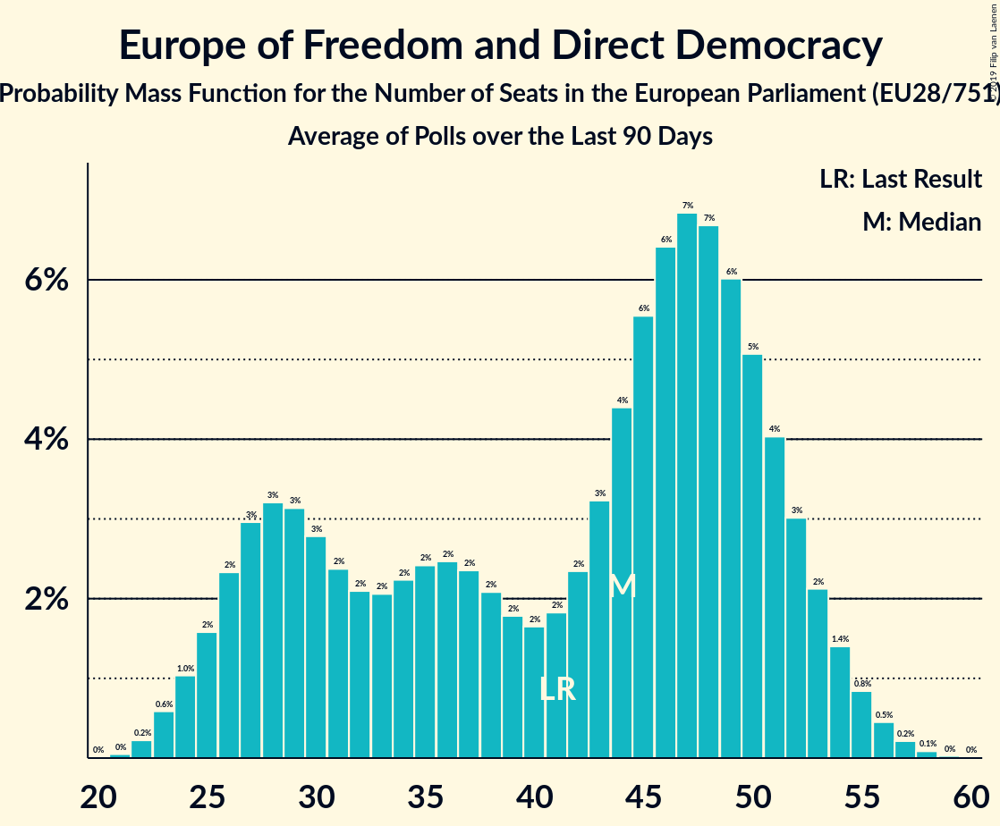

# Europe of Freedom and Direct Democracy

## Seats

Last result: **41** seats (General Election of 25 May 2014)

### Confidence Intervals

| Party | Last Result | Median | 80% Confidence Interval | 90% Confidence Interval | 95% Confidence Interval | 99% Confidence Interval |
|:-----:|:-----------:|:------:|:-----------------------:|:-----------------------:|:-----------------------:|:-----------------------:|
| Europe of Freedom and Direct Democracy | 41 | 44 | 28–50 | 26–51 | 25–52 | 23–54 |
| Brexit Party [GB-GBN] (EFDD) | | 24 | 6–27 | 6–28 | 6–28 | 6–29 |
| Movimento 5 Stelle [IT] (EFDD) | | 17 | 15–19 | 15–19 | 14–20 | 14–21 |
| Kukiz’15 [PL] (EFDD) | | 3 | 0–5 | 0–5 | 0–6 | 0–6 |
| Partija tvarka ir teisingumas [LT] (EFDD) | | 1 | 0–1 | 0–1 | 0–1 | 0–1 |
| Živi zid [HR] (EFDD) | | 1 | 1 | 1 | 1 | 1–2 |
| KORWiN [PL] (EFDD) | | 0 | 0–3 | 0–3 | 0–3 | 0–4 |
| Les Patriotes [FR] (EFDD) | | 0 | 0 | 0 | 0 | 0 |
| Parti Populaire [BE-FRC] (EFDD) | | 0 | 0 | 0 | 0 | 0 |
| Strana svobodných občanů [CZ] (EFDD) | | 0 | 0 | 0 | 0 | 0 |

### Probability Mass Function

The following table shows the probability mass function per seat for the [poll average](average-2019-05-07.html) for Europe of Freedom and Direct Democracy.

| Number of Seats | Probability | Accumulated | Special Marks |
|:---------------:|:-----------:|:-----------:|:-------------:|
| 22 | 0.2% | 100% |  |
| 23 | 0.6% | 99.8% |  |
| 24 | 1.2% | 99.2% |  |
| 25 | 2% | 98% |  |
| 26 | 2% | 96% |  |
| 27 | 3% | 94% |  |
| 28 | 3% | 91% |  |
| 29 | 3% | 87% |  |
| 30 | 3% | 84% |  |
| 31 | 2% | 82% |  |
| 32 | 2% | 79% |  |
| 33 | 2% | 77% |  |
| 34 | 2% | 75% |  |
| 35 | 2% | 73% |  |
| 36 | 3% | 71% |  |
| 37 | 2% | 68% |  |
| 38 | 2% | 66% |  |
| 39 | 2% | 64% |  |
| 40 | 2% | 62% |  |
| 41 | 2% | 60% | Last Result |
| 42 | 3% | 58% |  |
| 43 | 4% | 56% |  |
| 44 | 5% | 52% | Median |
| 45 | 7% | 46% |  |
| 46 | 8% | 39% |  |
| 47 | 8% | 32% |  |
| 48 | 7% | 24% |  |
| 49 | 6% | 16% |  |
| 50 | 4% | 11% |  |
| 51 | 3% | 6% |  |
| 52 | 2% | 3% |  |
| 53 | 0.9% | 2% |  |
| 54 | 0.4% | 0.6% |  |
| 55 | 0.2% | 0.2% |  |
| 56 | 0.1% | 0.1% |  |
| 57 | 0% | 0% |  |

