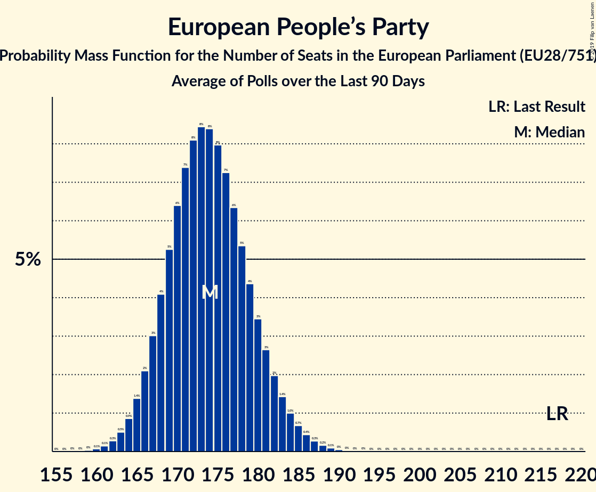

# European People’s Party

## Seats

Last result: **217** seats (General Election of 25 May 2014)

### Confidence Intervals

| Party | Last Result | Median | 80% Confidence Interval | 90% Confidence Interval | 95% Confidence Interval | 99% Confidence Interval |
|:-----:|:-----------:|:------:|:-----------------------:|:-----------------------:|:-----------------------:|:-----------------------:|
| European People’s Party | 217 | 177 | 170–183 | 168–185 | 166–187 | 163–190 |
| CDU [DE] (EPP) | | 24 | 21–25 | 21–26 | 20–29 | 20–29 |
| Koalicja Europejska [PL] (EPP) | | 20 | 15–22 | 14–23 | 14–23 | 13–24 |
| Fidesz–KDNP [HU] (EPP) | | 13 | 12–14 | 11–14 | 11–14 | 11–15 |
| Les Républicains [FR] (EPP) | | 12 | 10–14 | 9–14 | 9–15 | 9–16 |
| Partido Popular [ES] (EPP) | | 11 | 9–13 | 9–14 | 8–14 | 7–15 |
| Partidul Național Liberal [RO] (EPP) | | 9 | 8–11 | 8–11 | 8–11 | 8–12 |
| Νέα Δημοκρατία [GR] (EPP) | | 8 | 7–9 | 7–9 | 7–9 | 7–10 |
| Forza Italia [IT] (EPP) | | 7 | 6–9 | 6–9 | 6–10 | 5–10 |
| Partido Social Democrata [PT] (EPP) | | 6 | 6–7 | 5–8 | 5–8 | 5–8 |
| Österreichische Volkspartei [AT] (EPP) | | 6 | 6–7 | 5–7 | 5–7 | 5–8 |
| Граждани за европейско развитие на България [BG] (EPP) | | 6 | 6–8 | 6–8 | 6–8 | 5–9 |
| CSU [DE] (EPP) | | 4 | 4–6 | 4–6 | 3–7 | 3–7 |
| Fine Gael [IE] (EPP) | | 4 | 3–5 | 3–6 | 3–6 | 3–6 |
| Hrvatska demokratska zajednica [HR] (EPP) | | 4 | 3–6 | 3–6 | 3–6 | 3–6 |
| Chrëschtlech-Sozial Vollekspartei [LU] (EPP) | | 3 | 3 | 3 | 3 | 3 |
| Moderata samlingspartiet [SE] (EPP) | | 3 | 3–4 | 3–4 | 3–4 | 3–4 |
| Slovenska demokratska stranka–Slovenska ljudska stranka [SI] (EPP) | | 3 | 2–4 | 2–4 | 2–4 | 1–4 |
| Tėvynės sąjunga–Lietuvos krikščionys demokratai [LT] (EPP) | | 3 | 3–4 | 3–4 | 2–4 | 2–5 |
| CD&V [BE-VLG] (EPP) | | 2 | 2 | 1–2 | 1–2 | 1–2 |
| Christen-Democratisch Appèl [NL] (EPP) | | 2 | 2–3 | 2–3 | 2–3 | 2–3 |
| Kansallinen Kokoomus [FI] (EPP) | | 2 | 2–3 | 2–3 | 2–3 | 2–3 |
| Kristdemokraterna [SE] (EPP) | | 2 | 2–3 | 2–3 | 2–3 | 2–3 |
| Partit Nazzjonalista [MT] (EPP) | | 2 | 2 | 2–3 | 2–3 | 2–3 |
| TOP 09–Starostové a nezávislí–Strana zelených [CZ] (EPP) | | 2 | 1–2 | 1–2 | 1–2 | 1–3 |
| Δημοκρατικός Συναγερμός [CY] (EPP) | | 2 | 2 | 2 | 2 | 2 |
| CDS–Partido Popular [PT] (EPP) | | 1 | 1–2 | 1–2 | 1–2 | 1–2 |
| Christlich-Soziale Partei [2014O] (EPP) | | 1 | 1 | 1 | 1 | 1 |
| Det Konservative Folkeparti [DK] (EPP) | | 1 | 0–1 | 0–1 | 0–1 | 0–1 |
| Jaunā Vienotība [LV] (EPP) | | 1 | 1 | 1–2 | 1–2 | 1–2 |
| Jaunā konservatīvā partija [LV] (EPP) | | 1 | 0–1 | 0–1 | 0–1 | 0–1 |
| Kresťanskodemokratické hnutie [SK] (EPP) | | 1 | 1 | 1 | 1 | 1 |
| Křesťanská a demokratická unie–Československá strana lidová [CZ] (EPP) | | 1 | 0–1 | 0–1 | 0–1 | 0–2 |
| MOST–HÍD [SK] (EPP) | | 1 | 0–1 | 0–1 | 0–1 | 0–1 |
| Nova Slovenija–Krščanski demokrati [SI] (EPP) | | 1 | 0–1 | 0–1 | 0–1 | 0–1 |
| Partidul Mișcarea Populară [RO] (EPP) | | 1 | 0–2 | 0–2 | 0–2 | 0–2 |
| Uniunea Democrată Maghiară din România [RO] (EPP) | | 1 | 0–2 | 0–2 | 0–2 | 0–2 |
| cdH [BE-FRC] (EPP) | | 1 | 1 | 0–1 | 0–1 | 0–1 |
| Change UK [GB-GBN] (EPP) | | 0 | 0–4 | 0–5 | 0–5 | 0–6 |
| Erakond Isamaa [EE] (EPP) | | 0 | 0–1 | 0–1 | 0–1 | 0–1 |
| KPV LV [LV] (EPP) | | 0 | 0 | 0 | 0 | 0 |
| Kristendemokraterne [DK] (EPP) | | 0 | 0 | 0 | 0 | 0 |
| Kristillisdemokraatit [FI] (EPP) | | 0 | 0 | 0 | 0 | 0 |
| Strana maďarskej koalície–Magyar Koalíció Pártja [SK] (EPP) | | 0 | 0 | 0 | 0–1 | 0–1 |
| Демократична България [BG] (EPP) | | 0 | 0–1 | 0–1 | 0–1 | 0–1 |
| Реформаторски блок [BG] (EPP) | | 0 | 0 | 0 | 0 | 0 |

### Probability Mass Function

The following table shows the probability mass function per seat for the [poll average](average-2019-05-21.html) for European People’s Party.

| Number of Seats | Probability | Accumulated | Special Marks |
|:---------------:|:-----------:|:-----------:|:-------------:|
| 160 | 0% | 100% |  |
| 161 | 0.1% | 99.9% |  |
| 162 | 0.2% | 99.8% |  |
| 163 | 0.3% | 99.6% |  |
| 164 | 0.5% | 99.4% |  |
| 165 | 0.7% | 98.9% |  |
| 166 | 1.1% | 98% |  |
| 167 | 2% | 97% |  |
| 168 | 2% | 96% |  |
| 169 | 3% | 94% |  |
| 170 | 4% | 91% |  |
| 171 | 4% | 87% |  |
| 172 | 5% | 83% |  |
| 173 | 6% | 78% |  |
| 174 | 7% | 72% |  |
| 175 | 7% | 65% |  |
| 176 | 7% | 58% |  |
| 177 | 7% | 51% | Median |
| 178 | 7% | 43% |  |
| 179 | 7% | 36% |  |
| 180 | 6% | 29% |  |
| 181 | 5% | 23% |  |
| 182 | 4% | 18% |  |
| 183 | 4% | 13% |  |
| 184 | 3% | 10% |  |
| 185 | 2% | 7% |  |
| 186 | 2% | 5% |  |
| 187 | 1.1% | 3% |  |
| 188 | 0.8% | 2% |  |
| 189 | 0.5% | 1.3% |  |
| 190 | 0.3% | 0.8% |  |
| 191 | 0.2% | 0.5% |  |
| 192 | 0.1% | 0.3% |  |
| 193 | 0.1% | 0.2% |  |
| 194 | 0% | 0.1% |  |
| 195 | 0% | 0% |  |
| 196 | 0% | 0% |  |
| 197 | 0% | 0% |  |
| 198 | 0% | 0% |  |
| 199 | 0% | 0% |  |
| 200 | 0% | 0% |  |
| 201 | 0% | 0% |  |
| 202 | 0% | 0% |  |
| 203 | 0% | 0% |  |
| 204 | 0% | 0% |  |
| 205 | 0% | 0% |  |
| 206 | 0% | 0% |  |
| 207 | 0% | 0% |  |
| 208 | 0% | 0% |  |
| 209 | 0% | 0% |  |
| 210 | 0% | 0% |  |
| 211 | 0% | 0% |  |
| 212 | 0% | 0% |  |
| 213 | 0% | 0% |  |
| 214 | 0% | 0% |  |
| 215 | 0% | 0% |  |
| 216 | 0% | 0% |  |
| 217 | 0% | 0% | Last Result |

