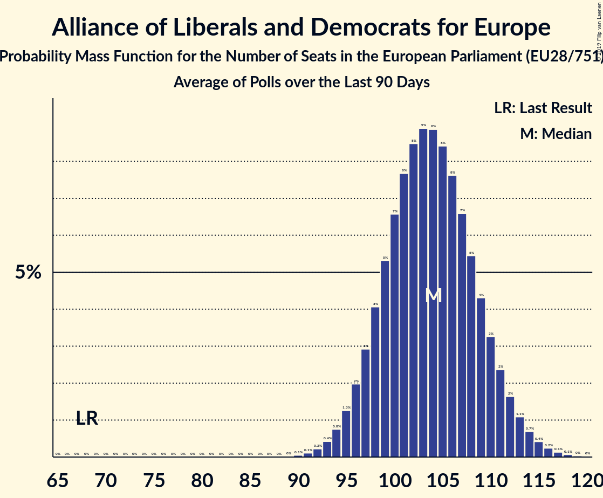

# Alliance of Liberals and Democrats for Europe

## Seats

Last result: **68** seats (General Election of 25 May 2014)

### Confidence Intervals

| Party | Last Result | Median | 80% Confidence Interval | 90% Confidence Interval | 95% Confidence Interval | 99% Confidence Interval |
|:-----:|:-----------:|:------:|:-----------------------:|:-----------------------:|:-----------------------:|:-----------------------:|
| Alliance of Liberals and Democrats for Europe | 68 | 17 | 15–20 | 15–21 | 14–21 | 14–22 |
| Uniunea Salvați România–Partidul Libertății, Unității și Solidarității [RO] (ALDE) | | 5 | 3–6 | 3–6 | 3–7 | 3–7 |
| PRO România [RO] (ALDE) | | 3 | 2–4 | 2–4 | 2–4 | 2–5 |
| Partidul Alianța Liberalilor și Democraților [RO] (ALDE) | | 3 | 2–4 | 2–4 | 2–4 | 2–5 |
| Centerpartiet [SE] (ALDE) | | 2 | 1–2 | 1–2 | 1–2 | 1–2 |
| Lista Marjana Šarca [SI] (ALDE) | | 2 | 1–3 | 1–3 | 1–3 | 1–3 |
| Progresívne Slovensko–SPOLU–Občianska Demokracia [SK] (ALDE) | | 2 | 2 | 2 | 1–2 | 1–2 |
| Liberalerna [SE] (ALDE) | | 1 | 0–1 | 0–1 | 0–1 | 0–1 |
| Demokratična stranka upokojencev Slovenije [SI] (ALDE) | | 0 | 0–1 | 0–1 | 0–1 | 0–1 |
| Stranka Alenke Bratušek [SI] (ALDE) | | 0 | 0 | 0 | 0 | 0 |
| Stranka modernega centra [SI] (ALDE) | | 0 | 0 | 0 | 0 | 0 |

### Probability Mass Function

The following table shows the probability mass function per seat for the [poll average](average-2019-05-26.html) for Alliance of Liberals and Democrats for Europe.

| Number of Seats | Probability | Accumulated | Special Marks |
|:---------------:|:-----------:|:-----------:|:-------------:|
| 13 | 0.4% | 100% |  |
| 14 | 3% | 99.6% |  |
| 15 | 10% | 97% |  |
| 16 | 16% | 87% |  |
| 17 | 21% | 70% | Median |
| 18 | 19% | 50% |  |
| 19 | 14% | 31% |  |
| 20 | 10% | 17% |  |
| 21 | 5% | 7% |  |
| 22 | 1.4% | 2% |  |
| 23 | 0.1% | 0.1% |  |
| 24 | 0% | 0% |  |
| 25 | 0% | 0% |  |
| 26 | 0% | 0% |  |
| 27 | 0% | 0% |  |
| 28 | 0% | 0% |  |
| 29 | 0% | 0% |  |
| 30 | 0% | 0% |  |
| 31 | 0% | 0% |  |
| 32 | 0% | 0% |  |
| 33 | 0% | 0% |  |
| 34 | 0% | 0% |  |
| 35 | 0% | 0% |  |
| 36 | 0% | 0% |  |
| 37 | 0% | 0% |  |
| 38 | 0% | 0% |  |
| 39 | 0% | 0% |  |
| 40 | 0% | 0% |  |
| 41 | 0% | 0% |  |
| 42 | 0% | 0% |  |
| 43 | 0% | 0% |  |
| 44 | 0% | 0% |  |
| 45 | 0% | 0% |  |
| 46 | 0% | 0% |  |
| 47 | 0% | 0% |  |
| 48 | 0% | 0% |  |
| 49 | 0% | 0% |  |
| 50 | 0% | 0% |  |
| 51 | 0% | 0% |  |
| 52 | 0% | 0% |  |
| 53 | 0% | 0% |  |
| 54 | 0% | 0% |  |
| 55 | 0% | 0% |  |
| 56 | 0% | 0% |  |
| 57 | 0% | 0% |  |
| 58 | 0% | 0% |  |
| 59 | 0% | 0% |  |
| 60 | 0% | 0% |  |
| 61 | 0% | 0% |  |
| 62 | 0% | 0% |  |
| 63 | 0% | 0% |  |
| 64 | 0% | 0% |  |
| 65 | 0% | 0% |  |
| 66 | 0% | 0% |  |
| 67 | 0% | 0% |  |
| 68 | 0% | 0% | Last Result |

