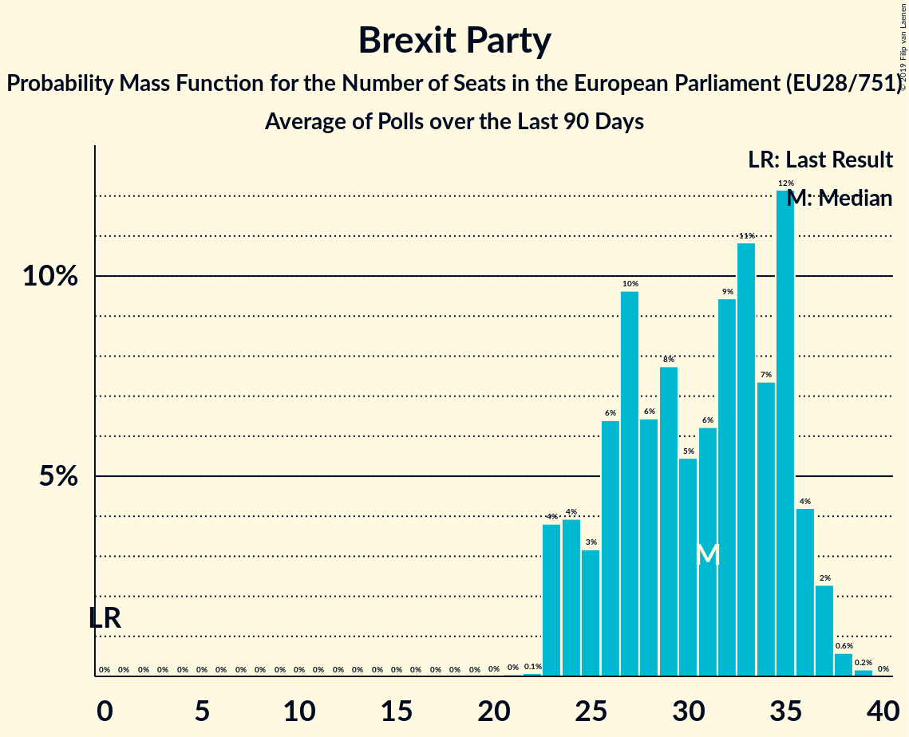

# Brexit Party

## Seats

Last result: **0** seats (General Election of 25 May 2014)

### Confidence Intervals

| Party | Last Result | Median | 80% Confidence Interval | 90% Confidence Interval | 95% Confidence Interval | 99% Confidence Interval |
|:-----:|:-----------:|:------:|:-----------------------:|:-----------------------:|:-----------------------:|:-----------------------:|
| Brexit Party | 0 | 31 | 27–35 | 26–35 | 25–35 | 24–37 |
| Brexit Party [GB-GBN] (BREXIT) | | 31 | 27–35 | 26–35 | 25–35 | 24–37 |

### Probability Mass Function

The following table shows the probability mass function per seat for the [poll average](average-2019-05-26.html) for Brexit Party.

| Number of Seats | Probability | Accumulated | Special Marks |
|:---------------:|:-----------:|:-----------:|:-------------:|
| 0 | 0% | 100% | Last Result |
| 1 | 0% | 100% |  |
| 2 | 0% | 100% |  |
| 3 | 0% | 100% |  |
| 4 | 0% | 100% |  |
| 5 | 0% | 100% |  |
| 6 | 0% | 100% |  |
| 7 | 0% | 100% |  |
| 8 | 0% | 100% |  |
| 9 | 0% | 100% |  |
| 10 | 0% | 100% |  |
| 11 | 0% | 100% |  |
| 12 | 0% | 100% |  |
| 13 | 0% | 100% |  |
| 14 | 0% | 100% |  |
| 15 | 0% | 100% |  |
| 16 | 0% | 100% |  |
| 17 | 0% | 100% |  |
| 18 | 0% | 100% |  |
| 19 | 0% | 100% |  |
| 20 | 0% | 100% |  |
| 21 | 0% | 100% |  |
| 22 | 0% | 100% |  |
| 23 | 0.2% | 100% |  |
| 24 | 0.8% | 99.8% |  |
| 25 | 2% | 99.0% |  |
| 26 | 4% | 97% |  |
| 27 | 16% | 92% |  |
| 28 | 8% | 76% |  |
| 29 | 12% | 68% |  |
| 30 | 5% | 57% |  |
| 31 | 3% | 51% | Median |
| 32 | 2% | 48% |  |
| 33 | 24% | 46% |  |
| 34 | 3% | 22% |  |
| 35 | 18% | 20% |  |
| 36 | 1.5% | 2% |  |
| 37 | 0.5% | 0.5% |  |
| 38 | 0% | 0% |  |

