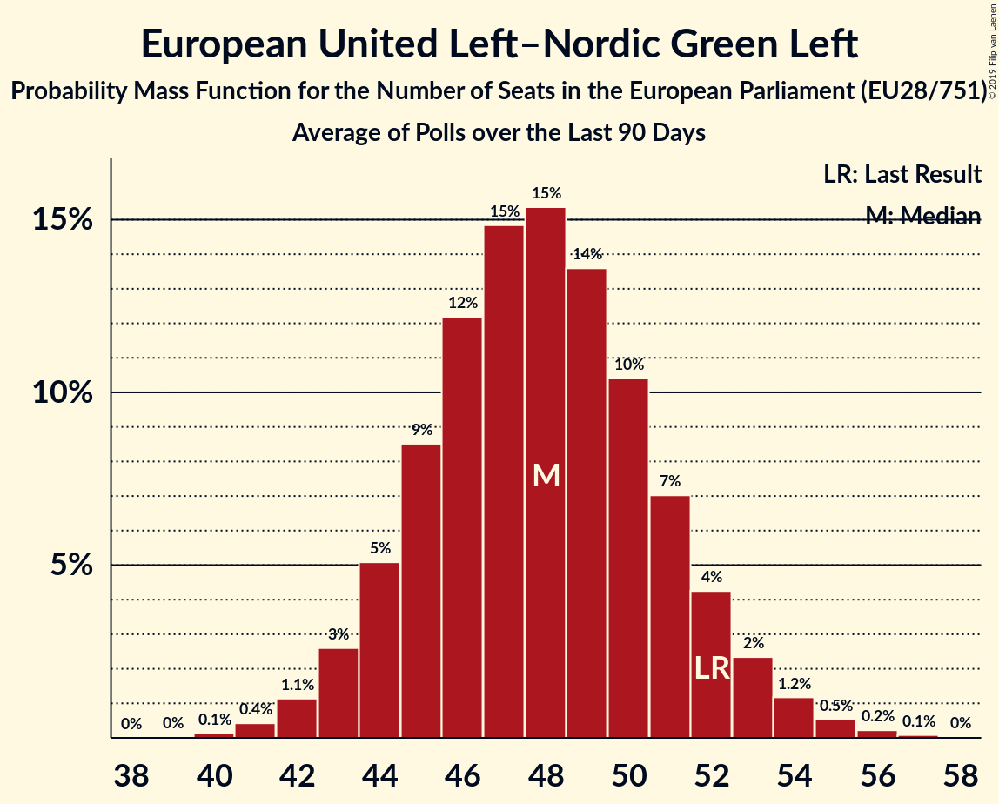

# European United Left–Nordic Green Left

## Seats

Last result: **52** seats (General Election of 25 May 2014)

### Confidence Intervals

| Party | Last Result | Median | 80% Confidence Interval | 90% Confidence Interval | 95% Confidence Interval | 99% Confidence Interval |
|:-----:|:-----------:|:------:|:-----------------------:|:-----------------------:|:-----------------------:|:-----------------------:|
| European United Left–Nordic Green Left | 52 | 48 | 45–51 | 44–52 | 43–53 | 41–55 |
| DIE LINKE [DE] (GUE/NGL) | | 8 | 7–9 | 6–10 | 6–10 | 6–11 |
| La France insoumise [FR] (GUE/NGL) | | 7 | 7–10 | 6–11 | 6–11 | 6–12 |
| Unidos Podemos [ES] (GUE/NGL) | | 7 | 6–9 | 5–9 | 5–9 | 5–10 |
| Συνασπισμός Ριζοσπαστικής Αριστεράς [GR] (GUE/NGL) | | 6 | 6–7 | 5–7 | 5–7 | 5–7 |
| Bloco de Esquerda [PT] (GUE/NGL) | | 2 | 1–2 | 1–2 | 1–2 | 1–2 |
| Coligação Democrática Unitária [PT] (GUE/NGL) | | 2 | 1–2 | 1–2 | 1–2 | 1–2 |
| Sinn Féin [IE] (GUE/NGL) | | 2 | 2–3 | 2–3 | 2–3 | 1–3 |
| Vänsterpartiet [SE] (GUE/NGL) | | 2 | 1–2 | 1–2 | 1–2 | 1–3 |
| Ανορθωτικό Κόμμα Εργαζόμενου Λαού [CY] (GUE/NGL) | | 2 | 1–2 | 1–2 | 1–2 | 1–2 |
| Enhedslisten–De Rød-Grønne [DK] (GUE/NGL) | | 1 | 1–2 | 1–2 | 1–2 | 1–2 |
| Komunistická strana Čech a Moravy [CZ] (GUE/NGL) | | 1 | 1–2 | 1–2 | 0–3 | 0–3 |
| PTB [BE-FRC] (GUE/NGL) | | 1 | 0–1 | 0–1 | 0–1 | 0–2 |
| Partei Mensch Umwelt Tierschutz [DE] (GUE/NGL) | | 1 | 1–2 | 0–2 | 0–2 | 0–3 |
| Partido Animalista Contra el Maltrato Animal [ES] (GUE/NGL) | | 1 | 0–1 | 0–1 | 0–1 | 0–1 |
| Partij voor de Dieren [NL] (GUE/NGL) | | 1 | 0–1 | 0–1 | 0–1 | 0–1 |
| Sinn Féin [GB-NIR] (GUE/NGL) | | 1 | 1–2 | 1–2 | 1–2 | 1–2 |
| Socialistische Partij [NL] (GUE/NGL) | | 1 | 0–1 | 0–1 | 0–1 | 0–2 |
| Vasemmistoliitto [FI] (GUE/NGL) | | 1 | 1 | 1 | 1 | 1–2 |
| Jaunā Saskaņa [LV] (GUE/NGL) | | 0 | 0–1 | 0–1 | 0–1 | 0–1 |
| Levica [SI] (GUE/NGL) | | 0 | 0–1 | 0–1 | 0–1 | 0–1 |
| Nouveau Parti anticapitaliste [FR] (GUE/NGL) | | 0 | 0 | 0 | 0 | 0 |
| PVDA [BE-VLG] (GUE/NGL) | | 0 | 0 | 0–1 | 0–1 | 0–1 |
| Parti communiste français [FR] (GUE/NGL) | | 0 | 0 | 0 | 0 | 0–4 |
| Solidarity–People Before Profit [IE] (GUE/NGL) | | 0 | 0 | 0 | 0 | 0 |
| Λαϊκή Ενότητα [GR] (GUE/NGL) | | 0 | 0 | 0 | 0 | 0–1 |
| Πλεύση Ελευθερίας [GR] (GUE/NGL) | | 0 | 0 | 0 | 0 | 0 |

### Probability Mass Function

The following table shows the probability mass function per seat for the [poll average](average-2019-05-26.html) for European United Left–Nordic Green Left.

| Number of Seats | Probability | Accumulated | Special Marks |
|:---------------:|:-----------:|:-----------:|:-------------:|
| 40 | 0.1% | 100% |  |
| 41 | 0.4% | 99.8% |  |
| 42 | 1.1% | 99.4% |  |
| 43 | 3% | 98% |  |
| 44 | 5% | 96% |  |
| 45 | 8% | 91% |  |
| 46 | 12% | 82% |  |
| 47 | 15% | 70% |  |
| 48 | 15% | 56% | Median |
| 49 | 14% | 40% |  |
| 50 | 11% | 27% |  |
| 51 | 7% | 16% |  |
| 52 | 4% | 9% | Last Result |
| 53 | 2% | 5% |  |
| 54 | 1.2% | 2% |  |
| 55 | 0.6% | 0.9% |  |
| 56 | 0.2% | 0.4% |  |
| 57 | 0.1% | 0.1% |  |
| 58 | 0% | 0% |  |

