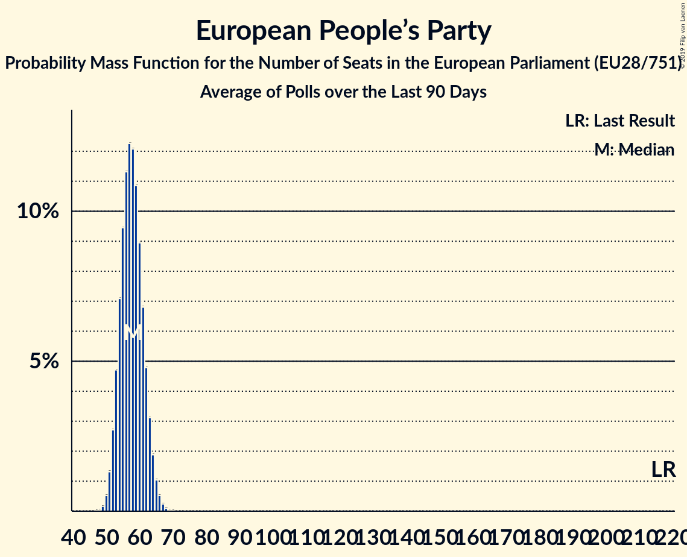

# European People’s Party

## Seats

Last result: **217** seats (General Election of 25 May 2014)

### Confidence Intervals

| Party | Last Result | Median | 80% Confidence Interval | 90% Confidence Interval | 95% Confidence Interval | 99% Confidence Interval |
|:-----:|:-----------:|:------:|:-----------------------:|:-----------------------:|:-----------------------:|:-----------------------:|
| European People’s Party | 217 | 57 | 53–61 | 52–62 | 51–63 | 50–65 |
| Koalicja Europejska [PL] (EPP) | | 19 | 17–23 | 16–24 | 16–24 | 15–25 |
| Partidul Național Liberal [RO] (EPP) | | 10 | 9–11 | 8–11 | 8–11 | 8–11 |
| Partido Social Democrata [PT] (EPP) | | 6 | 5–7 | 5–7 | 5–7 | 5–8 |
| Christen-Democratisch Appèl [NL] (EPP) | | 3 | 2–4 | 2–4 | 2–4 | 2–4 |
| Moderata samlingspartiet [SE] (EPP) | | 3 | 2–4 | 2–4 | 2–4 | 2–4 |
| Kristdemokraterna [SE] (EPP) | | 2 | 2 | 2 | 2–3 | 2–3 |
| Partidul Mișcarea Populară [RO] (EPP) | | 2 | 0–2 | 0–2 | 0–2 | 0–3 |
| Partit Nazzjonalista [MT] (EPP) | | 2 | 2–3 | 2–3 | 2–3 | 2–3 |
| Slovenska demokratska stranka–Slovenska ljudska stranka [SI] (EPP) | | 2 | 2–4 | 1–4 | 1–4 | 1–4 |
| CDS–Partido Popular [PT] (EPP) | | 1 | 1–2 | 1–2 | 1–2 | 1–2 |
| Christlich-Soziale Partei [2014O] (EPP) | | 1 | 1 | 1 | 1 | 1 |
| Jaunā Vienotība [LV] (EPP) | | 1 | 1–2 | 1–2 | 1–2 | 1–2 |
| Jaunā konservatīvā partija [LV] (EPP) | | 1 | 0–1 | 0–1 | 0–1 | 0–1 |
| Kresťanskodemokratické hnutie [SK] (EPP) | | 1 | 1 | 1 | 1 | 1 |
| Nova Slovenija–Krščanski demokrati [SI] (EPP) | | 1 | 0–1 | 0–1 | 0–1 | 0–1 |
| Zaļo un Zemnieku savienība [LV] (EPP) | | 1 | 0–1 | 0–1 | 0–1 | 0–1 |
| KPV LV [LV] (EPP) | | 0 | 0 | 0 | 0 | 0 |
| MOST–HÍD [SK] (EPP) | | 0 | 0–1 | 0–1 | 0–1 | 0–1 |
| Strana maďarskej koalície–Magyar Koalíció Pártja [SK] (EPP) | | 0 | 0 | 0 | 0–1 | 0–1 |
| Uniunea Democrată Maghiară din România [RO] (EPP) | | 0 | 0–2 | 0–2 | 0–2 | 0–2 |

### Probability Mass Function

The following table shows the probability mass function per seat for the [poll average](average-2019-05-31.html) for European People’s Party.

| Number of Seats | Probability | Accumulated | Special Marks |
|:---------------:|:-----------:|:-----------:|:-------------:|
| 48 | 0.1% | 100% |  |
| 49 | 0.3% | 99.9% |  |
| 50 | 0.8% | 99.6% |  |
| 51 | 2% | 98.8% |  |
| 52 | 4% | 97% |  |
| 53 | 6% | 93% |  |
| 54 | 9% | 87% |  |
| 55 | 11% | 78% |  |
| 56 | 13% | 66% |  |
| 57 | 13% | 53% | Median |
| 58 | 12% | 41% |  |
| 59 | 10% | 29% |  |
| 60 | 7% | 19% |  |
| 61 | 5% | 12% |  |
| 62 | 3% | 7% |  |
| 63 | 2% | 4% |  |
| 64 | 1.0% | 2% |  |
| 65 | 0.4% | 0.7% |  |
| 66 | 0.2% | 0.3% |  |
| 67 | 0.1% | 0.1% |  |
| 68 | 0% | 0% |  |
| 69 | 0% | 0% |  |
| 70 | 0% | 0% |  |
| 71 | 0% | 0% |  |
| 72 | 0% | 0% |  |
| 73 | 0% | 0% |  |
| 74 | 0% | 0% |  |
| 75 | 0% | 0% |  |
| 76 | 0% | 0% |  |
| 77 | 0% | 0% |  |
| 78 | 0% | 0% |  |
| 79 | 0% | 0% |  |
| 80 | 0% | 0% |  |
| 81 | 0% | 0% |  |
| 82 | 0% | 0% |  |
| 83 | 0% | 0% |  |
| 84 | 0% | 0% |  |
| 85 | 0% | 0% |  |
| 86 | 0% | 0% |  |
| 87 | 0% | 0% |  |
| 88 | 0% | 0% |  |
| 89 | 0% | 0% |  |
| 90 | 0% | 0% |  |
| 91 | 0% | 0% |  |
| 92 | 0% | 0% |  |
| 93 | 0% | 0% |  |
| 94 | 0% | 0% |  |
| 95 | 0% | 0% |  |
| 96 | 0% | 0% |  |
| 97 | 0% | 0% |  |
| 98 | 0% | 0% |  |
| 99 | 0% | 0% |  |
| 100 | 0% | 0% |  |
| 101 | 0% | 0% |  |
| 102 | 0% | 0% |  |
| 103 | 0% | 0% |  |
| 104 | 0% | 0% |  |
| 105 | 0% | 0% |  |
| 106 | 0% | 0% |  |
| 107 | 0% | 0% |  |
| 108 | 0% | 0% |  |
| 109 | 0% | 0% |  |
| 110 | 0% | 0% |  |
| 111 | 0% | 0% |  |
| 112 | 0% | 0% |  |
| 113 | 0% | 0% |  |
| 114 | 0% | 0% |  |
| 115 | 0% | 0% |  |
| 116 | 0% | 0% |  |
| 117 | 0% | 0% |  |
| 118 | 0% | 0% |  |
| 119 | 0% | 0% |  |
| 120 | 0% | 0% |  |
| 121 | 0% | 0% |  |
| 122 | 0% | 0% |  |
| 123 | 0% | 0% |  |
| 124 | 0% | 0% |  |
| 125 | 0% | 0% |  |
| 126 | 0% | 0% |  |
| 127 | 0% | 0% |  |
| 128 | 0% | 0% |  |
| 129 | 0% | 0% |  |
| 130 | 0% | 0% |  |
| 131 | 0% | 0% |  |
| 132 | 0% | 0% |  |
| 133 | 0% | 0% |  |
| 134 | 0% | 0% |  |
| 135 | 0% | 0% |  |
| 136 | 0% | 0% |  |
| 137 | 0% | 0% |  |
| 138 | 0% | 0% |  |
| 139 | 0% | 0% |  |
| 140 | 0% | 0% |  |
| 141 | 0% | 0% |  |
| 142 | 0% | 0% |  |
| 143 | 0% | 0% |  |
| 144 | 0% | 0% |  |
| 145 | 0% | 0% |  |
| 146 | 0% | 0% |  |
| 147 | 0% | 0% |  |
| 148 | 0% | 0% |  |
| 149 | 0% | 0% |  |
| 150 | 0% | 0% |  |
| 151 | 0% | 0% |  |
| 152 | 0% | 0% |  |
| 153 | 0% | 0% |  |
| 154 | 0% | 0% |  |
| 155 | 0% | 0% |  |
| 156 | 0% | 0% |  |
| 157 | 0% | 0% |  |
| 158 | 0% | 0% |  |
| 159 | 0% | 0% |  |
| 160 | 0% | 0% |  |
| 161 | 0% | 0% |  |
| 162 | 0% | 0% |  |
| 163 | 0% | 0% |  |
| 164 | 0% | 0% |  |
| 165 | 0% | 0% |  |
| 166 | 0% | 0% |  |
| 167 | 0% | 0% |  |
| 168 | 0% | 0% |  |
| 169 | 0% | 0% |  |
| 170 | 0% | 0% |  |
| 171 | 0% | 0% |  |
| 172 | 0% | 0% |  |
| 173 | 0% | 0% |  |
| 174 | 0% | 0% |  |
| 175 | 0% | 0% |  |
| 176 | 0% | 0% |  |
| 177 | 0% | 0% |  |
| 178 | 0% | 0% |  |
| 179 | 0% | 0% |  |
| 180 | 0% | 0% |  |
| 181 | 0% | 0% |  |
| 182 | 0% | 0% |  |
| 183 | 0% | 0% |  |
| 184 | 0% | 0% |  |
| 185 | 0% | 0% |  |
| 186 | 0% | 0% |  |
| 187 | 0% | 0% |  |
| 188 | 0% | 0% |  |
| 189 | 0% | 0% |  |
| 190 | 0% | 0% |  |
| 191 | 0% | 0% |  |
| 192 | 0% | 0% |  |
| 193 | 0% | 0% |  |
| 194 | 0% | 0% |  |
| 195 | 0% | 0% |  |
| 196 | 0% | 0% |  |
| 197 | 0% | 0% |  |
| 198 | 0% | 0% |  |
| 199 | 0% | 0% |  |
| 200 | 0% | 0% |  |
| 201 | 0% | 0% |  |
| 202 | 0% | 0% |  |
| 203 | 0% | 0% |  |
| 204 | 0% | 0% |  |
| 205 | 0% | 0% |  |
| 206 | 0% | 0% |  |
| 207 | 0% | 0% |  |
| 208 | 0% | 0% |  |
| 209 | 0% | 0% |  |
| 210 | 0% | 0% |  |
| 211 | 0% | 0% |  |
| 212 | 0% | 0% |  |
| 213 | 0% | 0% |  |
| 214 | 0% | 0% |  |
| 215 | 0% | 0% |  |
| 216 | 0% | 0% |  |
| 217 | 0% | 0% | Last Result |

