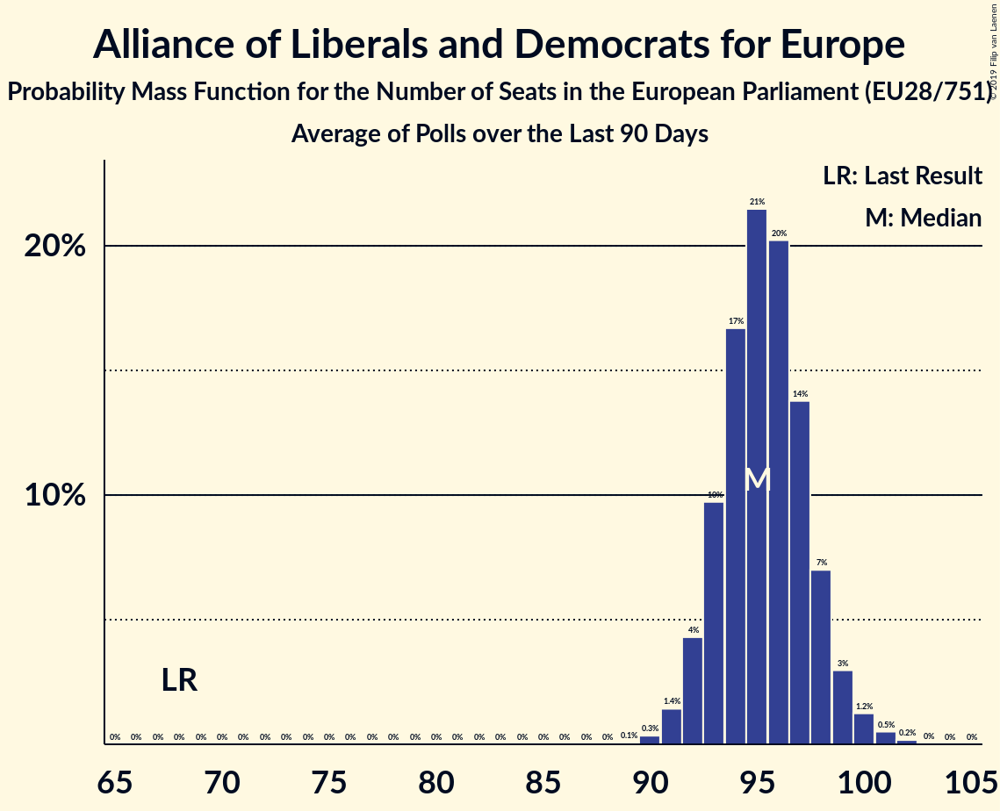

# Alliance of Liberals and Democrats for Europe

## Seats

Last result: **68** seats (General Election of 25 May 2014)

### Confidence Intervals

| Party | Last Result | Median | 80% Confidence Interval | 90% Confidence Interval | 95% Confidence Interval | 99% Confidence Interval |
|:-----:|:-----------:|:------:|:-----------------------:|:-----------------------:|:-----------------------:|:-----------------------:|
| Alliance of Liberals and Democrats for Europe | 68 | 30 | 28–32 | 27–33 | 27–33 | 26–35 |
| Ciudadanos–Partido de la Ciudadanía [ES] (ALDE) | | 8 | 7–9 | 7–9 | 7–9 | 7–10 |
| Freie Demokratische Partei [DE] (ALDE) | | 8 | 6–9 | 6–10 | 6–10 | 6–10 |
| Venstre [DK] (ALDE) | | 3 | 3–4 | 3–4 | 3–4 | 3–4 |
| Eesti Keskerakond [EE] (ALDE) | | 2 | 2 | 1–2 | 1–2 | 1–2 |
| Eesti Reformierakond [EE] (ALDE) | | 2 | 2 | 2–3 | 2–3 | 2–3 |
| Suomen Keskusta [FI] (ALDE) | | 2 | 1–2 | 1–2 | 1–2 | 1–2 |
| Demokratesch Partei [LU] (ALDE) | | 1 | 1 | 1 | 1 | 1 |
| Freie Wähler [DE] (ALDE) | | 1 | 1–2 | 1–2 | 1–2 | 1–2 |
| NEOS–Das Neue Österreich und Liberales Forum [AT] (ALDE) | | 1 | 1–2 | 1–2 | 1–2 | 1–2 |
| Radikale Venstre [DK] (ALDE) | | 1 | 1 | 1 | 1 | 0–2 |
| Eesti 200 [EE] (ALDE) | | 0 | 0 | 0 | 0 | 0 |
| Liberal Alliance [DK] (ALDE) | | 0 | 0 | 0 | 0 | 0 |
| Più Europa [IT] (ALDE) | | 0 | 0 | 0–3 | 0–3 | 0–4 |
| Svenska folkpartiet i Finland [FI] (ALDE) | | 0 | 0–1 | 0–1 | 0–1 | 0–1 |
| Ένωση Κεντρώων [GR] (ALDE) | | 0 | 0 | 0 | 0 | 0 |

### Probability Mass Function

The following table shows the probability mass function per seat for the [poll average](average-2019-06-30.html) for Alliance of Liberals and Democrats for Europe.

| Number of Seats | Probability | Accumulated | Special Marks |
|:---------------:|:-----------:|:-----------:|:-------------:|
| 25 | 0.3% | 100% |  |
| 26 | 2% | 99.7% |  |
| 27 | 6% | 98% |  |
| 28 | 14% | 91% |  |
| 29 | 21% | 78% |  |
| 30 | 23% | 57% | Median |
| 31 | 18% | 34% |  |
| 32 | 10% | 17% |  |
| 33 | 4% | 7% |  |
| 34 | 2% | 2% |  |
| 35 | 0.5% | 0.7% |  |
| 36 | 0.2% | 0.2% |  |
| 37 | 0% | 0.1% |  |
| 38 | 0% | 0% |  |
| 39 | 0% | 0% |  |
| 40 | 0% | 0% |  |
| 41 | 0% | 0% |  |
| 42 | 0% | 0% |  |
| 43 | 0% | 0% |  |
| 44 | 0% | 0% |  |
| 45 | 0% | 0% |  |
| 46 | 0% | 0% |  |
| 47 | 0% | 0% |  |
| 48 | 0% | 0% |  |
| 49 | 0% | 0% |  |
| 50 | 0% | 0% |  |
| 51 | 0% | 0% |  |
| 52 | 0% | 0% |  |
| 53 | 0% | 0% |  |
| 54 | 0% | 0% |  |
| 55 | 0% | 0% |  |
| 56 | 0% | 0% |  |
| 57 | 0% | 0% |  |
| 58 | 0% | 0% |  |
| 59 | 0% | 0% |  |
| 60 | 0% | 0% |  |
| 61 | 0% | 0% |  |
| 62 | 0% | 0% |  |
| 63 | 0% | 0% |  |
| 64 | 0% | 0% |  |
| 65 | 0% | 0% |  |
| 66 | 0% | 0% |  |
| 67 | 0% | 0% |  |
| 68 | 0% | 0% | Last Result |

