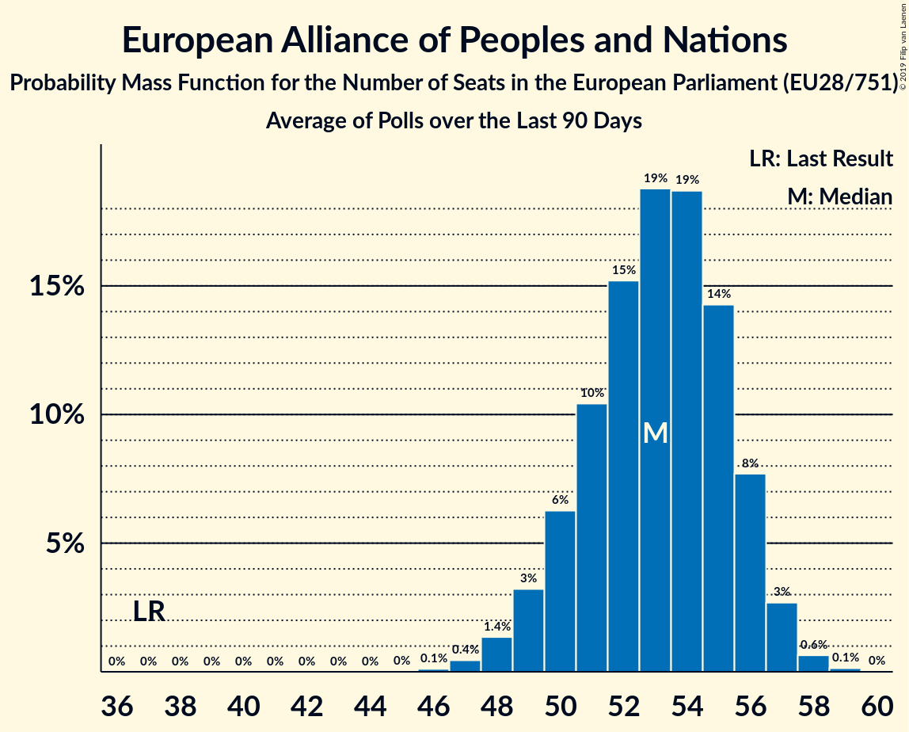

# European Alliance of Peoples and Nations

Members registered from **15 countries**:

> AT, BE, BG, CZ, DE, DK, EE, ES, FI, FR, GB, GR, HR, IT, NL

## Seats

Last result: **37** seats (General Election of 25 May 2014)

Current median: **83** seats (+46 seats)

At least one member in **12 countries** have a median of 1 seat or more:

> AT, BE, CZ, DE, DK, EE, ES, FI, FR, GR, IT, NL

### Confidence Intervals

| Party | Area | Last Result | Median | 80% Confidence Interval | 90% Confidence Interval | 95% Confidence Interval | 99% Confidence Interval |
|:-----:|:----:|:-----------:|:------:|:-----------------------:|:-----------------------:|:-----------------------:|:-----------------------:|
| European Alliance of Peoples and Nations | EU | 37 | 83 | 80–85 | 79–86 | 78–87 | 77–88 |
| Lega Nord | IT | | 27 | 25–29 | 25–30 | 24–30 | 23–31 |
| Rassemblement national | FR | | 22 | 22 | 22 | 22 | 22 |
| Alternative für Deutschland | DE | | 13 | 12–13 | 11–14 | 11–14 | 11–16 |
| Vox | ES | | 4 | 4–5 | 4–5 | 3–5 | 3–6 |
| Freiheitliche Partei Österreichs | AT | | 3 | 3–4 | 3–4 | 3–4 | 3–5 |
| Perussuomalaiset | FI | | 3 | 3 | 2–3 | 2–3 | 2–4 |
| Vlaams Belang | BE-VLG | | 3 | 3 | 3 | 3 | 3 |
| Svoboda a přímá demokracie | CZ | | 2 | 2–3 | 2–3 | 2–3 | 2–3 |
| Dansk Folkeparti | DK | | 1 | 1–2 | 1–2 | 1–2 | 1–2 |
| Eesti Konservatiivne Rahvaerakond | EE | | 1 | 1 | 1–2 | 1–2 | 1–2 |
| Partij voor de Vrijheid | NL | | 1 | 1–2 | 1–2 | 1–2 | 1–2 |
| Ελληνική Λύση | GR | | 1 | 0–1 | 0–1 | 0–1 | 0–1 |
| Neovisni za Hrvatsku | HR | | 0 | 0–1 | 0–1 | 0–1 | 0–1 |
| UK Independence Party | GB-GBN | | 0 | 0 | 0 | 0 | 0 |
| Воля | BG | | 0 | 0 | 0 | 0 | 0 |

### Probability Mass Function

The following table shows the probability mass function per seat for the [poll average](average-2019-06-30.html) for European Alliance of Peoples and Nations.

| Number of Seats | Probability | Accumulated | Special Marks |
|:---------------:|:-----------:|:-----------:|:-------------:|
| 37 | 0% | 100% | Last Result |
| 38 | 0% | 100% |  |
| 39 | 0% | 100% |  |
| 40 | 0% | 100% |  |
| 41 | 0% | 100% |  |
| 42 | 0% | 100% |  |
| 43 | 0% | 100% |  |
| 44 | 0% | 100% |  |
| 45 | 0% | 100% |  |
| 46 | 0% | 100% |  |
| 47 | 0% | 100% |  |
| 48 | 0% | 100% |  |
| 49 | 0% | 100% |  |
| 50 | 0% | 100% |  |
| 51 | 0% | 100% |  |
| 52 | 0% | 100% |  |
| 53 | 0% | 100% |  |
| 54 | 0% | 100% |  |
| 55 | 0% | 100% |  |
| 56 | 0% | 100% |  |
| 57 | 0% | 100% |  |
| 58 | 0% | 100% |  |
| 59 | 0% | 100% |  |
| 60 | 0% | 100% |  |
| 61 | 0% | 100% |  |
| 62 | 0% | 100% |  |
| 63 | 0% | 100% |  |
| 64 | 0% | 100% |  |
| 65 | 0% | 100% |  |
| 66 | 0% | 100% |  |
| 67 | 0% | 100% |  |
| 68 | 0% | 100% |  |
| 69 | 0% | 100% |  |
| 70 | 0% | 100% |  |
| 71 | 0% | 100% |  |
| 72 | 0% | 100% |  |
| 73 | 0% | 100% |  |
| 74 | 0% | 100% |  |
| 75 | 0% | 100% |  |
| 76 | 0.2% | 100% |  |
| 77 | 0.6% | 99.8% |  |
| 78 | 2% | 99.2% |  |
| 79 | 4% | 97% |  |
| 80 | 8% | 93% |  |
| 81 | 14% | 85% |  |
| 82 | 18% | 71% |  |
| 83 | 19% | 53% | Median |
| 84 | 15% | 35% |  |
| 85 | 10% | 19% |  |
| 86 | 5% | 9% |  |
| 87 | 2% | 3% |  |
| 88 | 0.8% | 1.1% |  |
| 89 | 0.2% | 0.3% |  |
| 90 | 0.1% | 0.1% |  |
| 91 | 0% | 0% |  |

