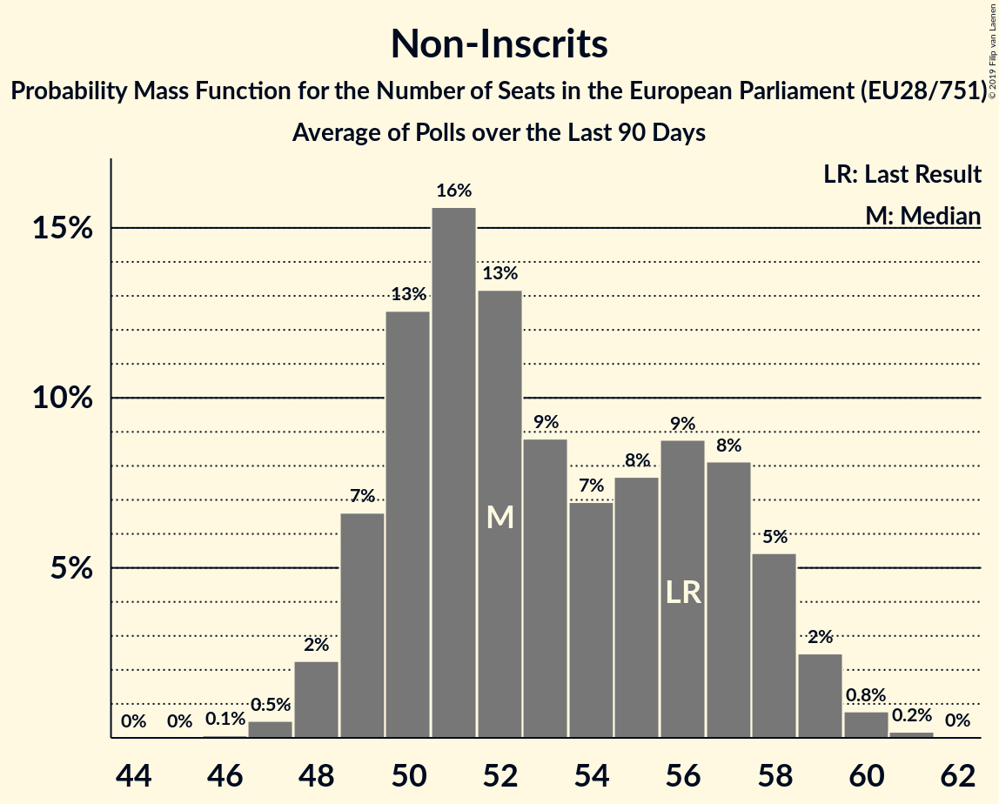

# Non-Inscrits

Members registered from 1 countries:

GR

## Seats

Last result: **21** seats (General Election of 25 May 2014)

Current median: **2** seats (-19 seats)

At least one members in 1 countries have a median of 1 seat or more:

GR

### Confidence Intervals

| Party | Last Result | Median | 80% Confidence Interval | 90% Confidence Interval | 95% Confidence Interval | 99% Confidence Interval |
|:-----:|:-----------:|:------:|:-----------------------:|:-----------------------:|:-----------------------:|:-----------------------:|
| Non-Inscrits | 21 | 2 | 2 | 2 | 2–3 | 1–3 |
| Κομμουνιστικό Κόμμα Ελλάδας [GR] | | 1 | 1 | 1 | 1–2 | 1–2 |
| Χρυσή Αυγή [GR] | | 1 | 1 | 1 | 1 | 0–2 |

### Probability Mass Function

The following table shows the probability mass function per seat for the [poll average](average-2019-06-30.html) for Non-Inscrits.

| Number of Seats | Probability | Accumulated | Special Marks |
|:---------------:|:-----------:|:-----------:|:-------------:|
| 1 | 2% | 100% |  |
| 2 | 93% | 98% | Median |
| 3 | 5% | 5% |  |
| 4 | 0% | 0% |  |
| 5 | 0% | 0% |  |
| 6 | 0% | 0% |  |
| 7 | 0% | 0% |  |
| 8 | 0% | 0% |  |
| 9 | 0% | 0% |  |
| 10 | 0% | 0% |  |
| 11 | 0% | 0% |  |
| 12 | 0% | 0% |  |
| 13 | 0% | 0% |  |
| 14 | 0% | 0% |  |
| 15 | 0% | 0% |  |
| 16 | 0% | 0% |  |
| 17 | 0% | 0% |  |
| 18 | 0% | 0% |  |
| 19 | 0% | 0% |  |
| 20 | 0% | 0% |  |
| 21 | 0% | 0% | Last Result |

