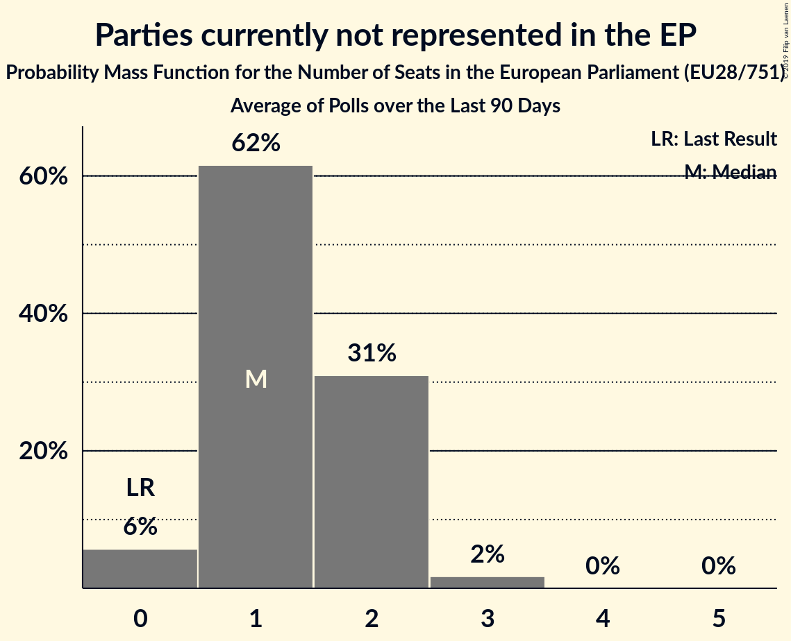

# Parties currently not represented in the EP

Members registered from **5 countries**:

> DK, EE, FR, GB, NL

## Seats

Last result: **0** seats (General Election of 25 May 2014)

Current median: **0** seats (0 seats)

At least one member in **0 countries** have a median of 1 seat or more:

> 

### Confidence Intervals

| Party | Area | Last Result | Median | 80% Confidence Interval | 90% Confidence Interval | 95% Confidence Interval | 99% Confidence Interval |
|:-----:|:----:|:-----------:|:------:|:-----------------------:|:-----------------------:|:-----------------------:|:-----------------------:|
| Parties currently not represented in the EP | EU | 0 | 0 | 0–1 | 0–1 | 0–1 | 0–1 |
| 50Plus [NL] (*) | NL | | 0 | 0 | 0–1 | 0–1 | 0–1 |
| Denk [NL] (*) | NL | | 0 | 0 | 0 | 0 | 0 |
| Eesti Vabaerakond [EE] (*) | EE | | 0 | 0 | 0 | 0 | 0 |
| Klaus Riskær Pedersen [DK] (*) | DK | | 0 | 0 | 0 | 0 | 0 |
| Lutte Ouvrière [FR] (*) | FR | | 0 | 0 | 0 | 0 | 0 |
| Mouvement des gilets jaunes [FR] (*) | FR | | 0 | 0 | 0 | 0 | 0 |
| Nye Borgerlige [DK] (*) | DK | | 0 | 0 | 0 | 0–1 | 0–1 |
| Résistons! [FR] (*) | FR | | 0 | 0 | 0 | 0 | 0 |
| Stram Kurs [DK] (*) | DK | | 0 | 0 | 0 | 0 | 0 |
| Traditional Unionist Voice [GB-NIR] (*) | GB-NIR | | 0 | 0 | 0 | 0 | 0 |
| Union populaire républicaine [FR] (*) | FR | | 0 | 0 | 0 | 0 | 0 |

### Probability Mass Function

The following table shows the probability mass function per seat for the [poll average](average-2019-06-30.html) for Parties currently not represented in the EP.

| Number of Seats | Probability | Accumulated | Special Marks |
|:---------------:|:-----------:|:-----------:|:-------------:|
| 0 | 90% | 100% | Last Result, Median |
| 1 | 10% | 10% |  |
| 2 | 0.3% | 0.3% |  |
| 3 | 0% | 0% |  |

