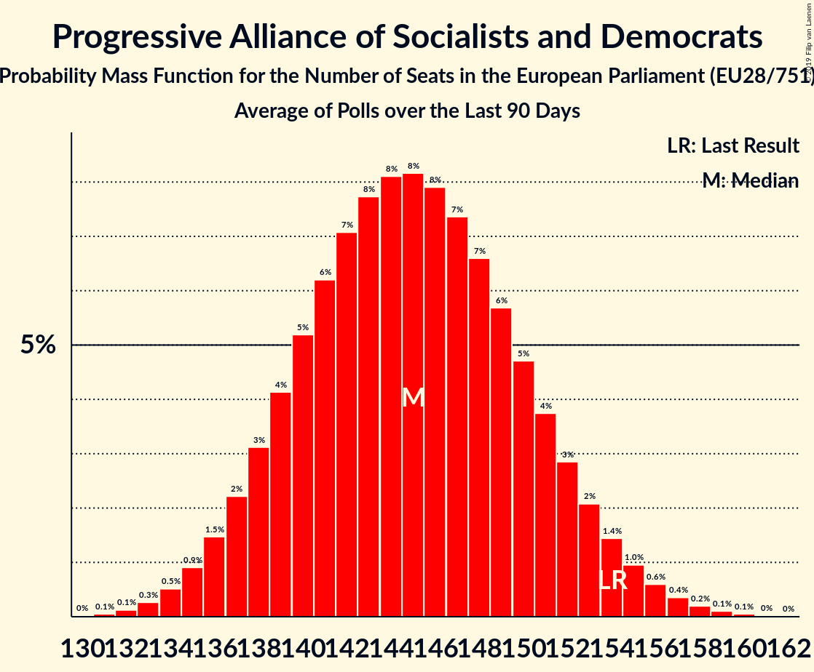

# Progressive Alliance of Socialists and Democrats

Members registered from **28 countries**:

> AT, BE, BG, CY, CZ, DE, DK, EE, ES, FI, FR, GB, GR, HR, HU, IE, IT, LT, LU, LV, MT, NL, PL, PT, RO, SE, SI, SK

## Seats

Last result: **154** seats (General Election of 25 May 2014)

Current median: **150** seats (-4 seats)

At least one member in **27 countries** have a median of 1 seat or more:

> AT, BE, BG, CY, CZ, DE, DK, EE, ES, FI, FR, GB, GR, HR, HU, IT, LT, LU, LV, MT, NL, PL, PT, RO, SE, SI, SK

### Confidence Intervals

| Party | Area | Last Result | Median | 80% Confidence Interval | 90% Confidence Interval | 95% Confidence Interval | 99% Confidence Interval |
|:-----:|:----:|:-----------:|:------:|:-----------------------:|:-----------------------:|:-----------------------:|:-----------------------:|
| Progressive Alliance of Socialists and Democrats | EU | 154 | 150 | 144–156 | 142–158 | 141–159 | 138–162 |
| Labour Party | GB-GBN | | 25 | 20–26 | 20–26 | 19–27 | 18–28 |
| Partido Socialista Obrero Español | ES | | 15 | 15 | 15 | 15 | 15–16 |
| Sozialdemokratische Partei Deutschlands | DE | | 15 | 12–16 | 11–16 | 11–17 | 11–18 |
| Partito Democratico | IT | | 14 | 12–16 | 12–16 | 11–17 | 11–18 |
| Partido Socialista | PT | | 10 | 10 | 10 | 10 | 10 |
| Partidul Social Democrat | RO | | 8 | 7–9 | 7–10 | 6–10 | 6–10 |
| Българска социалистическа партия | BG | | 6 | 5–6 | 5–6 | 5–7 | 5–7 |
| Parti socialiste | FR | | 5 | 5 | 5 | 5 | 5 |
| Sveriges socialdemokratiska arbetareparti | SE | | 5 | 5 | 4–6 | 4–6 | 4–6 |
| Partit Laburista | MT | | 4 | 4 | 3–4 | 3–4 | 3–4 |
| Socialdemokraterne | DK | | 4 | 4 | 4–5 | 4–5 | 4–5 |
| Socijaldemokratska partija Hrvatske | HR | | 4 | 3–4 | 3–5 | 3–5 | 3–5 |
| Sozialdemokratische Partei Österreichs | AT | | 4 | 3–4 | 3–4 | 3–4 | 3–4 |
| Demokratikus Koalíció | HU | | 3 | 2–3 | 2–3 | 2–3 | 2–3 |
| PRO România | RO | | 3 | 2–3 | 2–4 | 2–4 | 2–4 |
| Partij van de Arbeid | NL | | 3 | 2–4 | 2–4 | 2–4 | 2–5 |
| SMER–sociálna demokracia | SK | | 3 | 3 | 3–4 | 3–4 | 2–4 |
| Wiosna | PL | | 3 | 0–4 | 0–4 | 0–4 | 0–4 |
| Lietuvos socialdemokratų partija | LT | | 2 | 1–2 | 1–2 | 1–3 | 1–3 |
| Parti Socialiste | BE-FRC | | 2 | 2 | 2–3 | 2–3 | 2–3 |
| Sociāldemokrātiskā Partija “Saskaņa” | LV | | 2 | 2–3 | 2–3 | 2–3 | 1–3 |
| Suomen Sosialidemokraattinen Puolue | FI | | 2 | 2–3 | 2–3 | 2–3 | 2–3 |
| Κίνημα Αλλαγής | GR | | 2 | 1–2 | 1–2 | 1–2 | 1–2 |
| Lëtzebuerger Sozialistesch Aarbechterpartei | LU | | 1 | 1 | 1 | 1 | 1 |
| Magyar Szocialista Párt–Párbeszéd | HU | | 1 | 1–2 | 1–2 | 1–2 | 1–2 |
| Socialistische Partij Anders | BE-VLG | | 1 | 1 | 1 | 1 | 0–1 |
| Socialni demokrati | SI | | 1 | 1 | 1 | 1 | 0–1 |
| Sotsiaaldemokraatlik Erakond | EE | | 1 | 0–1 | 0–1 | 0–1 | 0–1 |
| Česká strana sociálně demokratická | CZ | | 1 | 1–2 | 1–2 | 1–2 | 0–2 |
| Δημοκρατικό Κόμμα | CY | | 1 | 1 | 1 | 1 | 1 |
| Κίνημα Σοσιαλδημοκρατών | CY | | 1 | 1 | 1 | 1 | 1 |
| Génération·s, le mouvement | FR | | 0 | 0 | 0 | 0 | 0 |
| Labour Party | IE | | 0 | 0 | 0 | 0 | 0–1 |
| Liberi e Uguali | IT | | 0 | 0 | 0 | 0 | 0–3 |
| Lietuvos socialdemokratų darbo partija | LT | | 0 | 0 | 0–1 | 0–1 | 0–1 |
| Progresīvie | LV | | 0 | 0–1 | 0–1 | 0–1 | 0–1 |
| Social Democratic and Labour Party | GB-NIR | | 0 | 0–1 | 0–1 | 0–1 | 0–1 |
| Social Democrats | IE | | 0 | 0 | 0–1 | 0–1 | 0–1 |
| Sojusz Lewicy Demokratycznej | PL | | 0 | 0–4 | 0–4 | 0–4 | 0–5 |

### Probability Mass Function

The following table shows the probability mass function per seat for the [poll average](average-2019-11-30.html) for Progressive Alliance of Socialists and Democrats.

| Number of Seats | Probability | Accumulated | Special Marks |
|:---------------:|:-----------:|:-----------:|:-------------:|
| 135 | 0% | 100% |  |
| 136 | 0.1% | 99.9% |  |
| 137 | 0.2% | 99.8% |  |
| 138 | 0.3% | 99.6% |  |
| 139 | 0.6% | 99.3% |  |
| 140 | 0.9% | 98.7% |  |
| 141 | 1.4% | 98% |  |
| 142 | 2% | 96% |  |
| 143 | 3% | 94% |  |
| 144 | 4% | 91% |  |
| 145 | 5% | 88% |  |
| 146 | 6% | 83% |  |
| 147 | 7% | 77% |  |
| 148 | 7% | 70% |  |
| 149 | 8% | 63% |  |
| 150 | 8% | 55% | Median |
| 151 | 8% | 47% |  |
| 152 | 8% | 39% |  |
| 153 | 7% | 31% |  |
| 154 | 6% | 24% | Last Result |
| 155 | 5% | 18% |  |
| 156 | 4% | 13% |  |
| 157 | 3% | 9% |  |
| 158 | 2% | 6% |  |
| 159 | 1.5% | 4% |  |
| 160 | 1.0% | 2% |  |
| 161 | 0.6% | 1.2% |  |
| 162 | 0.3% | 0.6% |  |
| 163 | 0.2% | 0.3% |  |
| 164 | 0.1% | 0.1% |  |
| 165 | 0% | 0.1% |  |
| 166 | 0% | 0% |  |

