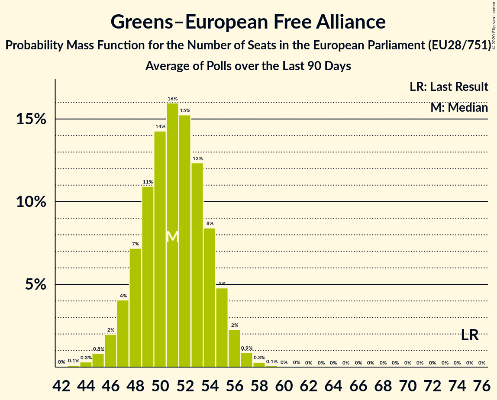

# Greens–European Free Alliance

Members registered from **11 countries**:

> BE, CY, CZ, DE, EU, HU, LT, LU, LV, MT, PT

## Seats

Last result: **75** seats (General Election of 25 May 2014)

Current median: **51** seats (-24 seats)

At least one member in **6 countries** have a median of 1 seat or more:

> BE, CZ, DE, EU, LT, LU

### Confidence Intervals

| Party | Area | Last Result | Median | 80% Confidence Interval | 90% Confidence Interval | 95% Confidence Interval | 99% Confidence Interval |
|:-----:|:----:|:-----------:|:------:|:-----------------------:|:-----------------------:|:-----------------------:|:-----------------------:|
| Greens–European Free Alliance | EU | 75 | 51 | 47–54 | 46–55 | 45–56 | 44–57 |
| Bündnis 90/Die Grünen | DE | | 21 | 19–22 | 18–22 | 18–23 | 18–24 |
| Europe Écologie Les Verts | EU27 | | 6 | 5–8 | 5–8 | 4–8 | 4–8 |
| GroenLinks | EU27 | | 4 | 2–4 | 2–5 | 2–5 | 2–5 |
| Die Grünen–Die Grüne Alternative | EU27 | | 3 | 3 | 3–4 | 2–4 | 2–4 |
| Česká pirátská strana | CZ | | 3 | 2–4 | 2–4 | 2–4 | 2–4 |
| Ecolo | BE-FRC | | 2 | 2 | 1–2 | 1–2 | 1–2 |
| Esquerra Republicana de Catalunya–Catalunya Sí | EU27 | | 2 | 1–2 | 1–2 | 1–3 | 1–3 |
| Lietuvos valstiečių ir žaliųjų sąjunga | LT | | 2 | 1–2 | 1–2 | 1–2 | 1–3 |
| Vihreä liitto | EU27 | | 2 | 2 | 2 | 2 | 2–3 |
| Coalició Compromís | EU27 | | 1 | 0–1 | 0–1 | 0–1 | 0–2 |
| Die PARTEI | DE | | 1 | 1–2 | 1–2 | 1–2 | 1–2 |
| Groen | BE-VLG | | 1 | 1 | 1 | 1 | 1–2 |
| Miljöpartiet de gröna | EU27 | | 1 | 1 | 0–1 | 0–1 | 0–1 |
| Socialistisk Folkeparti | EU27 | | 1 | 1 | 1 | 1 | 1 |
| déi gréng | LU | | 1 | 1 | 1 | 1 | 1 |
| Ökologisch-Demokratische Partei | DE | | 1 | 0–1 | 0–1 | 0–1 | 0–1 |
| Alternativet | EU27 | | 0 | 0 | 0 | 0 | 0 |
| Alternattiva Demokratika | MT | | 0 | 0 | 0 | 0 | 0 |
| Bloque Nacionalista Galego–Nós Candidatura Galega | EU27 | | 0 | 0 | 0 | 0 | 0 |
| Erakond Eestimaa Rohelised | EU27 | | 0 | 0 | 0 | 0 | 0 |
| Europa Verde | EU27 | | 0 | 0 | 0 | 0 | 0 |
| Green Party | EU27 | | 0 | 0–1 | 0–1 | 0–1 | 0–1 |
| LIVRE | PT | | 0 | 0 | 0 | 0 | 0 |
| Latvijas Krievu savienība | LV | | 0 | 0 | 0 | 0 | 0 |
| Lehet Más a Politika | HU | | 0 | 0 | 0 | 0 | 0–1 |
| Lietuvos Žaliųjų Partija | LT | | 0 | 0 | 0 | 0 | 0 |
| Pessoas–Animais–Natureza | PT | | 0 | 0–1 | 0–1 | 0–1 | 0–2 |
| Piratenpartei Deutschland | DE | | 0 | 0–1 | 0–1 | 0–1 | 0–1 |
| Piratepartei Lëtzebuerg | LU | | 0 | 0 | 0 | 0 | 0 |
| Strana zelených | CZ | | 0 | 0 | 0 | 0 | 0 |
| Volt Europa | DE | | 0 | 0–1 | 0–1 | 0–1 | 0–1 |
| Κίνημα Οικολόγων—Συνεργασία Πολιτών | CY | | 0 | 0 | 0 | 0 | 0 |

### Probability Mass Function

The following table shows the probability mass function per seat for the [poll average](average-2019-12-31.html) for Greens–European Free Alliance.

| Number of Seats | Probability | Accumulated | Special Marks |
|:---------------:|:-----------:|:-----------:|:-------------:|
| 41 | 0% | 100% |  |
| 42 | 0.1% | 99.9% |  |
| 43 | 0.3% | 99.8% |  |
| 44 | 0.7% | 99.5% |  |
| 45 | 2% | 98.8% |  |
| 46 | 3% | 97% |  |
| 47 | 6% | 94% |  |
| 48 | 9% | 88% |  |
| 49 | 12% | 80% |  |
| 50 | 14% | 68% |  |
| 51 | 15% | 54% | Median |
| 52 | 13% | 40% |  |
| 53 | 11% | 26% |  |
| 54 | 7% | 15% |  |
| 55 | 4% | 8% |  |
| 56 | 2% | 4% |  |
| 57 | 0.9% | 1.3% |  |
| 58 | 0.3% | 0.4% |  |
| 59 | 0.1% | 0.1% |  |
| 60 | 0% | 0% |  |
| 61 | 0% | 0% |  |
| 62 | 0% | 0% |  |
| 63 | 0% | 0% |  |
| 64 | 0% | 0% |  |
| 65 | 0% | 0% |  |
| 66 | 0% | 0% |  |
| 67 | 0% | 0% |  |
| 68 | 0% | 0% |  |
| 69 | 0% | 0% |  |
| 70 | 0% | 0% |  |
| 71 | 0% | 0% |  |
| 72 | 0% | 0% |  |
| 73 | 0% | 0% |  |
| 74 | 0% | 0% |  |
| 75 | 0% | 0% | Last Result |

