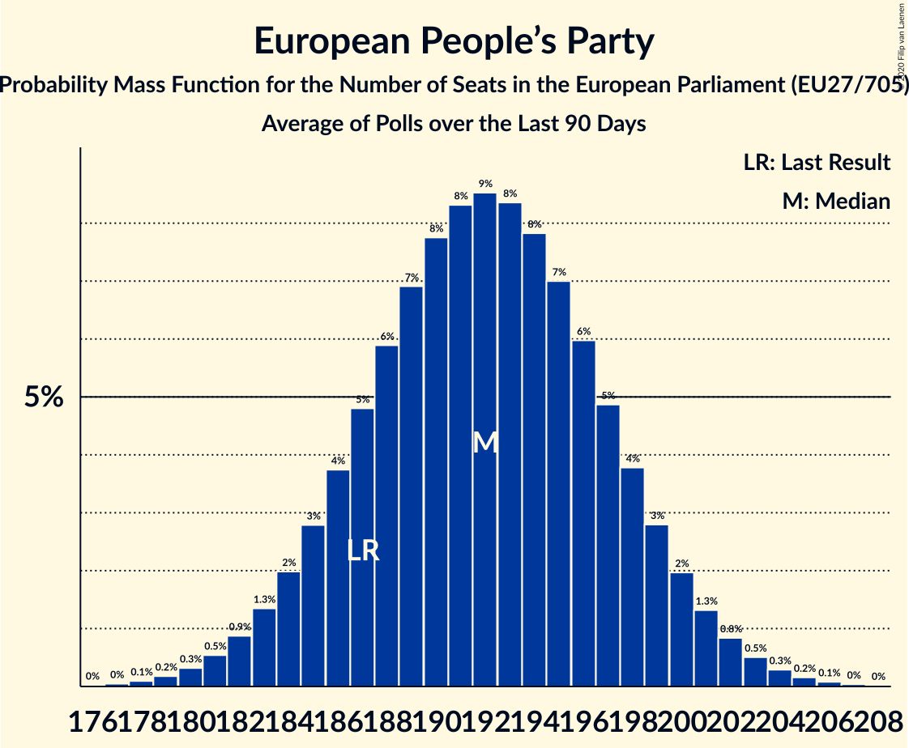

# European People’s Party

Members registered from **27 countries**:

> AT, BE, BG, CY, CZ, DE, DK, EE, ES, FI, FR, GR, HR, HU, IE, IT, LT, LU, LV, MT, NL, PL, PT, RO, SE, SI, SK

## Seats

Last result: **187** seats (General Election of 26 May 2019)

Current median: **191** seats (+4 seats)

At least one member in **26 countries** have a median of 1 seat or more:

> AT, BE, BG, CY, CZ, DE, DK, ES, FI, FR, GR, HR, HU, IE, IT, LT, LU, LV, MT, NL, PL, PT, RO, SE, SI, SK

### Confidence Intervals

| Party | Area | Last Result | Median | 80% Confidence Interval | 90% Confidence Interval | 95% Confidence Interval | 99% Confidence Interval |
|:-----:|:----:|:-----------:|:------:|:-----------------------:|:-----------------------:|:-----------------------:|:-----------------------:|
| European People’s Party | EU | 187 | 191 | 185–196 | 183–197 | 182–199 | 179–201 |
| Christlich Demokratische Union Deutschlands | DE | | 28 | 26–30 | 26–31 | 26–31 | 25–32 |
| Partido Popular | ES | | 14 | 13–16 | 13–16 | 12–17 | 12–17 |
| Fidesz–Kereszténydemokrata Néppárt | HU | | 13 | 12–14 | 11–14 | 11–14 | 11–14 |
| Partidul Național Liberal | RO | | 13 | 12–15 | 11–16 | 11–16 | 11–16 |
| Koalicja Obywatelska | PL | | 11 | 9–15 | 9–15 | 8–16 | 8–16 |
| Νέα Δημοκρατία | GR | | 11 | 10–12 | 10–12 | 10–12 | 10–12 |
| Österreichische Volkspartei | AT | | 9 | 8–10 | 8–10 | 8–10 | 7–11 |
| Christlich-Soziale Union in Bayern | DE | | 8 | 7–9 | 7–9 | 7–9 | 6–11 |
| Les Républicains | FR | | 7 | 6–9 | 6–9 | 5–9 | 5–10 |
| Forza Italia | IT | | 6 | 5–7 | 4–7 | 4–8 | 4–9 |
| Partido Social Democrata | PT | | 6 | 5–7 | 5–7 | 5–7 | 5–8 |
| Граждани за европейско развитие на България | BG | | 6 | 5–6 | 5–7 | 5–7 | 5–7 |
| Hrvatska demokratska zajednica | HR | | 5 | 4–5 | 3–5 | 3–5 | 3–6 |
| Koalicja Polska | PL | | 5 | 3–8 | 3–9 | 3–9 | 3–9 |
| OBYČAJNÍ ĽUDIA a nezávislé osobnosti | SK | | 5 | 4–5 | 4–5 | 4–5 | 4–6 |
| Moderata samlingspartiet | SE | | 4 | 4–5 | 4–5 | 4–5 | 3–5 |
| Slovenska demokratska stranka | SI | | 4 | 3–4 | 3–4 | 3–5 | 3–5 |
| Christen-Democratisch Appèl | NL | | 3 | 3 | 3 | 2–3 | 2–4 |
| Fine Gael | IE | | 3 | 2–5 | 2–5 | 2–6 | 2–6 |
| Kansallinen Kokoomus | FI | | 3 | 2–3 | 2–3 | 2–3 | 2–3 |
| Tėvynės sąjunga–Lietuvos krikščionys demokratai | LT | | 3 | 3–4 | 3–4 | 3–4 | 3–4 |
| Chrëschtlech-Sozial Vollekspartei | LU | | 2 | 2–3 | 2–3 | 2–3 | 2–3 |
| Partit Nazzjonalista | MT | | 2 | 2–3 | 2–3 | 2–3 | 1–3 |
| Δημοκρατικός Συναγερμός | CY | | 2 | 2 | 2 | 2 | 2 |
| 50Plus | NL | | 1 | 1–2 | 1–2 | 1–2 | 1–2 |
| Christen-Democratisch en Vlaams | BE-VLG | | 1 | 1–2 | 1–2 | 1–2 | 1–2 |
| ChristenUnie | NL | | 1 | 1 | 1 | 1–2 | 1–2 |
| Christlich-Soziale Partei | BE-DEG | | 1 | 1 | 1 | 1 | 1 |
| Det Konservative Folkeparti | DK | | 1 | 1 | 1 | 1 | 0–2 |
| Jaunā VIENOTĪBA | LV | | 1 | 1 | 1 | 1 | 1 |
| Jaunā konservatīvā partija | LV | | 1 | 1 | 1 | 1 | 1 |
| Kristdemokraterna | SE | | 1 | 1–2 | 1–2 | 1–2 | 1–2 |
| Křesťanská a demokratická unie–Československá strana lidová | CZ | | 1 | 0–2 | 0–2 | 0–2 | 0–2 |
| Starostové a nezávislí | CZ | | 1 | 0–1 | 0–1 | 0–2 | 0–2 |
| Zaļo un Zemnieku savienība | LV | | 1 | 1 | 1–2 | 1–2 | 1–2 |
| Демократична България | BG | | 1 | 1–2 | 1–2 | 1–2 | 0–2 |
| CDS–Partido Popular | PT | | 0 | 0–1 | 0–1 | 0–1 | 0–1 |
| Centre démocrate humaniste | BE-FRC | | 0 | 0 | 0 | 0–1 | 0–1 |
| Erakond Isamaa | EE | | 0 | 0 | 0 | 0 | 0–1 |
| Kresťanskodemokratické hnutie | SK | | 0 | 0–1 | 0–1 | 0–1 | 0–1 |
| Kristendemokraterne | DK | | 0 | 0 | 0 | 0 | 0 |
| Kristillisdemokraatit | FI | | 0 | 0 | 0 | 0 | 0 |
| MOST–HÍD | SK | | 0 | 0 | 0 | 0 | 0 |
| Nova Slovenija–Krščanski demokrati | SI | | 0 | 0–1 | 0–1 | 0–1 | 0–1 |
| Partidul Mișcarea Populară | RO | | 0 | 0–2 | 0–2 | 0–3 | 0–3 |
| Politiskā partija „KPV LV” | LV | | 0 | 0 | 0 | 0 | 0 |
| Slovenska ljudska stranka | SI | | 0 | 0 | 0 | 0 | 0 |
| Strana maďarskej koalície–Magyar Koalíció Pártja | SK | | 0 | 0 | 0 | 0–1 | 0–1 |
| TOP 09 | CZ | | 0 | 0–1 | 0–1 | 0–1 | 0–2 |
| Uniunea Democrată Maghiară din România | RO | | 0 | 0–2 | 0–2 | 0–2 | 0–2 |
| Za ľudí | SK | | 0 | 0 | 0–1 | 0–1 | 0–1 |

### Probability Mass Function

The following table shows the probability mass function per seat for the [poll average](average-2020-05-31.html) for European People’s Party.

| Number of Seats | Probability | Accumulated | Special Marks |
|:---------------:|:-----------:|:-----------:|:-------------:|
| 176 | 0% | 100% |  |
| 177 | 0.1% | 99.9% |  |
| 178 | 0.2% | 99.9% |  |
| 179 | 0.3% | 99.7% |  |
| 180 | 0.5% | 99.4% |  |
| 181 | 0.9% | 98.9% |  |
| 182 | 1.4% | 98% |  |
| 183 | 2% | 97% |  |
| 184 | 3% | 94% |  |
| 185 | 4% | 91% |  |
| 186 | 5% | 87% |  |
| 187 | 7% | 82% | Last Result |
| 188 | 8% | 75% |  |
| 189 | 9% | 68% |  |
| 190 | 9% | 59% |  |
| 191 | 9% | 50% | Median |
| 192 | 9% | 41% |  |
| 193 | 8% | 32% |  |
| 194 | 7% | 24% |  |
| 195 | 5% | 17% |  |
| 196 | 4% | 12% |  |
| 197 | 3% | 8% |  |
| 198 | 2% | 5% |  |
| 199 | 1.3% | 3% |  |
| 200 | 0.8% | 2% |  |
| 201 | 0.4% | 0.9% |  |
| 202 | 0.2% | 0.4% |  |
| 203 | 0.1% | 0.2% |  |
| 204 | 0.1% | 0.1% |  |
| 205 | 0% | 0% |  |

