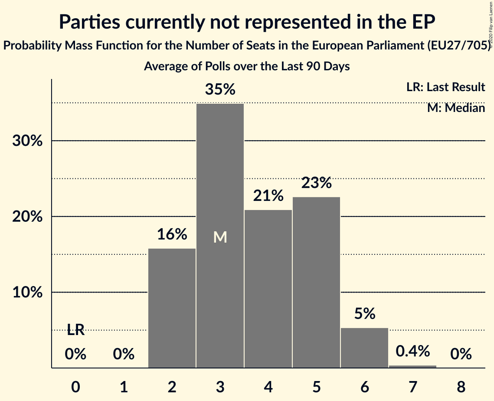

# Parties currently not represented in the EP

Members registered from **11 countries**:

> BG, DK, EE, FR, HR, IE, IT, LT, NL, RO, SK

## Seats

Last result: **0** seats (General Election of 26 May 2019)

Current median: **3** seats (+3 seats)

At least one member in **2 countries** have a median of 1 seat or more:

> BG, LT

### Confidence Intervals

| Party | Area | Last Result | Median | 80% Confidence Interval | 90% Confidence Interval | 95% Confidence Interval | 99% Confidence Interval |
|:-----:|:----:|:-----------:|:------:|:-----------------------:|:-----------------------:|:-----------------------:|:-----------------------:|
| Parties currently not represented in the EP | EU | 0 | 3 | 2–5 | 2–5 | 2–6 | 2–6 |
| Няма такава държава [BG] (*) | BG | | 2 | 2–3 | 2–3 | 2–3 | 2–3 |
| Partija tvarka ir teisingumas [LT] (*) | LT | | 1 | 1 | 1 | 1 | 0–1 |
| Aontú [IE] (*) | IE | | 0 | 0 | 0 | 0 | 0 |
| Bandić Milan 365–Stranka rada i solidarnosti [HR] (*) | HR | | 0 | 0 | 0 | 0 | 0 |
| Cambiamo! [IT] (*) | IT | | 0 | 0 | 0 | 0 | 0 |
| DENK [NL] (*) | NL | | 0 | 0 | 0 | 0 | 0 |
| Dobrá voľba [SK] (*) | SK | | 0 | 0 | 0 | 0 | 0 |
| Eesti Vabaerakond [EE] (*) | EE | | 0 | 0 | 0 | 0 | 0 |
| Independents [IE] (*) | IE | | 0 | 0 | 0 | 0 | 0 |
| Klaus Riskær Pedersen [DK] (*) | DK | | 0 | 0 | 0 | 0 | 0 |
| Lutte Ouvrière [FR] (*) | FR | | 0 | 0 | 0 | 0 | 0 |
| Nye Borgerlige [DK] (*) | DK | | 0 | 0 | 0 | 0 | 0 |
| Partidul Alianța Liberalilor și Democraților [RO] (*) | RO | | 0 | 0–2 | 0–2 | 0–2 | 0–2 |
| Partij voor de Toekomst [NL] (*) | NL | | 0 | 0 | 0 | 0 | 0 |
| Résistons! [FR] (*) | FR | | 0 | 0 | 0 | 0 | 0 |
| Stram Kurs [DK] (*) | DK | | 0 | 0 | 0 | 0 | 0 |
| Stranka antikorupcije, razvoja i transparentnosti [HR] (*) | HR | | 0 | 0 | 0 | 0 | 0 |
| Union populaire républicaine [FR] (*) | FR | | 0 | 0 | 0 | 0 | 0 |
| VLASŤ [SK] (*) | SK | | 0 | 0 | 0 | 0 | 0 |

### Probability Mass Function

The following table shows the probability mass function per seat for the [poll average](average-2020-05-31.html) for Parties currently not represented in the EP.

| Number of Seats | Probability | Accumulated | Special Marks |
|:---------------:|:-----------:|:-----------:|:-------------:|
| 0 | 0% | 100% | Last Result |
| 1 | 0% | 100% |  |
| 2 | 18% | 100% |  |
| 3 | 37% | 82% | Median |
| 4 | 19% | 45% |  |
| 5 | 23% | 26% |  |
| 6 | 3% | 3% |  |
| 7 | 0% | 0% |  |

