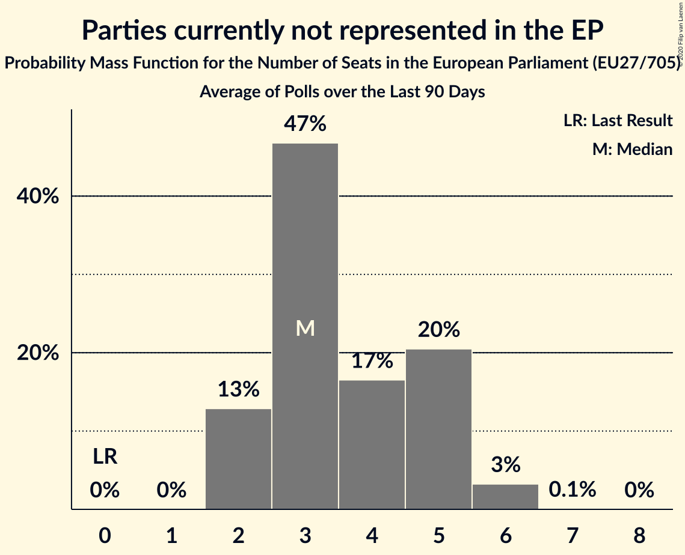

# Parties currently not represented in the EP

Members registered from **11 countries**:

> AT, BG, DK, EE, FR, HR, IE, IT, NL, RO, SK

## Seats

Last result: **0** seats (General Election of 26 May 2019)

Current median: **5** seats (+5 seats)

At least one member in **2 countries** have a median of 1 seat or more:

> BG, DK

### Confidence Intervals

| Party | Area | Last Result | Median | 80% Confidence Interval | 90% Confidence Interval | 95% Confidence Interval | 99% Confidence Interval |
|:-----:|:----:|:-----------:|:------:|:-----------------------:|:-----------------------:|:-----------------------:|:-----------------------:|
| Parties currently not represented in the EP | EU | 0 | 5 | 3–7 | 2–8 | 2–8 | 2–9 |
| Има такъв народ [BG] (*) | BG | | 2 | 2–4 | 1–4 | 1–4 | 1–4 |
| Nye Borgerlige [DK] (*) | DK | | 1 | 0–1 | 0–1 | 0–1 | 0–1 |
| Aontú [IE] (*) | IE | | 0 | 0 | 0 | 0 | 0 |
| Bandić Milan 365–Stranka rada i solidarnosti [HR] (*) | HR | | 0 | 0 | 0 | 0 | 0 |
| Cambiamo! [IT] (*) | IT | | 0 | 0 | 0 | 0 | 0 |
| DENK [NL] (*) | NL | | 0 | 0 | 0 | 0 | 0 |
| Dobrá voľba [SK] (*) | SK | | 0 | 0 | 0 | 0 | 0 |
| Eesti Vabaerakond [EE] (*) | EE | | 0 | 0 | 0 | 0 | 0 |
| Independents [IE] (*) | IE | | 0 | 0 | 0 | 0 | 0–1 |
| Klaus Riskær Pedersen [DK] (*) | DK | | 0 | 0 | 0 | 0 | 0 |
| Lutte Ouvrière [FR] (*) | FR | | 0 | 0 | 0 | 0 | 0 |
| Partidul Alianța Liberalilor și Democraților [RO] (*) | RO | | 0 | 0–2 | 0–2 | 0–2 | 0–2 |
| Partij voor de Toekomst [NL] (*) | NL | | 0 | 0 | 0 | 0 | 0 |
| Renua Ireland [IE] (*) | IE | | 0 | 0 | 0 | 0 | 0 |
| Résistons! [FR] (*) | FR | | 0 | 0 | 0 | 0 | 0 |
| Stram Kurs [DK] (*) | DK | | 0 | 0 | 0 | 0 | 0 |
| Team HC Strache–Allianz für Österreich [AT] (*) | AT | | 0 | 0–1 | 0–1 | 0–1 | 0–1 |
| Union populaire républicaine [FR] (*) | FR | | 0 | 0 | 0 | 0 | 0 |
| VLASŤ [SK] (*) | SK | | 0 | 0 | 0 | 0 | 0 |
| Възраждане [BG] (*) | BG | | 0 | 0 | 0 | 0 | 0 |
| Изправи се Бг [BG] (*) | BG | | 0 | 0–1 | 0–1 | 0–1 | 0–2 |
| Национален фронт за спасение на България [BG] (*) | BG | | 0 | 0 | 0 | 0 | 0 |

### Probability Mass Function

The following table shows the probability mass function per seat for the [poll average](average-2020-07-31.html) for Parties currently not represented in the EP.

| Number of Seats | Probability | Accumulated | Special Marks |
|:---------------:|:-----------:|:-----------:|:-------------:|
| 0 | 0% | 100% | Last Result |
| 1 | 0.4% | 100% |  |
| 2 | 6% | 99.6% |  |
| 3 | 24% | 93% |  |
| 4 | 17% | 69% |  |
| 5 | 21% | 52% | Median |
| 6 | 16% | 31% |  |
| 7 | 8% | 14% |  |
| 8 | 5% | 7% |  |
| 9 | 2% | 2% |  |
| 10 | 0.1% | 0.1% |  |
| 11 | 0% | 0% |  |

