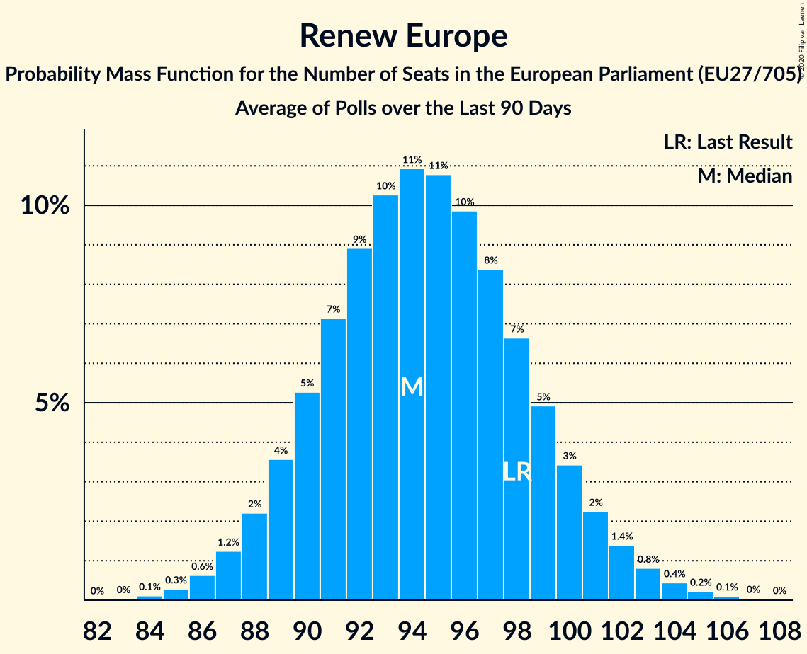

# Renew Europe

Members registered from **25 countries**:

> AT, BE, BG, CY, CZ, DE, DK, EE, ES, FI, FR, HR, HU, IE, IT, LT, LU, LV, MT, NL, PT, RO, SE, SI, SK

## Seats

Last result: **98** seats (General Election of 26 May 2019)

Current median: **96** seats (-2 seats)

At least one member in **21 countries** have a median of 1 seat or more:

> AT, BE, BG, CY, CZ, DE, DK, EE, ES, FI, FR, HU, IE, LT, LU, LV, NL, RO, SE, SI, SK

### Confidence Intervals

| Party | Area | Last Result | Median | 80% Confidence Interval | 90% Confidence Interval | 95% Confidence Interval | 99% Confidence Interval |
|:-----:|:----:|:-----------:|:------:|:-----------------------:|:-----------------------:|:-----------------------:|:-----------------------:|
| Renew Europe | EU | 98 | 96 | 91–101 | 90–102 | 89–103 | 87–106 |
| La République en marche–Mouvement démocrate | FR | | 25 | 22–27 | 21–29 | 21–29 | 21–30 |
| ANO 2011 | CZ | | 9 | 8–10 | 7–10 | 7–10 | 7–11 |
| Volkspartij voor Vrijheid en Democratie | NL | | 8 | 8–10 | 7–10 | 7–10 | 7–11 |
| Alianța 2020 USR-PLUS | RO | | 7 | 6–9 | 6–9 | 6–10 | 5–10 |
| Freie Demokratische Partei | DE | | 5 | 5–8 | 4–8 | 4–8 | 4–8 |
| Ciudadanos–Partido de la Ciudadanía | ES | | 4 | 3–5 | 3–6 | 2–6 | 2–6 |
| Democraten 66 | NL | | 3 | 2–3 | 2–3 | 2–3 | 2–4 |
| Eesti Reformierakond | EE | | 3 | 2–3 | 2–4 | 2–4 | 2–4 |
| Venstre | DK | | 3 | 3 | 2–4 | 2–4 | 2–4 |
| Centerpartiet | SE | | 2 | 1–2 | 1–2 | 1–2 | 1–2 |
| Demokratesch Partei | LU | | 2 | 2 | 1–2 | 1–2 | 1–2 |
| Eesti Keskerakond | EE | | 2 | 1–3 | 1–3 | 1–3 | 1–3 |
| Lista Marjana Šarca | SI | | 2 | 1–2 | 1–2 | 1–2 | 1–2 |
| Momentum Mozgalom | HU | | 2 | 1–4 | 1–4 | 1–4 | 1–4 |
| Mouvement Réformateur | BE-FRC | | 2 | 2 | 2 | 2 | 2 |
| Suomen Keskusta | FI | | 2 | 1–2 | 1–2 | 1–2 | 1–2 |
| Движение за права и свободи | BG | | 2 | 2 | 2–3 | 2–3 | 2–3 |
| Attīstībai/Par! | LV | | 1 | 1 | 1–2 | 1–2 | 1–2 |
| Darbo Partija | LT | | 1 | 1 | 1 | 1 | 0–1 |
| Fianna Fáil | IE | | 1 | 1–2 | 1–2 | 1–2 | 1–2 |
| Freie Wähler | DE | | 1 | 0–1 | 0–2 | 0–2 | 0–2 |
| Liberalų Sąjūdis | LT | | 1 | 1 | 1 | 1 | 1 |
| NEOS–Das Neue Österreich und Liberales Forum | AT | | 1 | 1 | 1 | 1–2 | 0–2 |
| Open Vlaamse Liberalen en Democraten | BE-VLG | | 1 | 1 | 1–2 | 1–2 | 1–2 |
| Partija tvarka ir teisingumas | LT | | 1 | 0–1 | 0–1 | 0–1 | 0–1 |
| Progresívne Slovensko–SPOLU–Občianska Demokracia | SK | | 1 | 1–2 | 1–2 | 1–2 | 0–2 |
| Radikale Venstre | DK | | 1 | 1 | 1 | 0–1 | 0–1 |
| Δημοκρατική Παράταξη | CY | | 1 | 0–1 | 0–1 | 0–1 | 0–1 |
| Agir, la droite constructive–Union des démocrates et indépendants | FR | | 0 | 0 | 0 | 0 | 0 |
| Coalición Canaria–Partido Nacionalista Canario | ES | | 0 | 0 | 0 | 0 | 0–1 |
| Demokratična stranka upokojencev Slovenije | SI | | 0 | 0–1 | 0–1 | 0–1 | 0–1 |
| DéFI | BE-FRC | | 0 | 0 | 0 | 0 | 0 |
| Eesti 200 | EE | | 0 | 0–1 | 0–1 | 0–1 | 0–1 |
| Euzko Alderdi Jeltzalea/Partido Nacionalista Vasco | ES | | 0 | 0–1 | 0–1 | 0–1 | 0–2 |
| Građansko-liberalni savez | HR | | 0 | 0 | 0 | 0 | 0 |
| Hrvatska narodna stranka–liberalni demokrati | HR | | 0 | 0 | 0 | 0 | 0 |
| Hrvatska seljačka stranka | HR | | 0 | 0 | 0 | 0 | 0 |
| Iniciativa Liberal | PT | | 0 | 0 | 0 | 0 | 0–1 |
| Istarski demokratski sabor | HR | | 0 | 0 | 0 | 0 | 0 |
| Italia Viva | IT | | 0 | 0–4 | 0–4 | 0–4 | 0–5 |
| Laisvės partija | LT | | 0 | 0 | 0–1 | 0–1 | 0–1 |
| Liberal Alliance | DK | | 0 | 0 | 0 | 0 | 0 |
| Liberalerna | SE | | 0 | 0–1 | 0–1 | 0–1 | 0–1 |
| Pametno | HR | | 0 | 0 | 0 | 0 | 0 |
| Partit Demokratiku | MT | | 0 | 0 | 0 | 0 | 0 |
| Più Europa | IT | | 0 | 0 | 0 | 0 | 0–3 |
| Stranka Alenke Bratušek | SI | | 0 | 0 | 0 | 0 | 0 |
| Stranka modernega centra | SI | | 0 | 0 | 0 | 0 | 0 |
| Svenska folkpartiet i Finland | FI | | 0 | 0 | 0 | 0–1 | 0–1 |
| Συμμαχία Πολιτών | CY | | 0 | 0 | 0 | 0 | 0 |

### Probability Mass Function

The following table shows the probability mass function per seat for the [poll average](average-2020-07-31.html) for Renew Europe.

| Number of Seats | Probability | Accumulated | Special Marks |
|:---------------:|:-----------:|:-----------:|:-------------:|
| 84 | 0% | 100% |  |
| 85 | 0.1% | 99.9% |  |
| 86 | 0.3% | 99.8% |  |
| 87 | 0.6% | 99.5% |  |
| 88 | 1.2% | 98.9% |  |
| 89 | 2% | 98% |  |
| 90 | 3% | 95% |  |
| 91 | 5% | 92% |  |
| 92 | 7% | 87% |  |
| 93 | 9% | 80% |  |
| 94 | 10% | 71% |  |
| 95 | 11% | 61% |  |
| 96 | 10% | 51% | Median |
| 97 | 10% | 40% |  |
| 98 | 8% | 31% | Last Result |
| 99 | 7% | 22% |  |
| 100 | 5% | 16% |  |
| 101 | 4% | 10% |  |
| 102 | 3% | 7% |  |
| 103 | 2% | 4% |  |
| 104 | 1.0% | 2% |  |
| 105 | 0.6% | 1.3% |  |
| 106 | 0.3% | 0.7% |  |
| 107 | 0.2% | 0.3% |  |
| 108 | 0.1% | 0.2% |  |
| 109 | 0% | 0.1% |  |
| 110 | 0% | 0% |  |

