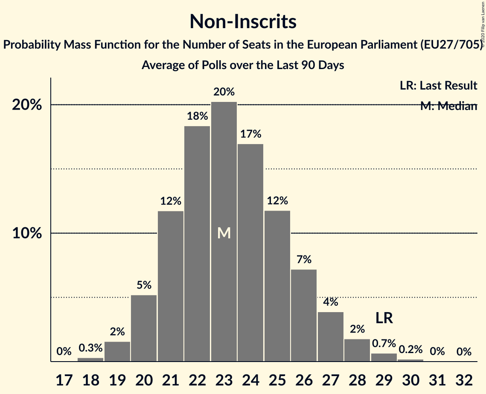

# Non-Inscrits

Members registered from **12 countries**:

> BG, CY, CZ, ES, FI, GR, HR, HU, IT, PL, SI, SK

## Seats

Last result: **29** seats (General Election of 26 May 2019)

Current median: **23** seats (-6 seats)

At least one member in **6 countries** have a median of 1 seat or more:

> ES, GR, HU, IT, PL, SK

### Confidence Intervals

| Party | Area | Last Result | Median | 80% Confidence Interval | 90% Confidence Interval | 95% Confidence Interval | 99% Confidence Interval |
|:-----:|:----:|:-----------:|:------:|:-----------------------:|:-----------------------:|:-----------------------:|:-----------------------:|
| Non-Inscrits | EU | 29 | 23 | 21–26 | 20–27 | 20–28 | 19–29 |
| Movimento 5 Stelle | IT | | 14 | 12–16 | 12–17 | 12–18 | 11–20 |
| Konfederacja | PL | | 4 | 3–5 | 3–5 | 3–5 | 2–6 |
| Jobbik | HU | | 2 | 1–2 | 1–2 | 1–2 | 1–2 |
| Kotleba–Ľudová strana Naše Slovensko | SK | | 1 | 1–2 | 1–2 | 1–2 | 1–2 |
| Partit Demòcrata Europeu Català | ES | | 1 | 1–2 | 1–2 | 1–2 | 0–2 |
| Κομμουνιστικό Κόμμα Ελλάδας | GR | | 1 | 1 | 1–2 | 1–2 | 1–2 |
| Liike Nyt | FI | | 0 | 0 | 0 | 0 | 0 |
| Magyar Kétfarkú Kutya Párt | HU | | 0 | 0–1 | 0–1 | 0–1 | 0–1 |
| Mi Hazánk Mozgalom | HU | | 0 | 0 | 0 | 0 | 0–1 |
| Slovenska nacionalna stranka | SI | | 0 | 0 | 0 | 0 | 0 |
| Strana svobodných občanů | CZ | | 0 | 0 | 0 | 0 | 0 |
| Živi zid | HR | | 0 | 0 | 0 | 0 | 0 |
| Εθνικό Λαϊκό Μέτωπο | CY | | 0 | 0–1 | 0–1 | 0–1 | 0–1 |
| Χρυσή Αυγή | GR | | 0 | 0 | 0 | 0 | 0 |
| Атака | BG | | 0 | 0 | 0 | 0 | 0 |

### Probability Mass Function

The following table shows the probability mass function per seat for the [poll average](average-2020-08-31.html) for Non-Inscrits.

| Number of Seats | Probability | Accumulated | Special Marks |
|:---------------:|:-----------:|:-----------:|:-------------:|
| 18 | 0.3% | 100% |  |
| 19 | 2% | 99.7% |  |
| 20 | 6% | 98% |  |
| 21 | 12% | 92% |  |
| 22 | 18% | 80% |  |
| 23 | 20% | 63% | Median |
| 24 | 17% | 43% |  |
| 25 | 12% | 26% |  |
| 26 | 7% | 15% |  |
| 27 | 4% | 7% |  |
| 28 | 2% | 3% |  |
| 29 | 0.8% | 1.3% | Last Result |
| 30 | 0.3% | 0.5% |  |
| 31 | 0.1% | 0.1% |  |
| 32 | 0% | 0% |  |

