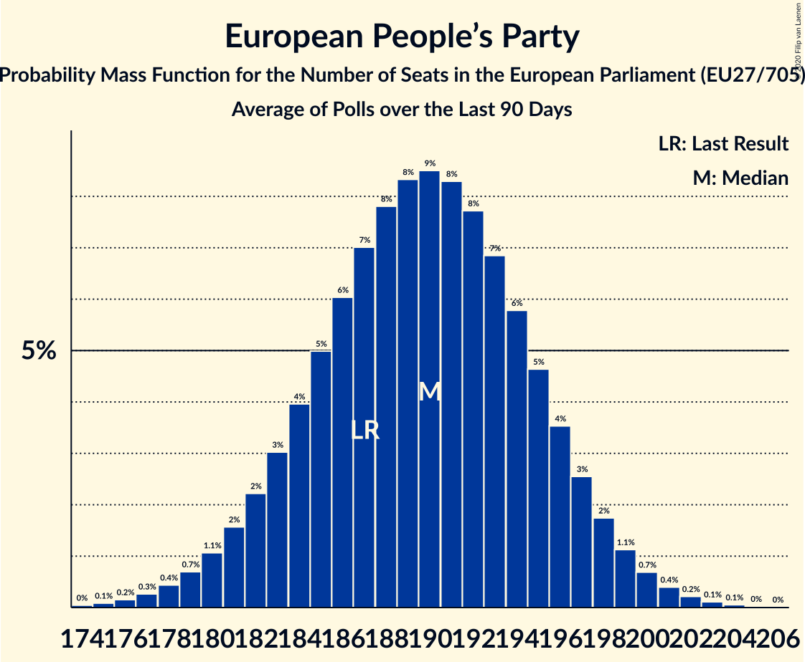

# European People’s Party

Members registered from **27 countries**:

> AT, BE, BG, CY, CZ, DE, DK, EE, ES, FI, FR, GR, HR, HU, IE, IT, LT, LU, LV, MT, NL, PL, PT, RO, SE, SI, SK

## Seats

Last result: **187** seats (General Election of 26 May 2019)

Current median: **188** seats (+1 seats)

At least one member in **26 countries** have a median of 1 seat or more:

> AT, BE, BG, CY, CZ, DE, DK, ES, FI, FR, GR, HR, HU, IE, IT, LT, LU, LV, MT, NL, PL, PT, RO, SE, SI, SK

### Confidence Intervals

| Party | Area | Last Result | Median | 80% Confidence Interval | 90% Confidence Interval | 95% Confidence Interval | 99% Confidence Interval |
|:-----:|:----:|:-----------:|:------:|:-----------------------:|:-----------------------:|:-----------------------:|:-----------------------:|
| European People’s Party | EU | 187 | 188 | 183–193 | 181–195 | 180–196 | 177–199 |
| Christlich Demokratische Union Deutschlands | DE | | 27 | 25–29 | 24–29 | 24–29 | 24–30 |
| Les Républicains | FR | | 14 | 14 | 13–14 | 12–14 | 11–14 |
| Partido Popular | ES | | 14 | 11–15 | 11–16 | 11–17 | 10–17 |
| Koalicja Obywatelska | PL | | 13 | 12–16 | 11–16 | 11–16 | 11–17 |
| Fidesz–Kereszténydemokrata Néppárt | HU | | 12 | 11–13 | 11–13 | 11–13 | 10–13 |
| Partidul Național Liberal | RO | | 11 | 10–12 | 10–13 | 10–13 | 9–13 |
| Νέα Δημοκρατία | GR | | 10 | 9–10 | 9–11 | 9–11 | 9–11 |
| Christlich-Soziale Union in Bayern | DE | | 8 | 6–9 | 6–9 | 6–9 | 6–9 |
| Österreichische Volkspartei | AT | | 8 | 8–9 | 7–9 | 7–9 | 7–10 |
| Forza Italia | IT | | 6 | 5–8 | 5–8 | 5–8 | 4–9 |
| Partido Social Democrata | PT | | 6 | 5–7 | 5–7 | 5–8 | 5–8 |
| Fine Gael | IE | | 5 | 5 | 5 | 5 | 5–7 |
| Hrvatska demokratska zajednica | HR | | 5 | 5–6 | 5–6 | 4–6 | 4–6 |
| Moderata samlingspartiet | SE | | 5 | 4–5 | 4–5 | 4–6 | 4–6 |
| Граждани за европейско развитие на България | BG | | 5 | 4–6 | 4–6 | 4–7 | 4–7 |
| Tėvynės sąjunga–Lietuvos krikščionys demokratai | LT | | 4 | 4 | 4 | 4 | 4 |
| Christen-Democratisch Appèl | NL | | 3 | 2–3 | 2–3 | 2–4 | 2–4 |
| Kansallinen Kokoomus | FI | | 3 | 2–3 | 2–3 | 2–3 | 2–3 |
| OBYČAJNÍ ĽUDIA a nezávislé osobnosti | SK | | 3 | 2–3 | 2–3 | 2–4 | 2–4 |
| Slovenska demokratska stranka | SI | | 3 | 3–4 | 3–4 | 2–4 | 2–4 |
| Chrëschtlech-Sozial Vollekspartei | LU | | 2 | 2 | 2 | 2 | 2–3 |
| Partit Nazzjonalista | MT | | 2 | 2–3 | 2–3 | 2–3 | 2–3 |
| Starostové a nezávislí | CZ | | 2 | 0–3 | 0–3 | 0–3 | 0–3 |
| Δημοκρατικός Συναγερμός | CY | | 2 | 2 | 2 | 2 | 2 |
| Демократична България | BG | | 2 | 1–2 | 0–2 | 0–2 | 0–3 |
| Christen-Democratisch en Vlaams | BE-VLG | | 1 | 1–2 | 1–2 | 1–2 | 1–2 |
| ChristenUnie | NL | | 1 | 0–1 | 0–1 | 0–1 | 0–2 |
| Christlich-Soziale Partei | BE-DEG | | 1 | 1 | 1 | 1 | 1 |
| Det Konservative Folkeparti | DK | | 1 | 1–2 | 1–2 | 1–2 | 1–2 |
| Jaunā VIENOTĪBA | LV | | 1 | 1 | 1 | 1 | 1 |
| Jaunā konservatīvā partija | LV | | 1 | 1 | 1 | 1 | 1 |
| Kristdemokraterna | SE | | 1 | 1 | 1–2 | 1–2 | 1–2 |
| TOP 09 | CZ | | 1 | 0–1 | 0–2 | 0–2 | 0–2 |
| Uniunea Democrată Maghiară din România | RO | | 1 | 0–2 | 0–2 | 0–2 | 0–2 |
| Zaļo un Zemnieku savienība | LV | | 1 | 1 | 1–2 | 1–2 | 1–2 |
| 50Plus | NL | | 0 | 0 | 0 | 0 | 0 |
| CDS–Partido Popular | PT | | 0 | 0–1 | 0–1 | 0–1 | 0–1 |
| Centre démocrate humaniste | BE-FRC | | 0 | 0–1 | 0–1 | 0–1 | 0–1 |
| Erakond Isamaa | EE | | 0 | 0 | 0 | 0 | 0 |
| Koalicja Polska | PL | | 0 | 0–3 | 0–3 | 0–4 | 0–4 |
| Kresťanskodemokratické hnutie | SK | | 0 | 0–1 | 0–1 | 0–1 | 0–1 |
| Kristendemokraterne | DK | | 0 | 0 | 0 | 0 | 0 |
| Kristillisdemokraatit | FI | | 0 | 0 | 0 | 0 | 0 |
| Křesťanská a demokratická unie–Československá strana lidová | CZ | | 0 | 0–1 | 0–1 | 0–1 | 0–1 |
| MOST–HÍD | SK | | 0 | 0 | 0 | 0 | 0 |
| Nova Slovenija–Krščanski demokrati | SI | | 0 | 0 | 0–1 | 0–1 | 0–1 |
| Partidul Mișcarea Populară | RO | | 0 | 0–2 | 0–2 | 0–2 | 0–3 |
| Politiskā partija „KPV LV” | LV | | 0 | 0 | 0 | 0 | 0 |
| Slovenska ljudska stranka | SI | | 0 | 0 | 0 | 0 | 0 |
| Strana maďarskej koalície–Magyar Koalíció Pártja | SK | | 0 | 0–1 | 0–1 | 0–1 | 0–1 |
| Za ľudí | SK | | 0 | 0 | 0–1 | 0–1 | 0–1 |

### Probability Mass Function

The following table shows the probability mass function per seat for the [poll average](average-2020-12-31.html) for European People’s Party.

| Number of Seats | Probability | Accumulated | Special Marks |
|:---------------:|:-----------:|:-----------:|:-------------:|
| 174 | 0% | 100% |  |
| 175 | 0.1% | 99.9% |  |
| 176 | 0.1% | 99.9% |  |
| 177 | 0.3% | 99.7% |  |
| 178 | 0.5% | 99.5% |  |
| 179 | 0.9% | 99.0% |  |
| 180 | 1.4% | 98% |  |
| 181 | 2% | 97% |  |
| 182 | 3% | 95% |  |
| 183 | 4% | 91% |  |
| 184 | 6% | 87% |  |
| 185 | 7% | 81% |  |
| 186 | 8% | 74% |  |
| 187 | 9% | 66% | Last Result |
| 188 | 10% | 57% | Median |
| 189 | 9% | 47% |  |
| 190 | 9% | 38% |  |
| 191 | 8% | 29% |  |
| 192 | 6% | 21% |  |
| 193 | 5% | 15% |  |
| 194 | 4% | 10% |  |
| 195 | 3% | 6% |  |
| 196 | 2% | 4% |  |
| 197 | 1.0% | 2% |  |
| 198 | 0.6% | 1.1% |  |
| 199 | 0.3% | 0.6% |  |
| 200 | 0.1% | 0.3% |  |
| 201 | 0.1% | 0.1% |  |
| 202 | 0% | 0.1% |  |
| 203 | 0% | 0% |  |

