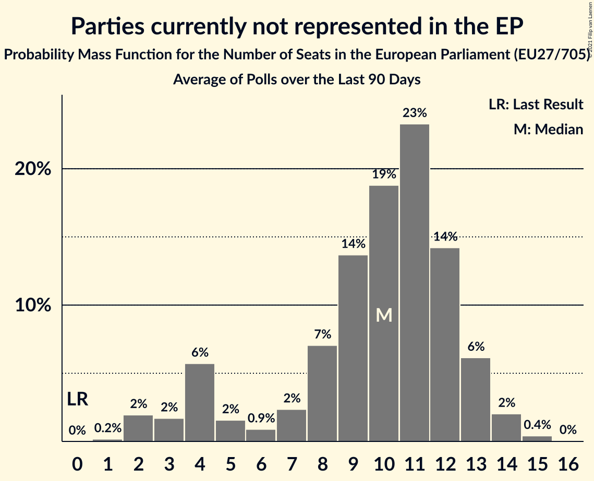

# Parties currently not represented in the EP

Members registered from **12 countries**:

> AT, BG, DK, EE, FR, HR, IE, IT, LU, NL, PL, SK

## Seats

Last result: **0** seats (General Election of 26 May 2019)

Current median: **11** seats (+11 seats)

At least one member in **3 countries** have a median of 1 seat or more:

> BG, DK, PL

### Confidence Intervals

| Party | Area | Last Result | Median | 80% Confidence Interval | 90% Confidence Interval | 95% Confidence Interval | 99% Confidence Interval |
|:-----:|:----:|:-----------:|:------:|:-----------------------:|:-----------------------:|:-----------------------:|:-----------------------:|
| Parties currently not represented in the EP | EU | 0 | 11 | 5–14 | 4–15 | 3–16 | 2–17 |
| Polska 2050 [PL] (*) | PL | | 7 | 5–10 | 5–11 | 4–12 | 4–13 |
| Има такъв народ [BG] (*) | BG | | 3 | 1–4 | 1–4 | 1–4 | 0–4 |
| Nye Borgerlige [DK] (*) | DK | | 1 | 1 | 1 | 1 | 1 |
| Aontú [IE] (*) | IE | | 0 | 0 | 0 | 0 | 0 |
| Bandić Milan 365–Stranka rada i solidarnosti [HR] (*) | HR | | 0 | 0 | 0 | 0 | 0 |
| Borgerlisten [DK] (*) | DK | | 0 | 0 | 0 | 0 | 0 |
| Cambiamo! [IT] (*) | IT | | 0 | 0 | 0 | 0 | 0 |
| DENK [NL] (*) | NL | | 0 | 0 | 0 | 0 | 0 |
| Dobrá voľba [SK] (*) | SK | | 0 | 0 | 0 | 0 | 0 |
| Eesti Vabaerakond [EE] (*) | EE | | 0 | 0 | 0 | 0 | 0 |
| Independents [IE] (*) | IE | | 0 | 0 | 0 | 0 | 0 |
| Kommunistesch Partei Lëtzebuerg [LU] (*) | LU | | 0 | 0 | 0 | 0 | 0 |
| Lutte Ouvrière [FR] (*) | FR | | 0 | 0 | 0 | 0 | 0 |
| Résistons! [FR] (*) | FR | | 0 | 0 | 0 | 0 | 0 |
| Stram Kurs [DK] (*) | DK | | 0 | 0 | 0 | 0 | 0 |
| Team HC Strache–Allianz für Österreich [AT] (*) | AT | | 0 | 0 | 0 | 0 | 0 |
| VLASŤ [SK] (*) | SK | | 0 | 0 | 0 | 0 | 0 |
| Veganerpartiet [DK] (*) | DK | | 0 | 0 | 0 | 0 | 0 |
| Изправи се Бг [BG] (*) | BG | | 0 | 0–1 | 0–1 | 0–1 | 0–1 |

### Probability Mass Function

The following table shows the probability mass function per seat for the [poll average](average-2021-01-31.html) for Parties currently not represented in the EP.

| Number of Seats | Probability | Accumulated | Special Marks |
|:---------------:|:-----------:|:-----------:|:-------------:|
| 0 | 0% | 100% | Last Result |
| 1 | 0.2% | 100% |  |
| 2 | 2% | 99.8% |  |
| 3 | 1.3% | 98% |  |
| 4 | 5% | 97% |  |
| 5 | 3% | 91% |  |
| 6 | 0.9% | 89% |  |
| 7 | 2% | 88% |  |
| 8 | 6% | 86% |  |
| 9 | 12% | 80% |  |
| 10 | 15% | 68% |  |
| 11 | 19% | 53% | Median |
| 12 | 14% | 34% |  |
| 13 | 8% | 20% |  |
| 14 | 5% | 12% |  |
| 15 | 4% | 8% |  |
| 16 | 3% | 4% |  |
| 17 | 0.9% | 1.0% |  |
| 18 | 0.1% | 0.2% |  |
| 19 | 0% | 0% |  |

