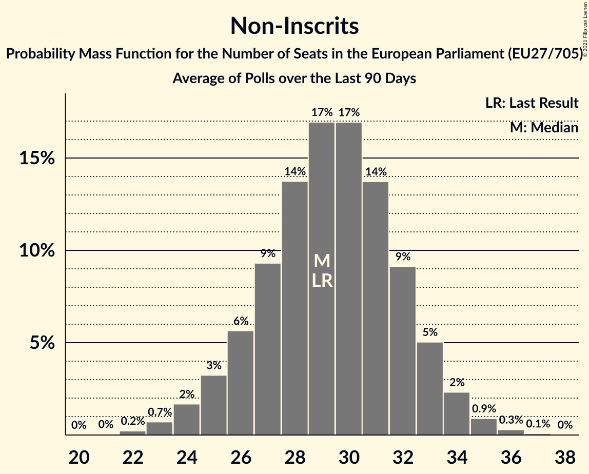

# Non-Inscrits

Members registered from **12 countries**:

> BG, CY, CZ, ES, FI, GR, HR, HU, IT, PL, SI, SK

## Seats

Last result: **29** seats (General Election of 26 May 2019)

Current median: **30** seats (+1 seats)

At least one member in **6 countries** have a median of 1 seat or more:

> ES, GR, HU, IT, PL, SK

### Confidence Intervals

| Party | Area | Last Result | Median | 80% Confidence Interval | 90% Confidence Interval | 95% Confidence Interval | 99% Confidence Interval |
|:-----:|:----:|:-----------:|:------:|:-----------------------:|:-----------------------:|:-----------------------:|:-----------------------:|
| Non-Inscrits | EU | 29 | 30 | 27–33 | 26–34 | 25–35 | 24–37 |
| Movimento 5 Stelle | IT | | 13 | 11–15 | 11–16 | 10–17 | 10–18 |
| Fidesz–Kereszténydemokrata Néppárt | HU | | 10 | 9–12 | 9–12 | 9–12 | 9–12 |
| Konfederacja | PL | | 4 | 2–5 | 0–6 | 0–6 | 0–7 |
| Kotleba–Ľudová strana Naše Slovensko | SK | | 1 | 0–2 | 0–2 | 0–2 | 0–2 |
| Partit Demòcrata Europeu Català | ES | | 1 | 0–1 | 0–2 | 0–2 | 0–2 |
| Κομμουνιστικό Κόμμα Ελλάδας | GR | | 1 | 1 | 1–2 | 1–2 | 1–2 |
| Kukiz’15 | PL | | 0 | 0 | 0 | 0 | 0 |
| Liike Nyt | FI | | 0 | 0 | 0 | 0 | 0 |
| Magyar Kétfarkú Kutya Párt | HU | | 0 | 0 | 0 | 0 | 0 |
| Mi Hazánk Mozgalom | HU | | 0 | 0 | 0 | 0 | 0 |
| Slovenska nacionalna stranka | SI | | 0 | 0 | 0 | 0 | 0–1 |
| Strana svobodných občanů | CZ | | 0 | 0 | 0 | 0 | 0 |
| Živi zid | HR | | 0 | 0 | 0 | 0 | 0 |
| Εθνικό Λαϊκό Μέτωπο | CY | | 0 | 0–1 | 0–1 | 0–1 | 0–1 |
| Атака | BG | | 0 | 0 | 0 | 0 | 0 |

### Probability Mass Function

The following table shows the probability mass function per seat for the [poll average](average-2021-03-31.html) for Non-Inscrits.

| Number of Seats | Probability | Accumulated | Special Marks |
|:---------------:|:-----------:|:-----------:|:-------------:|
| 22 | 0.1% | 100% |  |
| 23 | 0.3% | 99.9% |  |
| 24 | 0.9% | 99.5% |  |
| 25 | 2% | 98.7% |  |
| 26 | 4% | 97% |  |
| 27 | 7% | 93% |  |
| 28 | 10% | 86% |  |
| 29 | 14% | 76% | Last Result |
| 30 | 17% | 61% | Median |
| 31 | 16% | 45% |  |
| 32 | 12% | 29% |  |
| 33 | 8% | 17% |  |
| 34 | 5% | 9% |  |
| 35 | 2% | 4% |  |
| 36 | 1.0% | 2% |  |
| 37 | 0.4% | 0.5% |  |
| 38 | 0.1% | 0.2% |  |
| 39 | 0% | 0% |  |

