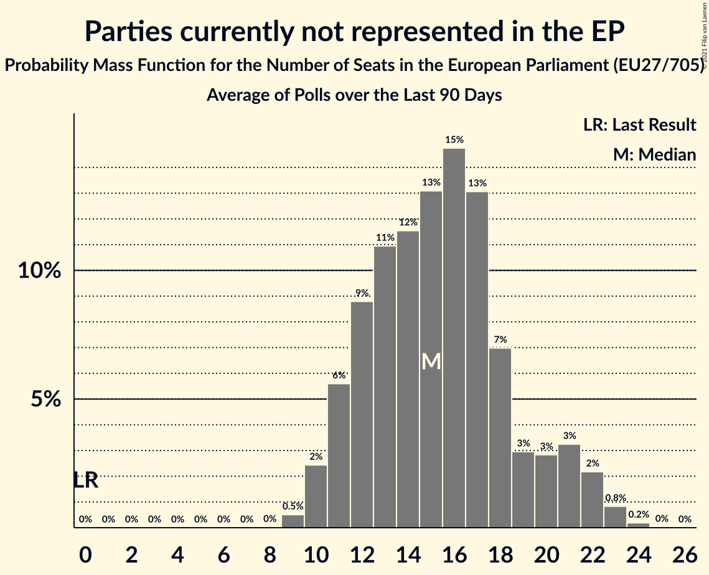

# Parties currently not represented in the EP

Members registered from **13 countries**:

> BE, BG, DK, FR, HR, IE, IT, LU, LV, NL, PL, SI, SK

## Seats

Last result: **0** seats (General Election of 26 May 2019)

Current median: **15** seats (+15 seats)

At least one member in **2 countries** have a median of 1 seat or more:

> BG, PL

### Confidence Intervals

| Party | Area | Last Result | Median | 80% Confidence Interval | 90% Confidence Interval | 95% Confidence Interval | 99% Confidence Interval |
|:-----:|:----:|:-----------:|:------:|:-----------------------:|:-----------------------:|:-----------------------:|:-----------------------:|
| Parties currently not represented in the EP | EU | 0 | 15 | 12–19 | 11–21 | 10–22 | 9–23 |
| Polska 2050 [PL] (*) | PL | | 12 | 9–16 | 8–18 | 7–18 | 7–19 |
| Има такъв народ [BG] (*) | BG | | 3 | 2–3 | 2–3 | 2–3 | 2–3 |
| Aontú [IE] (*) | IE | | 0 | 0 | 0 | 0 | 0 |
| Bandić Milan 365–Stranka rada i solidarnosti [HR] (*) | HR | | 0 | 0 | 0 | 0 | 0 |
| Bij1 [NL] (*) | NL | | 0 | 0 | 0 | 0 | 0 |
| BoerBurgerBeweging [NL] (*) | NL | | 0 | 0 | 0 | 0 | 0 |
| Borgerlisten [DK] (*) | DK | | 0 | 0 | 0 | 0 | 0 |
| Cambiamo! [IT] (*) | IT | | 0 | 0 | 0 | 0 | 0 |
| Code Oranje [NL] (*) | NL | | 0 | 0 | 0 | 0 | 0 |
| DENK [NL] (*) | NL | | 0 | 0 | 0 | 0 | 0 |
| Dobra država [SI] (*) | SI | | 0 | 0 | 0 | 0 | 0 |
| Dobrá voľba [SK] (*) | SK | | 0 | 0 | 0 | 0 | 0 |
| DéFI [BE-FRC] (*) | BE-FRC | | 0 | 0 | 0 | 0 | 0 |
| Independents [IE] (*) | IE | | 0 | 0–1 | 0–1 | 0–1 | 0–1 |
| Kommunistesch Partei Lëtzebuerg [LU] (*) | LU | | 0 | 0 | 0 | 0 | 0 |
| Likums un kārtība [LV] (*) | LV | | 0 | 0 | 0 | 0 | 0 |
| Lutte Ouvrière [FR] (*) | FR | | 0 | 0 | 0 | 0 | 0 |
| Piratenpartij [NL] (*) | NL | | 0 | 0 | 0 | 0 | 0 |
| Splinter [NL] (*) | NL | | 0 | 0 | 0 | 0 | 0 |
| Stram Kurs [DK] (*) | DK | | 0 | 0 | 0 | 0 | 0 |
| Union populaire républicaine [FR] (*) | FR | | 0 | 0 | 0 | 0 | 0 |
| VLASŤ [SK] (*) | SK | | 0 | 0 | 0 | 0 | 0 |
| Veganerpartiet [DK] (*) | DK | | 0 | 0 | 0 | 0 | 0 |
| Възраждане [BG] (*) | BG | | 0 | 0 | 0 | 0 | 0 |
| Изправи се Бг [BG] (*) | BG | | 0 | 0–1 | 0–1 | 0–2 | 0–2 |
| Републиканци за България [BG] (*) | BG | | 0 | 0 | 0 | 0 | 0 |

### Probability Mass Function

The following table shows the probability mass function per seat for the [poll average](average-2021-04-30.html) for Parties currently not represented in the EP.

| Number of Seats | Probability | Accumulated | Special Marks |
|:---------------:|:-----------:|:-----------:|:-------------:|
| 0 | 0% | 100% | Last Result |
| 1 | 0% | 100% |  |
| 2 | 0% | 100% |  |
| 3 | 0% | 100% |  |
| 4 | 0% | 100% |  |
| 5 | 0% | 100% |  |
| 6 | 0% | 100% |  |
| 7 | 0% | 100% |  |
| 8 | 0% | 100% |  |
| 9 | 0.5% | 100% |  |
| 10 | 2% | 99.5% |  |
| 11 | 6% | 97% |  |
| 12 | 9% | 91% |  |
| 13 | 11% | 83% |  |
| 14 | 12% | 72% |  |
| 15 | 13% | 60% | Median |
| 16 | 15% | 47% |  |
| 17 | 13% | 32% |  |
| 18 | 7% | 19% |  |
| 19 | 3% | 12% |  |
| 20 | 3% | 9% |  |
| 21 | 3% | 6% |  |
| 22 | 2% | 3% |  |
| 23 | 0.8% | 1.0% |  |
| 24 | 0.2% | 0.2% |  |
| 25 | 0% | 0% |  |

