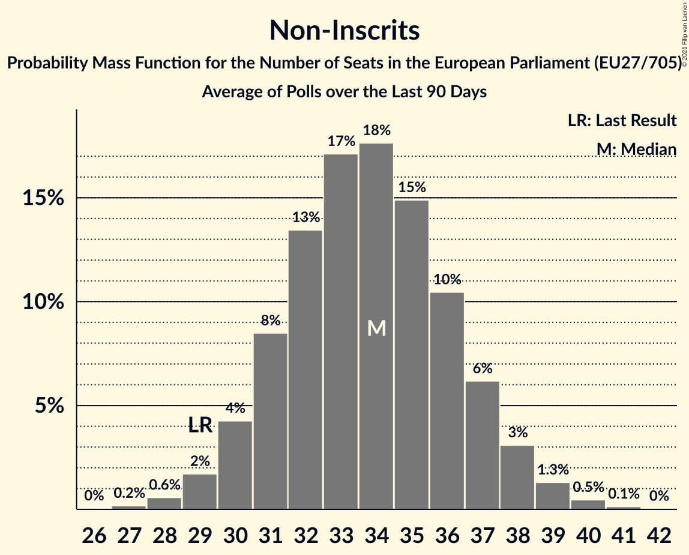

# Non-Inscrits

Members registered from **11 countries**:

> CY, DK, ES, FI, GR, HR, HU, IT, PL, SI, SK

## Seats

Last result: **29** seats (General Election of 26 May 2019)

Current median: **33** seats (+4 seats)

At least one member in **7 countries** have a median of 1 seat or more:

> CY, DK, ES, GR, HU, IT, PL

### Confidence Intervals

| Party | Area | Last Result | Median | 80% Confidence Interval | 90% Confidence Interval | 95% Confidence Interval | 99% Confidence Interval |
|:-----:|:----:|:-----------:|:------:|:-----------------------:|:-----------------------:|:-----------------------:|:-----------------------:|
| Non-Inscrits | EU | 29 | 33 | 31–36 | 30–37 | 29–38 | 28–39 |
| Movimento 5 Stelle | IT | | 14 | 12–16 | 12–17 | 11–17 | 11–17 |
| Fidesz–Kereszténydemokrata Néppárt | HU | | 11 | 9–12 | 9–12 | 9–12 | 9–12 |
| Konfederacja | PL | | 4 | 3–6 | 3–6 | 3–6 | 3–7 |
| Nye Borgerlige | DK | | 1 | 1 | 1–2 | 1–2 | 0–2 |
| Partit Demòcrata Europeu Català | ES | | 1 | 1 | 1–2 | 0–2 | 0–2 |
| Εθνικό Λαϊκό Μέτωπο | CY | | 1 | 1 | 1 | 1 | 1 |
| Κομμουνιστικό Κόμμα Ελλάδας | GR | | 1 | 1–2 | 1–2 | 1–2 | 1–2 |
| Kotleba–Ľudová strana Naše Slovensko | SK | | 0 | 0–1 | 0–1 | 0–1 | 0–1 |
| Kukiz’15 | PL | | 0 | 0 | 0 | 0 | 0 |
| Liike Nyt | FI | | 0 | 0 | 0 | 0 | 0 |
| Magyar Kétfarkú Kutya Párt | HU | | 0 | 0–1 | 0–1 | 0–1 | 0–1 |
| Mi Hazánk Mozgalom | HU | | 0 | 0–1 | 0–1 | 0–1 | 0–1 |
| REPUBLIKA | SK | | 0 | 0–1 | 0–1 | 0–1 | 0–1 |
| Slovenska nacionalna stranka | SI | | 0 | 0 | 0 | 0 | 0 |
| Živi zid | HR | | 0 | 0 | 0 | 0–1 | 0–1 |

### Probability Mass Function

The following table shows the probability mass function per seat for the [poll average](average-2021-07-31.html) for Non-Inscrits.

| Number of Seats | Probability | Accumulated | Special Marks |
|:---------------:|:-----------:|:-----------:|:-------------:|
| 27 | 0.2% | 100% |  |
| 28 | 0.8% | 99.8% |  |
| 29 | 2% | 99.0% | Last Result |
| 30 | 6% | 97% |  |
| 31 | 10% | 91% |  |
| 32 | 15% | 81% |  |
| 33 | 18% | 66% | Median |
| 34 | 17% | 48% |  |
| 35 | 14% | 31% |  |
| 36 | 9% | 17% |  |
| 37 | 5% | 8% |  |
| 38 | 2% | 3% |  |
| 39 | 0.8% | 1.2% |  |
| 40 | 0.3% | 0.3% |  |
| 41 | 0.1% | 0.1% |  |
| 42 | 0% | 0% |  |

