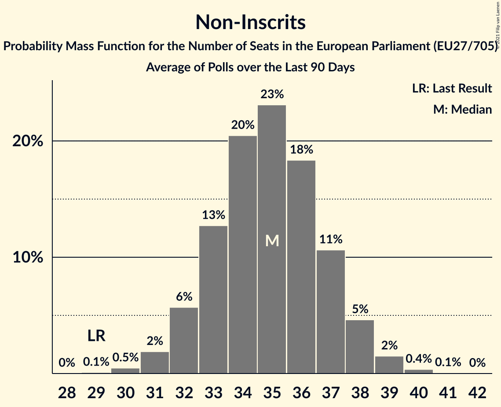

# Non-Inscrits

Members registered from **12 countries**:

> CY, DK, ES, FI, GR, HR, HU, IT, LT, PL, SI, SK

## Seats

Last result: **29** seats (General Election of 26 May 2019)

Current median: **35** seats (+6 seats)

At least one member in **8 countries** have a median of 1 seat or more:

> CY, DK, ES, GR, HU, IT, LT, PL

### Confidence Intervals

| Party | Area | Last Result | Median | 80% Confidence Interval | 90% Confidence Interval | 95% Confidence Interval | 99% Confidence Interval |
|:-----:|:----:|:-----------:|:------:|:-----------------------:|:-----------------------:|:-----------------------:|:-----------------------:|
| Non-Inscrits | EU | 29 | 35 | 33–37 | 32–38 | 31–38 | 30–39 |
| Movimento 5 Stelle | IT | | 14 | 13–15 | 12–16 | 12–16 | 11–17 |
| Fidesz–Kereszténydemokrata Néppárt | HU | | 11 | 10–12 | 10–12 | 10–12 | 10–12 |
| Konfederacja | PL | | 4 | 3–5 | 3–5 | 3–5 | 2–6 |
| Darbo Partija | LT | | 1 | 1 | 1 | 1 | 0–1 |
| Nye Borgerlige | DK | | 1 | 1 | 0–1 | 0–1 | 0–2 |
| Partit Demòcrata Europeu Català | ES | | 1 | 0–2 | 0–2 | 0–2 | 0–2 |
| Εθνικό Λαϊκό Μέτωπο | CY | | 1 | 1 | 1 | 1 | 1 |
| Κομμουνιστικό Κόμμα Ελλάδας | GR | | 1 | 1–2 | 1–2 | 1–2 | 1–2 |
| Kotleba–Ľudová strana Naše Slovensko | SK | | 0 | 0–1 | 0–1 | 0–1 | 0–1 |
| Kukiz’15 | PL | | 0 | 0 | 0 | 0 | 0 |
| Liike Nyt | FI | | 0 | 0 | 0 | 0 | 0 |
| Magyar Kétfarkú Kutya Párt | HU | | 0 | 0–1 | 0–1 | 0–1 | 0–1 |
| Mi Hazánk Mozgalom | HU | | 0 | 0 | 0–1 | 0–1 | 0–1 |
| REPUBLIKA | SK | | 0 | 0–1 | 0–1 | 0–1 | 0–1 |
| Slovenska nacionalna stranka | SI | | 0 | 0 | 0 | 0 | 0 |
| Živi zid | HR | | 0 | 0 | 0 | 0 | 0 |

### Probability Mass Function

The following table shows the probability mass function per seat for the [poll average](average-2021-09-30.html) for Non-Inscrits.

| Number of Seats | Probability | Accumulated | Special Marks |
|:---------------:|:-----------:|:-----------:|:-------------:|
| 29 | 0.1% | 100% | Last Result |
| 30 | 0.4% | 99.9% |  |
| 31 | 2% | 99.5% |  |
| 32 | 6% | 97% |  |
| 33 | 14% | 91% |  |
| 34 | 22% | 77% |  |
| 35 | 23% | 55% | Median |
| 36 | 17% | 32% |  |
| 37 | 9% | 14% |  |
| 38 | 4% | 5% |  |
| 39 | 1.1% | 1.4% |  |
| 40 | 0.3% | 0.3% |  |
| 41 | 0% | 0% |  |

