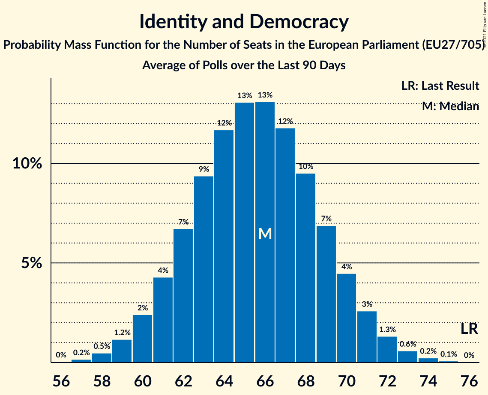

# Identity and Democracy

Members registered from **12 countries**:

> AT, BE, CZ, DE, DK, EE, FI, FR, IT, NL, PT, SK

## Seats

Last result: **76** seats (General Election of 26 May 2019)

Current median: **73** seats (-3 seats)

At least one member in **12 countries** have a median of 1 seat or more:

> AT, BE, CZ, DE, DK, EE, FI, FR, IT, NL, PT, SK

### Confidence Intervals

| Party | Area | Last Result | Median | 80% Confidence Interval | 90% Confidence Interval | 95% Confidence Interval | 99% Confidence Interval |
|:-----:|:----:|:-----------:|:------:|:-----------------------:|:-----------------------:|:-----------------------:|:-----------------------:|
| Identity and Democracy | EU | 76 | 73 | 70–76 | 70–77 | 69–78 | 67–79 |
| Rassemblement national | FR | | 25 | 24–27 | 23–28 | 22–28 | 22–29 |
| Lega Nord | IT | | 17 | 16–18 | 16–19 | 15–19 | 15–20 |
| Alternative für Deutschland | DE | | 10 | 9–11 | 8–11 | 8–12 | 8–12 |
| Freiheitliche Partei Österreichs | AT | | 4 | 3–4 | 3–5 | 2–5 | 2–5 |
| Partij voor de Vrijheid | NL | | 4 | 3–4 | 3–4 | 3–4 | 3–4 |
| Perussuomalaiset | FI | | 3 | 3 | 3 | 2–3 | 2–3 |
| Vlaams Belang | BE-VLG | | 3 | 3 | 3 | 3 | 3 |
| Eesti Konservatiivne Rahvaerakond | EE | | 2 | 2 | 2 | 2 | 2–3 |
| Svoboda a přímá demokracie | CZ | | 2 | 2–3 | 2–3 | 1–3 | 1–4 |
| Chega | PT | | 1 | 1 | 0–1 | 0–1 | 0–1 |
| Dansk Folkeparti | DK | | 1 | 1 | 0–1 | 0–1 | 0–1 |
| SME RODINA | SK | | 1 | 1 | 1–2 | 1–2 | 1–2 |
| Trikolóra hnutí občanů–Strana svobodných občanů–Strana soukromníků České republiky | CZ | | 0 | 0 | 0 | 0 | 0–1 |

### Probability Mass Function

The following table shows the probability mass function per seat for the [poll average](average-2021-11-30.html) for Identity and Democracy.

| Number of Seats | Probability | Accumulated | Special Marks |
|:---------------:|:-----------:|:-----------:|:-------------:|
| 66 | 0.1% | 100% |  |
| 67 | 0.4% | 99.9% |  |
| 68 | 1.2% | 99.4% |  |
| 69 | 3% | 98% |  |
| 70 | 6% | 95% |  |
| 71 | 10% | 89% |  |
| 72 | 15% | 78% |  |
| 73 | 17% | 64% | Median |
| 74 | 16% | 47% |  |
| 75 | 13% | 31% |  |
| 76 | 9% | 18% | Last Result |
| 77 | 5% | 9% |  |
| 78 | 2% | 4% |  |
| 79 | 0.9% | 1.2% |  |
| 80 | 0.3% | 0.4% |  |
| 81 | 0.1% | 0.1% |  |
| 82 | 0% | 0% |  |

