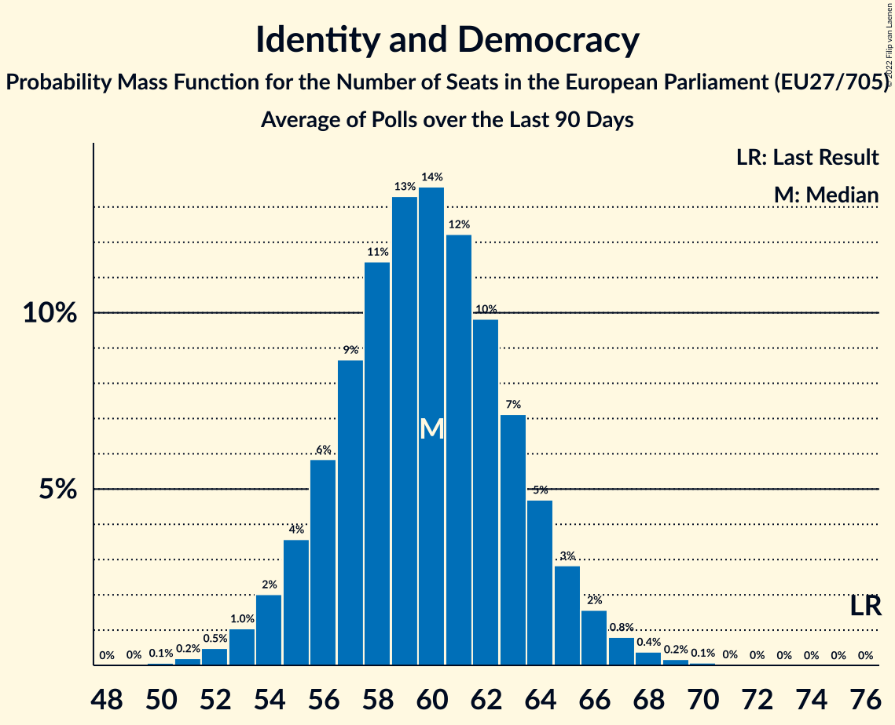

# Identity and Democracy

Members registered from **12 countries**:

> AT, BE, CZ, DE, DK, EE, FI, FR, IT, NL, PT, SK

## Seats

Last result: **76** seats (General Election of 26 May 2019)

Current median: **62** seats (-14 seats)

At least one member in **12 countries** have a median of 1 seat or more:

> AT, BE, CZ, DE, DK, EE, FI, FR, IT, NL, PT, SK

### Confidence Intervals

| Party | Area | Last Result | Median | 80% Confidence Interval | 90% Confidence Interval | 95% Confidence Interval | 99% Confidence Interval |
|:-----:|:----:|:-----------:|:------:|:-----------------------:|:-----------------------:|:-----------------------:|:-----------------------:|
| Identity and Democracy | EU | 76 | 62 | 59–66 | 58–67 | 57–68 | 55–70 |
| Lega Nord | IT | | 16 | 14–17 | 14–17 | 14–18 | 13–19 |
| Rassemblement national | FR | | 15 | 13–18 | 13–20 | 12–20 | 12–20 |
| Alternative für Deutschland | DE | | 10 | 9–12 | 9–12 | 8–13 | 8–14 |
| Freiheitliche Partei Österreichs | AT | | 4 | 3–4 | 3–5 | 3–5 | 3–5 |
| Partij voor de Vrijheid | NL | | 4 | 3–4 | 3–4 | 3–5 | 3–5 |
| Perussuomalaiset | FI | | 3 | 2–3 | 2–3 | 2–3 | 2–3 |
| Vlaams Belang | BE-VLG | | 3 | 3–4 | 3–4 | 3–4 | 3–4 |
| Eesti Konservatiivne Rahvaerakond | EE | | 2 | 2 | 2 | 1–2 | 1–2 |
| Svoboda a přímá demokracie | CZ | | 2 | 2 | 1–3 | 1–3 | 1–3 |
| Chega | PT | | 1 | 1–2 | 1–2 | 1–2 | 1–2 |
| Dansk Folkeparti | DK | | 1 | 0–1 | 0–1 | 0–1 | 0–1 |
| SME RODINA | SK | | 1 | 1–2 | 1–2 | 1–2 | 0–2 |
| Trikolóra hnutí občanů–Strana svobodných občanů–Strana soukromníků České republiky | CZ | | 0 | 0 | 0–1 | 0–1 | 0–1 |

### Probability Mass Function

The following table shows the probability mass function per seat for the [poll average](average-2022-02-28.html) for Identity and Democracy.

| Number of Seats | Probability | Accumulated | Special Marks |
|:---------------:|:-----------:|:-----------:|:-------------:|
| 54 | 0.1% | 100% |  |
| 55 | 0.4% | 99.9% |  |
| 56 | 1.0% | 99.5% |  |
| 57 | 2% | 98.5% |  |
| 58 | 4% | 96% |  |
| 59 | 8% | 92% |  |
| 60 | 11% | 84% |  |
| 61 | 14% | 73% |  |
| 62 | 15% | 60% | Median |
| 63 | 14% | 45% |  |
| 64 | 11% | 31% |  |
| 65 | 8% | 20% |  |
| 66 | 5% | 12% |  |
| 67 | 3% | 7% |  |
| 68 | 2% | 3% |  |
| 69 | 0.9% | 2% |  |
| 70 | 0.4% | 0.6% |  |
| 71 | 0.2% | 0.2% |  |
| 72 | 0.1% | 0.1% |  |
| 73 | 0% | 0% |  |
| 74 | 0% | 0% |  |
| 75 | 0% | 0% |  |
| 76 | 0% | 0% | Last Result |

