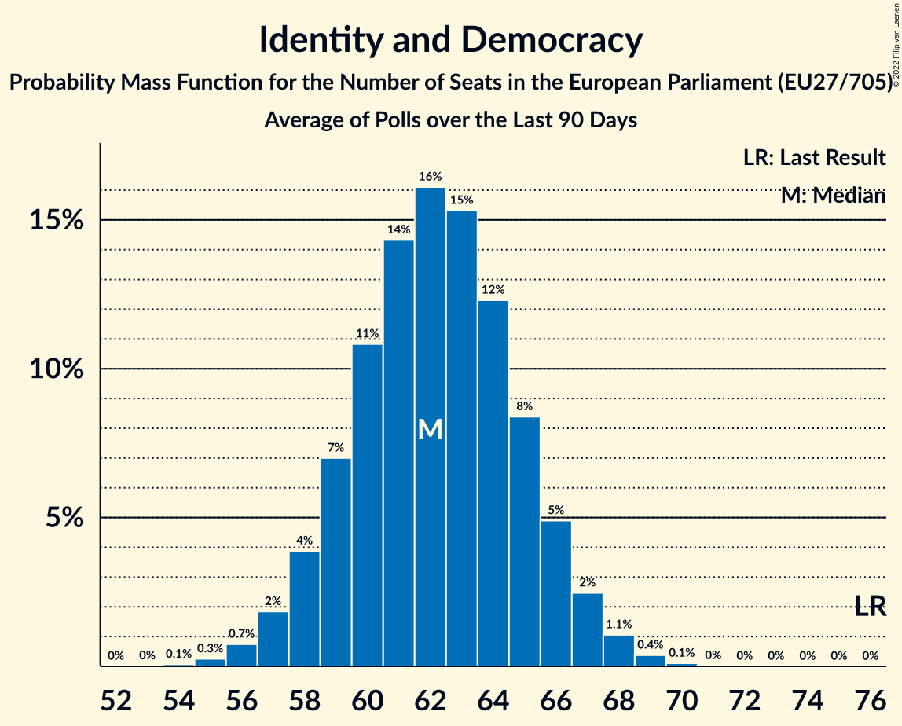

# Identity and Democracy

Members registered from **12 countries**:

> AT, BE, CZ, DE, DK, EE, FI, FR, IT, NL, PT, SK

## Seats

Last result: **76** seats (General Election of 26 May 2019)

Current median: **63** seats (-13 seats)

At least one member in **12 countries** have a median of 1 seat or more:

> AT, BE, CZ, DE, DK, EE, FI, FR, IT, NL, PT, SK

### Confidence Intervals

| Party | Area | Last Result | Median | 80% Confidence Interval | 90% Confidence Interval | 95% Confidence Interval | 99% Confidence Interval |
|:-----:|:----:|:-----------:|:------:|:-----------------------:|:-----------------------:|:-----------------------:|:-----------------------:|
| Identity and Democracy | EU | 76 | 63 | 60–67 | 59–68 | 58–69 | 57–71 |
| Rassemblement national | FR | | 20 | 19–21 | 19–22 | 18–22 | 18–23 |
| Lega Nord | IT | | 14 | 12–16 | 12–16 | 11–18 | 11–18 |
| Alternative für Deutschland | DE | | 10 | 7–12 | 7–12 | 7–13 | 7–13 |
| Freiheitliche Partei Österreichs | AT | | 4 | 3–4 | 3–4 | 3–4 | 3–5 |
| Partij voor de Vrijheid | NL | | 3 | 3–4 | 3–4 | 3–4 | 2–4 |
| Perussuomalaiset | FI | | 3 | 2–3 | 2–3 | 2–3 | 2–3 |
| Vlaams Belang | BE-VLG | | 3 | 3 | 3 | 3 | 2–3 |
| Eesti Konservatiivne Rahvaerakond | EE | | 2 | 1–2 | 1–2 | 1–2 | 1–2 |
| Svoboda a přímá demokracie | CZ | | 2 | 2–3 | 2–3 | 1–3 | 1–3 |
| Chega | PT | | 1 | 1–2 | 1–2 | 1–2 | 0–2 |
| Dansk Folkeparti | DK | | 1 | 0–1 | 0–1 | 0–1 | 0–1 |
| SME RODINA | SK | | 1 | 1 | 0–1 | 0–1 | 0–1 |
| Trikolóra hnutí občanů–Strana svobodných občanů–Strana soukromníků České republiky | CZ | | 0 | 0 | 0–1 | 0–1 | 0–1 |

### Probability Mass Function

The following table shows the probability mass function per seat for the [poll average](average-2022-05-31.html) for Identity and Democracy.

| Number of Seats | Probability | Accumulated | Special Marks |
|:---------------:|:-----------:|:-----------:|:-------------:|
| 55 | 0.1% | 100% |  |
| 56 | 0.3% | 99.9% |  |
| 57 | 0.8% | 99.6% |  |
| 58 | 2% | 98.8% |  |
| 59 | 4% | 97% |  |
| 60 | 7% | 93% |  |
| 61 | 10% | 86% |  |
| 62 | 13% | 76% |  |
| 63 | 15% | 63% | Median |
| 64 | 14% | 48% |  |
| 65 | 12% | 34% |  |
| 66 | 9% | 22% |  |
| 67 | 6% | 13% |  |
| 68 | 3% | 7% |  |
| 69 | 2% | 3% |  |
| 70 | 0.8% | 1.4% |  |
| 71 | 0.3% | 0.5% |  |
| 72 | 0.1% | 0.2% |  |
| 73 | 0% | 0.1% |  |
| 74 | 0% | 0% |  |
| 75 | 0% | 0% |  |
| 76 | 0% | 0% | Last Result |

